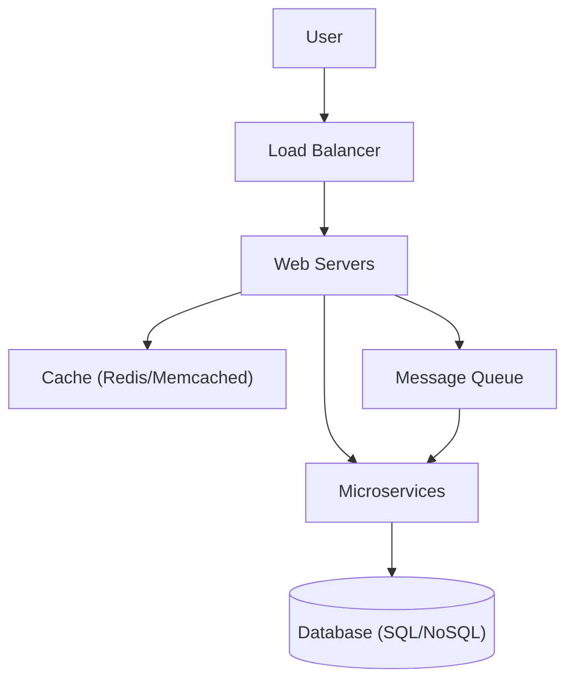
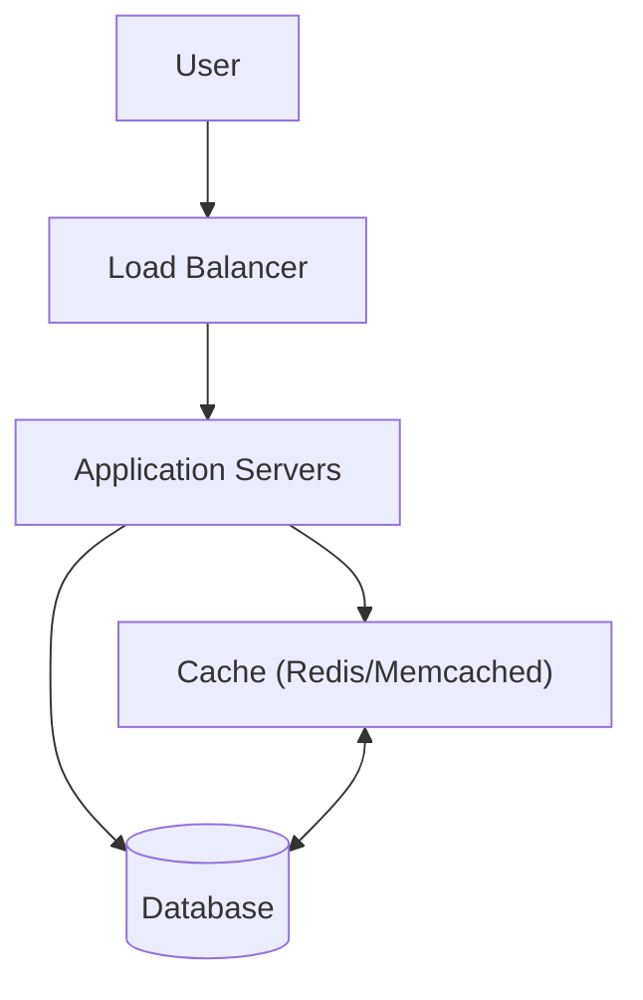
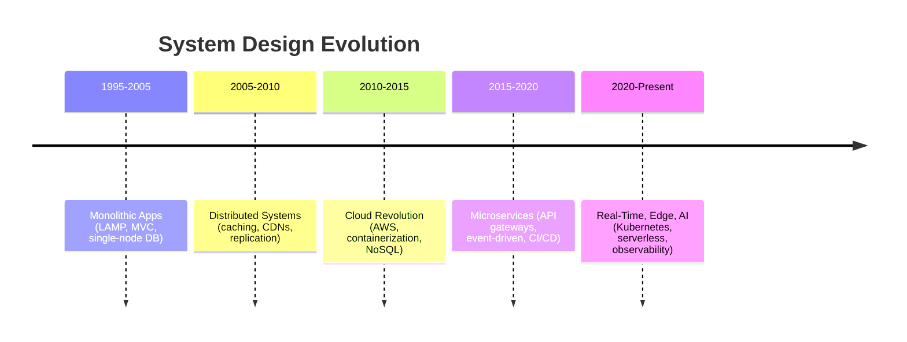
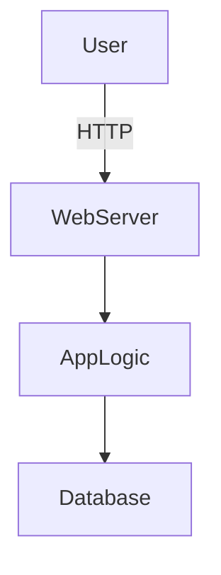
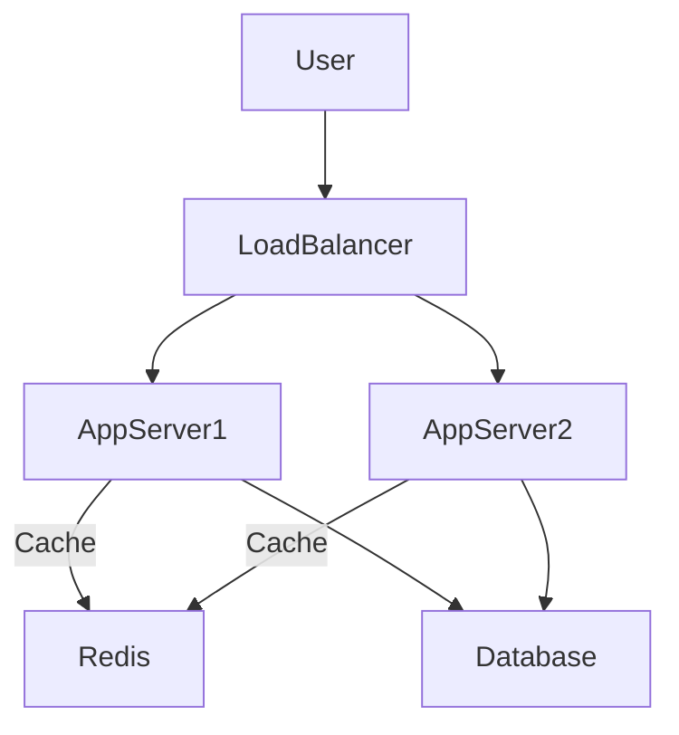
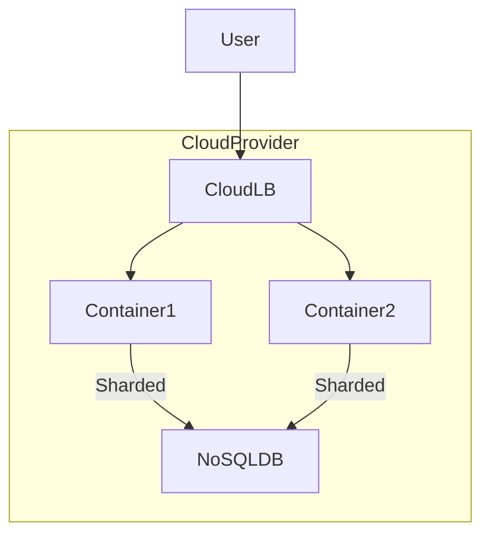
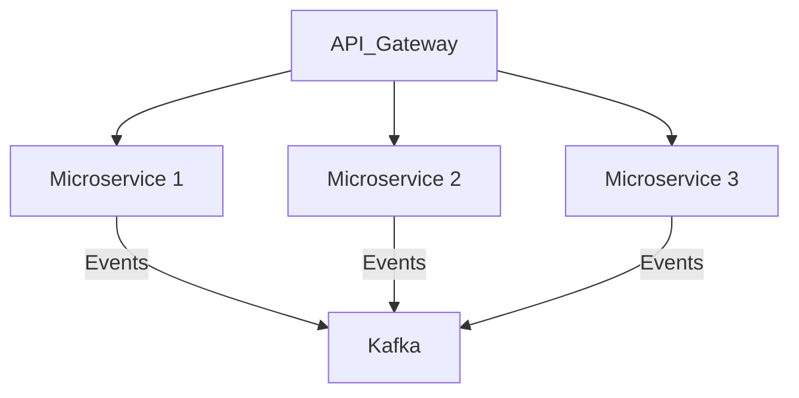
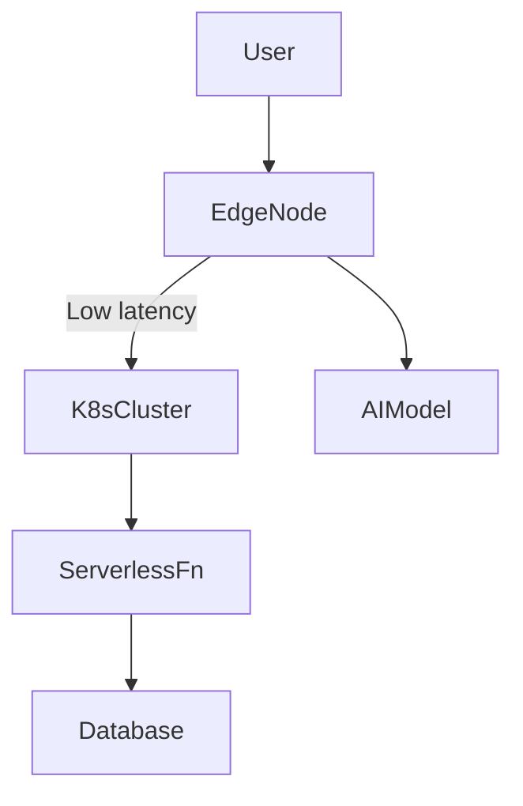
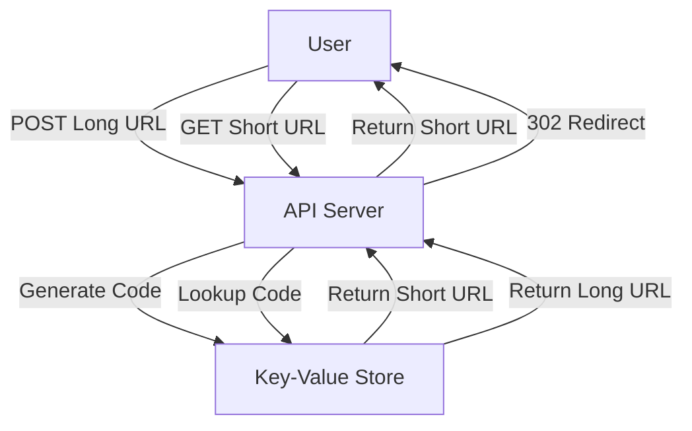

# Mastering System Design: From Basics to Cracking Interviews

*By Charikshith*

---

Welcome to your journey in **Mastering System Design**! Whether you're new to the topic or preparing for tough interviews, this guide will help you build a rock-solid foundation and give you the tools to design robust, scalable systems.

System design is a cornerstone skill for software engineers, architects, and anyone building large-scale, robust software solutions. It is often viewed through the narrow lens of interview preparation — but its true value lies in being able to architect real-world solutions effectively. In this chapter, we'll break down what system design is, why it has become so crucial in the tech industry, how it has evolved, and practical ways to master it.

---

## Learning Outcomes

After reading this chapter, you will be able to:

1. Define what system design is and explain why it matters beyond interviews.
2. Distinguish **functional** from **non-functional** requirements and name the most common non-functional dimensions (latency, throughput, availability, durability, scalability, consistency, security, maintainability, observability, cost).
3. Apply the **4-step design framework** (Requirements → Estimate → High-Level Design → Tech Decisions) to a new problem.
4. Reason about latency intuitively using the **"numbers every programmer should know"** reference table.
5. Recognize common beginner anti-patterns (premature scaling, cargo-cult architecture, distributed monolith).

---

## Prerequisites

Before starting, you should be comfortable with:

- Basic programming in any language (Python, JavaScript, Java, Go, etc.).
- How a web request/response works at a high level (browser → server → response).
- Basic SQL and what a database does.
- Basic command-line usage.

You **don't need** prior distributed-systems experience, prior cloud experience, or to have used Kubernetes/Kafka/Redis. Every term will be defined as it appears.

---

## How to Use This Course

- **Foundations (Chapters 1–11):** Read in order. Each chapter builds on the previous.
- **Case studies (Chapters 12–24):** Read in any order after the foundations. Each is self-contained.
- **Expect to revisit.** Caching only fully clicks after you've seen it used in three different case studies. That's normal.
- **Build a toy project alongside.** A blog, a URL shortener, a chat app — anything. Reading without building is like reading swimming books on dry land.
- **Read real post-mortems.** [danluu.com/postmortem-lessons](https://danluu.com/postmortem-lessons/) is the best curated list. Real failures teach more than any textbook.
- **Pace:** Each foundational chapter takes 1–2 hours to read carefully. Case studies take 30–60 minutes.

### Tools You'll See in This Course

- **Diagramming:** [Mermaid](https://mermaid-js.github.io/) (renders in GitHub/most Markdown viewers), [Excalidraw](https://excalidraw.com/), [draw.io](https://app.diagrams.net/).
- **API testing:** [Postman](https://www.postman.com/), `curl`.
- **Load testing:** [`wrk`](https://github.com/wg/wrk), [`k6`](https://k6.io/), [JMeter](https://jmeter.apache.org/), [Locust](https://locust.io/).
- **Observability:** [Prometheus](https://prometheus.io/), [Grafana](https://grafana.com/), [Jaeger](https://www.jaegertracing.io/), Datadog, New Relic.

You don't need to install any of these now — they'll be introduced where used.

---

## Table of Contents

1. [What is System Design?](#what-is-system-design)
2. [Why System Design Matters](#why-system-design-matters)
3. [Functional vs. Non-Functional Requirements](#functional-vs-non-functional-requirements)
4. [Numbers Every Programmer Should Know](#numbers-every-programmer-should-know)
5. [The Evolution of System Design (1995–Present)](#the-evolution-of-system-design-1995present)
6. [Course Structure](#course-structure)
7. [The 4-Step Design Framework](#the-4-step-design-framework)
8. [Worked Example: A URL Shortener](#worked-example-a-url-shortener)
9. [Architectural Patterns: A Preview](#architectural-patterns-a-preview)
10. [Communication & Load Balancing: A Preview](#communication--load-balancing-a-preview)
11. [Performance Boosters](#performance-boosters)
12. [Security Essentials](#security-essentials)
13. [Common Beginner Anti-Patterns](#common-beginner-anti-patterns)
14. [Tips and Tricks for Mastering System Design](#tips-and-tricks-for-mastering-system-design)
15. [Navigating This Course Effectively](#navigating-this-course-effectively)
16. [Further Reading](#further-reading)
17. [Conclusion](#conclusion)

---

## What is System Design?

> **System Design is the process of defining the architecture, components, modules, interfaces, and data flow for a system to meet specific requirements.**

System design is much more than just drawing boxes and arrows on a whiteboard — it's about making critical high-level decisions that determine not only how a system works, but also how it scales, performs, and remains reliable and maintainable.

> "System design isn't just about diagrams. It's about thinking through architecture — making trade-offs that impact both functional and non-functional requirements like scalability, reliability, performance, and maintainability."

You'll encounter system design in real-world applications like scalable web apps, distributed systems, databases, and cloud infrastructures.

### Key Aspects of System Design

- **Architecture:** Overall structure, including how components interact — Monoliths, microservices, serverless, etc.
- **Components / Modules:** The building blocks — Databases, caches, message queues, etc.
- **Interfaces:** How different parts of the system communicate — REST APIs, gRPC, GraphQL.
- **Data Flow:** How information travels through and between components.
- **Scalability:** Can the system handle a growing number of users?
- **Reliability & Performance:** Can the system recover from failure and remain fast?
- **Maintainability:** How easy is it to update or fix the system?

### A First Look: High-Level Architecture

A classic web application architecture, showing how a load balancer distributes traffic to multiple servers that use caching and a database to serve requests efficiently:



**Explanation of the components:**

- **Load Balancer:** Distributes traffic to web servers.
- **Cache:** Stores frequently accessed data to reduce database load.
- **Microservices:** Modularize business logic.
- **Database:** Stores persistent data.
- **Message Queue:** For asynchronous processing (e.g., order processing, emails).

A simpler view of the same architecture, showing the bidirectional relationship between cache and database:



---

## Why System Design Matters

Let's break down the core reasons, weaving in lecture material:

### 1. Scalability & Reliability

> *"Think about modern applications we use daily. These platforms handle millions, even billions of users without any problem. A good system design is crucial for such systems."*

A well-designed system ensures high availability, fault tolerance, and seamless scaling. Imagine a system that crashes during peak load — good design prevents this scenario.

**Example: Load Balancing**

```plaintext
                    +-------------+
                    |  Load       |
   Clients  --->    |  Balancer   |  --->  Multiple App Servers
                    +-------------+
```

### 2. Architectural Thinking

> *"When you study system design, you are actually going beyond coding. You are thinking at an architectural level."*

This means making informed decisions and trade-offs, such as:

- SQL vs. NoSQL databases
- Microservices vs. Monolith architectures
- Consistency vs. Availability (CAP theorem)

**Trade-off Example: CAP Theorem**

```plaintext
+------------------------+
|       CAP Theorem      |
+------------------------+
| C: Consistency         |
| A: Availability        |
| P: Partition Tolerance |
+------------------------+
Pick any two.
```

> **A nuance worth knowing:** the "pick any two" framing is the classic teaching, but in practice, network partitions in a distributed system are unavoidable — so P is essentially a given. The real choice you make during a partition is between **C and A**: do you serve stale data (favor availability) or refuse the request (favor consistency)? We'll dive deeper in Chapter 7 (Storage).

> **Vocabulary preview:** terms you'll see throughout this course before they're formally defined:
> - **Eventual consistency:** replicas converge to the same value *eventually*, not immediately. (Chapter 7)
> - **Idempotency:** processing the same request twice has the same effect as processing it once. Critical for retries. (Chapter 8)
> - **Consensus:** a group of nodes agreeing on a single value despite failures (Paxos, Raft). (Chapter 9)
> - **Backpressure:** a downstream system telling upstream to slow down to avoid being overwhelmed.
>
> Don't worry about mastering these now — just know the words exist.

### 3. Career Growth

> *"It is also important to become a senior level engineer or architect to focus on system design."*

Junior engineers focus on code; senior engineers design for scalability, maintainability, and system health. Mastery of system design is a must for tech leads and architects.

### 4. Real-World Problem Solving

> *"System design is about solving real-world engineering challenges and not just passing interviews."*

Memorizing patterns isn't enough. You must deeply understand *why* certain design choices are made. It enables you to design systems that solve actual business needs, not just interview questions.

### 5. Trade-Offs & Decision Making

> *"There is no such thing as a perfect system design. Only well-reasoned trade-offs are there in a good system design."*

You must balance scalability, cost, speed, and complexity. For example, the choice between SQL and NoSQL depends on your application's consistency and scalability needs.

### 6. Future-Proofing

> *"Poorly designed systems become bottlenecks over time. A well-designed system can adapt to growing traffic, new features and emerging technologies."*

Netflix and eBay, for instance, started with monolithic architectures but migrated to microservices as they scaled. A good design prevents bottlenecks and supports software evolution.

### 7. Cost

A system that "works" but costs $50K/month when it could have cost $5K is a failed design. Cloud bills are real, and architectural choices directly drive them:

- Choosing a fancy database when SQLite would do.
- Running 24/7 servers for workloads that could be serverless.
- Storing video in hot storage when 99% of it is rarely watched.

**Cost is a first-class design dimension.** Throughout this course, when we discuss trade-offs, cost will be one of them.

> **Note:** Many learners approach system design as an interview hurdle, but its true value is in building scalable, reliable, and efficient software. Master it for real-world impact, and interviews will naturally become easier.

> *"If you deeply understand system design principles, interviews will naturally become easier for you to crack. But more importantly, you will be able to architect real world solutions effectively."*

---

## Functional vs. Non-Functional Requirements

You'll see these terms constantly. Pin them down now:

| Type           | Question it answers          | Examples                                              |
|----------------|------------------------------|--------------------------------------------------------|
| **Functional** | *What does the system do?*   | "Users can shorten a URL", "Send email on signup", "Show recommended videos" |
| **Non-functional** | *How well does it do it?* | "p99 latency < 100ms", "99.99% uptime", "10K req/sec", "Encrypt all PII" |

> **Rule of thumb:** if removing the requirement still gives you a *working* system that's just slower, less reliable, or more expensive, it's non-functional.

### The Common Non-Functional Requirements

These ten are the "dimensions" along which every system can be measured. Every real-world system has to make trade-offs between them.

| Dimension          | What it measures                                                          | Common metric              |
|--------------------|---------------------------------------------------------------------------|----------------------------|
| **Latency**        | How long one request takes                                                | p50, p95, p99 in ms        |
| **Throughput**     | How many requests per unit time                                           | requests/sec, QPS, MB/s    |
| **Availability**   | % of time the system is up and serving                                    | 99.9% = "three nines"      |
| **Durability**     | Probability data is never lost once written                               | 11 nines (S3-style)        |
| **Scalability**    | Ability to grow to handle more load                                       | Linear vs. sub-linear cost |
| **Consistency**    | All readers see the same data at the same time                            | Strong / eventual          |
| **Security**       | Protection from unauthorized access, tampering                            | OWASP top 10 coverage      |
| **Maintainability**| How easy it is to change, debug, deploy                                   | Deploy frequency, MTTR     |
| **Observability**  | How easy it is to know what the system is doing                           | Logs, metrics, traces      |
| **Cost**           | Dollars per request, per user, per month                                  | $/req, $/user/mo           |

> **You cannot maximize all of these simultaneously.** Design *is* picking which ones matter most for your problem.

---

## Numbers Every Programmer Should Know

This table is the single most important reference in this course. **Memorize the orders of magnitude.** They will let you reason about why caching helps, why a cross-region call is bad, why disk seek is to be avoided, and why "just put it in memory" works.

Adapted from Jeff Dean's classic talk:

| Operation                                  | Time                | Mental shorthand                 |
|--------------------------------------------|---------------------|----------------------------------|
| L1 cache reference                         | 0.5 ns              | basically free                   |
| Branch mispredict                          | 5 ns                |                                  |
| L2 cache reference                         | 7 ns                | 14× L1                           |
| Mutex lock/unlock                          | 25 ns               |                                  |
| Main memory reference                      | 100 ns              | 200× L1, 20× L2                  |
| Compress 1 KB with Snappy                  | 3,000 ns (3 µs)     |                                  |
| Send 2 KB over commodity network           | ~1,000 ns (1 µs)    |                                  |
| Read 1 MB sequentially from memory         | 250,000 ns (250 µs) |                                  |
| Round trip within same datacenter          | 500,000 ns (0.5 ms) | network within a datacenter      |
| Read 4 KB randomly from SSD                | 150,000 ns (150 µs) |                                  |
| Read 1 MB sequentially from SSD            | 1,000,000 ns (1 ms) |                                  |
| Disk seek                                  | 10,000,000 ns (10 ms) | always avoid if possible       |
| Read 1 MB sequentially from disk           | 20,000,000 ns (20 ms) |                                |
| Round trip CA → Netherlands → CA           | 150,000,000 ns (150 ms) | speed of light over fiber     |

### What this means in practice

- **Memory is ~100× faster than SSD, ~100,000× faster than disk seek.** That's why caches exist.
- **Same-datacenter round trip (0.5 ms) is ~300× faster than cross-continent (150 ms).** That's why CDNs and regional replicas matter.
- **Compression often pays off:** 3 µs to compress vs. saving network/disk time later.
- **A modern API endpoint that takes >100 ms has spent most of its time on something *other* than CPU.** It's usually network or disk.

> **Whenever you propose a design, sanity-check it against this table.** If your design has 5 sequential cross-region calls in a hot path, your p99 is already ≥ 750 ms — no amount of code optimization will fix that.

---

## The Evolution of System Design (1995–Present)

System design is not static — it has evolved rapidly over the last 25 years. Let's trace the journey, highlighting key architectural shifts and technologies. We'll look at it in three formats: a summary table, a timeline diagram, and an era-by-era deep dive with code samples.

### Summary Table

| Era               | Key Trends                                       | Technologies & Patterns                                                               |
|-------------------|--------------------------------------------------|----------------------------------------------------------------------------------------|
| **1995–2005**     | Early monolithic web apps                        | LAMP stack, MVC, stateless servers, server-side rendering, single-node databases       |
| **2005–2010**     | Distributed systems, scaling challenges          | Caching (Memcached, Redis), CDNs, database replication, load balancing                 |
| **2010–2015**     | Cloud revolution                                 | AWS, Azure, GCP, virtualization, containers, NoSQL databases, on-demand scaling        |
| **2015–2020**     | Microservices & event-driven architectures       | API gateways, service meshes, event brokers (Kafka, RabbitMQ), CI/CD pipelines         |
| **2020–Present**  | Real-time, AI-driven & edge computing            | Serverless, Kubernetes, streaming, edge computing, observability, security, compliance |

### Timeline Diagram



### ASCII Timeline (for plain-text viewers)

```plaintext
1995-2005   2005-2010   2010-2015   2015-2020   2020+
|-----------|-----------|-----------|-----------|-----------|
Monolith    Distributed Cloud       Micro-      Real-time,
LAMP stack  Caching,    Revolution  services,   AI-driven,
MVC         Replication AWS, GCP,   Event       Edge,
            CDNs        NoSQL       Driven      Serverless
```

### Era-by-Era Deep Dive

#### 1995–2005: Early Monolithic Web Applications

- **Stack:** LAMP (Linux, Apache, MySQL, PHP)
- **Architecture:** Monolithic — front-end, back-end, and DB bundled together
- **Features:** Stateless servers, server-side rendering, no real-time interactions



```php
<?php
echo "Hello, World!";
?>
```

#### 2005–2010: Distributed Systems & Scaling

- **Challenges:** Social media and e-commerce scale (Facebook, Amazon)
- **Solutions:** Caching (Memcached, Redis), CDNs, database replication, load balancers



```python
import random

servers = ['app_server_1', 'app_server_2', 'app_server_3']

def handle_request(request):
    server = random.choice(servers)
    print(f"Forwarding {request} to {server}")
```

#### 2010–2015: The Cloud Revolution

- **Cloud Providers:** AWS, Azure, GCP
- **Deployment:** Virtualized, containerized (Docker)
- **Databases:** NoSQL (MongoDB, Cassandra)
- **Techniques:** Database sharding, on-demand scaling



```dockerfile
FROM node:18
WORKDIR /app
COPY . .
RUN npm install
CMD ["node", "server.js"]
```

#### 2015–2020: Microservices & Event-Driven Architectures

- **Shift:** Monoliths → Microservices
- **Tech:** API gateways, service meshes, event brokers (Kafka, RabbitMQ)
- **Practices:** CI/CD pipelines



```js
const { Kafka } = require('kafkajs');
const kafka = new Kafka({ clientId: 'my-app', brokers: ['kafka1:9092'] });
const producer = kafka.producer();

async function sendMessage() {
  await producer.connect();
  await producer.send({ topic: 'logs', messages: [{ value: 'Hello Kafka' }] });
  await producer.disconnect();
}
sendMessage();
```

#### 2020–Present: Real-Time, AI-Driven, and Edge Computing

- **Demands:** Low latency, real-time, AI recommendations, streaming, instant messaging
- **Tech:** Serverless, Kubernetes, edge computing, observability, security, compliance



```python
def lambda_handler(event, context):
    return {
        'statusCode': 200,
        'body': 'Hello from the Edge!'
    }
```

Each leap brought new challenges and solutions around scalability, reliability, and speed. Understanding this evolution helps us appreciate why certain choices are made today.

---

## Course Structure

This 25-chapter course is designed to take you from beginner to confident architect. It is organized into **foundational chapters (1–11)** followed by **deep-dive case studies (12–24)** and **interview preparation (25)**.

### Foundations

1. **Introduction** — System design fundamentals, importance, and the evolution of the discipline *(you are here)*
2. **Networking & Communication** — IP, DNS, proxies, load balancers, API gateways, CDNs
3. **Protocols** — UDP, TCP, HTTP, REST, WebSockets, gRPC, GraphQL
4. **Architectural Patterns** — Monolithic, layered, microservices, event-driven
5. **Web Concepts** — Sessions, cookies, JWT, serialization formats, CORS
6. **Scalability** — Horizontal vs. vertical scaling, auto-scaling, load balancing strategies
7. **Storage** — SQL vs. NoSQL, CAP theorem, sharding, replication, object storage, big data
8. **Performance** — Caching, message queues, concurrency, indexing, query optimization
9. **Reliability, Availability & Disaster Recovery** — Fault tolerance, redundancy, RTO/RPO, backups
10. **Security** — CIA triad, authentication, authorization, encryption, threat modeling
11. **The System Design Blueprint** — A 4-step methodology for tackling any design problem

### Case Studies

12. **URL Shortener** (TinyURL)
13–16. *(Reserved — case studies to be added later)*
17. **Auction Platform** (eBay)
18. *(Reserved — case study to be added later)*
19. **Cloud Storage** (Google Drive / Dropbox)
20. **Video Sharing Platform** (YouTube)
21. **Search Engine** (Google)
22. **E-Commerce Platform** (Amazon)
23. **Taxi Hailing App** (Uber)
24. **Collaborative Document Editor** (Google Docs)

> **About the gaps in numbering:** chapters 13–16 and 18 are intentionally left empty as placeholders for additional case studies (e.g., chat/messaging, news feed, payment processing). They're not missing content — they're TBD slots.

### Wrap-Up

25. **Final Prep, Mindset & Moving Forward** — Interview strategies, frameworks, and continuous learning

> **Note on chapter naming:** Earlier drafts of the course used slightly different labels — for example, what is now "The System Design Blueprint" was sometimes called "Putting It All Together" or "Comprehensive Design," and "Networking & Communication" was occasionally folded into "Fundamentals." The structure above reflects the current course as it exists in the repository.

---

## The 4-Step Design Framework

When approaching any system design problem — whether in an interview or in real life — use this structured methodology. Each step builds on the previous one. (Chapter 11 expands on this framework in depth; this section is the preview.)

```text
1. Understand the requirements
2. Estimate the scale
3. Design high-level components
4. Make strategic technology decisions
```

In more detail:

- **Step 1 — Requirements Clarification (Functional & Non-functional):**
  - Functional: What does the system do? (e.g., shorten URLs, support redirects)
  - Non-functional: How well must it do it? (latency, availability, throughput, durability)
- **Step 2 — Estimate the scale:**
  - How many users, requests/sec, data volume, growth rate
  - Identify likely bottlenecks early
- **Step 3 — High-Level Design (Draw block diagrams):**
  - Identify core services, data stores, communication patterns
  - Sketch components and how data flows between them
- **Step 4 — Detailed Components & Trade-offs:**
  - Databases, caching, scaling, partitioning, replication
  - Discuss pros/cons and alternatives
  - Justify every choice

> **Pro Tip:** When approaching any system design problem, start by clarifying requirements and constraints. Ask questions, outline assumptions, and only *then* move to architecture. This mirrors how real-world engineering happens.

---

## Worked Example: A URL Shortener

Let's apply the framework to a simplified example — designing a URL shortener like bit.ly. (Chapter 12 covers this case study in full detail.)

### Requirements

- Shorten long URLs
- Redirect users from short URLs to the originals
- Handle high read/write traffic
- Optional: analytics

### High-Level Steps

1. Generate a unique short code for each URL.
2. Store the mapping in a database.
3. Redirect incoming requests to the original URL.

### High-Level Architecture (ASCII)

```plaintext
        +--------+        +-----+       +-----------+
User -> |  API   | <----> | DB  | <---- | Cache     |
        +--------+        +-----+       +-----------+
```

### Request Flow (Mermaid)



### Simple Pseudocode

```python
import hashlib

def shorten_url(long_url):
    # Generate a short code using hash
    code = hashlib.md5(long_url.encode()).hexdigest()[:6]
    db.save(code, long_url)
    return f"https://sho.rt/{code}"

def redirect(code):
    long_url = db.get(code)
    if long_url:
        return redirect_to(long_url)
    else:
        return 404
```

### A Flask Implementation

```python
# Example: Flask REST API for a TinyURL service

import hashlib
from flask import Flask, request, jsonify

app = Flask(__name__)
url_map = {}

@app.route('/shorten', methods=['POST'])
def shorten():
    original_url = request.json['url']
    short_id = hashlib.md5(original_url.encode()).hexdigest()[:6]
    url_map[short_id] = original_url
    return jsonify({'short_url': f"https://tiny.url/{short_id}"})

@app.route('/<short_id>')
def redirect(short_id):
    original_url = url_map.get(short_id)
    if original_url:
        return f"Redirecting to {original_url}"
    return "URL not found", 404

if __name__ == "__main__":
    app.run()
```

- **API Design:** RESTful endpoints, stateless, scalable.
- **Data Management:** Hashing for the short URL; in-memory store (for illustration only — production would use Redis or DynamoDB).

### Trade-Offs to Consider

- **Database choice:** Use a key-value store (e.g., Redis or DynamoDB) for high throughput; SQL for transactional needs.
- **Cache:** Add caching for popular short URLs to reduce DB reads.
- **Partition strategy:** Partition the database based on code prefix for scalability.
- **High availability:** Run multiple API servers behind a load balancer.

> **A note on the MD5-truncate approach:** Using the first 6 characters of an MD5 hash is fine as a teaching example, but it's collision-prone — two different long URLs can map to the same short code. Production-grade URL shorteners use **base62 encoding of a monotonically increasing counter** (often coordinated via Zookeeper or a similar service) to guarantee uniqueness. We cover this in detail in Chapter 12.

---

## Architectural Patterns: A Preview

A glimpse of what's to come in Chapter 4.

### Monolithic vs. Microservices Architecture

```plaintext
+------------------------------+         +-----------+    +-----------+
|   Monolithic Application     |         | Service A |    | Service B |
+------------------------------+         +-----------+    +-----------+
| UI | Business Logic | DB     |   vs    (own DB,    )... (own DB,    )
+------------------------------+         (own logic )    (own logic )
```

- **Monolith:** Single codebase, tight coupling, easy to start, hard to scale.
- **Microservices:** Decomposed, independent deployability, language-agnostic, scales better.

---

## Communication & Load Balancing: A Preview

A preview of Chapter 2 (Networking) and Chapter 6 (Scalability).

### NGINX as a Reverse Proxy / Load Balancer

```nginx
http {
  upstream app_servers {
    server appserver1.example.com;
    server appserver2.example.com;
  }
  server {
    listen 80;
    location / {
      proxy_pass http://app_servers;
    }
  }
}
```

### A Round-Robin Load Balancer in Python

```python
class LoadBalancer:
    def __init__(self, servers):
        self.servers = servers
        self.index = 0

    def get_server(self):
        server = self.servers[self.index]
        self.index = (self.index + 1) % len(self.servers)
        return server

# Usage
lb = LoadBalancer(['AppServer1', 'AppServer2', 'AppServer3'])
for _ in range(6):
    print(lb.get_server())
```

Output:

```
AppServer1
AppServer2
AppServer3
AppServer1
AppServer2
AppServer3
```

---

## Performance Boosters

A preview of Chapter 8.

- **Caching:** Use Redis or Memcached to speed up repeated requests.
- **Message Queues:** Offload processing using Kafka or RabbitMQ.
- **Database Sharding:** Split big databases for better throughput.
- **CDNs:** Serve static assets closer to users for lower latency.

### Caching Example: User Profile Lookup

```python
import redis

# Connect to Redis
cache = redis.StrictRedis(host='localhost', port=6379, db=0)

def get_user_profile(user_id):
    # Check cache first
    profile = cache.get(f"user:{user_id}")
    if profile:
        return profile

    # If not in cache, fetch from DB (simulated)
    profile = fetch_from_db(user_id)
    cache.set(f"user:{user_id}", profile, ex=60*5)  # cache for 5 minutes
    return profile

def fetch_from_db(user_id):
    # Simulate DB fetch
    return {"user_id": user_id, "name": "John Doe"}
```

---

## Security Essentials

A preview of Chapter 10. Security is **never** an afterthought.

- **Authentication & Authorization:** OAuth, JWT, role-based access control.
- **Encryption:** HTTPS in transit, data-at-rest encryption.
- **Firewalls & API Gateways:** Control access, mitigate attacks (rate limiting, IP filtering).

---

## Common Beginner Anti-Patterns

Before you absorb the patterns, learn the **anti-patterns** — the predictable mistakes that turn good intentions into bad systems.

### 1. Premature Scaling

Designing for 1 billion users when you have 100. Sharding a database that fits on a single laptop. Building a Kafka pipeline for 50 events per day.

> **Rule of thumb:** Don't optimize for a scale you haven't reached. *Reaching* that scale will teach you what your real bottlenecks are. They are almost never what you predicted.

### 2. Cargo-Cult Architecture

"Netflix uses microservices, so we will too." Netflix has 4,000 engineers and a custom platform; you have 4 engineers and an MVP. Copying their architecture without their constraints gives you all the complexity and none of the benefits.

> **Rule of thumb:** Choose architecture for *your* constraints. The right answer for a 5-person startup is rarely the same as the right answer for FAANG.

### 3. Distributed Monolith

Splitting your code into 20 microservices that all share one database, all deploy together, and all break together. You get microservices' complexity (network calls, debugging across services) with monolith's coupling (shared schema, lockstep deploys). The worst of both worlds.

> **Rule of thumb:** Microservices need *independent deploys* and *independent data ownership.* If you don't have both, you have a distributed monolith.

### 4. Over-Rotating on Tech Choices

Spending three weeks debating PostgreSQL vs. MySQL when both would work. Switching to MongoDB to be "more scalable" when your data is highly relational.

> **Rule of thumb:** Your data model and query patterns matter 10× more than which DB you pick from the same category. Use Postgres unless you have a specific reason not to.

### 5. Ignoring Day-2 Operations

Designing the happy path beautifully. Forgetting backups, monitoring, alerting, on-call runbooks, capacity planning, cost dashboards. Then waking up at 3 AM with no way to diagnose what's wrong.

> **Rule of thumb:** A system that's hard to operate is a system that will fail. Operations is a design concern, not a deployment concern.

### 6. Big Up-Front Design

Spending 6 months designing the perfect architecture before writing a line of code. Real requirements are discovered by *using* the system, not by thinking about it.

> **Rule of thumb:** Design enough to get unstuck, then build, then design more. Iterate.

---

## Tips and Tricks for Mastering System Design

A merged master list, drawn from across the lecture material.

### Approach & Mindset

- **Build from Fundamentals.** Don't just memorize patterns — understand *why* they exist. Whether it's protocols, APIs, consistency models, or scaling techniques, building a strong foundation is critical.
- **Don't Memorize — Understand.** Focus on underlying principles, not just patterns.
- **Ask "Why?" Often.** For every decision, know the trade-offs (latency vs. consistency, cost vs. performance, etc.).
- **Stay Curious.** The field evolves — keep learning about new technologies and paradigms.

### Practice & Frameworks

- **Use the 4-Step Design Framework:**
  1. Requirements clarification (functional & non-functional)
  2. High-level design (draw block diagrams)
  3. Detailed components (databases, caching, scaling)
  4. Bottlenecks & trade-offs (discuss pros/cons, alternatives)
- **Practice Real-World Case Studies.** Analyze the architectures of Netflix, WhatsApp, Uber, Airbnb. Simulate real interview discussions.
- **Simulate Interview Discussions.** Practice articulating your design decisions and trade-offs out loud, to a peer or to yourself.

### Trade-Offs & Detail

- **Think in Trade-Offs.** There's never a perfect solution — always justify your choices (latency vs. consistency, cost vs. reliability). Practice discussing pros/cons.
- **Don't Skip the Details.** Dive into network protocols, database indexing, consistency models, sharding, replication, and failover.
- **Connect the Dots.** Realize how components like caching, load balancing, and sharding interrelate.

### Visualization & Communication

- **Draw Diagrams.** Communicate your design visually — use sequence diagrams, flowcharts, and component diagrams. Start with the big picture before drilling into details.
- **Diagram First, Details Later.** High-level diagrams help you communicate the architecture before specifics.

### Learning Discipline

- **Pause and Research.** If you hit an unfamiliar term (like *TF-IDF* in search systems), pause and read up before continuing. Don't gloss over.
- **Revisit & Iterate.** Topics are interconnected. Revisit sections to deepen your understanding. Do the course twice — the second run fills gaps you missed the first time.
- **Don't Rush.** Pause, research, and resume if you hit roadblocks.

### Other Essentials

- **Security First.** Never treat security as an afterthought.
- **Prepare for Interviews Methodically.** Practice explaining your design, drawing diagrams, and defending your choices.

---

## Navigating This Course Effectively

- **Start with Fundamentals** — build depth and clarity before jumping to advanced topics.
- **Use Case Studies** to simulate interview discussions and learn from real-world designs.
- **Apply the 4-Step Design Framework** for structured thinking.
- **Don't Skip Details** — pause, research, and revisit as needed.
- **Understand Interconnections** — system design topics are highly interrelated.

> **Diagrams note:** Mermaid diagrams render in supported Markdown viewers. If you're in an interview using pen and paper, sketch hand-drawn versions of the same.

---

## Further Reading

- [System Design Primer (GitHub)](https://github.com/donnemartin/system-design-primer)
- [Designing Data-Intensive Applications by Martin Kleppmann](https://dataintensive.net/)

---

## Conclusion

Mastering system design is not just about cracking interviews — it's about building scalable, reliable, and maintainable software that powers the world's largest applications. By mastering it, you'll be equipped to build scalable, efficient, and future-proof systems while naturally excelling in interviews.

System design isn't about memorizing buzzwords — it's about understanding the *why* behind every architectural choice. Start with the fundamentals, embrace the interconnections, and design one thoughtful step at a time.

Ready to dive in? Let's start this journey together!

---

**Next up:** [Chapter 2 — Networking & Communication →](./2%20-%20Networking%20%26%20Communication.md)

*Keep learning, keep building!*
