# Security in System Design: A Deep Dive

Security is not just a feature — it's a **core pillar** of reliable, scalable, and trustworthy system architecture. In this chapter, we'll explore security for distributed systems, drawing from fundamental principles, real-world attacks, best practices, and interview-ready explanations.

This chapter covers: the CIA triad, threat modeling, authentication & authorization, encryption & PKI, network & infrastructure security, zero-trust, cloud/container/serverless security, microservices security, OWASP Top 10, and security in the SDLC.

> *"Security is a non-functional requirement, but it's critical for user trust, data protection, and system reliability."*

---

## Learning Outcomes

After reading this chapter, you'll be able to:

1. Apply the **CIA triad** to evaluate a system's security posture.
2. Pick the right **OAuth 2.0 flow** for a given client type (web app, SPA, mobile, machine-to-machine).
3. Avoid the **top JWT pitfalls** (storing tokens in localStorage, not validating signatures, no expiry).
4. Apply **defense-in-depth** with WAF → API Gateway → app-level auth → DB-level access controls.
5. Design **secrets management** with rotation, least privilege, and audit logs.

---

## Table of Contents

1. [Why Security Matters](#why-security-matters)
2. [Security in Distributed Systems](#security-in-distributed-systems)
3. [The CIA Triad](#the-cia-triad)
4. [Threat Modeling & Attack Vectors](#threat-modeling--attack-vectors)
5. [Common Attacks](#common-attacks)
6. [Security in the SDLC](#security-in-the-sdlc)
7. [Authentication & Authorization](#authentication--authorization)
8. [Data Protection & Secure Communication](#data-protection--secure-communication)
9. [Network & Infrastructure Security](#network--infrastructure-security)
10. [Network Segmentation & Isolation](#network-segmentation--isolation)
11. [Zero Trust Security Model](#zero-trust-security-model)
12. [Securing Cloud Environments](#securing-cloud-environments)
13. [Serverless & Container Security](#serverless--container-security)
14. [Security in Microservices](#security-in-microservices)
15. [Common Vulnerabilities — OWASP Top 10](#common-vulnerabilities--owasp-top-10)
16. [Combined Tips & Tricks](#combined-tips--tricks)
17. [Sample Interview Questions](#sample-interview-questions)
18. [Summary & Quick Reference](#summary--quick-reference)
19. [Further Reading](#further-reading)

---

## Why Security Matters

- **User trust:** Users won't share data with insecure platforms.
- **Data protection:** Prevent leaks, theft, and accidental exposure.
- **System reliability:** Systems under attack can't perform well.
- **Compliance:** Laws like **GDPR** and **HIPAA** strictly mandate how data should be handled.

**Real-world breaches** (Equifax, Facebook) show that neglecting security can lead to massive financial and reputational damage.

---

## Security in Distributed Systems

Distributed architectures = more components, more entry points, more vulnerabilities.

**Key considerations:**

- Data protection **in transit** and **at rest**.
- Robust **authentication / authorization.**
- **Secure APIs:** Input validation, rate limiting, exploit protection.
- **Node & network protection:** Segmentation, firewalls, monitoring.

(See `image-24.png` for layered-security diagram. Security must be enforced at every layer: API, service, data, infrastructure.)

---

## The CIA Triad

The backbone of security:

| Principle              | Goal                                          | Techniques                                       |
|------------------------|-----------------------------------------------|--------------------------------------------------|
| **(C) Confidentiality**| Prevent unauthorized data access              | Encryption (at rest/in transit), access control  |
| **(I) Integrity**      | Prevent data tampering                        | Hashing, digital signatures, checksums, versioning |
| **(A) Availability**   | Ensure system/data are accessible when needed | Redundancy, DDoS protection, failover            |

(See `image-25.png` for CIA triad diagram.)

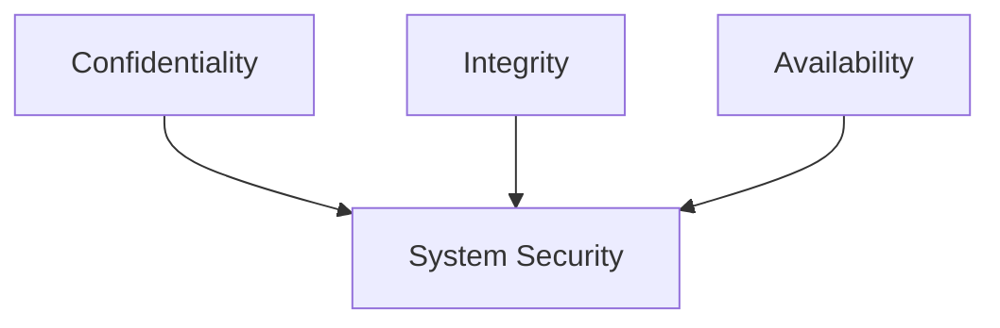

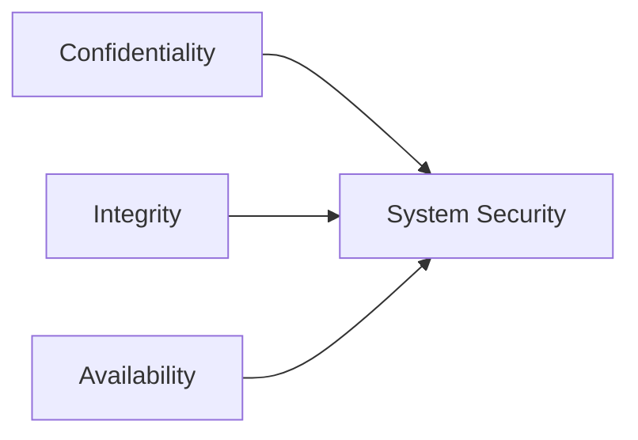

---

## Threat Modeling & Attack Vectors

**Threat modeling** helps you think like an attacker.

### Steps

- **Identify attack surface:** Exposed APIs, UIs, network endpoints.
- **Entry points:** Vulnerable integrations, user errors.
- **Assets to protect:** Sensitive data, financial transactions, IP.

### STRIDE Model

(See `image-26.png` for STRIDE diagram.)

- **S**poofing
- **T**ampering
- **R**epudiation
- **I**nformation Disclosure
- **D**enial of Service
- **E**levation of Privilege

### Common Attack Vectors

| Vector                 | Description                            | Defense                                  |
|------------------------|----------------------------------------|------------------------------------------|
| Insecure APIs          | Poor validation, lack of auth          | Input validation, auth, rate limiting    |
| Misconfigured Servers  | Defaults, missing patches              | Config management, regular audits        |
| Poor Authentication    | Weak passwords, no 2FA, session flaws  | Strong auth, MFA, secure token handling  |
| Open Ports/Services    | Unnecessary or exposed ports           | Firewalls, segmentation, port closure    |

```
   +------------+      +-------------+      +-------------+
   |  Internet  |----->|   Firewall  |----->| Web Service |
   +------------+      +------+------+      +------+------+
                                 |                 |
                                 v                 v
                         [Database]       [Internal APIs]
```

Attackers probe every interface — APIs, open ports, misconfigured servers.

---

## Common Attacks

### DDoS (Distributed Denial of Service)

- **Description:** Flooding system with traffic to disrupt service.
- **Target:** Availability.
- **Mitigation:** Rate limiting, traffic scrubbing (e.g., Cloudflare), autoscaling and failover.

### Man-in-the-Middle (MITM)

- **Description:** Attacker intercepts communication.
- **Targets:** Confidentiality & Integrity.
- **Protection:** HTTPS (TLS), certificate pinning, VPNs.

### Injection Attacks (e.g., SQL Injection)

- **Description:** Attacker sends malicious input to execute unwanted commands.
- **Impacts:** Data integrity, confidentiality.
- **Mitigation:** Input validation, parameterized queries, WAF (Web Application Firewall).

### Spoofing Attacks

- **Description:** Impersonation of another user or system.
- **Types:** IP spoofing, email spoofing, DNS spoofing.
- **Defense:** Multi-factor authentication, token-based authentication, IP whitelisting.

---

## Security in the SDLC

**Embed security from the start (Shift Left):** Integrate security practices early in the development process to prevent vulnerabilities instead of fixing them later.

### Phases

- **Requirements:** Threat modeling — identify and assess potential security threats before development begins.
- **Design:** Secure architecture — create system designs that minimize attack surfaces and enforce least privilege.
- **Development:** Secure coding — follow coding standards and best practices to avoid introducing vulnerabilities.
- **Testing:** Security tests, fuzzing — detect and fix vulnerabilities through automated and manual security testing.
- **Deployment:** Secrets management — protect credentials, keys, and sensitive configurations in production environments.
- **Maintenance:** Patch management — continuously update and patch systems to address newly discovered vulnerabilities.

---

## Authentication & Authorization

### Authentication vs. Authorization

| Concept            | What is it?                                       | Example                       | Mnemonic                |
|--------------------|---------------------------------------------------|-------------------------------|-------------------------|
| **Authentication** | Verifying *who* the user is                       | Logging in with password/MFA  | "Who are you?"          |
| **Authorization**  | Deciding *what* the authenticated user can do     | Accessing admin dashboard     | "What can you do here?" |

**Key point:** You *authenticate* first, then the system *authorizes* your actions.

### Common Authentication Methods

#### 1. Basic Authentication

Username and password sent with every request (use only with HTTPS).

```http
GET /protected HTTP/1.1
Authorization: Basic dXNlcjpwYXNz
```

#### 2. OAuth 2.0

Delegated access: third-party apps access user data without seeing credentials. Example: "Login with Google" or "Login with Facebook".

#### 3. OpenID Connect

Built on OAuth2; adds an identity layer for authentication. Use case: Single Sign-On (SSO) across multiple apps.

#### 4. JWT (JSON Web Token)

Stateless: server issues a signed token after login; client sends it with each request.

```json
{
  "sub": "1234567890",
  "name": "John Doe",
  "role": "admin",
  "exp": 1711234567
}
```

### Session-Based vs. Token-Based Authentication

| Feature            | Session-Based                  | Token-Based (e.g., JWT)          |
|--------------------|--------------------------------|----------------------------------|
| **Storage**        | Server memory/database         | Client-side (token)              |
| **Scalability**    | Challenging in distributed env | Scales easily in microservices   |
| **State**          | Stateful                       | Stateless                        |
| **Security Concerns** | Session hijacking, CSRF     | Token theft, token expiry        |

**Session-based flow:**

1. User logs in.
2. Server creates a session, sends session ID cookie.
3. Client sends cookie with each request.
4. Cons: Scalability challenges in distributed systems.

**Token-based flow:**

1. User logs in.
2. Server issues signed JWT.
3. Client sends JWT in `Authorization` header.
4. Cons: Requires secure token storage and handling.

### Access Control Models (Authorization)

#### 1. RBAC — Role-Based Access Control

- Assign permissions to roles, roles to users.
- **Example roles:** `admin`, `editor`, `viewer`.
- **Pros:** Simple, scalable for standard teams.
- **Cons:** Not granular for complex orgs.

#### 2. ABAC — Attribute-Based Access Control

- Access based on user attributes (department, project, clearance).
- **Pros:** Fine-grained control.
- **Cons:** Harder to manage at scale.

#### 3. DAC — Discretionary Access Control

- Resource owners set access permissions.
- **Example:** File-sharing apps.

#### 4. MAC — Mandatory Access Control

- Central authority enforces strict policies.
- **Example:** Military/government systems.

### Single Sign-On (SSO) & Identity Federation

- **SSO:** User logs in once, gains access to multiple apps/services without re-authenticating.
- **Identity Federation:** Trust external identity providers (Google, Facebook, Microsoft) for authentication across organizational boundaries.
- **Benefit:** Fewer passwords, less friction, better user experience.

### Code Examples

#### JWT Authentication with Node.js / Express

```javascript
const jwt = require('jsonwebtoken');

// Issue JWT after login
app.post('/login', (req, res) => {
  // ...validate user
  const token = jwt.sign({ userId: user.id, role: user.role }, process.env.JWT_SECRET, { expiresIn: '1h' });
  res.json({ token });
});

// Verify JWT on protected route
function authenticateJWT(req, res, next) {
  const authHeader = req.headers.authorization;
  if (authHeader) {
    const token = authHeader.split(' ')[1];
    jwt.verify(token, process.env.JWT_SECRET, (err, user) => {
      if (err) return res.sendStatus(403);
      req.user = user;
      next();
    });
  } else {
    res.sendStatus(401);
  }
}
```

A simpler form:

```js
const jwt = require('jsonwebtoken');
function authenticate(req, res, next) {
  const token = req.header('Authorization').replace('Bearer ', '');
  try {
    const payload = jwt.verify(token, process.env.JWT_SECRET);
    req.user = payload;
    next();
  } catch (err) {
    res.status(401).json({error: 'Unauthorized'});
  }
}
```

#### RBAC Middleware

```javascript
function authorizeRoles(...allowedRoles) {
  return (req, res, next) => {
    if (req.user && allowedRoles.includes(req.user.role)) {
      next();
    } else {
      res.sendStatus(403); // Forbidden
    }
  }
}

// Usage:
app.get('/admin', authenticateJWT, authorizeRoles('admin'), (req, res) => {
  res.send('Welcome, admin!');
});
```

### Diagrams

**Authentication & Authorization Flow:**

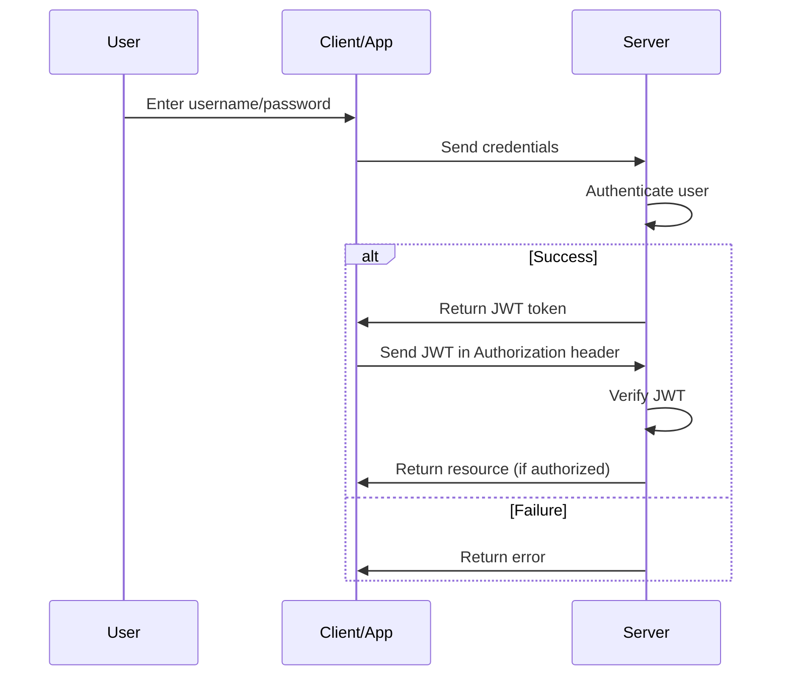

**RBAC Model:**

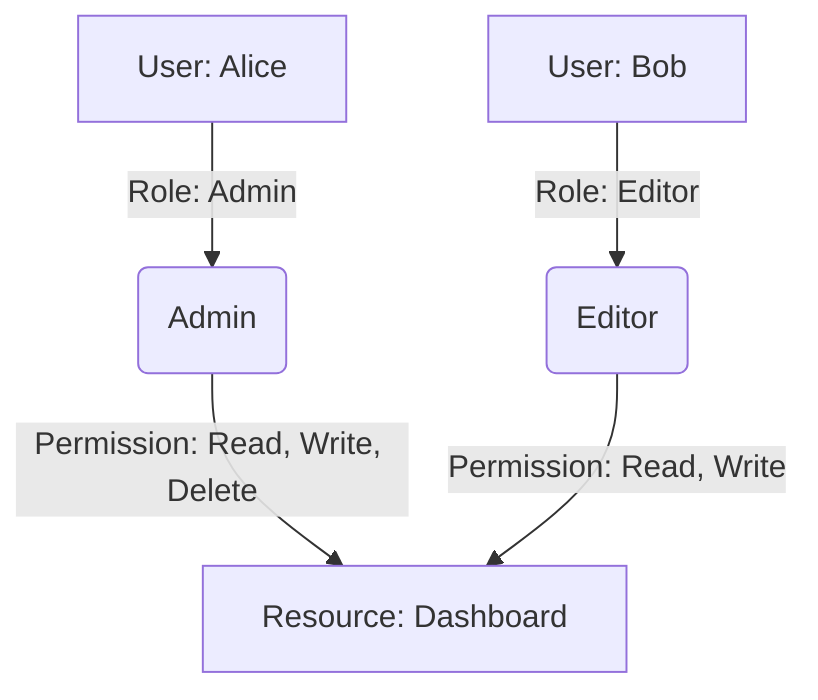

**End-to-end auth flow:**

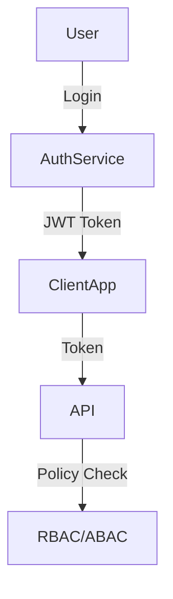

### Authentication / Authorization Tips

- **Always use HTTPS** even for development.
- **Keep JWTs short-lived:** Use refresh tokens for longer sessions.
- **Never store sensitive data in JWTs:** Tokens can be decoded by anyone.
- **Secure cookies:** Set `HttpOnly`, `Secure`, and `SameSite` attributes.
- **Centralize session/token invalidation** to handle logout and token revocation.
- **Use established libraries:** Don't roll your own crypto/auth code.
- **Implement rate limiting:** Protect authentication endpoints from brute-force attacks.
- **Audit permissions regularly:** Remove unused roles/permissions (principle of least privilege).
- **Log authentication events** for auditing and intrusion detection.
- **Educate users:** Encourage strong passwords and enable MFA.

---

## Data Protection & Secure Communication

### Encryption: The Heart of Data Protection

Encryption converts readable data (**plaintext**) into an unreadable format (**ciphertext**) using a secret key.

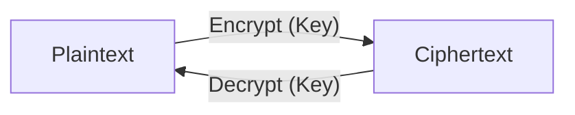

### Symmetric vs. Asymmetric Encryption

| Symmetric Encryption                 | Asymmetric Encryption                                  |
|--------------------------------------|--------------------------------------------------------|
| Single key (shared)                  | Key pair: Public + Private                             |
| Fast, efficient                      | Slower, but more secure for key exchange               |
| Used for large data                  | Used for identity, digital signatures, key exchange    |
| Challenge: secure key sharing        | Challenge: computational overhead                      |

**Symmetric Encryption:**

- Uses **one key** for both encryption and decryption.
- **Fast** and efficient — ideal for encrypting **large amounts of data.**
- Example algorithms: **AES**, **DES**, **Blowfish.**

**Asymmetric Encryption:**

- Uses a **key pair** — one **public key** (for encryption) and one **private key** (for decryption).
- Enables **secure key exchange** and **digital signatures.**
- Example algorithms: **RSA**, **ECC**, **Diffie-Hellman.**

**Combined Usage:** Often used together, e.g., in TLS handshakes — asymmetric encryption secures key exchange; symmetric encryption is then used for data transmission.

(See `image-27.png` for symmetric vs. asymmetric diagram.)

**Example (Python `cryptography` library — symmetric):**

```python
from cryptography.fernet import Fernet

# Generate a key
key = Fernet.generate_key()
cipher = Fernet(key)

# Encrypt
plaintext = b'secret data'
ciphertext = cipher.encrypt(plaintext)

# Decrypt
decrypted = cipher.decrypt(ciphertext)
assert decrypted == plaintext
```

### TLS Handshake (Simplified)

1. **Client Hello:** Client proposes cipher suites.
2. **Server Hello:** Server selects cipher suite, sends certificate (with public key).
3. **Key Exchange:** Client encrypts a random symmetric key with server's public key.
4. **Secure Session:** Both use the symmetric key for fast, secure data transfer.

### Encryption: At Rest & In Transit

| Encryption at Rest                              | Encryption in Transit               |
|-------------------------------------------------|--------------------------------------|
| Protects stored data (disks, DBs, backups)      | Protects data moving across network  |
| Techniques: Full-disk, field-level encryption   | Techniques: TLS/SSL (HTTPS)          |
| Use Cases: Cloud storage, user files, logs      | Use Cases: APIs, login sessions      |

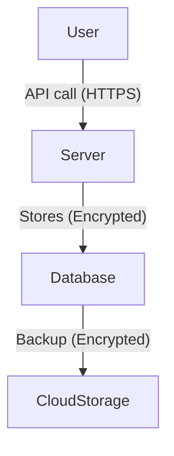

### TLS/SSL and HTTPS

- **HTTPS = HTTP over TLS.** Adds a secure encryption layer (TLS) on top of HTTP. TLS = Transport Layer Security; SSL = Secure Sockets Layer.
- **Ensures confidentiality, integrity, and authenticity:** Protects data from being read, altered, or spoofed during transmission.
- **TLS Handshake:** Key exchange + cipher negotiation. Establishes a secure session.

(See `image-28.png` for TLS handshake diagram.)

**Sample HTTPS server (Express.js):**

```js
const https = require('https');
const fs = require('fs');
const app = require('./app');
const options = {
  key: fs.readFileSync('key.pem'),
  cert: fs.readFileSync('cert.pem')
};
https.createServer(options, app).listen(443);
```

### Hashing & Salting: Secure Password Storage

#### Hashing

Hashing converts input data into a fixed-length string using a mathematical algorithm. It is a **one-way** operation.

**Pros:**

- **Irreversible:** Protects original data even if hashes are leaked.
- **Efficient:** Quick to compute and compare during authentication.
- **Fixed output size:** Consistent length regardless of input size.
- **Good for integrity checks:** Detects if data has been tampered with.

**Cons:**

- **Vulnerable to rainbow table attacks:** Precomputed hash databases can reveal common passwords.
- **Identical inputs = identical hashes:** Enables pattern recognition if no extra protection (like salting).

#### Salting

Salting adds a **unique random value (salt)** to each password **before hashing.** Ensures even identical passwords produce **different hashes.**

**Pros:**

- **Prevents rainbow table attacks.**
- **Increases security:** Makes brute-force attacks more difficult.
- **Protects common passwords.**

**Cons:**

- **Requires storage for salts:** Each salt must be stored securely with the hash.
- **Adds computational overhead.**
- **Not encryption:** Doesn't allow password recovery — only verification.

#### Common Secure Hash Algorithms

**SHA-256**, **SHA-512**, **bcrypt**, **scrypt**, **Argon2** (preferred for password storage).

| Technique   | Purpose                       | Reversible | Security Level | Example Use               |
|-------------|-------------------------------|------------|----------------|---------------------------|
| **Hashing** | Converts data into fixed hash | No         | Moderate       | Data integrity, checksums |
| **Salting** | Adds randomness to hashes     | No         | High           | Password storage          |

(See `image-29.png` for hashing diagram.)

**Hashing example with bcrypt (Python):**

```python
import bcrypt

password = b"supersecret"
# Generate salt and hash
hashed = bcrypt.hashpw(password, bcrypt.gensalt())

# To verify:
bcrypt.checkpw(password, hashed)  # Returns True
```

A simpler form:

```python
import bcrypt

password = b"supersecret"
salt = bcrypt.gensalt()
hashed = bcrypt.hashpw(password, salt)
# Store hashed in DB, never store raw password!
```

### Public Key Infrastructure (PKI) & Digital Certificates

**PKI** is a framework that manages **digital certificates** and **public-key encryption** to enable secure communication, authentication, and data integrity over untrusted networks.

PKI provides the foundation for **HTTPS**, **digital signatures**, **email encryption**, and **secure user/device authentication.**

#### Key Components

- **Certificate Authority (CA):** Issues and verifies digital certificates.
- **Registration Authority (RA):** Verifies identities before certificate issuance.
- **Public/Private Key Pair:** Used for encryption and decryption or signing and verification.
- **Digital Certificates:** Bind public keys to verified identities.
- **Certificate Revocation List (CRL):** Tracks invalid or compromised certificates.

#### Pros of PKI

- **Strong security:** Enables encryption, authentication, and data integrity.
- **Scalability:** Supports secure communication across large distributed systems.
- **Trust framework:** Certificates issued by trusted authorities enhance reliability.
- **Non-repudiation:** Digital signatures prove the origin and authenticity of data.
- **Automation support:** Modern systems allow automated certificate renewal and management.

#### Cons of PKI

- **Complex setup and management:** Requires proper configuration, key rotation, and certificate lifecycle management.
- **High cost:** Involves infrastructure, licensing, and operational expenses.
- **Single point of trust:** Compromise of a CA can impact many users.
- **Revocation challenges:** CRLs or OCSP responses may be slow or unavailable.
- **User mismanagement:** Improper key handling can compromise security.

#### Common Use Cases

- **HTTPS (SSL/TLS):** Secure web communication.
- **Email encryption:** Protects message content (S/MIME).
- **Code signing:** Verifies authenticity of software.
- **VPNs and Zero Trust networks:** Ensures secure device and user access.

**Certificate Chain Diagram:**

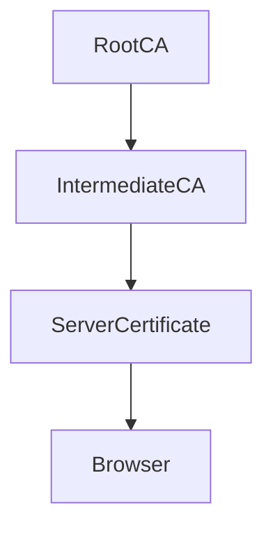

### Secure API Communication

**Key techniques:**

- **HTTPS (TLS):** Encrypts data in transit.
- **API keys:** Identify and authenticate API consumers.
- **OAuth 2.0 / OpenID Connect:** Provide secure delegated authorization.
- **JWT:** Enable stateless authentication and authorization.
- **HMAC:** Ensures message integrity and authenticity.
- **Rate limiting & throttling:** Prevent abuse or denial-of-service attacks.
- **Input validation:** Protects against injection and data corruption attacks.

**Pros:** Data confidentiality, integrity, authentication & authorization, scalability, user trust.

**Cons:** Added complexity, performance overhead, key management risks, misconfiguration risks, maintenance burden.

**Best practices:**

- Always use **HTTPS** (disable plain HTTP).
- Implement **strong authentication** (OAuth 2.0, API keys, or mutual TLS).
- Apply **rate limiting**, **monitoring**, and **logging.**
- Rotate and expire **tokens/keys** regularly.
- Use **WAFs (Web Application Firewalls)** to filter malicious traffic.

(See `image-30.png` for secure API diagram.)

**JWT example (Python, PyJWT):**

```python
import jwt
SECRET = 'your-secret-key'

# Encode
token = jwt.encode({'user': 'alice'}, SECRET, algorithm='HS256')

# Decode/verify
payload = jwt.decode(token, SECRET, algorithms=['HS256'])
```

### Data Protection — Cheat Sheet

| Concept            | What to Use/Do                       | Why                        |
|--------------------|--------------------------------------|----------------------------|
| Data at Rest       | Full-disk, DB encryption             | Protects stored data       |
| Data in Transit    | TLS/SSL, HTTPS                       | Prevents eavesdropping     |
| Passwords          | Hash + Salt (bcrypt, Argon2)         | Not reversible, secure     |
| Communication Auth | PKI, CA-signed certificates          | Verifies identity          |
| APIs               | HTTPS, JWT/OAuth2, rate limiting     | Secure, prevent abuse      |
| Certificate Mgmt   | Automate renewal, use strong CAs     | Avoid expired/weak certs   |

---

## Network & Infrastructure Security

### Why Network Security Matters

- **External Threats:** DDoS, intrusion attempts, IP spoofing, etc.
- **Internal Risks:** Misconfiguration, lateral movement after a breach.
- **Cloud-Native Expansion:** More exposure, new attack surfaces.
- **Business Impact:** Reliability, uptime, user trust, and data protection.

(See `image-31.png` for network security overview.)

### Firewalls

**Purpose:** Filter traffic based on IP, port, protocol.

**Types:**

- **Network-based:** Protects entry points (perimeter gateway).
- **Host-based:** Secures individual servers/devices.
- **Cloud firewalls:** Tailored for cloud resources (e.g., AWS Security Groups).

**Example: AWS Security Group (Terraform)**

```hcl
resource "aws_security_group" "web_sg" {
  name        = "web_sg"
  description = "Allow HTTP and HTTPS"

  ingress {
    from_port   = 80
    to_port     = 80
    protocol    = "tcp"
    cidr_blocks = ["0.0.0.0/0"]
  }
  ingress {
    from_port   = 443
    to_port     = 443
    protocol    = "tcp"
    cidr_blocks = ["0.0.0.0/0"]
  }
  egress {
    from_port   = 0
    to_port     = 0
    protocol    = "-1"
    cidr_blocks = ["0.0.0.0/0"]
  }
}
```

### Reverse Proxies

**Purpose:** Route incoming requests, mask backend identities, add security layers (SSL termination, load balancing).

**Popular tools:** NGINX, AWS ALB, HAProxy.

**Basic NGINX reverse proxy:**

```nginx
server {
    listen 80;
    server_name example.com;

    location / {
        proxy_pass http://backend-service:8080;
        proxy_set_header Host $host;
        proxy_set_header X-Real-IP $remote_addr;
    }
}
```

**With TLS:**

```nginx
server {
    listen 443 ssl;
    server_name example.com;
    ssl_certificate /etc/ssl/cert.pem;
    ssl_certificate_key /etc/ssl/key.pem;

    location / {
        proxy_pass http://backend:8080;
    }
}
```

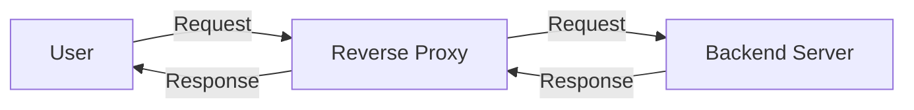

### Firewall vs. Reverse Proxy

#### Firewall

A **security barrier** that filters incoming and outgoing network traffic based on defined security rules.

**Pros:** Blocks unauthorized traffic; enforces policies based on IP/port/protocol/packet state; prevents malware/DDoS/brute-force; supports network segmentation (e.g., DMZ).

**Cons:** Can't inspect application-level payloads deeply (unless NGFW); needs constant rule updates; doesn't provide caching/load balancing.

#### Reverse Proxy

Sits in front of web servers and acts as an **intermediary** for client requests.

**Pros:** Hides internal server identities; load balancing; SSL/TLS termination; caching; can integrate WAF and authentication features.

**Cons:** Adds complexity; can be a single point of failure if not redundant; slight latency; misconfiguration risk.

#### Comparison Table

| Feature             | **Firewall**                                    | **Reverse Proxy**                                    |
|---------------------|-------------------------------------------------|------------------------------------------------------|
| **Primary Purpose** | Block unauthorized network traffic              | Handle and manage web traffic to backend servers     |
| **OSI Layer**       | Network (Layer 3/4)                             | Application (Layer 7)                                |
| **Direction**       | Controls traffic *into and out of* the network  | Handles traffic *into* web servers                   |
| **Security Role**   | Network perimeter defense                       | Application-level protection and traffic management  |
| **Functions**       | Filtering, monitoring, blocking                 | Load balancing, SSL termination, caching, routing    |
| **Visibility**      | Sees IPs, ports, and protocols                  | Sees HTTP/HTTPS requests and responses               |
| **Example Tools**   | pfSense, Cisco ASA, Fortinet                    | NGINX, HAProxy, Apache HTTPD, Cloudflare             |

**Summary:** Firewalls protect the **network layer;** reverse proxies protect the **application layer.** They're complementary — often used together.

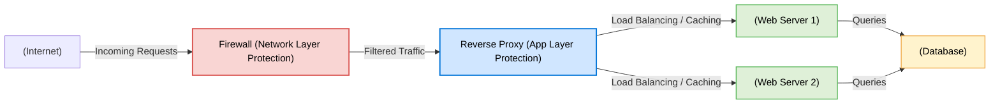

### API Traffic Control: Rate Limiting, Throttling, IP Filtering

#### Rate Limiting

Controls how many requests a client (IP, user, API key) can make within a specified time period.

**Example:** A user may make **100 requests per minute.** Exceeding returns **429 – Too Many Requests.**

**Pros:** Prevents DDoS / API abuse; ensures fair usage; manages server load; protects against brute-force login.

**Cons:** Can block legitimate bursts; adds latency at gateways; requires state management.

**Tools:** NGINX, Kong Gateway, Cloudflare, AWS API Gateway.

#### Throttling

**Softer version** of rate limiting: rather than rejecting excess requests, throttling **queues or delays** them.

**Example:** After 100 requests/min, additional requests are processed slower (e.g., 1 per second).

**Pros:** Prevents overload gracefully; better UX than hard blocking; useful for streaming/real-time systems.

**Cons:** Adds response latency; more complex; might not fully protect against massive spikes.

**Use cases:** Payment gateways, file uploads / video streaming, real-time APIs.

#### IP Filtering

Allows or blocks traffic based on the **source IP address.** First layer of defense at network or application level.

**Example:** Allow only requests from specific corporate IPs; block known malicious IPs.

**Pros:** Simple and effective for basic access control; reduces attack surface; works with firewalls/proxies/LBs.

**Cons:** Ineffective against spoofed IPs / botnets; static allowlists need updates; not suitable for mobile clients or dynamic-IP cloud environments.

**Implementation:** Firewall rules (AWS Security Groups, NACLs), reverse proxies, API Gateways.

#### Summary Table

| Technique         | Purpose                                 | Behavior               | Pros                           | Cons                        |
|-------------------|------------------------------------------|------------------------|--------------------------------|-----------------------------|
| **Rate Limiting** | Restrict total requests per time window | Blocks excess          | Prevents abuse, DDoS           | May block legitimate spikes |
| **Throttling**    | Slow down excess requests               | Queues or delays       | Smooth handling, user-friendly | Adds latency                |
| **IP Filtering**  | Allow/block based on IPs                | Drops or denies        | Simple, low-cost security      | Hard to manage dynamic IPs  |

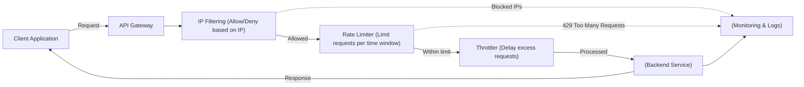

```
[User]-->(API Gateway)--(Token Bucket)-->[Backend Service]
```

---

## Network Segmentation & Isolation

**Network segmentation** is the practice of dividing a network into smaller logical or physical subnetworks (segments) to limit lateral movement, enforce granular security policies, and improve performance. **Isolation** means enforcing strict controls (often via firewalls or access control) so that one segment cannot freely access another.

> **Lateral Movement:** The technique attackers use to move within a network after gaining initial access — typically moving from one compromised system to others, in search of sensitive data, credentials, or critical assets.

### Why It Matters

- Reduces blast radius when a system is compromised.
- Enforces least-privilege access between services.
- Improves performance and traffic management.
- Helps meet compliance and audit requirements (PCI, HIPAA, etc.).

### Common Segmentation Patterns

- **Perimeter (Internet) → DMZ → Application → Database.**
- **VLAN-based segmentation** (L2 segmentation inside LANs).
- **Subnet + ACLs** (IP subnets with routing / access control lists).
- **Zone-based firewalling** (separate security zones).
- **Microsegmentation** (host-level segmentation using software agents, service mesh, cloud security groups).
- **Zero Trust segmentation** (authenticate & authorize every connection).

### Techniques / Tools

- **VLANs** (switch-level segmentation).
- **Subnets + routing** (logical segments).
- **Firewalls / NGFWs** (policy enforcement between segments).
- **Security groups / NACLs** (cloud-native segmentation).
- **VPNs and private links** (isolate management and inter-datacenter traffic).
- **Service mesh / sidecars** (mTLS, policies between microservices).
- **Host-based firewalls** (iptables, Windows Firewall).
- **Network access control (NAC)** and identity-aware proxies.

### Pros

- Limits lateral movement and attack surface.
- Better compliance and auditability.
- Fine-grained policy control.
- Can improve network performance.

### Cons / Trade-offs

- Increased management complexity.
- Misconfiguration risk.
- Potential operational overhead.
- Can add latency if traffic traverses multiple enforcement points.

### Best Practices

- Start with a **clear segmentation plan:** Categorize assets by sensitivity & function.
- Apply **least privilege:** Default deny between segments; allow only required flows.
- **Defense-in-depth:** Combine perimeter, segment firewalls, host controls.
- **Centralize policy management** (IaC for network/firewall rules).
- **Document** allowed flows and maintain network maps.
- **Automate** audits and drift detection.
- **Use monitoring & IDS/IPS** per segment.
- Test via chaos / attack simulations and pentesting.

### Implementation Checklist

- [ ] Inventory assets and classify by sensitivity (prod, dev, management, public).
- [ ] Define required flows (source → dest: ports/protocols).
- [ ] Design segments (DMZ, app, db, management, monitoring, CI/CD).
- [ ] Implement segmentation (VLANs/subnets, security groups, NGFW rules).
- [ ] Harden management plane (separate network + MFA for admin access).
- [ ] Deploy host-based protections & microsegmentation if required.
- [ ] Configure logging & monitoring per segment.
- [ ] Set up automated policy tests and regular audits.
- [ ] Plan for incident response (how to quarantine a segment).

### Typical Segmented Layout

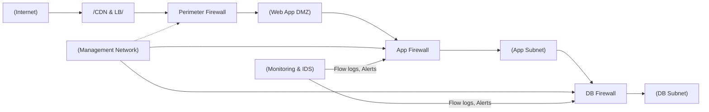

### When to Use Microsegmentation

- Highly dynamic, east-west traffic heavy environments (K8s, microservices).
- Environments with strict compliance or where host-level compromise risk is high.
- When you need policy tied to identity/service, not to network addresses.

### Pitfalls to Avoid

- Over-segmentation causing operational headache.
- Relying on network segmentation alone (forget host-level controls).
- Not version-controlling network policies.
- Ignoring management plane isolation.

---

## Zero Trust Security Model

**Definition:** A cybersecurity framework based on the principle: **"Never trust, always verify."**

Zero Trust assumes that **no user, device, or application** — whether inside or outside the network — should be automatically trusted. Every access request must be **authenticated, authorized, and continuously validated.**

> The traditional perimeter-based security model is obsolete — threats can come from **inside** the network too.

### Key Principles

| Principle                                  | Description                                                                                                          |
|--------------------------------------------|----------------------------------------------------------------------------------------------------------------------|
| **1. Verify Explicitly**                   | Always authenticate and authorize every request using **all available data** (identity, device, location, behavior). |
| **2. Least Privilege Access**              | Give users and applications **only the minimum required access.**                                                    |
| **3. Assume Breach**                       | Design systems as if they are already compromised. Continuously monitor, inspect, and segment traffic.               |
| **4. Microsegmentation**                   | Divide the network into isolated zones so that attackers cannot move laterally.                                      |
| **5. Continuous Monitoring**               | Use real-time analytics and telemetry to detect anomalies and re-evaluate trust dynamically.                         |
| **6. Strong Identity and Device Management** | Use MFA, SSO, and device posture checks (e.g., OS version, security patches).                                       |

### How Zero Trust Works

1. **User/Device requests access** → identity verified (via SSO/MFA).
2. **Policy Engine** evaluates context (who, what, where, how).
3. **Access granted** only to the specific resource, for a specific session.
4. **Session continuously monitored** for anomalies (behavioral analytics).
5. **Access revoked** if the session or device becomes non-compliant.

### Zero Trust Architecture Components

| Component                          | Function                                                                |
|------------------------------------|-------------------------------------------------------------------------|
| **Identity Provider (IdP)**        | Authenticates users (Azure AD, Okta).                                   |
| **Policy Engine**                  | Decides access based on identity, device, risk score, and context.      |
| **Policy Enforcement Point (PEP)** | Enforces decisions (reverse proxy, gateway, endpoint agent).            |
| **Telemetry & Analytics**          | Collects logs, detects anomalies, provides continuous trust evaluation. |
| **Microsegmented Network**         | Isolates systems and limits lateral movement.                           |

### Advantages

- Prevents unauthorized access — even if attackers breach the network.
- Reduces lateral movement and insider threat impact.
- Improves compliance (NIST SP 800-207, ISO 27001).
- Scales well across cloud, hybrid, and remote environments.
- Enhances visibility across all access points.

### Challenges

- Complex to implement in legacy networks.
- Requires identity centralization and strong IAM policies.
- Continuous monitoring can increase operational overhead.
- Needs integration across identity, network, endpoint, and application layers.

### Comparison: Traditional vs. Zero Trust

| Aspect          | Traditional Security         | Zero Trust Security               |
|-----------------|------------------------------|-----------------------------------|
| **Trust Model** | "Trust but verify"           | "Never trust, always verify"      |
| **Perimeter**   | Network boundary (firewall)  | Identity & device-centric         |
| **Access**      | Implicit once inside network | Explicit, per request/session     |
| **Focus**       | Keep outsiders out           | Protect resources everywhere      |
| **Visibility**  | Limited                      | Continuous monitoring & analytics |

### Zero Trust Architecture Diagram

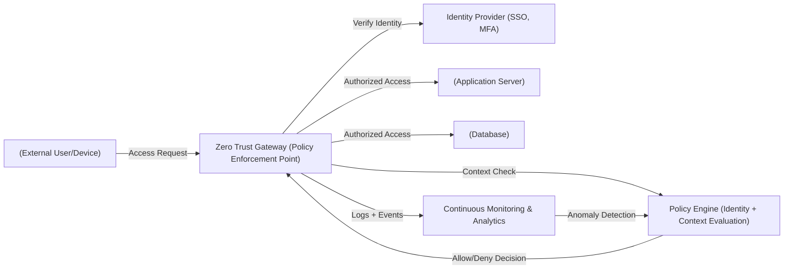

### Zero Trust in Practice

- Use **SSO + MFA** for all users and admins.
- Enforce **device posture checks** before granting access.
- Apply **microsegmentation** at network and workload level.
- Implement **just-in-time (JIT)** privileged access.
- Integrate with **SIEM/SOAR** tools for active monitoring.
- Continuously **evaluate session risk** and revoke access dynamically.

> **Analogy:** Zero Trust is like airport security — every traveler must show ID (authenticate), get screened (policy check), and can only enter specific gates (authorized resources). Even inside, behavior is continuously monitored.

---

## Securing Cloud Environments

### Shared Responsibility Model

Security in the cloud is a **shared responsibility** between the **cloud provider** and the **customer.**

| Responsibility     | Description                                                                                          |
|--------------------|------------------------------------------------------------------------------------------------------|
| **Cloud Provider** | Secures physical infrastructure, hardware, network, and foundational services (AWS, Azure, GCP).     |
| **Customer**       | Secures data, identity, access, and configurations within the cloud environment.                     |

### Key Cloud Security Practices

| Practice                          | Description                                                                                                                |
|-----------------------------------|----------------------------------------------------------------------------------------------------------------------------|
| **IAM (Identity & Access Mgmt)**  | Enforce RBAC, least privilege, and MFA.                                                                                    |
| **Encryption**                    | Encrypt data at rest (EBS, S3, Cloud Storage) and data in transit (via TLS/HTTPS).                                         |
| **Audit Logging**                 | Enable detailed audit trails (AWS CloudTrail, Azure Monitor, GCP Audit Logs).                                              |
| **CSPM (Cloud Security Posture Management)** | Continuously scan cloud resources for misconfigurations, policy violations, and compliance gaps.                  |

### AWS IAM Policy Example

```json
{
  "Version": "2012-10-17",
  "Statement": [
    {
      "Effect": "Allow",
      "Action": ["s3:GetObject"],
      "Resource": ["arn:aws:s3:::mybucket/*"]
    }
  ]
}
```

> Grants read-only access to all objects in the S3 bucket `mybucket`.

### Additional Cloud Security Best Practices

- **Network segmentation:** Use VPCs, subnets, and security groups to isolate workloads.
- **Zero Trust principles:** Verify each access request — don't assume trust inside your network.
- **Key management:** Use managed services like **AWS KMS**, **Azure Key Vault**, **GCP KMS** for secure key lifecycle.
- **Monitoring & alerting:** Use SIEM tools (AWS GuardDuty, Azure Sentinel) for threat detection.
- **Backup & recovery:** Automate snapshots, versioning, cross-region backups.
- **Compliance automation:** Use **CSPM** and **CIEM** to maintain governance.

| Aspect                      | Best Practice                            |
|-----------------------------|------------------------------------------|
| **Access Management**       | RBAC, least privilege, MFA               |
| **Data Protection**         | Encryption (in transit & at rest)        |
| **Visibility & Monitoring** | Logging, threat detection, alerts        |
| **Configuration Security**  | CSPM & automated policy enforcement      |
| **Resilience**              | Regular backups, versioning, DR planning |

---

## Serverless & Container Security

### Serverless Security

Serverless functions (AWS Lambda, Azure Functions, GCP Cloud Functions) abstract away infrastructure, but **security of the code and configurations** remains your responsibility.

| Practice                          | Description                                                                                                  |
|-----------------------------------|--------------------------------------------------------------------------------------------------------------|
| **IAM Roles (Least Privilege)**   | Assign narrowly scoped IAM roles — each function should only access the resources it truly needs.            |
| **Timeouts & Execution Limits**   | Set strict runtime limits to prevent resource abuse or infinite loops.                                       |
| **API Gateway Security**          | Front serverless functions with API Gateways that enforce authentication, rate limiting, and IP filtering.   |
| **Input Validation**              | Sanitize and validate inputs to prevent injection attacks.                                                   |
| **Logging & Monitoring**          | Use services like AWS CloudWatch Logs or Azure Monitor for visibility and anomaly detection.                 |
| **Dependency Management**         | Regularly scan third-party libraries for vulnerabilities (AWS CodeGuru, Snyk).                               |

### Container Security

Containers (Docker, Kubernetes workloads) share the host kernel, requiring **strong isolation and image hygiene.**

| Practice                          | Description                                                                                       |
|-----------------------------------|---------------------------------------------------------------------------------------------------|
| **Image Scanning**                | Scan container images using **Trivy**, **Clair**, **Anchore** to detect known CVEs.               |
| **Run as Non-Root**               | Prevent privilege escalation by running containers under non-root users.                          |
| **Limit Privileges**              | Use minimal capabilities (`--cap-drop=ALL`) and read-only file systems.                           |
| **Network Policies (Kubernetes)** | Use **NetworkPolicies** to restrict pod-to-pod communication and block lateral movement.          |
| **Image Signing**                 | Use **Notary** or **Cosign** to verify image authenticity before deployment.                      |
| **Runtime Protection**            | Employ tools like **Falco** or **AppArmor** to detect abnormal container activity.                |
| **Patch & Update**                | Regularly rebuild and update images with the latest OS and library patches.                       |

### Summary Table

| Area           | Key Security Measures                                                   | Tools/Services                                                                        |
|----------------|-------------------------------------------------------------------------|---------------------------------------------------------------------------------------|
| **Serverless** | IAM least privilege, input validation, API Gateway protection           | AWS Lambda + CloudWatch, Azure Functions + Defender, GCP Functions + Security Scanner |
| **Containers** | Image scanning, non-root execution, network policies, runtime hardening | Trivy, Clair, Falco, AppArmor, Kubernetes NetworkPolicies                             |

### Best Practices Across Both

- Adopt the **Principle of Least Privilege** everywhere.
- Automate security checks in **CI/CD pipelines.**
- Use **Infrastructure as Code (IaC)** scanning tools (Checkov, tfsec).
- Continuously monitor logs and metrics for anomalies.
- Rotate and securely store **secrets** using KMS or Vault.

---

## Security in Microservices

### 1. Service-to-Service Authentication

Each microservice must verify the identity of the other before sharing data.

- Use **JWT** for stateless authentication and authorization.
- Use **Mutual TLS (mTLS)** to authenticate both client and server using digital certificates.
- Rotate tokens and certificates regularly.
- Store secrets securely (AWS Secrets Manager, HashiCorp Vault).

*Example:* Service A → includes JWT in request → Service B verifies signature and claims.

### 2. API Gateway

Acts as a **central entry point** for all external traffic into your microservices.

- Enforces **authentication**, **authorization**, **input validation.**
- Implements **rate limiting**, **IP filtering**, **request logging.**
- Hides internal services from external exposure.
- Integrates with **IAM** or **OAuth 2.0** providers for user identity management.

*Example:* API Gateway verifies OAuth token before routing request to internal services.

### 3. Service Mesh

A **service mesh** (Istio, Linkerd, Consul) adds security, observability, and traffic management between microservices without changing application code.

- Provides **fine-grained traffic policies** and **mTLS encryption** for all inter-service communication.
- Implements **zero-trust** principles inside the cluster.
- Enables **access control**, **telemetry**, **automatic certificate rotation.**
- Offloads network security from developers — handled by **sidecar proxies** (Envoy).

*Example:* Service A ↔ Service B communication is automatically encrypted and authenticated by the service mesh.

### Summary Table

| Layer                       | Security Focus                         | Techniques / Tools                   |
|-----------------------------|----------------------------------------|--------------------------------------|
| **Edge (External)**         | Secure user access                     | API Gateway, OAuth 2.0, WAF          |
| **Service-to-Service**      | Authenticate internal requests         | JWT, mTLS, Service Accounts          |
| **Intra-Service (Network)** | Encrypted and controlled communication | Service Mesh (Istio, Linkerd)        |
| **Secrets Management**      | Protect credentials and tokens         | HashiCorp Vault, AWS Secrets Manager |
| **Monitoring & Auditing**   | Detect abnormal behavior               | Prometheus, OpenTelemetry, SIEM      |

### Secure Microservices Architecture

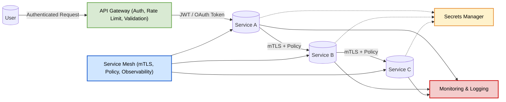

**Key takeaways:**

- Apply **Zero Trust:** authenticate and encrypt *every* service call.
- Use **API Gateways** for edge protection, and **Service Meshes** for internal trust.
- Automate **certificate and token management.**
- Continuously **monitor, log, and analyze** inter-service communication.

---

## Common Vulnerabilities — OWASP Top 10

- **Injection:** SQL, NoSQL, OS command injection.
- **Broken Authentication:** Weak or no authentication.
- **Sensitive Data Exposure:** Unencrypted data.
- **Security Misconfiguration:** Default creds, open ports.
- **XSS, CSRF, SSRF:** Client-side and server-side threats.

**Mitigation:**

- Input validation.
- Secure authentication.
- Encrypt sensitive data.
- Harden configuration.
- Secure defaults.

---

## OAuth 2.0 Flows — Pick the Right One

Most security failures in modern apps come from picking the wrong OAuth flow or skipping steps. Here's the decision tree.

| Flow                              | Use for                                                | What you need to know                                              |
|-----------------------------------|---------------------------------------------------------|---------------------------------------------------------------------|
| **Authorization Code + PKCE**     | SPAs, mobile apps                                       | Modern best practice. PKCE prevents code interception.              |
| **Authorization Code** (no PKCE)  | Server-side web apps with a client secret              | Classic flow; needs a confidential client (secret server-side).     |
| **Client Credentials**            | Machine-to-machine (one service calls another)         | No user; just a service identity.                                   |
| **Device Code**                   | TVs, CLI tools, IoT devices                            | "Visit example.com/device and enter ABC-123"                        |
| **~~Implicit~~** (deprecated)     | ~~SPAs~~                                                | **Don't use.** Token in URL = browser history leakage. Use Auth Code + PKCE. |
| **~~Resource Owner Password~~** (deprecated) | ~~Trusted first-party login~~              | **Don't use.** App handles the password directly — defeats OAuth's purpose. |

> **In a system design interview:** "We'll use Authorization Code + PKCE for the SPA, Client Credentials for our microservices to talk to each other, and Device Code for the CLI tool."

---

## JWT Pitfalls — What Goes Wrong

JWT is everywhere, but it's also where the most security mistakes happen.

| Pitfall                                  | Why it's bad                                                                       | Fix                                                                            |
|------------------------------------------|------------------------------------------------------------------------------------|--------------------------------------------------------------------------------|
| **Storing JWT in `localStorage`**         | Any XSS instantly steals the token (no `HttpOnly` protection)                      | Use `HttpOnly`, `Secure`, `SameSite=Lax` cookies instead                       |
| **Not validating the signature**          | Anyone can forge a JWT with admin claims                                          | Always verify with the public key/secret. Reject `alg: none`.                  |
| **Accepting `alg: none`**                 | Famous CVE — library lets you skip signature                                       | Pin the expected algorithm in your verifier                                    |
| **No expiry (`exp`)**                     | Stolen token works forever                                                        | Set short `exp` (15-60 min). Use refresh tokens for long-lived sessions.       |
| **No token revocation strategy**          | Can't invalidate before `exp` even if you know the token is compromised           | Keep a blocklist OR use short expiry + refresh                                |
| **Storing sensitive data in the payload** | JWT payload is base64-encoded, *not encrypted* — anyone with the token can read it| Don't put PII or secrets in the JWT. Use opaque tokens or encrypt the payload (JWE). |
| **Confusing JWT with sessions**           | JWTs can't be revoked easily; sessions can be deleted server-side                  | If you need instant revocation, use server-side sessions.                      |

---

## Defense in Depth — Layered Security

A single security control will eventually fail. **Layer your defenses** so an attacker has to bypass multiple controls.

```
Internet
   │
   ▼
[1] CDN / Anti-DDoS (Cloudflare, AWS Shield)
   │
   ▼
[2] WAF (Web Application Firewall) — blocks OWASP Top 10 attempts
   │
   ▼
[3] API Gateway — auth, rate limits, JWT validation
   │
   ▼
[4] App-level authorization — role/permission checks per endpoint
   │
   ▼
[5] Database access controls — row-level security, per-service DB users
   │
   ▼
[6] Encryption at rest — even if attacker exfiltrates the DB, data is encrypted
   │
   ▼
[7] Audit logs — every access logged for incident response
```

> **Lesson:** even if one layer is bypassed, the next catches it. Don't rely on a single "wall."

---

## Secrets Management — Don't Put Secrets in Code

Hard-coded API keys, DB passwords, and TLS certs in source repos are how breaches happen. Use a **secrets manager.**

| Tool                       | Pros                                       | Cons                          |
|----------------------------|--------------------------------------------|-------------------------------|
| **HashiCorp Vault**        | Cloud-agnostic, dynamic secrets, fine-grained policies | Operational complexity |
| **AWS Secrets Manager / Parameter Store** | Native AWS integration, automatic rotation | AWS-only |
| **GCP Secret Manager**     | Native GCP integration, versioned          | GCP-only                      |
| **Azure Key Vault**        | Native Azure integration                   | Azure-only                    |
| **Doppler / 1Password Secrets Automation** | Developer-friendly UX           | Hosted SaaS                   |

**The non-negotiables for any secrets system:**

1. **Rotate** secrets regularly (and ideally on-demand if compromised).
2. **Audit** — log every access; alert on unusual patterns.
3. **Least privilege** — each service gets only the secrets it needs.
4. **Never in source control** — use `.gitignore` + pre-commit hooks (`gitleaks`, `trufflehog`).

---

## Common Security Headers — Defaults Every App Should Set

These belong on every HTTP response. Forgetting them is a finding in any security audit.

| Header                          | What it does                                                |
|---------------------------------|--------------------------------------------------------------|
| `Strict-Transport-Security`     | Force HTTPS for all future requests (HSTS)                  |
| `Content-Security-Policy`       | Whitelist allowed scripts/styles (strongest XSS defense)    |
| `X-Content-Type-Options: nosniff` | Stop browsers from guessing MIME types                    |
| `X-Frame-Options: DENY`         | Prevent clickjacking (or use CSP's `frame-ancestors`)       |
| `Referrer-Policy: strict-origin-when-cross-origin` | Limit referer leakage                  |
| `Permissions-Policy`            | Disable browser features (camera, mic) you don't need       |

---

## Combined Tips & Tricks

A consolidated master list from all sections.

### General

- **Shift Left:** Start thinking about security early in your project. Embed security throughout the SDLC.
- **Automate security checks:** Use CI tools to catch issues early. Integrate security tests and vulnerability scans into CI/CD pipelines.
- **Principle of Least Privilege:** Give only the permissions needed.
- **Patch early, patch often:** Stay on top of OS, library, and container image updates.
- **Review regularly:** Security is an ongoing process, not a one-time setup.
- **Educate your team:** Security awareness is everyone's job.

### Authentication & Authorization

- Always use **multi-factor authentication (MFA)** where possible.
- Store sensitive tokens/secrets in **vaults** (AWS Secrets Manager, HashiCorp Vault).
- Rotate keys and secrets regularly. Automate rotation.

### Data Protection

- **Encrypt everywhere:** Both at rest and in transit — never skip one.
- Use **parameterized queries** to prevent SQL injection.
- Always **salt** and **hash** passwords — never store them in plaintext.
- **Hash, don't encrypt, passwords:** And always salt them.
- **Automate certificate renewal:** Use tools like Let's Encrypt with auto-renewal.

### Network Security

- Regularly **scan for open ports** and **unused services.**
- Use **security groups** and **VPCs** in the cloud for isolation.
- **Harden your APIs:** Rate limiting, IP filtering, input validation, strong authentication.
- **Trust but verify:** Use mTLS, certificate pinning, threat modeling.

### Monitoring & Logging

- Log **all security events** and review them regularly.
- Set up **alerting** for suspicious activities.
- **Enable logging and monitoring:** Know when and where breaches or anomalies happen.
- **Log everything (securely):** Centralize logs and protect them with encryption.

### Operations

- **Embrace CSPM:** Use tools to continuously assess your cloud security posture.
- **Practice incident response:** Regularly test your recovery and incident response plans.
- **Red team exercises:** Regularly test your defenses.

---

## Sample Interview Questions

1. How would you design a secure authentication system for a distributed application?
2. Explain how the CIA triad applies to system design.
3. What are common security threats in a microservices architecture, and how would you mitigate them?
4. How would you protect your system from a DDoS attack?
5. What role does TLS/HTTPS play in system security?
6. How would you implement certificate management at scale?
7. How can you ensure secure data storage in a cloud-based system?
8. What is threat modeling and how would you incorporate it into your design process?
9. What is the difference between hashing and encryption?
10. Why is asymmetric encryption slower than symmetric?
11. How does PKI build trust online?
12. How would you secure data at rest and in motion?
13. How do you protect APIs from abuse and unauthorized access?
14. Explain the Zero Trust security model.
15. How would you implement microsegmentation?
16. What are the OWASP Top 10 vulnerabilities, and how do you mitigate them?

---

## Summary & Quick Reference

- **Security** is ongoing. It must be built into every phase and layer of your system.
- **CIA triad:** Confidentiality, Integrity, Availability.
- **Threat modeling** and awareness of **common attack vectors** are critical.
- Use **modern authentication & access control** (OAuth2, JWT, RBAC/ABAC).
- **Encrypt data everywhere** — at rest and in transit.
- **Harden your network** with firewalls, segmentation, zero trust, monitoring.
- **DR is more than backups** — it's about system continuity.

### Quick Reference: Security by Layer

| Layer         | Key Controls                                |
|---------------|---------------------------------------------|
| App/API       | Input validation, auth, rate limiting       |
| Data          | Encryption, hashing, access controls        |
| Network       | Firewalls, segmentation, Zero Trust         |
| Cloud/Infra   | IAM, audit, secure defaults                 |

> *Building secure systems isn't a checkbox — it's the foundation of good architecture.*

---

## Further Reading

- [OWASP Authentication Cheat Sheet](https://cheatsheetseries.owasp.org/cheatsheets/Authentication_Cheat_Sheet.html)
- [JWT.io Introduction](https://jwt.io/introduction)
- [OAuth 2.0 and OpenID Connect](https://auth0.com/docs/get-started/authentication-and-authorization-protocols/oauth-2-0-and-openid-connect)
- [OWASP Top 10](https://owasp.org/www-project-top-ten/)
- [NIST Cybersecurity Framework](https://www.nist.gov/cyberframework)
- [AWS Security Best Practices](https://aws.amazon.com/architecture/security-identity-compliance/)
- [Let's Encrypt](https://letsencrypt.org/)

---

**Next Up:** [Chapter 11 — The System Design Blueprint →](./11%20-%20The%20System%20Design%20Blueprint.md) — a 4-step methodology for tackling any system design problem.
