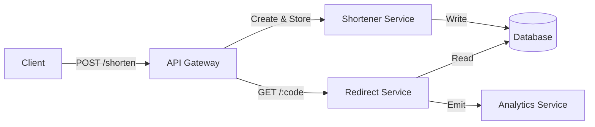

# The System Design Blueprint: A 4-Step Method for Scalable Systems

Welcome to the **capstone of the foundational chapters** of our system design series. In this chapter, we shift gears from core theory to practical application. We'll break down a proven **4-step system design approach** — a blueprint you can follow to tackle any real-world system design problem, from initial requirements to strategic technical decisions.

This is the framework we'll use for every case study (Chapters 12 onwards).

---

## Learning Outcomes

After reading this chapter, you'll be able to:

1. Walk through any system design problem using the **4-step framework**.
2. Do **back-of-the-envelope estimations** for QPS, storage, and bandwidth.
3. Manage **45 minutes** of interview time across the four steps without running out.
4. Recognize when to **go deeper vs. zoom out** based on interviewer cues.
5. State **trade-offs explicitly** — the single skill that separates a junior from senior in design interviews.

---

## Table of Contents

1. [What Is System Design?](#what-is-system-design)
2. [The 4-Step System Design Process](#the-4-step-system-design-process)
3. [Step 1: Understanding the Problem & Defining Scope](#step-1-understanding-the-problem--defining-scope)
4. [Step 2: Estimating Scale & Identifying Bottlenecks](#step-2-estimating-scale--identifying-bottlenecks)
5. [Step 3: High-Level Design — Services, APIs & Communication](#step-3-high-level-design--services-apis--communication)
6. [Step 4: Making Tech & Infrastructure Decisions Strategically](#step-4-making-tech--infrastructure-decisions-strategically)
7. [Tips and Tricks for System Design Interviews](#tips-and-tricks-for-system-design-interviews)
8. [Conclusion: Your Blueprint for Success](#conclusion-your-blueprint-for-success)
9. [Further Reading](#further-reading)

---

## What Is System Design?

Before we dive into the framework, let's recap what system design means in practice:

- **System design** is the process of defining a system's architecture, components, and interactions to meet requirements such as *scalability*, *performance*, and *maintainability*.
- It's about **building solutions** that are robust, scalable, and sustainable — not just working software.
- System design is full of **trade-offs:** performance vs. cost, complexity vs. simplicity, and more. Every decision must align with long-term vision and business goals.

---

## The 4-Step System Design Process

Here's the high-level process we'll use for every case study:

```
+---------------------+      +----------------------------+      +-----------------------+      +-----------------------------+
| 1. Problem & Scope  | ---> | 2. Estimating Scale &      | ---> | 3. High-Level Design  | ---> | 4. Tech & Infra Decisions   |
|                     |      |    Identifying Bottlenecks |      |    (Services, APIs)   |      |    (Stack, Performance)     |
+---------------------+      +----------------------------+      +-----------------------+      +-----------------------------+
```

Let's dig into each step.

---

## Step 1: Understanding the Problem & Defining Scope

1. **Functional Requirements**
   - What should the system do?
   - *Example:* For a URL shortener: create short URLs, redirect to the original, track analytics.
2. **Non-Functional Requirements**
   - Performance (latency, throughput).
   - Scalability (handle millions of requests).
   - Security, Reliability, Compliance, etc.
3. **Constraints**
   - Time, budget, team, regulatory, and technical limitations.

#### Example: URL Shortener

- **Functional:** Shorten URLs, redirect, analytics.
- **Non-Functional:** < 100ms latency, 99.99% uptime, GDPR compliance.
- **Constraints:** Launch in 3 months, AWS only, $1000/mo budget.

---

## Step 2: Estimating Scale & Identifying Bottlenecks

1. **Estimate Traffic**
   - What's the expected peak load? How fast will it grow?
   - *Example:* 10M requests/day, 2× annual growth.
2. **Identify Bottlenecks**
   - Which parts could fail under load? (DB, CPU, network, etc.)
3. **Capacity Planning**
   - Estimate storage, bandwidth, and compute needs to avoid failure.

#### Example: Rough Traffic Estimation

```python
DAILY_REQS = 10_000_000
BYTES_PER_REQ = 1_000  # e.g., analytics payload, overhead
bandwidth_needed = DAILY_REQS * BYTES_PER_REQ / (24 * 3600)  # bytes/sec
print(f"Required bandwidth: {bandwidth_needed/1024:.2f} KB/s")
```

---

## Step 3: High-Level Design — Services, APIs & Communication

1. **Core Services**
   - Break into logical components (shortener service, analytics service, etc.).
2. **API Design**
   - Define endpoints and request/response formats.
3. **Communication Patterns**
   - Synchronous (REST) vs. Asynchronous (queues, events).
4. **Service Interaction**
   - How do services talk? Direct, via API Gateway, or through message queues?



#### Example: API Endpoint (Flask)

```python
from flask import Flask, request, jsonify, redirect

app = Flask(__name__)

@app.route('/shorten', methods=['POST'])
def shorten():
    original_url = request.json['url']
    code = generate_code(original_url)
    store_url(code, original_url)
    return jsonify({'short_url': f'https://sho.rt/{code}'})

@app.route('/<code>', methods=['GET'])
def redirect_url(code):
    original_url = get_original_url(code)
    log_hit(code)
    return redirect(original_url)
```

---

## Step 4: Making Tech & Infrastructure Decisions Strategically

1. **Tech Stack**
   - SQL or NoSQL? In-memory cache (e.g., Redis)? Message queues?
2. **Scalability & Availability**
   - Load balancing, auto-scaling, replication.
3. **Performance**
   - Caching, latency vs. throughput, CDN, etc.
4. **Trade-Offs**
   - Performance vs. cost, simplicity vs. flexibility, etc.

#### Example Choices

- **DB:** NoSQL (Cassandra) for fast writes, high scalability.
- **Cache:** Redis to store hot URLs.
- **Load Balancer:** AWS ALB for HTTP routing.
- **Scaling:** Auto-Scaling Groups.

#### Example: Redis Caching

```python
import redis

r = redis.Redis(host='localhost', port=6379)

def get_original_url(code):
    url = r.get(code)
    if url:
        return url
    # fallback: fetch from DB, then cache it
    url = db.fetch_url(code)
    r.setex(code, 3600, url)
    return url
```

---

## Managing 45 Minutes of Interview Time

A typical system design interview is **45 minutes**. Most candidates run out of time because they spend 20 minutes on requirements. Here's the rough budget:

| Phase                                | Time      | What to do                                                       |
|--------------------------------------|-----------|------------------------------------------------------------------|
| 1. Requirements + scope              | **5 min** | Functional + 2-3 NFRs + back-of-envelope numbers. **Don't linger.** |
| 2. High-level design (boxes & arrows)| **10 min**| Sketch core components and data flow. Get the interviewer's nod. |
| 3. Deep-dive into 1-2 components     | **20 min**| Pick the most interesting/scaling-relevant pieces. Show data models, APIs, algorithms. |
| 4. Scaling, failure modes, trade-offs| **10 min**| What happens at 10× scale? What if a region fails? What did we sacrifice? |

> **The #1 mistake:** spending 25 minutes on phase 1-2 and never getting to a deep-dive. The deep-dive is where you actually *demonstrate* your level. Time-box ruthlessly.

---

## Common Interview Frameworks

Different mentors give different acronyms. They all roughly describe the same flow. Pick whichever you remember:

- **RADIO**: Requirements → API → Data → I/O (throughput, latency) → Optimizations.
- **REACTO**: Repeat the question → Examples → Approach → Code (or design) → Test → Optimize.
- **The 4-Step** (this book): Requirements → Scale → High-level → Tech.

> **None is "right."** What matters is having *a* structure so you don't freeze when the prompt is "design YouTube."

---

## Reading the Interviewer

System design interviews are **collaborative.** Watch for cues:

| Interviewer signal                                | What it likely means                          | What to do                                         |
|---------------------------------------------------|-----------------------------------------------|-----------------------------------------------------|
| "Interesting, what about X?"                       | They want you to go deeper on X               | Drop your current path; deep-dive X                |
| "OK, let's move on"                               | You've spent too long here                    | Wrap up in 30 seconds and move forward             |
| "How would this handle 100M users?"               | Scaling question — invite to discuss bottlenecks | Walk through 10×, 100×, 1000× and what breaks at each |
| "What if the database goes down?"                  | Failure mode question                          | Talk replicas, failover, RPO/RTO targets           |
| Silence after you propose something               | They're skeptical or want more depth          | Explain *why* you chose it; offer an alternative   |
| "Can you draw that?"                              | They want a visual aid                         | Sketch boxes and arrows — even rough is better than none |

---

## Handling "I Don't Know"

The right answer is **never "I don't know" and stop.** It's: "I don't know, but here's how I'd approach finding out."

**Good:** "I haven't used Cassandra in production, but I know it's a wide-column store optimized for high write throughput. For our use case — append-heavy event logs — that seems like a fit. I'd want to validate by checking it handles our read patterns too."

**Bad:** "I don't know Cassandra. Pass."

Showing how you reason in the face of uncertainty is **more impressive** than memorized facts.

---

## State Trade-offs Explicitly (the One Skill That Matters Most)

Juniors propose solutions. Seniors propose solutions *and name what they're sacrificing.* In every interview, after every choice, say:

> "I'm choosing X. The trade-off is that we lose Y, but Y is acceptable here because Z."

Examples:
- "We'll use eventual consistency for the feed. **Trade-off:** users might briefly see stale posts. **Acceptable because** feed staleness <1s is fine, and we gain massive read throughput."
- "We'll shard by user_id. **Trade-off:** cross-user analytics queries get harder. **Acceptable because** 99% of queries are single-user; we'll run analytics on a separate column store."
- "We'll cache aggressively. **Trade-off:** cache invalidation gets complex. **Acceptable because** writes are <5% of traffic, and 60s of staleness is fine for this data."

This sentence pattern alone is worth a level on the rubric.

---

## Tips and Tricks for System Design Interviews

- **Always start with requirements:** Don't jump to solutions; clarify what's needed.
- **Think in trade-offs:** There's no perfect design — always state what you're optimizing for.
- **Draw diagrams:** Visuals help clarify architecture and component interactions.
- **Estimate with numbers:** Even rough calculations (requests/sec, data size) show your depth.
- **Consider failure modes:** Think about what happens when a component fails (DB down? Cache miss?).
- **Justify tech choices:** Explain *why* you picked a tool or architecture.
- **Iterate:** Revise your design as you find new bottlenecks or constraints.

---

## Conclusion: Your Blueprint for Success

- **Start with clear requirements and constraints.**
- **Use scale and bottleneck analysis to guide architecture.**
- **Create a high-level design balancing performance, cost, and complexity.**
- **Make informed infrastructure and tech choices to ensure scalability and availability.**

By following this four-step process, you'll build systems that are robust, reliable, and ready for real-world growth.

---

## Further Reading

- [System Design Primer (GitHub)](https://github.com/donnemartin/system-design-primer)
- [Designing Data-Intensive Applications by Martin Kleppmann](https://dataintensive.net/)
- [AWS Architecture Center](https://aws.amazon.com/architecture/)

---

**Next Up:** [Chapter 12 — Design a URL Shortener (TinyURL) →](./12%20-%20Design%20a%20URL%20Shortener%20(TinyURL).md) — applying this blueprint to our first real-world case study.
