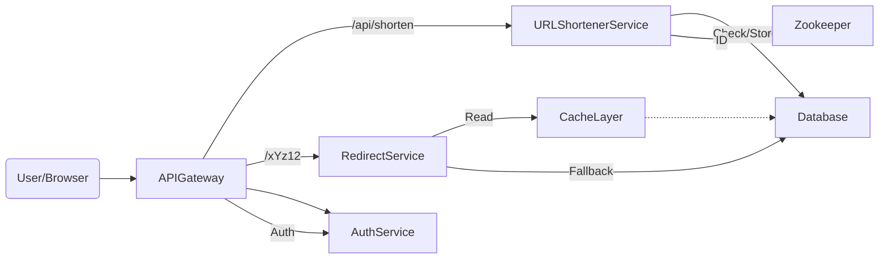
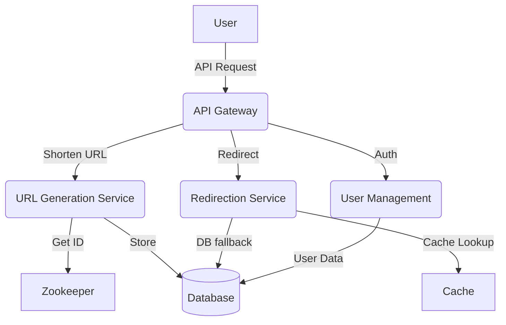
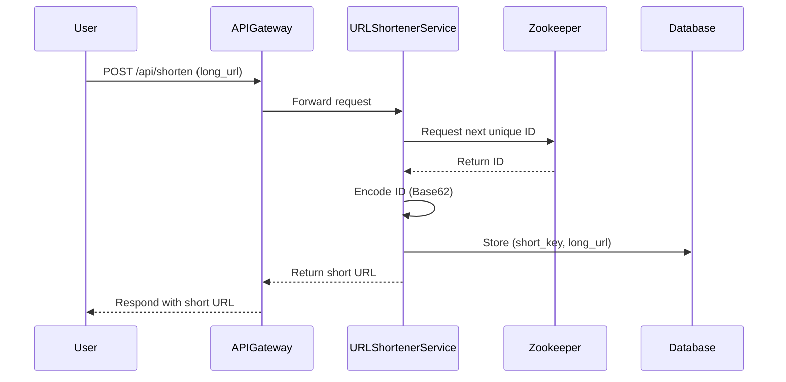
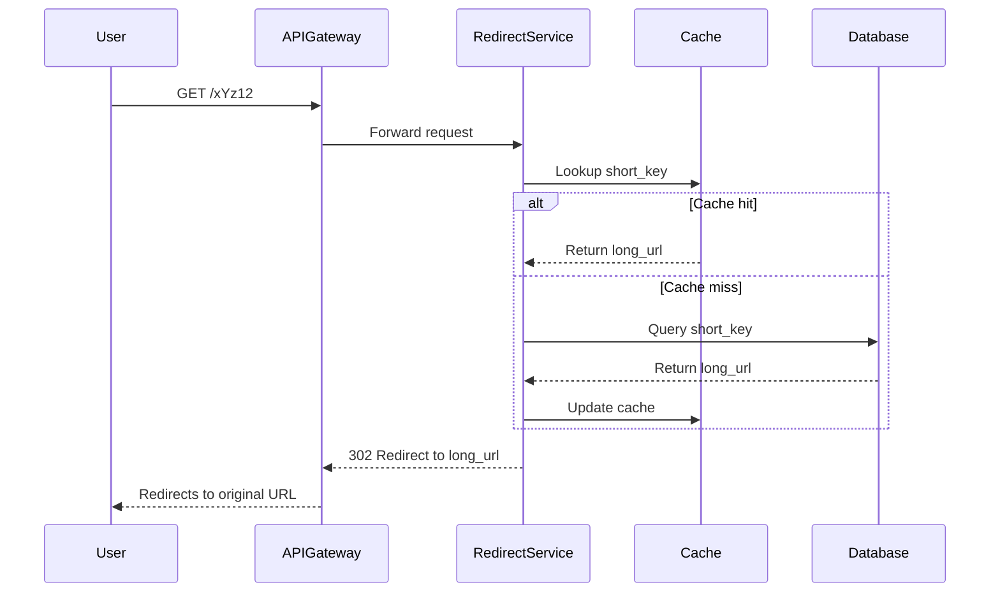

# Designing a URL Shortener (TinyURL) — A System Design Deep Dive

Welcome to our first case study: a comprehensive guide on designing a **URL shortener service** like [TinyURL](https://tinyurl.com/) from the ground up. We'll apply the 4-step blueprint from Chapter 11 to cover everything from **requirements gathering** to **distributed coordination**, with code snippets, diagrams, and practical tips.

URL shorteners like TinyURL and [Bitly](https://bitly.com) are essential for condensing long URLs into compact, shareable links — crucial for platforms with character limits or for branding and analytics.

---

## Learning Outcomes

After working through this case study, you'll be able to:

1. Design a system optimized for **extreme read-write asymmetry** (500:1 reads to writes).
2. Choose between **counter+base62**, **hashing**, **UUID**, and **random** for unique ID generation — and explain when each fails.
3. Apply **Zookeeper or Snowflake-style ID generation** for distributed coordination.
4. Design click analytics that **don't slow down the hot path** (302 redirect).
5. Defend against **abuse vectors** (phishing, malicious redirects, scraping).

---

## Table of Contents

1. [Introduction & Why Build a URL Shortener?](#introduction--why-build-a-url-shortener)
2. [Functional Requirements](#functional-requirements)
3. [Non-Functional Requirements](#non-functional-requirements)
4. [Unique Key Generation Strategies](#unique-key-generation-strategies)
5. [Estimating Scale & Bottlenecks](#estimating-scale--bottlenecks)
6. [API Design](#api-design)
7. [High-Level System Architecture](#high-level-system-architecture)
8. [Distributed Collision Handling with Zookeeper](#distributed-collision-handling-with-zookeeper)
9. [Tech Stack & Infrastructure Decisions](#tech-stack--infrastructure-decisions)
10. [Critical Flows](#critical-flows)
11. [Sample Code Walkthrough](#sample-code-walkthrough)
12. [Tips and Tricks](#tips-and-tricks)
13. [Summary](#summary)
14. [Further Reading](#further-reading)

---

## Introduction & Why Build a URL Shortener?

A **URL shortener** transforms a long, complex URL into a short, unique, and manageable link:

```
https://www.example.com/very/long/path/to/resource
→ https://tinyurl.com/abc123
```

### Why Build One?

- **Compact links:** Ideal for Twitter, SMS, QR codes, or anywhere with length limits.
- **Enhanced UX:** Clean, readable, easy to share.
- **Click tracking:** Analytics for link performance.
- **Branding:** Custom domains for businesses.
- **Cross-channel friendly:** Works across emails, chat, and even print.

### How Does It Work?

1. **User submits a long URL.**
2. **System generates a unique short key.**
3. **Stores the mapping** (short key → original URL) in a database.
4. **When the short URL is accessed,** the system redirects to the original URL.

---

## Functional Requirements

1. **Shorten a URL:** Accept a valid long URL and return a shortened URL.
   - *If the same URL is submitted, return the same short URL (unless a custom alias is used).*
2. **Redirect to original URL:** On accessing the short URL, redirect (HTTP 302) to the original.
3. **Prevent duplicate short URLs:** Avoid multiple short URLs for the same long URL by default.
4. **User authentication:** Allow user registration/login to manage URLs, view analytics, set expiration, delete links.

---

## Non-Functional Requirements

- **High availability:** 24/7 uptime, >99.9%.
- **Performance & low latency:** Redirections in milliseconds; URL shortening near-instantaneous.
- **Scalability:** Support millions to billions of URLs. High read volume (redirects); moderate write volume (new URLs).
- **Reliability:** No data loss even during failures; use durable storage, replication, and backups.

---

## Unique Key Generation Strategies

Key generation is critical for uniqueness, compactness, and scalability.

| Strategy                  | Pros                                    | Cons                                  | Suitability for TinyURL |
|---------------------------|-----------------------------------------|---------------------------------------|------------------------|
| **Random String**         | Unpredictable, simple                   | Collisions, requires handling         | ❌                      |
| **UUID**                  | Globally unique                         | Long, not user-friendly               | ❌                      |
| **Hashing + Salt**        | Unique, secure, hard to reverse         | Not always short, collision possible  | ❌                      |
| **Base62 Encoding (ID)**  | Short, compact, deterministic, scalable | Needs counter management              | ✅ **Recommended**     |

### Detailed Strategy Notes

- **Random String Generation:** Creates a fixed-length string from random characters.
  - ✅ Unpredictable, no obvious pattern.
  - ⚠️ Risk of collisions, requires collision handling.
- **UUID:** 128-bit globally unique identifier (e.g., `123e4567-e89b-12d3-a456...`).
  - ✅ Guaranteed uniqueness, no central coordination.
  - ⚠️ Very long, not user-friendly.
- **Hashing with Salt:** Hashes the original URL (e.g., SHA-256 + salt).
  - ✅ Unique, secure, hard to reverse.
  - ⚠️ May not be short, collision possible, needs mapping storage.
- **Base62 Encoding:** Converts incrementing ID to Base62 (0-9, a-z, A-Z).
  - ✅ Short, compact, deterministic, easy to implement.
  - ⚠️ Needs counter management to avoid collisions.

### Recommended: Base62 Encoding

- Use an incrementing ID, encode in Base62 (`0-9`, `a-z`, `A-Z`) for short, unique keys.
- Requires a globally unique counter (see [Distributed Collision Handling with Zookeeper](#distributed-collision-handling-with-zookeeper)).

#### Base62 Encoding Code

```python
import string

BASE62 = string.digits + string.ascii_letters

def encode_base62(num):
    if num == 0: return BASE62[0]
    arr = []
    while num:
        num, rem = divmod(num, 62)
        arr.append(BASE62[rem])
    arr.reverse()
    return ''.join(arr)

# Example usage:
print(encode_base62(123456))  # Output: 'w7e'
```

A more documented version:

```python
import string

BASE62 = string.digits + string.ascii_letters

def encode_base62(num):
    """Encodes a number to a Base62 string."""
    if num == 0:
        return BASE62[0]
    arr = []
    base = len(BASE62)
    while num:
        num, rem = divmod(num, base)
        arr.append(BASE62[rem])
    arr.reverse()
    return ''.join(arr)

# Example usage:
url_id = 12345678  # ID from centralized counter
short_key = encode_base62(url_id)
print(short_key)  # e.g., 'BkQmR'
```

Another variant:

```python
def encode_base62(num):
    chars = "0123456789abcdefghijklmnopqrstuvwxyzABCDEFGHIJKLMNOPQRSTUVWXYZ"
    base = len(chars)
    result = []
    while num > 0:
        num, rem = divmod(num, base)
        result.append(chars[rem])
    return ''.join(reversed(result))

# Example: ID 125
print(encode_base62(125))  # '21'
```

---

## Estimating Scale & Bottlenecks

Before picking a database or thinking about code, we **quantify** what the system must handle.

### User Traffic Estimates

| Metric                  | Estimate                              |
|-------------------------|---------------------------------------|
| Daily Active Users      | ~10 million                           |
| Monthly Active Users    | ~300 million                          |
| New Short URLs/day      | ~100,000 (1% of DAU)                  |
| Redirects/day           | ~50 million (avg. 5 per user)         |
| Hot URL Cache Size      | 1 million mappings (~500 MB RAM)      |
| Storage Growth          | ~50 MB/day; ~50 GB/year (with indexes)|

### Memory for Hot URL Cache

We want redirects to be lightning-fast for popular URLs.

- **Cache Top 1M URLs:** 1,000,000.
- **Each Mapping:** ~500 bytes (short key, long URL, metadata).
- **Total Cache Memory:** 1M × 500B = **~500 MB.**

### Network Bandwidth (Redirects)

- **Redirects/day:** 50 million.
- **Payload/redirect** (headers + body): ~700 bytes.
- **Total/day:** 50M × 700 = **35 GB/day.**
- **Avg. throughput:** ≈ 0.4–0.5 MB/sec.
- **Peak throughput:** ≈ 5 MB/sec.

### Storage Requirements

- **New URLs/day:** 100,000 × 500 bytes = **~50 MB/day.**
- **Year:** ~18 GB raw; plan for **~50 GB/year** (including indexes, logs, backup).

### Data Flow & Hot Path

```
[User] --> [API Gateway] --> [URL Shortener Service] --> [Database]
                                     |
                                     v
                                [Cache Layer]
                                     ^
                                     |
[User] <-- [Redirect Service] <------+
```

- **Hot Path:** Redirect checks Cache first; DB on miss.
- **Write Path:** New short URLs go to DB and may pre-warm Cache.

### Where Are the Bottlenecks?

#### A. High Read Volume

- **Problem:** 50M+ redirects/day = tons of reads.
- **Solution:** Cache most popular URLs (Redis/Memcached); optimize DB for fast lookups (indexes, sharding).

#### B. Moderate Write Throughput

- **Problem:** 100K short URLs/day — must be consistent.
- **Solution:** Strong consistency for writes; write-optimized DB.

#### C. Latency Sensitivity

- **Problem:** Redirects must feel instant (<50ms ideally).
- **Solution:** Low-latency infra (cache, fast DB); CDN for edge delivery; optimize network paths.

#### D. Burst Traffic & Scaling

- **Problem:** Viral links can spike traffic 10× or 100×.
- **Solution:** Autoscaling backend instances; CDN for static redirect handling; load balancer in front of services.

### Summary Table: Key Numbers

| Resource        | Estimate         |
|-----------------|------------------|
| Cache           | 500 MB (1M hot)  |
| Bandwidth       | 35 GB/day        |
| Storage (1yr)   | 50 GB            |
| Peak Throughput | 5 MB/sec         |

---

## API Design

### 1. Create Short URL

```http
POST /api/shorten
Content-Type: application/json
Authorization: Bearer <token>

{
  "long_url": "https://example.com/article?id=1234"
}
```

**Response:**

```json
{
  "short_url": "https://tinyurl.com/xYz12",
  "short_key": "xYz12"
}
```

**Notes:**

- Should check for duplicates: if the same long URL is submitted, return the same short URL.
- Should be fast (sub-100ms typical).

### 2. Redirect to Original URL

```http
GET /xYz12
```

**Behavior:** 302 Redirect to the original URL.

```http
HTTP/1.1 302 Found
Location: https://example.com/article?id=1234
```

### 3. Delete a Short URL (Authenticated)

```http
DELETE /api/url/xYz12
Authorization: Bearer <access_token>
```

**Behavior:** Deletes the short URL mapping if the authenticated user owns it. Returns error if unauthorized.

**cURL example:**

```bash
curl -X DELETE https://tinyurl.com/api/url/abc123 \
  -H "Authorization: Bearer <access_token>"
```

### 4. User Authentication APIs

- **Register:** `POST /api/auth/register`
- **Login:** `POST /api/auth/login`
- All sensitive endpoints secured with JWT Bearer tokens.

---

## High-Level System Architecture



A more detailed view:



ASCII view:

```
          ┌──────────────┐
          │   Clients    │
          └──────┬───────┘
                 │
          ┌──────▼───────┐
          │ API Gateway  │
          └─────┬────────┘
     ┌──────────┼─────────────┬───────────────┐
     │          │             │               │
┌────▼───┐ ┌────▼────┐   ┌────▼────┐      ┌──▼─────────┐
│ Auth   │ │URL      │   │Redirect │      │ Zookeeper  │
│Service │ │Shortener│   │Service  │      │ (ID Gen)   │
└────┬───┘ └────┬────┘   └────┬────┘      └────▲───────┘
     │         │             │                   │
┌────▼─────────▼─────────────▼───────────────────┴──────┐
│         Database & Cache (Redis/Memcached)            │
└───────────────────────────────────────────────────────┘
```

### Component Responsibilities

| Component             | Responsibility                                                                       |
|-----------------------|---------------------------------------------------------------------------------------|
| **API Gateway**       | Entry point; handles routing, authentication, rate-limiting.                          |
| **URL Shortener**     | Generates short keys, checks for duplicates, validates custom aliases.                |
| **Redirect Service**  | Resolves short keys to long URLs, optimized for speed.                                |
| **Database**          | Persists all mappings (Short URL → Long URL), user data, metadata.                    |
| **Cache Layer**       | In-memory cache (Redis/Memcached) for top N most-accessed URLs.                       |
| **Auth Service**      | User registration, authentication, session/token management.                          |
| **Zookeeper**         | Distributed coordination for unique ID generation, preventing key collisions.         |

---

## Distributed Collision Handling with Zookeeper

**Problem:** In a distributed system, multiple URL shortener instances must generate unique IDs without collisions.

**Solution:** Use [Apache Zookeeper](https://zookeeper.apache.org/) for distributed coordination.

Zookeeper provides:

- **Atomic counters:** Each service instance requests the next unique ID from Zookeeper.
- **Distributed locks:** Serializes ID generation; ensures global uniqueness.

### Flow

1. **Service requests next unique ID from Zookeeper.**
2. **Zookeeper increments the global counter atomically.**
3. **Service encodes the ID with Base62, forms short URL.**
4. **Mapping is stored in DB.**

```python
# Pseudocode for atomic ID generation
def get_next_id():
    # Connect to Zookeeper and increment the global counter atomically
    return zookeeper.increment_counter("global_url_id")

new_id = get_next_id()
short_key = encode_base62(new_id)
```

### ASCII Diagram

```
+---------------------+
| URL Shortener Svc 1 | --+
+---------------------+   |
                          |   +-------------+
+---------------------+   +-->| Zookeeper   |
| URL Shortener Svc 2 | --+   | (Counter)   |
+---------------------+       +-------------+
                               |
                               v
                    [Global Unique ID for Base62]
```

Or, in another visualization:

```
+------------------------+
| URL Generation Service |
+------------------------+
           |
           v
+----------------------+
|  Zookeeper Counter   |  ---[Atomic ID: 1234567]--->
+----------------------+
           |
           v
+----------------------+
| Base62 Encode (e.g., |
| "abc123")            |
+----------------------+
```

### Advantages

- Each instance gets a unique ID.
- Supports horizontal scaling.
- No risk of collision.

### Sample Short Key Generation

```python
def generate_short_key(long_url):
    # Check if long_url already exists in DB
    existing = db.get_short_key(long_url)
    if existing:
        return existing

    # Request next ID from Zookeeper for uniqueness
    unique_id = zookeeper.get_next_id()  # e.g., returns 123456789
    short_key = base62_encode(unique_id)  # e.g., returns "abc123"

    # Store mapping
    db.save_mapping(short_key, long_url)
    return short_key
```

---

## Tech Stack & Infrastructure Decisions

### Database

- **SQL** (PostgreSQL with auto-increment IDs) for strong consistency.
- **NoSQL** (DynamoDB, Cassandra) for massive scalability.
- **Hybrid:** SQL for data integrity, Redis for speed.

### Cache

- **Redis** or **Memcached** for fast lookups.

### Distributed Coordination

- **Apache Zookeeper** for distributed atomic counter.

### Edge & Routing

- **API Gateway:** Kong, NGINX, AWS API Gateway.
- **Load Balancer:** NGINX/ELB to distribute traffic.

### Authentication

- **JWT tokens**, **OAuth** for user sessions.

### Scalability & Availability

1. **Horizontal scaling:** Deploy multiple instances of the URL Shortener and Redirect services.
2. **Load balancers:** Distribute requests evenly.
3. **Replication & failover:** Use DB replication (primary-replica) and managed cloud services.
4. **Caching:** Cache top N URLs in memory (Redis).

---

## Critical Flows

### 1. URL Generation Flow

1. User submits a long URL.
2. API Gateway authenticates and rate-limits.
3. URL Generation Service requests a unique ID from Zookeeper.
4. ID is Base62 encoded (short, user-friendly).
5. Mapping (`short_key` → `long_url`) stored in the DB.
6. Short URL returned to user.



### 2. Redirection Flow (Fast Path & Cold Path)

1. User clicks short URL (e.g., `tinyurl.com/abc123`).
2. API Gateway routes request to Redirection Service.
3. Redirection Service:
   - Checks Cache (fast-path). If hit, redirect immediately.
   - If miss, queries Database (cold-path), updates cache, then redirects.
4. Returns HTTP 302 Redirect to the original URL.



---

## Sample Code Walkthrough

### Generate Short URL (Python/Flask)

```python
@app.route('/api/shorten', methods=['POST'])
def shorten_url():
    data = request.get_json()
    long_url = data['long_url']
    user_id = get_current_user_id()

    # 1. Request a unique ID from Zookeeper (pseudo-code)
    unique_id = zookeeper.get_next_id()

    # 2. Encode unique ID as Base62
    short_key = base62_encode(unique_id)

    # 3. Store mapping in DB
    db.insert({'short_key': short_key, 'long_url': long_url, 'user_id': user_id})

    # 4. Return shortened URL
    return jsonify({'short_url': f'https://tinyurl.com/{short_key}'})
```

### Redirect Handler (Python/Flask)

```python
@app.route('/<short_key>')
def redirect_short_url(short_key):
    # 1. Check cache first
    long_url = cache.get(short_key)
    if not long_url:
        # 2. Fallback to database
        mapping = db.find_one({'short_key': short_key})
        if mapping:
            long_url = mapping['long_url']
            cache.set(short_key, long_url)
        else:
            abort(404)

    # 3. Redirect user
    return redirect(long_url, code=302)
```

---

## Beyond MVP — What a Senior Designer Adds

### Click Analytics Without Slowing the Redirect

A naive design writes a row to a `clicks` table on every redirect. **That's the hot path** — you can't add 20ms of DB write to a millisecond-budget redirect.

**Better pattern:**

1. Redirect Service issues 302 immediately.
2. *Asynchronously* writes click event to Kafka.
3. A separate consumer aggregates clicks → analytics DB (e.g., ClickHouse, BigQuery).

The redirect stays fast (<10ms); analytics get hourly/daily rollups instead of real-time, which is almost always fine.

### Custom Aliases (with Collision Handling)

Users want to pick `tinyurl.com/my-product`. Now you need:

- Uniqueness check on the alias (DB query).
- Reservation lock to prevent two users picking the same alias simultaneously.
- Validation: no profanity, no impersonating well-known names, length limits.

**Implementation:** add `alias` column with unique constraint. On collision: HTTP 409.

### Abuse Prevention

A URL shortener is **catnip for phishers.** Without controls, your domain reputation tanks (Google Safe Browsing flags it).

**Defenses:**

1. **URL scanning at submission time** — integrate with Google Safe Browsing API, VirusTotal, PhishTank.
2. **Rate limiting** — per-IP and per-user quotas to prevent mass-submission.
3. **Domain blocklist** — known phishing/malware destinations.
4. **User flagging** — anyone can report a short link; suspicious links get manual review.
5. **Auto-disable on abuse score** — multiple reports + heuristics → temporarily disable.

### Geo-Distribution

For a global service, the redirect should hit a local edge — adding 150ms cross-continent on every click is unacceptable.

**Pattern:** push read-path data (short_key → long_url) to all regions; writes go to a primary, async-replicated globally. Eventual consistency is fine — a brand new URL working in some regions but not others for 5 seconds is OK.

### Privacy & PII

If your service is in the EU or serves EU users:

- Click logs may contain IP + URL = personal data under GDPR.
- Need retention limits, right-to-delete, and clear consent.
- Consider hashing IPs before storage; rotate the hash salt.

---

## Tips and Tricks

- **Cache hot URLs:** Store top N most accessed URLs in Redis/Memcached to drastically cut down read latency.
- **Cache wisely:** Cache the top 1M URLs to reduce DB load by 90%+.
- **Eviction policy:** Use LRU (Least Recently Used) or LFU (Least Frequently Used) for hot URL cache.
- **Prevent duplicates:** Hash the long URL; if already present, reuse the existing short key.
- **CDN-friendly redirects:** Serve 302 redirects via CDN for global low-latency.
- **Bulk pre-warming:** Preload cache with the most popular URLs during off-peak hours.
- **Autoscaling:** Use container orchestration (Kubernetes, ECS) to handle burst traffic.
- **CDN integration:** Offload static asset delivery and some redirect logic to CDN.
- **Monitoring:** Instrument metrics for response times, error rates, traffic spikes, cache hit/miss ratios.
- **Security:** Rate-limit API, sanitize inputs, use HTTPS everywhere.
- **Backups:** Regularly back up your mapping database; replicate across regions for disaster recovery.
- **Expiration policies:** Allow users to set expiration dates; periodically clean up expired entries.
- **Data retention:** Periodically archive or delete old/expired URLs to keep storage lean.
- **Misuse protection:** Implement link scanning and user reports against phishing.
- **Custom aliases:** Allow users to set custom short keys with collision check logic.
- **Atomic operations:** Always generate IDs atomically (Zookeeper or DB sequences) to avoid key collisions.
- **Custom domains:** Let enterprises use their own branded domains for shortened URLs.
- **Analytics:** Store access logs for each short URL for click tracking and analytics.

---

## Summary

### Final Design Flow

**URL Generation:**

1. User submits long URL via API.
2. API Gateway authenticates & rate limits.
3. URL Generation Service requests next global ID (Zookeeper).
4. Encodes ID to Base62, creates short key.
5. Stores mapping in DB.
6. Returns short URL.

**Redirection:**

1. User visits short URL.
2. API Gateway forwards to Redirect Service.
3. Service checks Redis cache for mapping.
4. If not found, queries DB and updates cache.
5. Responds with HTTP 302 redirect.

### Scale Estimates Recap

- **Users:** 10M DAU, 300M MAU.
- **New URLs/day:** 100K.
- **Redirect requests/day:** 50M.
- **Memory for hot cache:** 500MB (1M URLs).
- **Storage/year:** ~50GB.

Designing a scalable, reliable, and high-performance URL shortener requires careful design choices at every layer — from unique key generation to distributed systems coordination and robust API design. By adopting best practices in caching, database selection, and distributed counter management, you can deliver a production-grade service like TinyURL that stands up to real-world demands.

---

## Further Reading

- [Apache Zookeeper](https://zookeeper.apache.org/)
- [Apache Zookeeper Docs](https://zookeeper.apache.org/doc/)
- [Redis](https://redis.io/)
- [Redis caching strategies](https://redis.io/docs/management/cache/)
- [Base62 Encoding (Wikipedia)](https://en.wikipedia.org/wiki/Base62)
- [System Design Primer](https://github.com/donnemartin/system-design-primer)
- [Designing Data-Intensive Applications](https://dataintensive.net/)
- [JWT.io: JSON Web Tokens](https://jwt.io/)

---

**Next Up:** *(Chapters 13-16 reserved.)* [Chapter 17 — Design an Auction Platform (eBay) →](./17%20-%20Design%20an%20Auction%20Platform%20(aka%20eBay).md)
