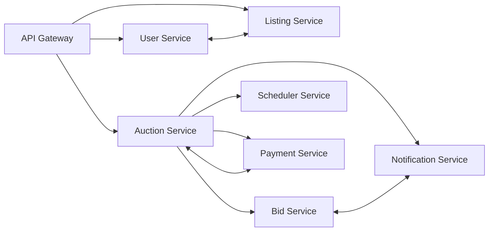
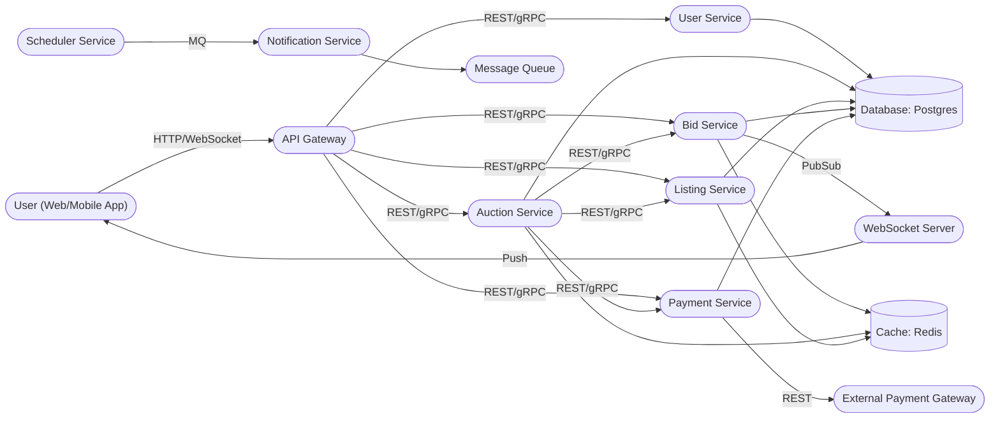
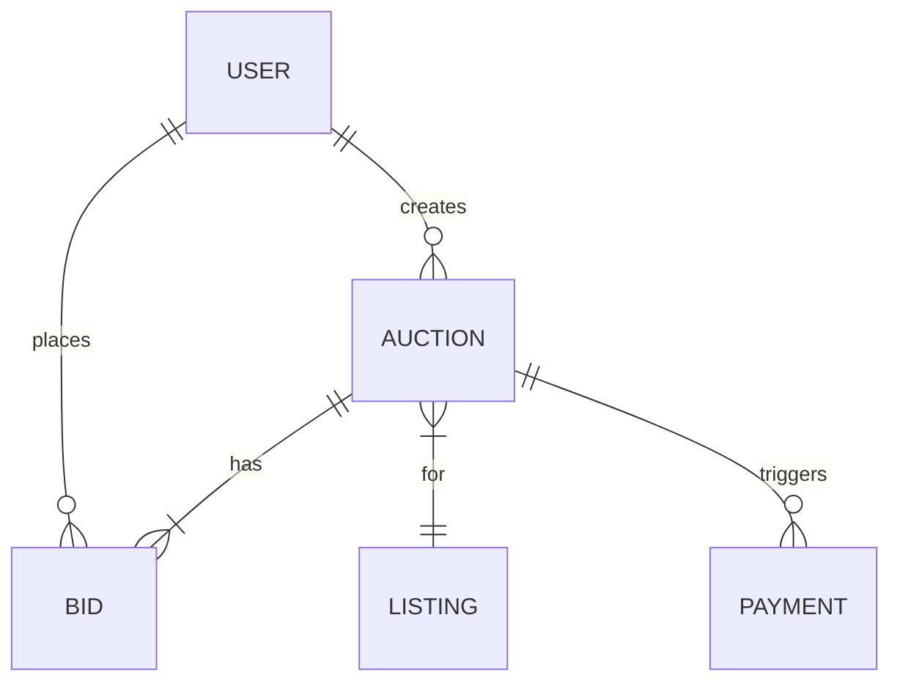

# Designing a Modern Real-Time Auction Platform (eBay)

Building a scalable, fair, and real-time auction platform is a fascinating challenge that touches on many core system design principles — **latency, concurrency, real-time updates, and user trust.**

In this case study, we'll walk through the architectural blueprint for an auction platform like eBay. We'll cover requirements, bottlenecks, architecture, data model, real-time bid delivery, scheduler design, and practical implementation snippets — with diagrams and a curated tips section.

---

## Learning Outcomes

After working through this case study, you'll be able to:

1. Design **concurrency-safe bid placement** so two users bidding at the same millisecond can't both win.
2. Handle the **last-second sniping** problem with anti-sniping extensions.
3. Scale **WebSocket fan-out** for 10K+ users watching a single hot auction.
4. Reliably trigger auction closure even if a server dies in the middle.
5. Integrate payment with **idempotent retries** so a single payment never charges twice.

---

## Table of Contents

1. [What is an Auction Platform?](#what-is-an-auction-platform)
2. [Functional & Non-Functional Requirements](#functional--non-functional-requirements)
3. [Core Actors & Use Cases](#core-actors--use-cases)
4. [Scale Estimation & Traffic Patterns](#scale-estimation--traffic-patterns)
5. [Identifying Bottlenecks](#identifying-bottlenecks)
6. [High-Level Architecture](#high-level-architecture)
7. [API Design](#api-design)
8. [Service Communication Patterns](#service-communication-patterns)
9. [Real-Time Bid Delivery (WebSockets)](#real-time-bid-delivery-websockets)
10. [Data Model](#data-model)
11. [Handling Auction Timers & Closures](#handling-auction-timers--closures)
12. [Concurrency-Safe Bid Placement](#concurrency-safe-bid-placement)
13. [Technology & Infrastructure Choices](#technology--infrastructure-choices)
14. [Scaling & Performance](#scaling--performance)
15. [Security & Cost](#security--cost)
16. [Tips & Tricks](#tips--tricks)
17. [Example Sequence Diagram](#example-sequence-diagram)
18. [Conclusion](#conclusion)

---

## What is an Auction Platform?

At its core, an auction platform is a digital marketplace where **sellers list items** and **buyers place bids** within a defined auction window. The system manages:

- Real-time bid tracking and updates.
- Strict timing and auction state transitions.
- Fair winner determination and payment processing.
- Notifications for all critical auction events.

**Key goals:** Security, fairness, scalability, and low-latency real-time experience.

The highest bid at closing wins. The platform must efficiently handle item listings, bid tracking, real-time updates, auction lifecycle management, and payment processing.

---

## Functional & Non-Functional Requirements

### Functional Requirements

- **User registration & authentication:** Secure sign-up/login for buyers and sellers.
- **Item listing:** Sellers can create listings with auction parameters (start/end time, reserve price, buy-it-now).
- **Real-time bidding:** Instant bid placement, validation, and feedback.
- **Auction lifecycle:** Automated transitions (scheduled → active → ended), winner determination.
- **Payment processing:** Integration with payment providers (Stripe, PayPal).
- **Notifications:** Outbid alerts, auction won, payment pending/complete.

### Non-Functional Requirements

- **Performance:** Sub-second latency for bid placement & updates.
- **Scalability:** Support 1M+ concurrent auctions, 10K+ users in a single auction.
- **Security:** Strong authentication, encrypted payments, anti-bot.
- **High availability:** Especially during auction closings.
- **Observability:** Real-time monitoring, event logging, anomaly detection.

---

## Core Actors & Use Cases

| Actor   | Role / Actions                                                              |
|---------|-----------------------------------------------------------------------------|
| Seller  | Lists items, sets auction parameters.                                        |
| Bidder  | Places bids, receives instant updates.                                      |
| System  | Manages auction rules, timing, and payments.                                |
| Admin   | Monitors platform, handles fraud/disputes.                                  |

**Example Use Case:** A seller lists a gaming console for a 3-day auction. Bidders compete in real-time. On closure, the system determines the winner and triggers payment.

---

## Scale Estimation & Traffic Patterns

Quantify what the system must handle:

| Metric                              | Value                    |
|-------------------------------------|--------------------------|
| Registered Users                    | 5 million                |
| Daily Active Users                  | 500,000                  |
| Concurrent Auctions (Active)        | 1 million                |
| Avg. Bids per Auction               | 10                       |
| Total Bids per Day                  | 10 million               |
| Completed Auctions (per day)        | 100,000                  |
| Peak Concurrent Users (hot auction) | 10,000                   |
| Payment Transactions (per day)      | 100,000                  |

**Traffic Patterns:**

- **Read-heavy:** Viewing auctions, item details, bid history.
- **Write-sensitive:** Bid placements, auction creation, auction close.
- **Real-time pressure:** Last-minute bidding, fan-out updates, precise scheduling, payment triggers.

> **Takeaway:** The system must scale for massive reads, but remain fast and strongly consistent for critical writes — especially during last-second bidding frenzies.

---

## Identifying Bottlenecks

Key bottlenecks and mitigation strategies:

- **Heavy service loads:** Predict & isolate high-load services (Bid Service, Payment Service).
- **Hot auctions:** Handle sudden, skewed loads from popular items.
- **Real-time updates:** Use WebSockets and pub/sub for fan-out to watchers.
- **Consistency vs. latency:** Use async processing (e.g., for notifications) where possible; ensure strong consistency for bids/payments.
- **Horizontal scaling:** Partition high-volume data (bids, listings) across servers/shards.
- **Sub-second bid updates** (especially last-second "sniping").
- **Concurrency conflicts** on simultaneous writes.
- **Massive read-fanout** for hot auctions.
- **Precise auction closure** and payment triggers.
- **Fairness and anti-bot.**

---

## High-Level Architecture



A more detailed view:



ASCII view:

```
+-------------------+
|    API Gateway    |
+--------+----------+
         |
         v
+---------------+      +-------------+      +-----------------+
| User Service  |----->| Listing Svc |----->| Auction Service |
+---------------+      +-------------+      +-----------------+
                                  |                  |
                                  v                  v
                        +----------------+   +-------------+
                        |   Bid Service  |<->| Scheduler   |
                        +----------------+   +-------------+
                                  |                  |
                                  v                  v
                        +----------------+   +--------------+
                        | Payment Svc    |   | Notification |
                        +----------------+   +--------------+
```

### Key Components

- **API Gateway:** Entry point, routing, rate limiting, authentication.
- **User Service:** Auth, profiles, roles (buyer/seller).
- **Listing Service:** Item metadata, categories, media, search/filter.
- **Auction Service:** Lifecycle, rules, winner logic.
- **Bid Service:** Real-time bid handling, concurrency control.
- **Scheduler Service:** Timed auction start/end, closure orchestration.
- **Payment Service:** Integrates with Stripe/PayPal, payment flows.
- **Notification Service:** Outbid, win/loss, payment alerts.

---

## API Design

```http
# User APIs
POST   /signup
POST   /login
GET    /user/profile

# Auction APIs
POST   /auctions                  # create new auction
GET    /auctions/{id}             # view auction details
POST   /auctions/{id}/bids        # place a bid
GET    /auctions/{id}/bids        # view bid history
GET    /auctions/active           # list active auctions

# Payment APIs
POST   /payments/initiate
GET    /payments/{id}/status
```

### Sample: Place a Bid

```http
POST /auctions/12345/bids
Authorization: Bearer <token>
Content-Type: application/json

{
  "amount": 205.00
}
```

**Response (Success):**

```json
{
  "status": "ok",
  "currentHighestBid": 205.00,
  "message": "Bid accepted!"
}
```

### Notification Triggers (Internal)

- On auction ending → notify winner.
- On new highest bid → notify previous top bidder.

---

## Service Communication Patterns

| Pattern         | Use Case                                                                       |
|-----------------|--------------------------------------------------------------------------------|
| Sync (REST/gRPC)| User authentication, listing fetch, Auction → Bid → Payment trigger.            |
| Async (Pub/Sub) | New bid placed → broadcast to watchers; auction ended → notify, trigger payment; payment failed → retry, alert. |

### Event Topics

| Topic             | Payload                                  |
|-------------------|------------------------------------------|
| `bid.placed`      | `{auction_id, bid_id, amount, user_id}`  |
| `auction.ended`   | `{auction_id, winner_id}`                |
| `payment.failed`  | `{payment_id, reason}`                   |
| `user.registered` | `{user_id, email}`                       |

**Benefits:** Decoupling, better retries, graceful failure handling.

---

## Real-Time Bid Delivery (WebSockets)

**Why WebSockets?** Traditional HTTP polling can't meet the low-latency demands of real-time bidding. WebSockets establish a persistent, full-duplex connection ideal for pushing bid updates and auction status changes instantly.

### How It Works

1. User connects to `wss://auction-platform.com/ws`.
2. Subscribes to channel, e.g., `auction:123456`.
3. **Bid Service** validates & accepts bid → publishes event.
4. **WebSocket Server** fans out updates to all connected clients.

**Scaling challenge:** Must support horizontal scaling for high concurrency (10K+ watchers on a hot auction).

### Sample WebSocket Event

```json
{
  "event": "bid.placed",
  "auctionId": 12345,
  "newHighestBid": 205.00,
  "bidder": "alice"
}
```

### Code: Node.js WebSocket Handler

```javascript
const WebSocket = require('ws');
const wss = new WebSocket.Server({ port: 8080 });

const auctionChannels = {}; // { auctionId: Set of WebSocket clients }

wss.on('connection', (ws) => {
  ws.on('message', (msg) => {
    const { action, auctionId, bid } = JSON.parse(msg);
    if (action === 'subscribe') {
      if (!auctionChannels[auctionId]) auctionChannels[auctionId] = new Set();
      auctionChannels[auctionId].add(ws);
    } else if (action === 'place_bid') {
      // Bid validation logic...
      // On success:
      auctionChannels[auctionId].forEach(client => {
        client.send(JSON.stringify({ event: 'new_bid', bid }));
      });
    }
  });
});
```

### Code: Socket.IO Variant

```javascript
io.on('connection', (socket) => {
  socket.on('join-auction', (auctionId) => {
    socket.join(`auction:${auctionId}`);
  });
  socket.on('place-bid', async (data) => {
    // Validate and process bid...
    io.to(`auction:${data.auctionId}`).emit('bid-update', { /* new bid info */ });
  });
});
```

### Fan-out via Redis Pub/Sub

```javascript
// On valid bid, publish to Redis Pub/Sub
redis.publish(`auction:${auctionId}`, JSON.stringify({ bid: /* ... */ }));

// WebSocket server subscribes, fans out to all connected clients
redis.on('message', (channel, message) => {
  const clients = websocketClientsForChannel(channel);
  clients.forEach(ws => ws.send(message));
});
```

```
Client --WebSocket--> Bid Service --Pub/Sub--> WebSocket Server --Fan Out--> Watchers
```

---

## Data Model



### Tables

```sql
-- User Table
CREATE TABLE users (
  id SERIAL PRIMARY KEY,
  email VARCHAR(255) UNIQUE,
  password_hash TEXT,
  role VARCHAR CHECK (role IN ('buyer','seller','admin')),
  created_at TIMESTAMP
);

-- Listing Table
CREATE TABLE listings (
  id SERIAL PRIMARY KEY,
  seller_id INTEGER REFERENCES users(id),
  title VARCHAR(255),
  description TEXT,
  image_url TEXT,
  category VARCHAR(100),
  media_url TEXT[],
  created_at TIMESTAMP
);

-- Auction Table
CREATE TABLE auctions (
  id SERIAL PRIMARY KEY,
  listing_id INTEGER REFERENCES listings(id),
  start_time TIMESTAMP,
  end_time TIMESTAMP,
  reserve_price NUMERIC,
  status VARCHAR CHECK (status IN ('scheduled','active','ended')),
  winner_id INTEGER REFERENCES users(id),
  created_at TIMESTAMP
);

-- Bid Table
CREATE TABLE bids (
  id SERIAL PRIMARY KEY,
  auction_id INTEGER REFERENCES auctions(id),
  bidder_id INTEGER REFERENCES users(id),
  amount NUMERIC,
  created_at TIMESTAMP DEFAULT NOW()
);

-- Payment Table
CREATE TABLE payments (
  id SERIAL PRIMARY KEY,
  auction_id INTEGER REFERENCES auctions(id),
  user_id INTEGER REFERENCES users(id),
  status VARCHAR CHECK (status IN ('pending','completed','failed')),
  payment_provider VARCHAR(50),
  transaction_id VARCHAR(100),
  created_at TIMESTAMP
);
```

---

## Handling Auction Timers & Closures

**Scheduler Service** ensures auctions start/end precisely.

### Design Options

- **Dedicated Scheduler Service:** Maintains all timers, triggers start/end (cron or job queues).
- **Delayed jobs in message queues:** Push closure jobs to queue with delay (SQS Delay, BullMQ, Kafka).
- **Redis with TTL/polling/Keyspace notifications:** Store auction end as TTL key, trigger on expiry.

### Reliability Measures

- **Idempotency:** Ensure end-of-auction logic can be safely retried (no double winners).
- **Retries:** On failure, closure jobs are retried.
- **Logging/alerts:** All timer events logged; alert on missed or failed closures.

### Sample: Auction Closure (Python)

```python
def close_auction(auction_id):
    auction = db.get_auction(auction_id)
    if auction.status != 'ended':
        highest_bid = db.get_highest_bid(auction_id)
        auction.status = 'ended'
        auction.winner_id = highest_bid.bidder_id
        db.save(auction)
        notify_winner(highest_bid.bidder_id, auction_id)
        trigger_payment(highest_bid.bidder_id, auction_id)
```

### Sample: Auction Closure (Node.js)

```js
async function closeAuction(auctionId) {
  // 1. Mark auction as ended (idempotent)
  // 2. Determine highest valid bid
  // 3. Trigger payment for winner
  // 4. Notify winner and seller
}
```

---

## Concurrency-Safe Bid Placement

### End-to-End Bid Placement (Python/Flask)

```python
@app.route('/auctions/<auction_id>/bids', methods=['POST'])
def place_bid(auction_id):
    user = authenticate(request)
    bid_amount = request.json['amount']
    # Transactional check: is auction active? Is bid higher than current?
    with db.transaction():
        auction = db.query('SELECT * FROM auctions WHERE id = %s FOR UPDATE', auction_id)
        if auction.status != 'active' or now() > auction.end_time:
            return error('Auction not active')
        current_highest = db.query('SELECT MAX(amount) FROM bids WHERE auction_id = %s', auction_id)
        if bid_amount <= current_highest:
            return error('Bid too low')
        db.insert('bids', { 'auction_id': auction_id, 'bidder_id': user.id, 'amount': bid_amount })
    # Publish event for real-time update
    pubsub.publish(f"auction.{auction_id}.bid_placed", { 'user': user.id, 'amount': bid_amount })
    return success('Bid placed')
```

### Place Bid Endpoint (Node.js / Express)

```js
app.post('/auctions/:id/bids', authenticateUser, async (req, res) => {
  const auctionId = req.params.id;
  const { amount } = req.body;
  try {
    // 1. Validate auction is active
    // 2. Check bid > current highest
    // 3. Write bid atomically (use DB or Redis transaction)
    // 4. Publish event to WebSocket channel
    await placeBid(auctionId, req.user.id, amount);

    // Notify via WebSocket (pseudo)
    websocketServer.publish(`auction:${auctionId}`, { newBid: amount });
    res.status(200).json({ success: true });
  } catch (err) {
    res.status(400).json({ error: err.message });
  }
});
```

### Atomic Bid Placement with Redis Lua Script

```lua
-- Lua script for atomic bid placement (simplified)
local auctionKey = "auction:" .. KEYS[1]
local currentBid = tonumber(redis.call("GET", auctionKey))

if tonumber(ARGV[1]) > currentBid then
    redis.call("SET", auctionKey, ARGV[1])
    return "ACCEPTED"
else
    return "REJECTED"
end
```

> **Usage:** Ensures only higher bids are accepted, preventing race conditions.

---

## Technology & Infrastructure Choices

| Layer         | Technology Choices                       | Reasoning                                                  |
|---------------|------------------------------------------|------------------------------------------------------------|
| **Frontend**  | React, Vue                               | Fast, interactive, real-time UI                            |
| **Backend**   | Node.js, Spring Boot (Java), ASP.NET     | Scalable, async request handling                           |
| **Database**  | PostgreSQL                               | Strong consistency, relational data                        |
| **Cache**     | Redis                                    | Ultra-fast caching, real-time bid state, pub/sub           |
| **Real-time** | WebSockets (Socket.IO, ws), Redis PubSub | Low-latency, bi-directional bid updates                    |
| **Scheduler** | Dedicated service, BullMQ, SQS, Kafka    | Accurate, scalable job handling                            |
| **Payments**  | Stripe, PayPal API                       | Secure, reliable transactions                              |
| **Auth**      | OAuth2                                   | Secure, modern authentication                              |
| **Encryption**| SSL/TLS                                  | Data-in-transit protection                                 |
| **Cloud**     | AWS / GCP / Azure                        | Managed, pay-as-you-go, elastic scaling                    |
| **Scaling**   | Load Balancers, Autoscaling              | High availability, fault tolerance                         |

---

## Scaling & Performance

- **Horizontal partitioning:** Shard bids and auctions by auction ID.
- **Redis caching:** Store hot auction data for fast access.
- **Load balancers & autoscaling:** Handle traffic spikes, especially end-of-auction surges.
- **Cache hot data:** Active auctions, top bids, sessions in Redis.
- **Partitioning:** Shard bid and auction tables for massive scale.
- **Async processing:** Use message queues for notifications, payments, analytics.
- **Plan for "hot auctions":** WebSocket clusters, partitioned queues, localized caching.
- **Observability:** Centralized logging, real-time dashboards (Grafana + Prometheus).

---

## Security & Cost

### Security

- **OAuth 2.0:** All endpoints protected via secure tokens.
- **SSL/TLS:** All data in transit encrypted.
- **Rate limiting:** Prevent brute-force and abuse.
- **Anti-bot:** CAPTCHAs, suspicious activity monitoring.

### Cost Optimization

- **Cloud pay-as-you-go** models (AWS, GCP, Azure).
- **Autoscaling:** Dynamically match resources to demand.
- **Cache hot auctions** in Redis to minimize DB reads.

---

## Beyond MVP — What a Senior Designer Adds

### The Anti-Sniping Extension

The "snipe" — bidding in the final 5 seconds when no one can respond — is a real eBay problem. **Solution: if a bid comes in within the last N seconds, extend the auction by N seconds.** This converts "first-mover-wins-the-snipe" back into "highest-willing-bid-wins."

Implementation: on each bid, check `now() > end_time - 60s`. If true, atomically set `end_time = now() + 60s`. Broadcast the new end time to all watchers.

### Search and Discovery

Largely missing from this case study but critical to a real marketplace. **Add:**

- Full-text product search via Elasticsearch — re-indexed asynchronously from the Listing service.
- Faceted filtering (category, price range, condition, seller rating).
- Auto-complete on the search bar — pre-computed top queries in Redis.
- "Auctions ending soon" feed — materialized view, refreshed every few seconds.

### Recommendation Engine

"Buyers who bid on this also bid on..." — collaborative filtering against historical bid data. Compute embeddings offline; serve via vector DB.

### Multi-Warehouse Inventory (For Buy-Now Items)

eBay isn't just auctions — many items are buy-it-now with multiple sellers shipping from different locations. Inventory is **per-(item, location, seller)**. Choosing which seller to fulfill from is a small optimization problem (cost + speed).

### Reviews and Ratings

After purchase: buyer rates seller, seller rates buyer. Ratings drive search ranking, dispute decisions, and fraud detection.

**Pitfall:** ratings are write-heavy *and* heavily skewed (most are 5-star). Use percentile-based ranking, not just average, to differentiate sellers.

### Dispute Resolution Workflow

What happens when item doesn't arrive, or arrives damaged?

- Buyer opens dispute → frozen funds.
- Seller has N days to respond.
- If escalated, human review.
- Resolution: refund (full or partial), or seller wins.

This is a workflow service (Saga pattern from Chapter 4). Most marketplaces underinvest here until it bites them.

### Surge Pricing for Featured Slots (Auctions for Visibility)

In addition to item auctions, sellers can pay to feature their listings — which is itself an auction (for ad slots). Real-time bidding system within a bidding system.

---

## Tips & Tricks

### Concurrency & Consistency

- **Prevent race conditions:** Use atomic DB operations or distributed locks on bid placement.
- **Strong consistency for bids:** Use optimistic concurrency control or atomic DB operations.
- **Idempotency:** All payment, closure, and notification triggers should be idempotent.

### Hotspots & Scaling

- **Mitigate "hot auction" skew:** Special-case handling for auctions with thousands of watchers/bidders (dedicated nodes, in-memory pub/sub).
- **WebSockets at scale:** Use sticky sessions, distributed pub/sub (Redis Streams, Kafka).
- **Partition bids:** Hot auctions create write hotspots. Shard bids by auction ID.

### Security

- **Bot & sniping protection:** CAPTCHA for bid burst, randomize auction end time slightly, anti-sniping extensions.
- **Strong auth:** OAuth2, encrypt all traffic (TLS), DDoS/bot protection.

### Reliability

- **Graceful degradation:** If real-time fails, fallback to polling for updates.
- **Retry & fallback:** For all external calls (payments, notifications), use robust retry with exponential backoff.
- **Payment handling:** Treat payment as an eventual process — support retries, status polling, manual dispute workflows.
- **Failover:** Replicate databases, use cloud managed services for auto-healing, design for geo-redundancy.

### Operational Excellence

- **Logging & alerts:** Proactive monitoring for stuck auctions, payment failures, high-latency bids.
- **Observability:** Log all auction state changes, bid events, payment outcomes. Monitor for scheduler lags and missed events.
- **Consistent time source:** Always use a single time reference (e.g., UTC from your DB or a time service) for auction state to avoid drift.
- **Testing:** Simulate last-second bid storms and payment failures.

---

## Example Sequence Diagram

```
Bidder                API Gateway           Auction Service           Bid Service         Notification
  |                        |                      |                        |                   |
  |-- Place Bid ---------->|                      |                        |                   |
  |                        |-- Validate Auction ->|                        |                   |
  |                        |<-- Auction OK ------ |                        |                   |
  |                        |--- Place Bid ------->|--- Concurrency Check ->|                   |
  |                        |<-- Bid Accepted ---- |                        |                   |
  |                        |--- Broadcast --------|----------------------->|--- Push Outbid -->|
  |<-- Bid Accepted -------|                      |                        |                   |
```

---

## Conclusion

Designing a real-time auction platform is a multi-disciplinary effort that demands not just feature-rich development, but also careful handling of timing, concurrency, and fairness. The best platforms combine robust backend services, real-time communication channels, and a developer mindset that's always preparing for race conditions, sudden load spikes, and the creative mischief of determined users.

**A real-time auction platform is a showcase for modern distributed system design:**

- **Microservices** for modular growth and scalability.
- **WebSockets** and **event-driven messaging** for instant feedback.
- **Atomic concurrency controls** for bid integrity.
- **Async workflows** for notifications and payment integration.
- **Caching** and **partitioning** for performance under load.

---

## Further Reading

- [eBay Architecture Principles](https://www.ebayinc.com/tech/)
- [WebSockets at Scale](https://ably.com/concepts/websockets)
- [Distributed Scheduling Patterns](https://martinfowler.com/articles/patterns-of-distributed-systems/scheduled-job.html)

---

**Next Up:** *(Chapter 18 reserved.)* [Chapter 19 — Design a Cloud Storage Solution (Google Drive, Dropbox) →](./19%20-%20Design%20a%20Cloud%20Storage%20Solution%20(aka%20Google%20Drive%2C%20Dropbox).md)
