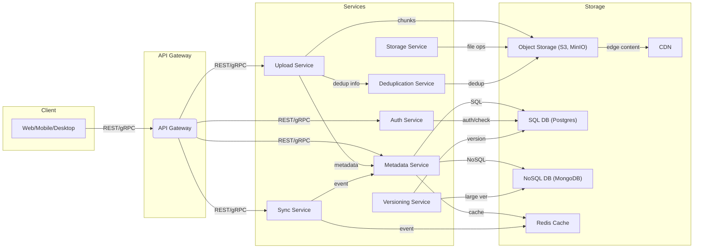
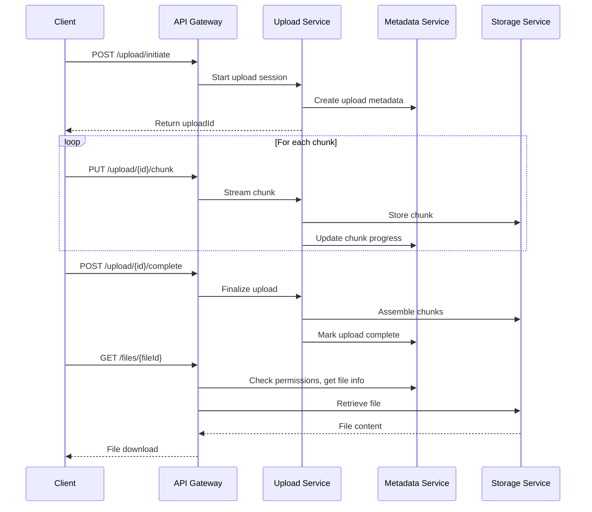
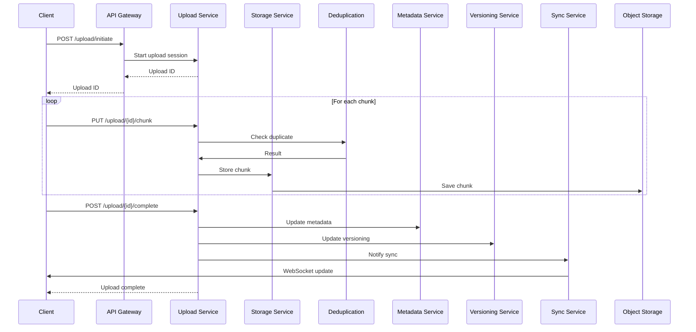

# Designing a Cloud Storage System (Google Drive / Dropbox)

Cloud storage services such as **Google Drive** and **Dropbox** support billions of files, real-time sync, complex permissions, and must deliver blazing performance at massive scale. This case study walks through a practical system design approach — highlighting requirements, architecture, API design, chunked uploads, deduplication, versioning, and optimization strategies.

---

## Learning Outcomes

After working through this case study, you'll be able to:

1. Design **chunked, resumable uploads** that survive network interruptions.
2. Build **block-level deduplication** to dramatically reduce storage costs.
3. Sync files across devices using **vector clocks or version vectors** to handle conflicts.
4. Choose **last-writer-wins vs three-way merge** for conflict resolution.
5. Support **offline editing** with sync-on-reconnect semantics.

---

## Table of Contents

1. [Problem Definition & Requirements](#problem-definition--requirements)
2. [Estimating Scale & Access Patterns](#estimating-scale--access-patterns)
3. [Identifying Bottlenecks](#identifying-bottlenecks)
4. [High-Level System Architecture](#high-level-system-architecture)
5. [Core Services & Responsibilities](#core-services--responsibilities)
6. [API Design](#api-design)
7. [Service Communication Patterns](#service-communication-patterns)
8. [Chunked Uploads & Large File Handling](#chunked-uploads--large-file-handling)
9. [File Versioning & Restore](#file-versioning--restore)
10. [Storage & Database Strategies](#storage--database-strategies)
11. [Caching & Performance](#caching--performance)
12. [Critical User Flow: File Upload & Sync](#critical-user-flow-file-upload--sync)
13. [Tech & Infrastructure Stack](#tech--infrastructure-stack)
14. [Tips & Tricks](#tips--tricks)
15. [Conclusion](#conclusion)

---

## Problem Definition & Requirements

### What Are We Building?

A distributed, cloud-based file storage platform with:

- **File upload and storage** (all types, securely).
- **Cross-device sync** (real-time updates).
- **Secure sharing and collaboration** (fine-grained access).
- **Massive scalability** (millions of users, petabytes of data).
- **File versioning and recovery.**

### Functional Requirements

| Feature                  | Description                                                                |
|--------------------------|----------------------------------------------------------------------------|
| File Upload/Download     | Any file type, fast, resumable uploads                                     |
| Multi-Device Sync        | Instant reflection of updates across desktop, mobile, web (<5s latency)    |
| File Organization        | Folders, nested directories, tags                                          |
| Sharing & Collaboration  | Public/private links, permissions (view/edit/comment), shared folders      |
| File Versioning          | Maintain and restore previous versions                                     |
| Soft Delete & Restore    | Trash bin, restore before permanent deletion                               |

### Non-Functional Requirements

| Quality                  | Why It Matters                                            |
|--------------------------|-----------------------------------------------------------|
| Scalability              | Must support millions of users, billions of files         |
| High Availability        | Files should never disappear (11 nines durability)        |
| Low Latency              | Instant uploads, downloads, and sync                      |
| Security                 | End-to-end encryption, strict access control              |
| Cost Efficiency          | Deduplication, storage lifecycle management               |
| Observability/Monitoring | Track usage, errors, delays, API failures                 |

> **Trade-offs:** Improving one quality (e.g., durability) can affect others (cost, latency). **Design is about balancing these.**

### Key Assumptions & Constraints

- Files can be large (up to 5GB) → need chunked, resumable uploads.
- Users access files from multiple devices → real-time sync.
- Use cloud object storage (e.g., AWS S3) → metadata/content separation.
- Auth handled externally → focus on storage & permissions.
- Uploads are resumable (session & chunk tracking).
- File sync latency < 5s (push/event-driven updates).
- Storage must be cost-efficient (deduplication/lifecycle policies).
- Fine-grained access control (robust permission/ACL model).

---

## Estimating Scale & Access Patterns

### Key Metrics

| Metric                  | Value                       |
|-------------------------|-----------------------------|
| Active Users            | 10 million                  |
| Average Files per User  | 500                         |
| Total Files             | ~5 billion                  |
| Average File Size       | 2 MB                        |
| Total Data Stored       | ~10 PB                      |
| Peak Upload Rate        | ~2,000 uploads/sec          |
| Peak Sync Events        | ~10,000 updates/sec         |

> **Implication:** Requires horizontally scalable object storage, distributed metadata service, and horizontally scalable sync/notification pipelines.

### Access Patterns

- **Write-heavy:** Chunked uploads (large payloads), frequent sync events upon file changes, versioning (multiple writes per file).
- **Read-heavy:** Downloads from many device types, folder listings and metadata lookups, shared link/file previews.

> **Optimization focus:** Efficient upload flow (chunking, retries), low-latency metadata access (caching), fast permission checks.

---

## Identifying Bottlenecks

| Bottleneck                | Why It's Painful                                  | Solution Direction                    |
|---------------------------|----------------------------------------------------|---------------------------------------|
| Single Metadata DB        | Hotspot, limits throughput and scalability         | Partition by user/folder; hybrid DBs  |
| Large File Uploads        | Timeouts, failures, especially on mobile           | Chunked, resumable uploads            |
| Real-Time Sync            | Risk of stale data, race conditions                | Pub/Sub sync, event sourcing          |
| Permission Checks         | Can slow down access on shared content             | Caching, precomputed ACLs             |
| High-Volume Shared Links  | Spike in unauthenticated traffic                   | CDN caching, rate limiting            |

---

## High-Level System Architecture



ASCII view:

```
+------------------+     +-----------------+     +-------------------+
|  Client Devices  +<--->+  API Gateway    +<--->+  Auth Service     |
| (Web/Mobile/Desktop)   +-----------------+     +-------------------+
        |                         |
        |                         v
        |                 +--------------------+
        |                 |  Upload Service    |
        |                 +--------------------+
        |                         |
        |                         v
        |                 +--------------------+
        |                 |  Metadata Service  |<----+
        |                 +--------------------+     |
        |                         |                  |
        v                         v                  |
+-------------------+     +-------------------+      |
|  Sync Service     |<--->+  Storage Service  +<-----+
+-------------------+     +-------------------+
        |
        v
+-------------------+
| Notification/Push |
+-------------------+
```

---

## Core Services & Responsibilities

| Service                 | Responsibility                                                                  |
|-------------------------|---------------------------------------------------------------------------------|
| **API Gateway**         | Entry point, routes all requests, authentication, rate limiting.                |
| **Upload Service**      | Handles chunked, resumable file uploads, manages upload sessions.               |
| **Storage Service**     | Stores/retrieves file chunks from object storage.                               |
| **Metadata Service**    | Stores file/folder structure, ownership, permissions, chunk & version info.     |
| **Auth Service**        | Validates user identity, checks permissions (read/write/share).                 |
| **Sync Service**        | Pushes real-time changes to clients via WebSocket/push.                         |
| **Deduplication Service**| Eliminates redundant file chunks (saves cost/bandwidth).                       |
| **Versioning Service**  | Maintains file version history, supports rollback and restore.                  |
| **Caches**              | Metadata and chunk caches for fast access (Redis).                              |
| **Databases**           | SQL (structured: users, file structure, perms) + NoSQL (chunk tracking, versioning, logs). |
| **CDN**                 | Edge caching for low-latency downloads worldwide.                               |
| **Message Queues**      | Decouples upload, sync, deduplication, versioning flows (Kafka, RabbitMQ).      |

---

## API Design

All APIs are **RESTful**, secure, and idempotent. Uploads are resumable and support chunking.

### Chunked File Upload

```http
# 1. Initiate upload session
POST /upload/initiate
Content-Type: application/json

{
  "fileName": "report.pdf",
  "fileSize": 10485760,
  "mimeType": "application/pdf"
}
# Response: { "uploadId": "abc123" }

# 2. Upload chunks (parallelizable)
PUT /upload/abc123/chunk
Content-Type: application/octet-stream
Headers: { "Chunk-Index": 0, "Checksum": "..." }
# Body: <binary chunk data>

# 3. Complete upload
POST /upload/abc123/complete
```

A more complete initiation example:

```http
POST /upload/initiate
Content-Type: application/json
Authorization: Bearer <token>

{
  "filename": "myphoto.jpg",
  "size": 5000000,
  "folderId": "abc123"
}
```

**Response:**

```json
{
  "uploadId": "xyz789",
  "chunkSize": 5242880
}
```

### File Retrieval & Metadata

```http
# Download file (with access control)
GET /files/{fileId}

# Fetch metadata, version history, permissions
GET /files/{fileId}/metadata
```

### Sharing & Collaboration

```http
# Create a shareable link
POST /files/{fileId}/share
Body: { "access": "view", "expiresIn": 604800 }

# Access file via shared link (token-based)
GET /files/shared/{token}
```

### Sync & Change Tracking

```http
# Real-time updates for client sync
GET /sync/updates?since=timestamp
# Returns: stream or array of changes (new/updated/deleted files)
```

### Versioning

```http
# List all versions for a file
GET /files/{fileId}/versions

# Restore specific version
POST /files/{fileId}/restore
Body: { "versionId": "v2" }
```

---

## Service Communication Patterns

- **REST/gRPC:** Synchronous service-to-service calls (fast, low latency).
- **Pub/Sub queues:** For asynchronous processing (sync events, post-upload tasks).
- **WebSockets:** Real-time push notifications to clients for file/folder changes.
- **Event sourcing:** For triggering sync and versioning updates.

### Example: Async Event Publish (Node.js + RabbitMQ)

```js
// Publish a sync update event
channel.assertQueue('sync-events');
const event = { userId, fileId, eventType: 'UPDATED', timestamp: Date.now() };
channel.sendToQueue('sync-events', Buffer.from(JSON.stringify(event)));
```

### Pseudocode: Pub/Sub Publish

```python
event = {
    "type": "FILE_UPDATED",
    "file_id": "file789",
    "user_id": 42,
    "timestamp": 1710000000
}
pubsub.publish("sync_updates", event)
```

---

## Chunked Uploads & Large File Handling

### Why Chunking?

- Efficient for large files (e.g., up to 5GB).
- Enables resumability (network interruptions don't restart whole upload).
- Allows parallel uploads for speed.

### Upload Workflow

1. **Split file** into fixed-size chunks (e.g., 5MB).
2. **Upload each chunk** individually (with checksum).
3. **Track upload progress** in Metadata Service.
4. **On completion, assemble** chunks into file in Storage Service.

### Chunk Tracking (Python pseudocode)

```python
upload_progress = {}

def upload_chunk(upload_id, chunk_idx, data):
    store_chunk(upload_id, chunk_idx, data)
    upload_progress.setdefault(upload_id, set()).add(chunk_idx)

def is_upload_complete(upload_id, total_chunks):
    return len(upload_progress.get(upload_id, set())) == total_chunks
```

### Chunk Upload Endpoint (Python/Flask)

```python
@app.route('/upload/<upload_id>/chunk', methods=['PUT'])
def upload_chunk(upload_id):
    chunk_data = request.files['file'].read()
    chunk_idx = int(request.form['chunk_idx'])
    checksum = request.form['checksum']

    # Verify checksum
    if md5(chunk_data) != checksum:
        return {'error': 'Checksum mismatch'}, 400

    # Store chunk in object storage
    object_storage.put(f"{upload_id}/chunk_{chunk_idx}", chunk_data)
    # Update metadata service
    metadata_service.update_chunk_status(upload_id, chunk_idx, 'uploaded')

    return {'status': 'ok'}
```

### Chunk Metadata (NoSQL)

```json
{
  "uploadId": "abc123",
  "userId": 42,
  "fileId": "file789",
  "chunks": [
    { "index": 0, "status": "complete", "checksum": "..." },
    { "index": 1, "status": "pending" }
  ],
  "status": "in_progress"
}
```

### Retry / Resumable Logic

- If a chunk fails, client retries upload.
- On session resume, server returns missing chunks so client uploads only those.

### Pseudocode Chunked Upload

```python
for chunk in file.chunks():
    upload_chunk_to_s3(chunk_id, chunk)
    record_chunk_metadata(upload_id, chunk_id, status='uploaded')
if all_chunks_uploaded(upload_id):
    assemble_chunks(upload_id)
```

---

## File Versioning & Restore

### Why?

- Rollback to previous states.
- Track history for collaboration.

### Versioning Flow

1. Each update creates a new version (if content changes).
2. Store metadata: version ID, timestamp, checksum.
3. Allow users to restore any version.

### Change Detection (Hash Comparison)

```python
def is_new_version(file_id, new_chunks):
    old_chunks = get_file_chunks(file_id)
    return hash(new_chunks) != hash(old_chunks)
```

### Versioning APIs

```http
# List all versions for a file
GET /files/{fileId}/versions

# Restore a previous version
POST /files/{fileId}/restore
Content-Type: application/json
{
  "versionId": "ver123"
}
```

---

## Storage & Database Strategies

### Object Storage

- Stores file chunks as objects (S3, MinIO, GCS).
- Enables parallel/chunked uploads.
- High durability via replication (11 nines).

### SQL vs NoSQL

| Data                | DB Type    | Why                              |
|---------------------|------------|----------------------------------|
| Users               | SQL        | Strong relationships              |
| File Metadata       | SQL/NoSQL  | Structured, scalable              |
| Chunk Info          | NoSQL      | High write throughput             |
| Permissions         | SQL        | Relational integrity              |
| Audit Logs          | NoSQL      | High volume                       |
| Versioning Metadata | NoSQL      | Large, flexible structures        |

### Sample SQL: File Metadata

```sql
CREATE TABLE files (
  file_id UUID PRIMARY KEY,
  owner_id UUID,
  name TEXT,
  size BIGINT,
  created_at TIMESTAMP,
  updated_at TIMESTAMP,
  current_version_id UUID
);

CREATE TABLE file_versions (
  version_id UUID PRIMARY KEY,
  file_id UUID REFERENCES files(file_id),
  created_at TIMESTAMP,
  chunk_ids TEXT[], -- Array of chunk IDs
  checksum TEXT
);
```

A simpler form with permissions JSONB:

```sql
CREATE TABLE files (
    file_id UUID PRIMARY KEY,
    user_id UUID REFERENCES users(user_id),
    name TEXT,
    size BIGINT,
    created_at TIMESTAMP,
    updated_at TIMESTAMP,
    permissions JSONB
);
```

### Partitioning Example

```sql
-- Postgres: Partition file metadata by user_id
CREATE TABLE file_metadata (
    id BIGSERIAL PRIMARY KEY,
    user_id BIGINT NOT NULL,
    file_name TEXT,
    -- ...
) PARTITION BY HASH (user_id);
```

### Sample NoSQL: Chunk Metadata Document

```json
{
  "upload_id": "abc-123",
  "chunk_idx": 5,
  "status": "uploaded",
  "location": "s3://bucket/abc-123/chunk_5",
  "checksum": "md5hash"
}
```

```json
{
  "upload_id": "abc123",
  "chunk_id": 1,
  "status": "uploaded",
  "checksum": "sha256:abcd...",
  "timestamp": "2024-06-01T12:34:56Z"
}
```

---

## Caching & Performance

- **Metadata Cache:** In-memory (Redis) for file/folder info, frequently accessed metadata, permissions ACLs.
- **File Content Cache:** CDN (e.g., CloudFront) for frequently accessed files/shared links.
- **Sync & consistency:** Event queues (Kafka) for updates, cache invalidation.

### Metadata Caching Example

```python
redis.set(f"file_meta:{file_id}", json.dumps(metadata), ex=300)  # 5-min expiry
```

---

## Critical User Flow: File Upload & Sync

1. **Client → API Gateway:** Initiates file upload.
2. **API Gateway → Upload Service:** Begins upload session, returns Upload ID.
3. **Client → Upload Service:** Uploads file in parallel chunks (resumable, each chunk has checksum).
4. **Upload Service:**
   - Validates/authenticates via Auth Service.
   - Splits file, tracks chunk progress.
   - Sends chunks to Storage Service (which stores in Object Storage).
   - Publishes chunk tasks to Upload Queue.
5. **Deduplication Service:** Checks for redundant chunks before storage.
6. **Upload Service → Metadata Service:** Updates file metadata in SQL DB.
7. **Upload Service → Versioning Service:** Updates file version info in NoSQL DB.
8. **Caches:** Metadata and chunk caches updated.
9. **Sync Service:** Publishes change event to Sync Queue. Pushes updates via WebSocket to all devices.
10. **Client:** Receives confirmation after upload, deduplication, metadata, and sync complete.

### Sequence Diagram



A more detailed flow with dedup, versioning, and sync:



---

## Tech & Infrastructure Stack

| Layer         | Technology                                |
|---------------|-------------------------------------------|
| Architecture  | Microservices, Containers (Docker/K8s)    |
| Storage       | AWS S3, MinIO                             |
| DB            | PostgreSQL, MongoDB                       |
| Caching       | Redis, CDN                                |
| API Gateway   | Kong, NGINX                               |
| Scaling       | Auto-scaling groups, Kubernetes HPA       |

### Example: Kubernetes Deployment

```yaml
apiVersion: apps/v1
kind: Deployment
metadata:
  name: upload-service
spec:
  replicas: 4
  selector:
    matchLabels:
      app: upload-service
  template:
    metadata:
      labels:
        app: upload-service
    spec:
      containers:
      - name: upload-service
        image: myrepo/upload-service:latest
        ports:
        - containerPort: 8080
```

### Example: Kubernetes HPA

```yaml
apiVersion: autoscaling/v2
kind: HorizontalPodAutoscaler
metadata:
  name: upload-service-hpa
spec:
  scaleTargetRef:
    apiVersion: apps/v1
    kind: Deployment
    name: upload-service
  minReplicas: 2
  maxReplicas: 20
  metrics:
  - type: Resource
    resource:
      name: cpu
      target:
        type: Utilization
        averageUtilization: 70
```

---

## Beyond MVP — What a Senior Designer Adds

### Block-Level Deduplication (Massive Cost Savings)

Naive: store each user's copy of "Annual_Report.pdf" separately. 1M users × 5MB = 5TB.

**Block-level dedup:** hash every chunk (e.g., 4 MB block); store unique hashes once; map (user, file) → list of hashes.

If users share documents, copies, or even similar files (templates), storage can drop by **5-10×**. Dropbox famously used this to operate cheaper than S3 for years.

**Pitfall:** dedup across users is a privacy concern (one user can probe whether another user has a specific file). Most modern systems dedup *per user* only.

### Conflict Resolution: LWW vs Three-Way Merge

When two devices edit the same file offline, you have a conflict. Two strategies:

| Strategy             | Behavior                                                         | Used by                |
|----------------------|------------------------------------------------------------------|------------------------|
| **Last-Writer-Wins (LWW)** | Whichever sync arrives last wins; the loser becomes a "conflicted copy" | Dropbox (default) |
| **Three-Way Merge**   | If file is text, attempt automated merge with common ancestor   | Google Docs (uses CRDTs) |

For binary files, **LWW is the only realistic option** — there's no meaningful way to merge two divergent PowerPoints. Save both as "Annual_Report.pptx" and "Annual_Report (alice's conflicted copy 2024-06-15).pptx".

### Offline Editing

The client maintains a **local journal** of edits made while offline. On reconnect:

1. Push local changes to server.
2. Pull server changes since last sync.
3. Apply merge or conflict resolution.

This is where vector clocks / version vectors earn their keep: comparing "what does each side know?" rather than just timestamps.

### Full-Text Search Across Documents

Asynchronously index document text into Elasticsearch. PDF/DOCX extraction is a separate pipeline. **Pitfall:** search must respect access control — Alice should never see Bob's documents in her results, even if they match.

### Thumbnails and Previews

For images, videos, and documents: generate thumbnails asynchronously (image-magick, ffmpeg, libreoffice headless). Store at multiple sizes. Served from CDN with long TTLs (content is immutable).

### Trash and Soft Delete

Never hard-delete on user request. Move to "trash"; purge after 30 days. This is essential because users *will* delete things by mistake.

Implementation: `deleted_at` column. Trash view = `WHERE deleted_at IS NOT NULL`. Background job hard-deletes after retention period.

### Sharing and Permissions Model

Real sharing is complex:

- **Public link:** anyone with the URL.
- **Domain-restricted:** anyone in @company.com.
- **Specific people:** ACL of user IDs.
- **Roles:** viewer, commenter, editor, owner.
- **Inheritance:** a folder share applies to children.

Modeling this needs more than a `permissions` JSON field. Most production systems use a **graph-based authorization service** (Google Zanzibar is the canonical paper; Spicedb and OpenFGA are OSS implementations).

---

## Tips & Tricks

### Architecture & Scaling

- **Think in microservices:** Decompose by domain (upload, metadata, versioning, sync). Each service should scale independently and be stateless where possible.
- **Design for scale from day 1:** Plan for sharding/partitioning of metadata DBs. Use object storage for infinite file scalability.
- **Partition by user/folder:** Distributes load and eases scaling.

### Uploads

- **Chunk everything:** Not just uploads, but also downloads for large files.
- **Make uploads resumable:** Track chunk progress and implement retry logic. Tune chunk size between 5–10MB.
- **Chunk resumability:** Always track chunk upload progress and allow clients to retry failed chunks without restarting the whole upload.

### Performance

- **Cache aggressively:** Metadata caching (Redis) for low-latency file listings and access. Permission checks should hit Redis, not DB.
- **Metadata hotspots:** Use in-memory caching for folder listings and shared link lookups.
- **Permission checks:** Cache ACLs in Redis to speed up frequent validations.
- **Use pub/sub for sync:** Event-driven updates scale better than polling.

### Storage Optimization

- **Separate metadata and file content:** Use object storage for files, databases for metadata.
- **Deduplicate early:** Run deduplication on chunks before storage to cut costs. Check chunk hashes; maintain reference counts for garbage collection.
- **Version only on change:** Only create new file versions when content actually changes (hash comparison).
- **Cost control:** Apply storage lifecycle policies to delete old versions or trash after a retention period.

### Reliability

- **Design for failure:** Assume network and storage failures; design for resumable/retryable uploads.
- **Enforce idempotency:** All APIs, especially for uploads and sync, must be idempotent to handle client retries safely.

### Security & Observability

- **Secure by default:** Enforce strict access controls, encrypt data at rest and in transit, audit all access.
- **Monitor everything:** Track uploads, download times, errors, API performance. Use Prometheus, ELK, distributed tracing.
- **Automate scaling:** Use Kubernetes or equivalent for auto-scaling services.

---

## Conclusion

Designing a cloud storage backend is a challenging, rewarding system design exercise. By combining a microservices architecture, robust object storage, hybrid SQL/NoSQL databases, aggressive caching, and dynamic scaling, we meet both the functional and non-functional requirements of a modern cloud storage system.

**Key design decisions:**

- Separation of metadata and content (SQL for structured, NoSQL for dynamic, S3 for chunks).
- Chunked, resumable uploads for large files.
- Event-driven sync via Pub/Sub for real-time updates.
- Caching (Redis + CDN) for hot paths.
- Deduplication to save storage costs.
- Versioning with hash comparison to avoid redundant versions.

---

## Further Reading

- [Dropbox Tech Blog: Magic Pocket Architecture](https://dropbox.tech/infrastructure/magic-pocket-architecture)
- [Dropbox Tech Blog: Magic Pocket Part 1](https://dropbox.tech/infrastructure/magic-pocket-part-1)
- [Google Cloud Storage System Design](https://cloud.google.com/storage/docs/architecture)
- [AWS S3 Best Practices](https://docs.aws.amazon.com/AmazonS3/latest/userguide/best-practices.html)
- [Google Drive Engineering](https://ai.googleblog.com/2012/02/building-google-drive.html)

---

**Next Up:** [Chapter 20 — Design a Video Sharing Platform (YouTube) →](./20%20-%20Design%20a%20Video%20Sharing%20Platform%20(aka%20YouTube).md)
