# Networking & Communication Fundamentals in System Design

Networking forms the backbone of every large-scale system. Whether you're building a web application, a distributed microservice, or a cloud-native service, understanding how data flows between components is key to creating scalable, high-performance, and resilient architectures.

> *"Networking forms the backbone of modern system architecture. Performance, scalability, and security all depend on robust networking practices."*

In this chapter we'll cover every essential networking and communication concept a system designer must know:

- IP addresses (IPv4 & IPv6, public vs. private, NAT)
- DNS and domain name resolution
- The client-server model
- Proxies (forward & reverse)
- Load balancing strategies
- API gateways
- Content delivery networks (CDNs)

---

## Learning Outcomes

After reading this chapter, you'll be able to:

1. Place each networking component (DNS, TCP, HTTP, LB, CDN, etc.) on the **OSI / TCP-IP stack**.
2. Trace a full request end-to-end: what happens between typing `google.com` and seeing the page.
3. Read **CIDR notation** like `10.0.0.0/8` and explain what it means.
4. Choose between **L4 vs L7** load balancers, **forward vs reverse** proxies, and **reverse proxy vs API gateway** for a given problem.
5. Explain **sticky sessions, SSL termination, health checks, anycast, and Geo-DNS** in one sentence each.

---

## The Networking Stack — A Map

Before we dive in, here's the mental map for *where each topic in this chapter lives*. Every networking concept fits somewhere in this stack.

```
Layer                  Examples                            Topics in this chapter
─────────────────────────────────────────────────────────────────────────────────
Application (L7)       HTTP, HTTPS, DNS, gRPC, WebSocket    API Gateway, L7 LB, CDN
Transport   (L4)       TCP, UDP                             L4 LB, NAT
Network     (L3)       IP (v4, v6), ICMP                    IP addresses, routing
Link        (L2)       Ethernet, Wi-Fi                      (out of scope here)
```

**Two terms you'll see constantly:**

- **"Layer 4 (L4)"** = decisions made on IP address and port (no idea what's inside the packet).
- **"Layer 7 (L7)"** = decisions made on the actual application data (URL, headers, cookies).

When you read "L4 load balancer" later in this chapter, picture a thing that only sees `source_ip:port → dest_ip:port`. An "L7 load balancer" sees `GET /api/users → Cookie: session=abc`.

---

## Table of Contents

1. [Why Networking Matters in System Design](#why-networking-matters-in-system-design)
2. [IP Addresses](#ip-addresses)
3. [DNS — The Domain Name System](#dns--the-domain-name-system)
4. [The Client-Server Model](#the-client-server-model)
5. [Proxies — Forward and Reverse](#proxies--forward-and-reverse)
6. [Load Balancing](#load-balancing)
7. [API Gateways](#api-gateways)
8. [Content Delivery Networks (CDNs)](#content-delivery-networks-cdns)
9. [Combining an API Gateway with a CDN](#combining-an-api-gateway-with-a-cdn)
10. [Combined Tips & Tricks for System Design Interviews](#combined-tips--tricks-for-system-design-interviews)
11. [Sample Interview Questions](#sample-interview-questions)
12. [Summary](#summary)
13. [Further Reading](#further-reading)

---

## Why Networking Matters in System Design

Every system relies on data exchange between components. Networking enables this by allowing communication between clients, servers, databases, and other services. It's not just about connectivity — it's about ensuring:

- **Seamless Communication:** All system components must exchange data efficiently.
- **Scalability:** Well-designed networks can handle millions of users and high traffic.
- **Reliability & Performance:** Good networking minimizes downtime and latency.
- **Security:** Protects data and infrastructure from unauthorized access.

### Key Networking Areas

- **Communication:** Client-server, server-database, microservice-to-microservice.
- **Load Balancing:** Preventing overload and distributing traffic.
- **Security:** Firewalls, private networks, DDoS protection.
- **Efficiency:** Optimizing latency and throughput.

These concepts are foundational to nearly every chapter that follows: protocols (Ch. 3), scalability (Ch. 6), and security (Ch. 10) all build directly on top of them.

---

## IP Addresses

> *Imagine trying to send a letter without an address. The postal service wouldn't know where to deliver it, and your letter would never reach its destination. The same principle applies to the internet. Every device needs an address to send and receive data — this is where IP addresses come in.*

### What is an IP Address?

An **IP address (Internet Protocol address)** is a unique numerical label assigned to each device connected to a computer network that uses the Internet Protocol for communication. Think of it as a home address for your computer or phone — without it, your device would never receive the data it requests.

**Key Purposes:**

- Identifies a device on a network.
- Enables routing of data between devices.

### Why Are IP Addresses Important in System Design?

- **Foundation of all networking:** Without IP addresses, devices couldn't locate or communicate with each other.
- **Crucial for scalability:** Managing and segmenting networks using IPs enables systems to grow.
- **Security and management:** Allows for isolation between internal and external systems, vital for cloud and corporate environments.

### IPv4 (Internet Protocol Version 4)

- **Most widely used addressing system.**
- **32-bit address format** (e.g., `192.168.1.1`).
- **~4.3 billion unique addresses.**
- Used in traditional networking, web servers, most internet devices.
- **Limitations:** Address exhaustion, fragmentation, and some security concerns.

**IPv4 Address Format (octets):**

```
+----+----+----+----+
|192 |168 | 1  | 15 |
+----+----+----+----+
```

Each group is called an **octet** (8 bits), separated by dots.

```python
# Python: Get local IPv4 address
import socket
hostname = socket.gethostname()
local_ip = socket.gethostbyname(hostname)
print(f"My IPv4 address: {local_ip}")
```

### IPv6 (Internet Protocol Version 6)

- **Next-generation IP.**
- **128-bit address format** (e.g., `2001:0db8:85a3:0000:0000:8a2e:0370:7334`).
- **340 undecillion (virtually unlimited) addresses.**
- Designed for IoT, mobile networks, future scalability.
- **Key benefits:** Larger address space, improved security, efficient routing.

**IPv6 Address Format:**

```
2001:0db8:85a3:0000:0000:8a2e:0370:7334
```

Eight groups of four hexadecimal digits, separated by colons.

```bash
# Linux: Show IPv6 addresses
ip -6 addr show
```

### IPv4 vs. IPv6: At a Glance

| Feature       | IPv4                     | IPv6                                      |
|---------------|--------------------------|--------------------------------------------|
| Address Length / Size | 32 bits           | 128 bits                                   |
| Address Format | Dotted decimal          | Colon-separated hexadecimal                |
| Example       | `192.168.1.1`            | `2001:0db8:85a3::8a2e:0370:7334`           |
| Address Space | ~4.3 billion             | 340 undecillion (3.4×10³⁸)                 |
| NAT Needed?   | Yes (for address sharing)| Not required (enough addresses for all)    |
| Security      | Optional (IPSec)         | Built-in (IPSec mandatory)                 |
| Use Cases     | Legacy/Current Web       | IoT, new networks, future scalability      |
| Deployment    | Universal                | Rapidly increasing, especially in IoT/cloud|

**Address space visualization:**

```
IPv4: [ 00000000.00000000.00000000.00000000 ] (32 bits)
IPv6: [ 0000:0000:0000:0000:0000:0000:0000:0000 ] (128 bits)
```

### Public vs. Private IP Addresses

#### Public IP Addresses

- **Assigned by ISPs.**
- **Globally unique;** used to communicate over the Internet.
- Example: `192.203.23.45`.

#### Private IP Addresses

- **Used within local networks** (homes, offices, data centers).
- **Not routable on the public Internet;** reusable in different networks.
- Typical ranges (IPv4):
  - `10.0.0.0` – `10.255.255.255`
  - `172.16.0.0` – `172.31.255.255`
  - `192.168.0.0` – `192.168.255.255`

#### A Quick Primer on CIDR Notation

You'll see ranges written like `10.0.0.0/8` or `192.168.1.0/24`. This is **CIDR notation** (Classless Inter-Domain Routing). The number after the slash is the number of **fixed (network) bits**; the remaining bits are available for hosts.

| Notation        | Network bits | Host bits | Number of addresses |
|-----------------|--------------|-----------|---------------------|
| `10.0.0.0/8`    | 8            | 24        | ~16.7 million       |
| `172.16.0.0/12` | 12           | 20        | ~1 million          |
| `192.168.0.0/16`| 16           | 16        | 65,536              |
| `10.0.1.0/24`   | 24           | 8         | 256                 |
| `10.0.1.0/30`   | 30           | 2         | 4                   |

> **Rule of thumb:** `/24` = a small subnet with 256 IPs. `/16` = a large network with 65k IPs. `/8` = a *huge* private range (the entire `10.x.x.x` block). When AWS creates a VPC, it usually gives you a `/16` and you subdivide into `/24` subnets per AZ.

> **IPv6 changes things:** there is no NAT in IPv6 by design. Every device gets a globally routable address. That doesn't mean every device is *reachable* — firewalls still apply — but the addressing concept fundamentally shifts.

**ASCII Diagram: Home Network Example**

```
           [Internet]
                |
          [Public IP: 203.0.113.5]
                |
             [Router]
          /     |      \
[192.168.1.2] [192.168.1.3] [192.168.1.4]
   Laptop        TV           Phone
 (Private IPs - not visible to Internet)
```

All devices inside the home share the same public IP for internet access, but each has a unique private IP within the local network.

### Why Do We Need Private IPs and NAT?

- **Address Conservation:** Allows reuse of IP ranges, avoiding exhaustion of public IPv4 space.
- **Enhanced Security:** Devices with private IPs are not directly accessible from the internet.
- **Efficient Network Management:** Internal communication is separated from external exposure.
- **Cost-Effective:** Reduces the number of public IPs needed.
- **Enables NAT (Network Address Translation):** so multiple devices share one public IP.

### Network Address Translation (NAT) in Action

NAT translates private IP addresses to a public IP for internet communication.

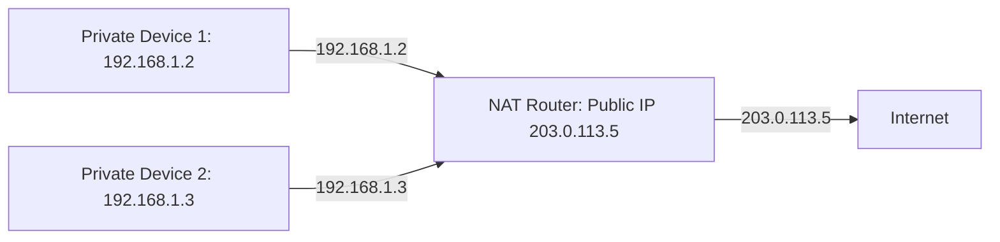

A more detailed view, showing the request/response flow:

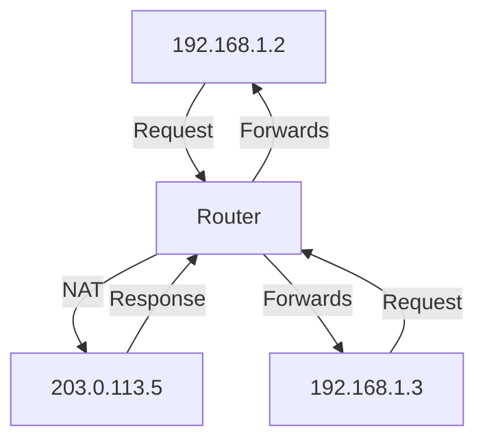

Multiple devices share one public IP via NAT.

### Role of IPs in System Design

- **Scalability:** Use private IPs to create large, distributed, multi-region architectures (e.g., microservices in the cloud).
- **Security:** Isolate internal services with firewalls and VPNs using private IPs.
- **Load Balancing:** Use IPs to distribute traffic among servers.
- **Cloud Networking:** Manage both public and private IPs for flexible and secure deployments (AWS, GCP, Azure).
- **Microservices:** Internal services communicate using private IPs, exposed to the internet via public IPs and load balancers.

### Practical Code: Checking Your IP Addresses

#### Get all local (private) IP addresses

```python
import socket

def get_local_ips():
    hostname = socket.gethostname()
    ips = socket.gethostbyname_ex(hostname)[2]
    return ips

print("Local (private) IP addresses:", get_local_ips())
```

#### Get your public IP

```bash
# Requires curl
curl ifconfig.me
```

#### Check whether an IP is private or public

```python
import ipaddress

def ip_type(ip):
    ip_obj = ipaddress.ip_address(ip)
    if ip_obj.is_private:
        return "Private"
    else:
        return "Public"

print(ip_type("192.168.1.1"))           # Private
print(ip_type("8.8.8.8"))               # Public
print(ip_type("2001:4860:4860::8888"))  # Public (IPv6)
```

### IP Addresses — Tips for System Design Interviews

- **Always clarify:** Are you being asked about public or private IPs? Their roles differ significantly.
- **Remember ranges:** Know the standard private IP ranges (10.x.x.x, 172.16-31.x.x, 192.168.x.x).
- **Mention NAT:** For IPv4, highlight how NAT enables homes and offices to share a single public IP.
- **IPv6 is the future:** Stress that IPv6 solves the address-exhaustion problem and brings better security and performance.
- **Design for scalability:** Use private IPs internally and public IPs only where needed (e.g., front-end load balancers).
- **Security first:** Keep internal services on private IPs; control access with firewalls and VPNs.
- **Draw diagrams:** Visually represent network topology in interviews or documentation.

### IP Addresses — Key Takeaways

- **IPv4 vs. IPv6:** IPv4 is common but limited; IPv6 offers vast address space and new features.
- **Public vs. Private:** Public IPs are unique and internet-facing; private IPs are internal and reusable.
- **System Design:** Correct IP management is crucial for scalability, security, and performance in modern distributed systems.

### IP Addresses — FAQ

**Q: Can two devices on the global internet have the same public IP?**
A: No. Public IP addresses are unique globally. However, many devices can share the same public IP behind a NAT within a private network.

**Q: Is IPv6 backward compatible with IPv4?**
A: No. IPv6 and IPv4 are separate protocols. Devices and networks often run both in parallel (dual stack).

---

## DNS — The Domain Name System

DNS is often called the **phone book of the Internet**. Its main job is to translate **human-readable domain names** (like `google.com`) into **machine-friendly IP addresses** (`142.250.190.78`), enabling seamless connectivity.

### Why is DNS Critical?

- **Usability:** Without DNS, users would need to remember numeric IP addresses for every website.
- **Scalability:** DNS provides a hierarchical, distributed system that can handle billions of devices.
- **Performance:** Through caching and geographic distribution, DNS speeds up website access.
- **Foundation for Modern Networking:** Key for load balancing, CDNs, failover, and cloud architectures.

### Types of DNS Servers

DNS resolution is a collaborative process involving several specialized servers:

| Server Type                    | Role                                                                                           |
|--------------------------------|------------------------------------------------------------------------------------------------|
| **Root Name Servers**          | Direct queries for TLDs (e.g., `.com`, `.org`) to the correct TLD name servers.                |
| **TLD Name Servers**           | Manage domains under a specific TLD (e.g., `google.com`, `amazon.com`).                        |
| **Authoritative Name Servers** | Store actual DNS records (A, CNAME, MX, etc.) and resolve domains to IP addresses.             |
| **Recursive Resolvers**        | Provided by ISPs or organizations; perform lookups on behalf of clients and cache results.     |

### Common DNS Record Types

The records you'll actually deal with as a developer:

| Record  | Maps                              | Example use                                       |
|---------|-----------------------------------|---------------------------------------------------|
| **A**     | name → IPv4 address             | `google.com` → `142.250.190.78`                   |
| **AAAA**  | name → IPv6 address             | IPv6 equivalent of A                              |
| **CNAME** | name → another name             | `www.example.com` → `example.com`                 |
| **MX**    | domain → mail server            | Routes email to your mail provider                |
| **NS**    | zone → authoritative DNS server | Delegation (which servers are authoritative)      |
| **TXT**   | name → arbitrary text           | SPF/DKIM (email auth), domain ownership proofs    |
| **SOA**   | zone → admin metadata           | One per zone; lists the primary nameserver        |
| **PTR**   | IP → name                       | Reverse DNS lookup                                |

> **Most common confusion:** A record vs CNAME. **A** gives an IP; **CNAME** gives another name to look up. You can't have a CNAME at the apex (e.g., `example.com` itself) — you need an A record there. Use CNAME for `www` and other subdomains.

### DNS Resolution: Step-by-Step

Here's what happens when you type `google.com` in your browser:

1. **Browser Cache Check:** Is the IP address already cached? If yes, use it.
2. **OS Cache Check:** If not in browser, the OS checks its own cache.
3. **Query to Recursive Resolver:** If the OS doesn't know, it asks the local DNS resolver (usually at your ISP).
4. **Cache Check at Resolver:** If the resolver has it cached, it responds immediately.
5. **Root Server Query:** If not, the resolver queries a root name server.
6. **TLD Server Query:** The root server directs to the relevant TLD name server.
7. **Authoritative Name Server Query:** The TLD server directs to the authoritative name server for `google.com`.
8. **IP Address Returned:** The authoritative server responds with the IP address.
9. **Caches Populated:** Every layer caches the response for future requests.
10. **Browser Connects to IP:** The browser uses the IP to fetch the website.

### DNS Resolution Flow (Simplified)

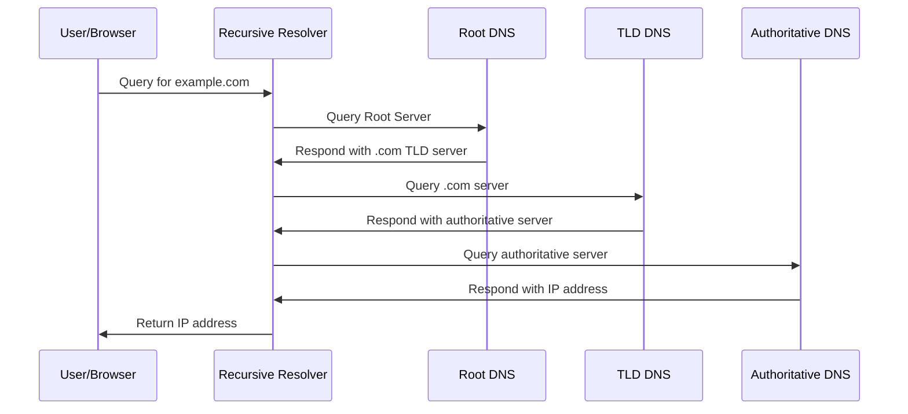

### DNS Resolution Flow (Detailed, with browser & OS layers)

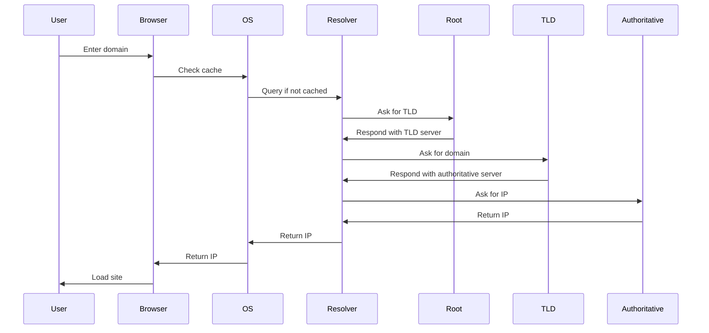

### DNS Server Hierarchy

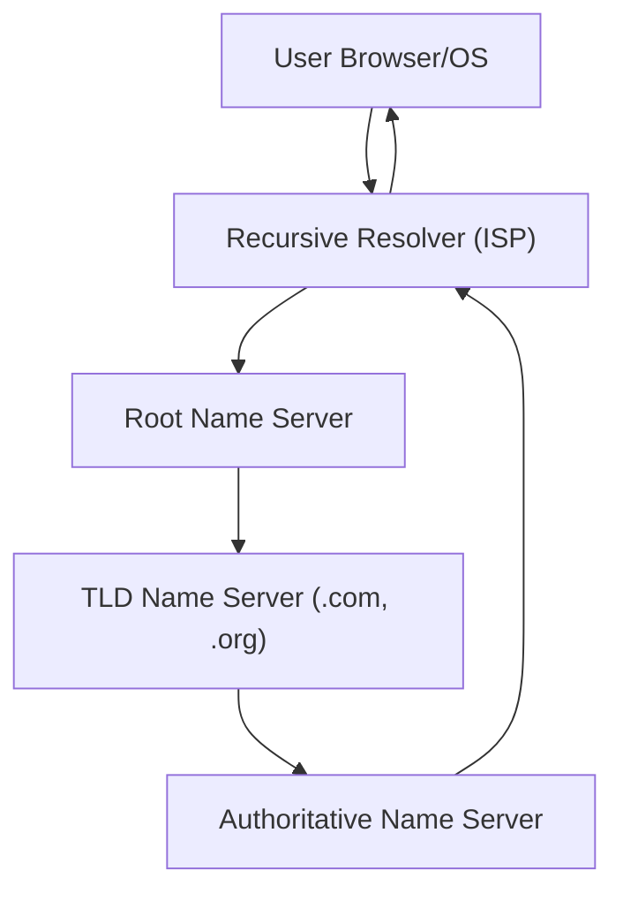

### Resolution Flow (ASCII for plain-text viewers)

```
User (Browser)
  |
  v
Browser Cache --> OS Cache --> Recursive Resolver (ISP) --> Root Server --> TLD Server --> Authoritative Server
                                                                                               |
                                                                                               v
                                                                               IP Address Response
```

### DNS Caching and Performance

#### Why is Caching Important?

- **Reduces Latency:** Cached records allow instant DNS resolution.
- **Lowers Server Load:** Fewer queries hit the authoritative servers.
- **Improves User Experience:** Faster page loads, especially for repeat visits.

#### Where Does DNS Caching Happen?

1. **Browser cache**
2. **Operating system cache** (e.g., `/etc/hosts`)
3. **Recursive resolver cache** (ISP level)
4. **Authoritative server cache** (optional, for negative responses)

#### The Role of TTL (Time-to-Live)

**TTL** determines how long a DNS record stays in cache.

- **Short TTL:** Faster updates, higher traffic to DNS servers.
- **Long TTL:** Lower DNS traffic, but slower propagation of record changes.

### DNS in Large-Scale Systems

DNS is a keystone in scalable, resilient architectures:

- **DNS Load Balancing:** Distributes user requests across multiple servers (e.g., round-robin DNS, geo-based routing).
- **Anycast DNS:** Multiple DNS servers share the same IP; users are routed to the nearest, fastest server.
- **Failover:** Primary and secondary DNS servers ensure availability if one goes down.
- **CDN Integration:** DNS routes users to the nearest edge node — this is exactly the mechanism that powers CDNs in Section 8.
- **Security:** Needs protection against DNS poisoning and DDoS.

### Anycast — One IP, Many Servers

**Anycast** is the foundational trick behind global DNS, modern CDNs, and DDoS mitigation. The same IP address is advertised from many physical locations using BGP (the internet's routing protocol). When you query that IP, the network automatically routes you to the **closest** instance.

```
Same IP (1.1.1.1) is advertised from:
   - London    ──┐
   - Frankfurt ──┤
   - Mumbai    ──┼── you reach whichever is "nearest" by network distance
   - Tokyo     ──┤
   - Virginia  ──┘
```

This is why Cloudflare's `1.1.1.1` resolver answers in <10ms from almost anywhere in the world. Same IP, hundreds of physical locations.

**Anycast vs DNS load balancing:**

- **DNS LB** returns a *different IP* depending on who's asking → routing decision is at DNS lookup time.
- **Anycast** uses the *same IP* everywhere → routing decision is made by BGP at every hop.

### Geo-DNS / GSLB

**Geo-DNS** (also called Global Server Load Balancing, or GSLB) returns different DNS answers based on the *querying client's location*. The user in Tokyo gets the Tokyo region's IP; the user in São Paulo gets the São Paulo region's IP. Implemented by Route 53 (AWS), Cloud DNS (GCP), Azure Traffic Manager, Cloudflare, Akamai, etc.

> **Performance note:** A DNS lookup typically takes 20-120ms the first time (often cached afterward). That's why DNS caching matters: from Chapter 1's table, a network round-trip within a datacenter is ~0.5ms; DNS adds the equivalent of ~100 round trips on a miss.

### DNS Security Considerations

DNS is a frequent target for cyber attacks:

- **DNS Cache Poisoning:** Attackers inject false records into DNS caches, redirecting users to malicious sites.
- **DDoS Attacks:** Overwhelm DNS servers with requests, making websites unreachable.
- **Mitigation:** Use DNSSEC (DNS Security Extensions), monitoring, and secure configurations to protect infrastructure.

### Code Snippet: Querying DNS in Python

Using [dnspython](https://www.dnspython.org/):

```python
import dns.resolver

def resolve_domain(domain):
    try:
        result = dns.resolver.resolve(domain, 'A')
        for ipval in result:
            print(f"{domain} has IP address: {ipval.to_text()}")
    except Exception as e:
        print(f"Could not resolve {domain}: {e}")

resolve_domain('google.com')
```

**Output:**

```
google.com has IP address: 142.250.190.78
```

### DNS — Tips and Best Practices

- **Set Appropriate TTLs:** Balance between freshness and efficiency. Short TTLs for frequently updated records, longer for static domains.
- **Use Multiple DNS Providers:** Improve redundancy with primary and secondary DNS providers.
- **Monitor DNS Health:** Use health checks and alerts for failover.
- **Leverage Anycast for Global Scale:** Deploy DNS servers in multiple regions for faster resolution.
- **Implement DNSSEC:** Protect against cache poisoning and DNS spoofing.
- **Optimize Caching Layers:** Understand cache hierarchies — browser, OS, resolver.
- **Document DNS Changes:** Keep detailed records for auditing and rollback.

### DNS — Common Interview Questions

- Explain the DNS resolution process step by step.
- What is the difference between authoritative and recursive DNS servers?
- How does DNS caching improve performance? Where does it occur?
- What is TTL in DNS, and why is it important?
- How does DNS-based load balancing work in large-scale systems?
- What are common DNS-related security threats, and how can they be mitigated?

### DNS — Further Reading

- [RFC 1035: Domain Names Implementation and Specification](https://www.rfc-editor.org/rfc/rfc1035)
- [Google Public DNS Documentation](https://developers.google.com/speed/public-dns/docs/using)
- [DNSSEC – DNS Security Extensions](https://www.icann.org/resources/pages/dnssec-what-is-it-why-important-2019-03-05-en)

---

## The Client-Server Model

In the world of modern computing, **networking and communication** form the backbone of scalable, high-performance systems. Whether you're browsing the web, using your favorite app, or streaming a movie, you interact with the **client-server model** every day. Understanding this model is fundamental for developers, architects, and anyone preparing for system design interviews.

### What is the Client-Server Model?

The **client-server model** is a distributed application structure that separates tasks between service requesters (clients) and service providers (servers).

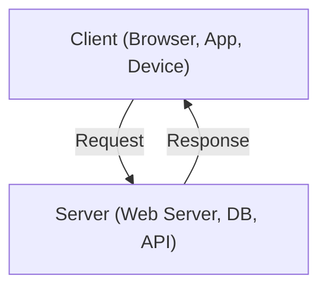

*Communication happens over a network (Internet, LAN, Wi-Fi, etc.).*

A simpler graph-LR view:

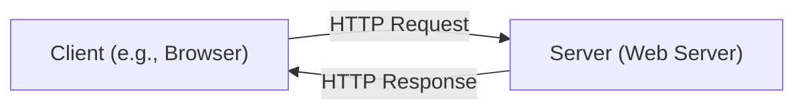

**Key Components:**

- **Client:** The user-facing application (web browser, mobile app, API consumer) that initiates a request.
- **Server:** Processes the request and sends back a response (web server, database server, mail server).
- **Network:** The medium (Internet, LAN, Wi-Fi, 5G, etc.) that connects clients and servers.

### Why is the Client-Server Model Important?

- **Resource Management:** Centralizes computation, storage, and management on powerful servers rather than individual devices.
- **Scalability:** Easy to add or remove resources at the server side as demand changes.
- **Seamless Communication:** Standardizes data exchange between diverse devices and platforms.
- **Real-World Applications:** Powers everything from web browsing and email to cloud services, APIs, and IoT.

### The Basic Request-Response Cycle

Every digital action — opening a website, sending an email, fetching an API — follows a basic pattern:

1. **Client sends a request** (GET, POST, SQL query, etc.)
2. **Network transmits the request** to the server
3. **Server processes the request** (fetches data, computes results)
4. **Server sends a response** back
5. **Client processes the response** (displays webpage, updates UI, etc.)

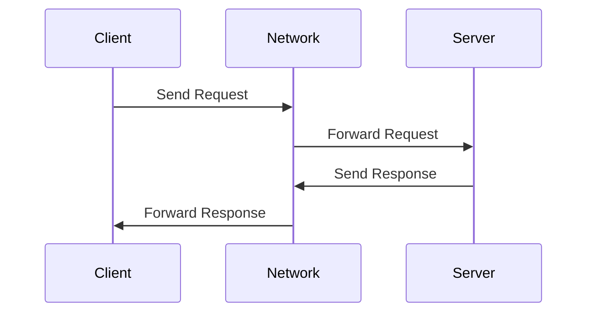

A more detailed example showing a web-server backed by a database:

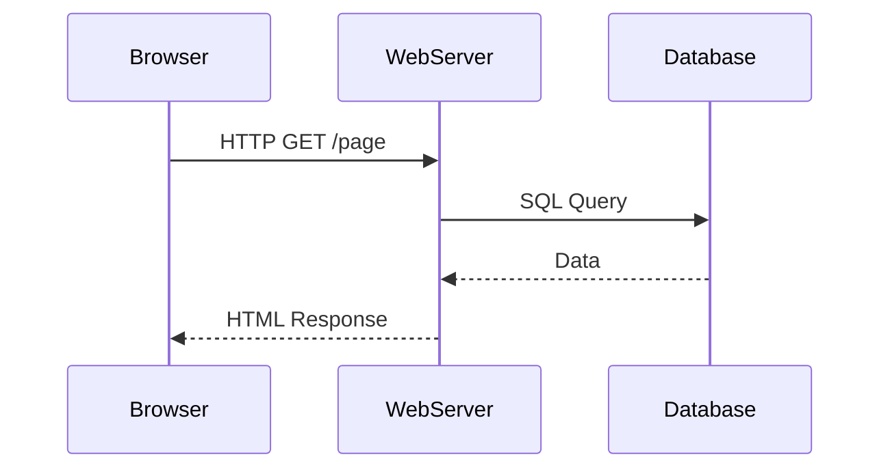

### Types of Communication

#### Synchronous (Request-Response)

- **Pattern:** Client sends a request and waits for the server's response before proceeding.
- **Examples:** HTTP requests, REST APIs, form submissions.

#### Asynchronous (Persistent Connection)

- **Pattern:** Client and server maintain an open connection for real-time, two-way communication.
- **Examples:** WebSockets (live chat, notifications), FTP sessions, multiplayer games.

| Feature           | Synchronous                         | Asynchronous                     |
|-------------------|-------------------------------------|----------------------------------|
| Client Waits?     | Yes                                 | No                               |
| Typical Pattern   | Blocking (waits for response)       | Non-blocking (can do other work) |
| Example           | REST API call, form submission      | WebSocket chat, AJAX, polling    |

**Analogy:**
- *Synchronous*: Calling a friend and waiting for them to answer before hanging up.
- *Asynchronous*: Sending a text message and doing other things while waiting for a reply.

### Stateless vs. Stateful Servers

| Feature             | Stateless                          | Stateful                          |
|---------------------|------------------------------------|-----------------------------------|
| Session Memory?     | No memory of past requests         | Maintains session info            |
| Scalability         | High (easy to distribute/cache)    | Harder (sessions must be tracked) |
| Example             | REST APIs, HTTP servers            | WebSockets, online games, banking |

**Practical Examples:**

- **Stateless:** Every API call to a REST service must include all needed information (e.g., authentication token), because the server does not remember previous requests.
- **Stateful:** A WebSocket server remembers each user's connection, allowing for real-time chat or game state to persist.

### Example: HTTP Request-Response Cycle

Let's walk through what happens when you load a website (`https://example.com`) in your browser.

1. **DNS Lookup:** Browser resolves domain to an IP address.
2. **Browser sends an HTTP GET request** to the web server.
3. **Server processes the request:** Queries database, generates HTML.
4. **Server responds:** Sends HTML, CSS, JS files, status code (200 OK or 404 Not Found).
5. **Browser processes the response:** Renders the page.

**Code Example: Simple HTTP Client in Python**

```python
import requests

response = requests.get('https://example.com')
print(response.status_code)  # 200
print(response.text)         # HTML content of the page
```

**Fetching JSON:**

```python
import requests

response = requests.get('https://jsonplaceholder.typicode.com/posts/1')
print(response.json())
```

### Real-World Examples

- **Web Browsing:** Browser (client) requests pages from a web server.
- **API Calls:** Mobile app (client) fetches data from backend APIs (server).
- **Database Queries:** Application server (client) queries a database server.
- **Messaging:** WhatsApp or Slack uses WebSockets to maintain a persistent connection for real-time communication.

### Code Snippet: A Simple HTTP Server

A minimal HTTP server in Python:

```python
from http.server import HTTPServer, BaseHTTPRequestHandler

class SimpleHandler(BaseHTTPRequestHandler):
    def do_GET(self):
        self.send_response(200)
        self.end_headers()
        self.wfile.write(b'Hello, Client-Server World!')

if __name__ == '__main__':
    server_address = ('', 8000)
    httpd = HTTPServer(server_address, SimpleHandler)
    print("Serving on port 8000...")
    httpd.serve_forever()
```

**Test it:** Open your browser to `http://localhost:8000` and see the response.

### Client-Server Model — Tips for System Design Interviews

1. **Clarify Requirements.** Ask whether the system needs to be stateless or stateful. Stateless systems scale more easily; stateful ones are required for sessions and personalization.
2. **Consider Scalability.** Use stateless servers and load balancers for large-scale systems. For real-time features (chat), stateful or persistent connections are needed.
3. **Network Efficiency.** Minimize data transfer. Use compression, caching (CDN, HTTP cache), and optimize request/response payloads.
4. **Security First.** Always authenticate and authorize requests. Use HTTPS for all communications.
5. **Choose the Right Protocol.** HTTP is great for request-response. Use WebSockets or gRPC for real-time, bi-directional communication. (See Ch. 3 — Protocols.)
6. **Logging and Monitoring.** Implement request/response logging, error tracking, and metrics.
7. **Handle Failures Gracefully.** Design with retries, fallbacks, and error handling.

### Client-Server Model — Sample Interview Questions

- What is the client-server model, and how does it work?
- How does a browser load a webpage? Walk through the request-response cycle.
- Explain the difference between stateless and stateful servers. When would you use each?
- How can you design a scalable client-server architecture for millions of users?
- What are the security challenges in the client-server model?
- How does WebSocket communication differ from REST APIs?
- How would you implement load balancing in a client-server system?

### Client-Server Model — Resources

- [Python http.server Documentation](https://docs.python.org/3/library/http.server.html)
- [MDN Web Docs: HTTP Overview](https://developer.mozilla.org/en-US/docs/Web/HTTP/Overview)
- [Mermaid Live Editor](https://mermaid-js.github.io/mermaid-live-editor/)

---

## Proxies — Forward and Reverse

In modern distributed architectures, **proxies** play a crucial role in securing, optimizing, and managing network traffic. However, not all proxies are created equal. Two fundamental types — **forward proxies** and **reverse proxies** — serve very different purposes.

### What is a Proxy?

A **proxy server** acts as an intermediary between a client (browser, app, etc.) and a server (web server, API, etc.). Instead of clients communicating directly with servers, requests pass through a proxy, which can inspect, modify, or redirect them.

**Key Benefits of Proxies:**

- **Security:** Protect clients and servers from threats.
- **Caching:** Store frequently accessed content to reduce latency.
- **Traffic Control:** Efficiently distribute requests, preventing overload.
- **Anonymity:** Mask client IPs to maintain privacy.

### Forward Proxy

A **forward proxy** sits between the client and the internet. It acts on behalf of the client, forwarding client requests to servers.

**How It Works:**

```
[Client] ---> [Forward Proxy] ---> [Internet/Server]
```

**Flow:**

1. Client sends a request to the forward proxy.
2. Proxy evaluates the request (may filter or log).
3. Proxy forwards the request to the destination server.
4. Server responds to the proxy.
5. Proxy returns the response to the client.

**Use Cases:**

- **Content Filtering:** Restrict access to certain sites (e.g., in companies or schools).
- **Anonymity:** Hide client IPs (VPNs, TOR).
- **Bypass Geo-restrictions:** Access blocked content from other regions.
- **Caching:** Reduce bandwidth and accelerate web access.

**Example: Python Requests via Forward Proxy**

```python
import requests

proxies = {
    "http": "http://forward-proxy.example.com:3128",
    "https": "http://forward-proxy.example.com:3128",
}

response = requests.get("http://example.com", proxies=proxies)
print(response.text)
```

**Quick test with cURL:**

```bash
curl -x http://proxy.example.com:8080 http://example.com
```

### Reverse Proxy

A **reverse proxy** sits in front of backend servers. Clients interact with the reverse proxy, which in turn communicates with the servers.

**How It Works:**

```
[Client] ---> [Reverse Proxy] ---> [Backend Servers]
```

**Flow:**

1. Client sends a request to the reverse proxy.
2. Reverse proxy evaluates, authenticates, or manipulates the request.
3. Proxy forwards the request to the appropriate backend server.
4. Server responds to the proxy.
5. Proxy returns the response to the client.

**Use Cases:**

- **Load Balancing:** Distribute incoming requests across multiple servers.
- **Caching:** Store frequently requested resources to improve performance.
- **Security & DDoS Protection:** Hide backend servers, filter malicious traffic.
- **SSL Termination:** Offload SSL/TLS encryption from backend servers.

> **What "SSL Termination" actually means:** the proxy decrypts incoming HTTPS traffic and forwards plain HTTP to backends. Why do this? You manage one TLS certificate (on the proxy) instead of N (one per backend), and the CPU cost of encryption happens once at the edge instead of on every backend. **The catch:** traffic between the proxy and your backends is now unencrypted, so this assumes a trusted private network. If that assumption doesn't hold (e.g., backends are in a different VPC, or compliance requires end-to-end encryption), use **mTLS** between proxy and backends instead.

**Example: NGINX as a Reverse Proxy**

```nginx
server {
    listen 80;

    location / {
        proxy_pass http://backend_servers;
        proxy_set_header Host $host;
        proxy_set_header X-Real-IP $remote_addr;
    }
}

upstream backend_servers {
    server app1.internal:8080;
    server app2.internal:8080;
}
```

**Minimal reverse proxy snippet:**

```nginx
location /api/ {
    proxy_pass http://api-backend.internal/;
}
```

### Combined View of Forward + Reverse

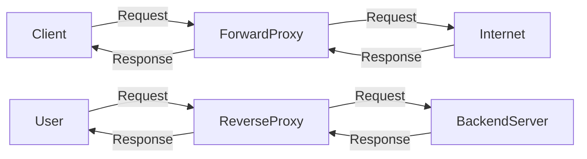

### Forward Proxy vs. Reverse Proxy: Key Differences

| Aspect           | Forward Proxy                      | Reverse Proxy                              |
|------------------|------------------------------------|--------------------------------------------|
| Placement        | In front of clients                | In front of backend servers                |
| Protects         | Clients                            | Servers                                    |
| Use Case         | Anonymity, filtering, caching      | Load balancing, security, caching          |
| Common Users     | Individuals, organizations         | Web apps, APIs, cloud services             |
| Examples         | Squid, VPN, Tor                    | NGINX, HAProxy, Cloudflare, AWS ELB        |
| Visibility       | Hides client from server           | Hides server from client                   |

### Proxy Placement in the Network

```
          [Client]
              |
      -----------------
      |               |
[Forward Proxy]   (Direct, no proxy)
      |
  [Internet]
      |
[Reverse Proxy]
      |
[Backend Servers]
```

### Proxies — Tips for System Design Interviews

- **When to use a Forward Proxy?** Use when clients need anonymity, content filtering, or must bypass restrictions. Example: A corporate environment restricting social media access.
- **When to use a Reverse Proxy?** Use when you need to scale backend services, balance load, add security layers, or centralize SSL. Example: Deploying an e-commerce platform serving millions of users.
- **Common Pitfalls:**
  - Don't confuse direction: Forward proxy = client-side; Reverse proxy = server-side.
  - Avoid exposing backend servers directly — always use a reverse proxy for public-facing services.
  - Remember that caching exists in both, but for different reasons and different content.
- **Interview-Ready Phrases:**
  - *"A forward proxy is client-facing, mainly for outbound traffic; a reverse proxy is server-facing, mainly for inbound traffic."*
  - *"Reverse proxies enable seamless scaling and high availability by distributing requests across backend servers."*
- **Real-World Examples:**
  - Forward Proxy: Corporate web proxy, VPN, Tor exit node.
  - Reverse Proxy: NGINX as load balancer, Cloudflare for DDoS protection, API Gateway.

### Proxies — Further Reading

- [NGINX Reverse Proxy Documentation](https://docs.nginx.com/nginx/admin-guide/web-server/reverse-proxy/)
- [Squid Forward Proxy](http://www.squid-cache.org/)
- [Cloudflare: What is a Reverse Proxy?](https://www.cloudflare.com/learning/cdn/glossary/reverse-proxy/)

---

## Load Balancing

Load balancing is a foundational building block in scalable, reliable, and high-performing system architectures. Whether you're designing for millions of users or just want smooth user experiences, understanding load balancing — its types, strategies, and real-world applications — is non-negotiable.

### Why Load Balancing Matters

Modern applications must handle fluctuating traffic, minimize downtime, and ensure fast response times. **Load balancers** sit between clients and backend servers, distributing requests efficiently to prevent any one server from being overwhelmed.

**Key Benefits:**

- **High Availability:** Keeps systems running even during traffic spikes or server failures.
- **Traffic Distribution:** Spreads requests evenly, so no single server bears excessive load.
- **Failure Handling:** Automatically redirects traffic if a server becomes unhealthy.
- **Improved Performance:** Reduces latency by routing requests to the least busy or fastest server.
- **Scalability:** Easily add servers as your application grows — load balancers distribute requests automatically.

> **Real-World Example:** Consider a high-traffic e-commerce platform during a sale. Without load balancing, a single server could easily be swamped, causing slow performance or downtime. With load balancing, requests are smoothly distributed, ensuring a seamless experience for all users.

### Types of Load Balancers

Load balancers can be categorized by **network layer** and **deployment model**.

#### By Network Layer

**Layer 4 Load Balancers (Transport Layer):**

- Operate at TCP/UDP level.
- Make routing decisions based on IP addresses and ports.
- Very fast, ideal for raw network traffic.
- **Example:** AWS Network Load Balancer, HAProxy (L4 mode).

**Layer 7 Load Balancers (Application Layer):**

- Operate at HTTP/HTTPS level.
- Inspect the actual content — HTTP headers, cookies, URLs.
- Can route requests based on content (e.g., send `/checkout` to a different server pool).
- **Example:** AWS Application Load Balancer, NGINX.

```text
+-------------------+
|   Client Request  |
+---------+---------+
          |
          v
    +-----+------+
    | Load       |   Layer 4:  IP/Port based
    | Balancer   |   Layer 7:  Content-aware
    +-----+------+
          |
   +------+------+------+
   |             |      |
+--+--+       +--+--+ +--+--+
| S1 |       | S2 | | S3 |
+-----+       +-----+ +-----+
```

#### By Deployment Model

- **Hardware Load Balancers:** Dedicated devices for enterprises and data centers (e.g., F5 BIG-IP).
- **Software Load Balancers:** Run on general servers or VMs. Flexible and cost-effective (e.g., NGINX, HAProxy, Envoy).
- **Cloud-Based Load Balancers:** Managed by cloud providers, offer auto-scaling and easy integration (e.g., AWS ELB, GCP Load Balancer, Azure Load Balancer).

### Load Balancing Strategies

The strategy you choose impacts performance, reliability, and cost. Strategies are broadly classified as **static** or **dynamic**.

#### Static Load Balancing

**1. Round Robin** — distributes requests sequentially across servers.

```python
servers = ['S1', 'S2', 'S3']
request_count = 0

def get_next_server():
    global request_count
    server = servers[request_count % len(servers)]
    request_count += 1
    return server
```

**2. Least Connections** — routes new requests to the server with the fewest active connections.

**3. IP Hashing** — routes requests based on a hash of the client's IP, providing session persistence.

```python
import hashlib

def get_server_by_ip(client_ip, servers):
    index = int(hashlib.sha256(client_ip.encode()).hexdigest(), 16) % len(servers)
    return servers[index]
```

#### Dynamic Load Balancing

**1. Least Response Time** — routes to the server with the fastest current response.

**2. Adaptive Load Balancing** — dynamically adjusts based on real-time metrics (CPU, memory, health).

**3. Weighted Load Balancing** — assigns more traffic to higher-capacity servers.

```python
servers = [('S1', 3), ('S2', 1)]  # (server, weight)

def weighted_round_robin(request_id):
    flat_list = [s for s, w in servers for _ in range(w)]
    return flat_list[request_id % len(flat_list)]
```

**Example: NGINX Weighted Load Balancer Config**

```nginx
http {
    upstream backend {
        server backend1.example.com weight=3;
        server backend2.example.com weight=1;
    }

    server {
        listen 80;
        location / {
            proxy_pass http://backend;
        }
    }
}
```

### Load Balancers in Action

```text
                       +--------------+
                       |    Client    |
                       +------+-------+
                              |
                              v
                       +------+-------+
                       |  Load        |
                       |  Balancer    |
                       +----+---+-----+
                            |   |
                 +----------+   +----------+
                 |                         |
          +------+-----+            +------+-----+
          |   Server 1 |            |   Server 2 |
          +------+-----+            +------+-----+
                 \                          /
                  +------------------------+
                    (More backend servers)
```

A Mermaid version of the same idea:

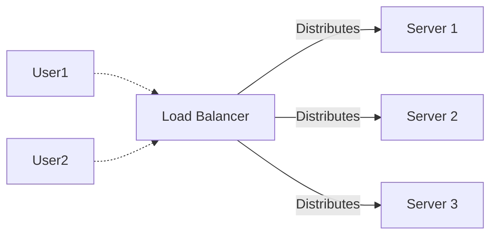

**How it works:**

- Client sends a request to the Load Balancer.
- Load Balancer chooses a backend server based on the configured strategy.
- If a server fails, the Load Balancer reroutes traffic to healthy servers.

### Choosing the Right Load Balancer

- **Layer:** L4 for speed, L7 for content-aware routing.
- **Scalability:** Will you need auto-scaling? Use cloud-based solutions.
- **Security:** Need SSL termination or DDoS protection?
- **Cost & Flexibility:** Software load balancers are more flexible, hardware for enterprise performance.
- **Use Case:** API gateways, microservices, high-traffic web apps, etc.

### Health Checks — What They Are

The LB needs to know which backends are alive. It does this via **health checks**:

- **Active health check (most common):** the LB hits a `/health` endpoint on each backend every N seconds (typically 5-30s). If it gets HTTP 200, backend stays in the pool; if it fails K times in a row, it's removed.
- **Passive health check:** the LB tracks real user traffic and ejects a backend after K consecutive failed requests.

A good `/health` endpoint should:

- Return fast (< 50 ms) — never block on slow dependencies.
- Reflect *only the local* health (don't fail if a downstream is slow; that's a separate concern).
- Optionally have a separate `/ready` endpoint for "I've finished startup and am ready to serve."

### Sticky Sessions — What They Are and When to Avoid

**Sticky sessions** (a.k.a. *session affinity*) mean the LB always routes a given user to the *same* backend. Typically implemented via:

- **IP-hash sticky:** hash(client_IP) % N. Free but breaks if user's IP changes.
- **Cookie-based sticky:** LB injects a cookie identifying the backend.

**Why you might need it:** legacy apps that hold per-user state (session data, in-memory caches) on a specific backend.

**Why you should usually avoid it:**

- Breaks horizontal scaling — one user can't be load-balanced.
- A backend death loses that user's session.
- Some backends end up hot, others cold.

**The modern alternative:** make backends *stateless* and externalize session state to Redis/Memcached. Any backend can serve any user.

### Load Balancing — Tips & Best Practices

- **Monitor Health:** Always enable health checks for backend servers.
- **Sticky Sessions:** Use session persistence (IP hash, cookies) if user state is needed.
- **SSL Offloading:** Terminate SSL at the load balancer to reduce backend load.
- **Auto Scaling:** For cloud setups, integrate load balancers with auto-scaling groups.
- **Rate Limiting:** Prevent abuse by integrating rate limiting at the load balancer or API gateway.
- **Failover:** Design for graceful failover — use multiple load balancers or DNS-based failover.
- **Logging & Monitoring:** Track traffic, errors, and latency at the load balancer for troubleshooting and analytics.
- **Security:** Use WAFs (Web Application Firewalls) and DDoS protection features available on most advanced load balancers.

### Load Balancing — Interview Quick Reference

- **What is load balancing and why is it important?** Distributes traffic to ensure high availability, performance, and reliability.
- **Layer 4 vs. Layer 7 Load Balancers?**
  - L4: Fast, IP/Port-based.
  - L7: Content-aware, supports complex rules.
- **Static vs. Dynamic strategies?**
  - Static: Predefined rules, simple.
  - Dynamic: Adapt to real-time load/health.
- **How does a load balancer improve security?** Can perform SSL/TLS termination, DDoS filtering, hide backend servers.

### Load Balancing — Further Reading

- [NGINX as a Load Balancer](https://docs.nginx.com/nginx/admin-guide/load-balancer/http-load-balancer/)
- [AWS Elastic Load Balancing](https://aws.amazon.com/elasticloadbalancing/)
- [HAProxy Documentation](https://www.haproxy.org/)
- [Kubernetes Ingress Controllers](https://kubernetes.io/docs/concepts/services-networking/ingress-controllers/)

---

## API Gateways

An **API Gateway** is a server that acts as a centralized entry point for all client requests to your backend services. It is responsible for request routing, composition, protocol translation, authentication, rate limiting, caching, logging, and more.

### Key Functions

- **Authentication & Authorization** (OAuth, JWT, API keys)
- **Security** — DDoS protection, SSL termination, bot protection
- **Routing** — forwards requests to the correct backend service
- **Rate Limiting & Throttling**
- **Caching** — stores common responses to reduce backend load and response time
- **Request/Response Transformation** — modifies formats
- **Logging & Monitoring** — centralized observability
- **API Composition** — aggregates calls to multiple backend services

### API Gateway Diagram

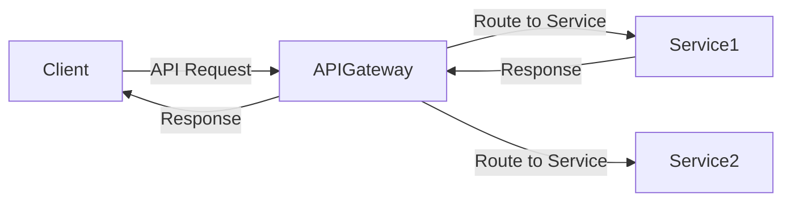

A more detailed view showing aggregation:

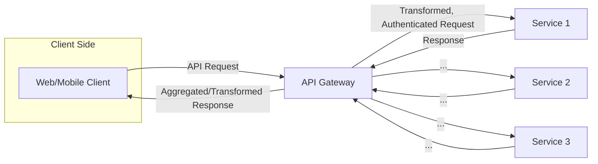

### Sample API Gateway Implementation (Node.js + Express + http-proxy-middleware)

```js
const express = require('express');
const { createProxyMiddleware } = require('http-proxy-middleware');
const rateLimit = require('express-rate-limit');
const app = express();

// Rate Limiting
const limiter = rateLimit({
  windowMs: 1 * 60 * 1000, // 1 minute window
  max: 60                  // limit each IP to 60 requests per windowMs
});
app.use(limiter);

// Simple auth middleware
app.use((req, res, next) => {
  if (req.headers['x-api-key'] !== 'your-api-key') {
    return res.status(401).send('Unauthorized');
  }
  next();
});

// Proxy setup
app.use('/service1', createProxyMiddleware({ target: 'http://localhost:5001', changeOrigin: true }));
app.use('/service2', createProxyMiddleware({ target: 'http://localhost:5002', changeOrigin: true }));

app.listen(3000, () => console.log('API Gateway running on port 3000'));
```

### API Gateway vs. Reverse Proxy — When to Use Which

This is *the* most common confusion. Both sit in front of your services. Both can route, terminate TLS, and load-balance. So what's different?

| Concern              | Reverse Proxy (NGINX, HAProxy)  | API Gateway (Kong, AWS API GW, Apigee) |
|----------------------|----------------------------------|-----------------------------------------|
| Routing              | ✓ by URL/host                   | ✓ by URL/host + API contract            |
| SSL termination      | ✓                                | ✓                                       |
| Load balancing       | ✓ first-class                    | sometimes (often delegates to LB)       |
| Authentication       | basic (mTLS, basic auth)         | first-class (OAuth, JWT, API keys)      |
| Rate limiting        | basic (global, per-IP)           | rich (per-API key, per-route, per-tier) |
| API composition      | ✗                                | ✓                                       |
| Request transform    | basic (headers)                  | ✓ (body, schema)                        |
| Schema validation    | ✗                                | ✓ (OpenAPI / GraphQL)                   |
| Developer portal     | ✗                                | ✓                                       |
| Pricing model        | free, open-source                | often per-API-call (managed services)   |

**Rule of thumb:**
- **Reverse proxy** = traffic infrastructure. You'd run it for any web service.
- **API Gateway** = API product surface. Use it when you're exposing APIs to external developers, multiple internal teams, or partners — anywhere you need quotas, plans, and a polished contract.
- **In practice you often use both:** a reverse proxy (e.g., NGINX) close to your services for routing/TLS, plus a managed API gateway at the edge for auth, quotas, and developer experience.

### API Gateways — Tips

- **Use JWT/OAuth2** for robust authentication and authorization.
- **Implement rate limiting** at the gateway to prevent abuse.
- **Aggregate requests** in the gateway to reduce client-server roundtrips (API composition).
- **Monitor logs** for suspicious activity and performance bottlenecks.
- **Cache GET responses** for expensive, non-sensitive data.

### API Gateways — Interview Questions

- What is an API gateway and why is it important?
- How does an API gateway differ from a load balancer?
- How would you implement rate limiting and authentication in an API gateway?
- Describe a scenario where API aggregation/composition is beneficial.

---

## Content Delivery Networks (CDNs)

A **Content Delivery Network (CDN)** is a globally distributed network of servers (also called Points of Presence, or PoPs) designed to deliver content (web pages, images, videos, APIs, etc.) to users efficiently, reliably, and securely. By caching content closer to users, CDNs reduce latency, enhance availability, and offload traffic from origin servers.

### Why Do We Need CDNs?

Without a CDN, every client request must travel the entire distance to the origin server (which could be on another continent), resulting in:

- **High latency** due to geographical distance.
- **Overloaded origin servers** under heavy traffic.
- **Bandwidth bottlenecks** and slow load times.

CDNs solve these problems by:

- Serving content from the nearest edge server.
- Distributing user load across many servers.
- Caching and optimizing content to reduce bandwidth and cost.
- Handling massive traffic and DDoS attacks.
- Optimizing bandwidth and cost.

### CDN Architecture & Components

| Component             | Description                                                                       |
|-----------------------|-----------------------------------------------------------------------------------|
| **Origin Server**     | Central server hosting the original content.                                       |
| **Edge Server / PoP** | Distributed servers caching and serving content closer to users.                   |
| **Request Routing**   | Logic that directs traffic to the optimal edge server (geo, latency, load).        |

**Basic CDN Architecture:**

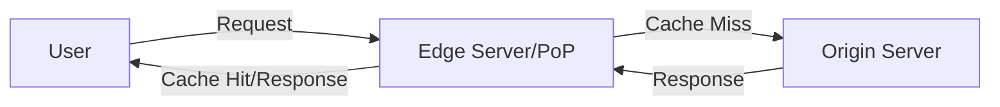

**ASCII view:**

```plaintext
           +-----------------+
           | Origin Server   |
           +-----------------+
                |
        +-------+---------+
        |                 |
+----------------+  +----------------+
| Edge Server 1  |  | Edge Server 2  | ... More PoPs
+----------------+  +----------------+
      |                   |
   User 1              User 2
(Requests routed to nearest edge server)
```

### How a CDN Handles Requests

1. **User Requests Content:** A user tries to load a resource (e.g., image, video, API data).
2. **CDN Resolves to Nearest Edge Server:** DNS and routing logic direct the request to the best PoP (based on geography, latency, load).
3. **Cache Hit:** If the content is cached at the edge, it is served instantly.
4. **Cache Miss:** If not cached, the edge server fetches from the origin, caches it for future requests, and serves the user.
5. **Subsequent Requests:** Future users benefit from the cached content, improving speed and reliability.

A combined flow showing the user → edge → origin → cache journey:

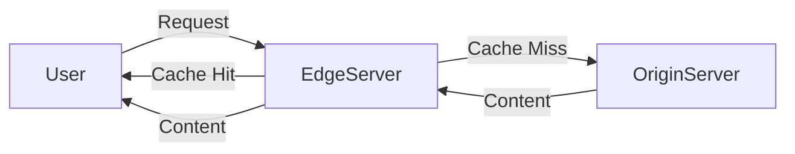

### CDN Request Flow (Sequence Diagram)

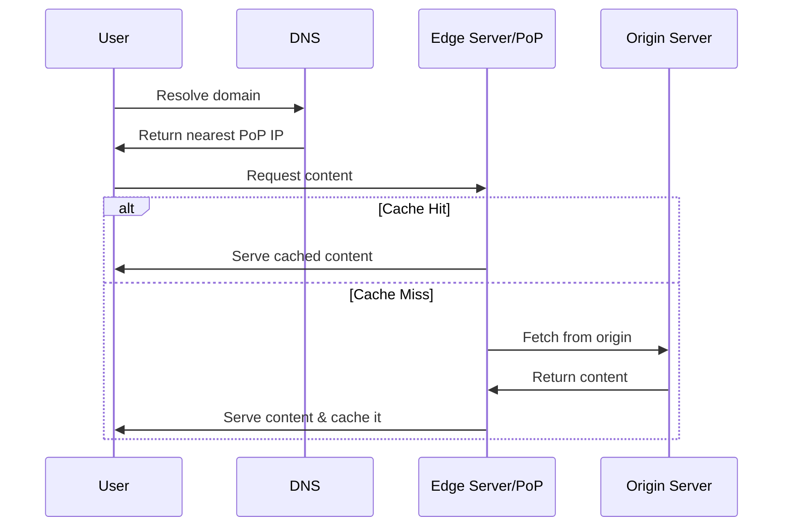

### Key CDN Features & Benefits

| Feature                       | Benefit                                                |
|-------------------------------|--------------------------------------------------------|
| **Caching & Replication**     | Reduces latency and origin server load.                |
| **Load Balancing**            | Handles massive traffic, provides high availability.   |
| **Compression & Optimization**| Reduces bandwidth, speeds up delivery.                 |
| **Security**                  | DDoS mitigation, SSL/TLS, bot filtering.               |

### Caching Strategies in CDNs

CDNs cache frequently accessed content at edge servers. Key concepts:

**Cache Expiration (TTL):** determines how long an object stays cached before being refreshed.

```http
Cache-Control: public, max-age=86400
```

**Cache Invalidation** techniques to ensure freshness:

- **Manual Purge:** Explicitly remove/refresh objects.
- **Stale-While-Revalidate:** Serve stale content while fetching the latest version asynchronously.
- **Cache-Control Headers:** Fine-tune caching via HTTP headers.

**Example: Setting Cache-Control headers in Express.js**

```js
app.get('/static/*', (req, res) => {
  res.set('Cache-Control', 'public, max-age=86400'); // Cache for 1 day
  res.sendFile(/* ... */);
});
```

### Request Routing, Load Balancing, and Failover

CDNs use intelligent algorithms for:

- **Geo-Based Routing:** Directs users to the geographically nearest PoP.
- **Latency-Based Routing:** Picks the PoP with the fastest response time.
- **Load-Aware Routing:** Avoids sending requests to overloaded PoPs.

**Failover Handling:** If a PoP fails, traffic is rerouted to the next closest or most responsive PoP, ensuring high availability.

### Compression, Minification, and Optimization

CDNs further optimize content delivery by:

- **Compression:**
  - Gzip/Brotli for text files (HTML, CSS, JS)
  - Image compression (WebP, AVIF)
- **Minification:**
  - Remove whitespace and comments from JS/CSS.
- **Bundling:**
  - Combine multiple files into one to reduce HTTP requests.

**Example: Enable Gzip Compression in Node.js**

```js
const express = require('express');
const compression = require('compression');

const app = express();
app.use(compression());
```

### Security Features

- **DDoS Protection:** Rate limiting, traffic filtering, anomaly detection.
- **SSL/TLS Offloading:** Edge servers handle encryption, reducing load on origin.
- **Bot Mitigation:** Block malicious bots before reaching origin.
- **Web Application Firewall (WAF):** Protects against common web threats.

### CDN Use Cases

- **Static Content Delivery:** Images, CSS, JS, videos, HTML.
- **Dynamic Content Optimization:** API responses, personalized pages (with careful caching).
- **API Acceleration:** Edge caching of API responses for speed.
- **Edge Computing:** Run lightweight computation at the edge (e.g., video transcoding, A/B testing).

### CDN Nuances Worth Knowing

- **Pull CDN (most common):** Edge fetches from origin on first cache miss, then serves cached copy. Cloudflare, CloudFront, Fastly default to this. **Easy to set up** (just point DNS at the CDN).
- **Push CDN:** You manually upload assets to the CDN. Used for very large, rarely-changing files (game patches, software downloads).
- **Origin shield:** A *single* designated edge in front of your origin so all other edges fetch from it on a miss. Reduces load on your origin during a stampede.
- **Cache key design:** Two URLs that should serve the same content (e.g., with vs. without a marketing query parameter) need to share a cache key, or you'll cache them separately and waste hit-rate. Most CDNs let you strip irrelevant query params from the key.
- **Signed URLs:** For private content (paid videos, private documents), the CDN won't serve unless the URL includes a short-lived signature your origin generated. Lets you put auth at the origin while still using the CDN for delivery.
- **Cache invalidation:** Two strategies — **purge** (CDN evicts on demand, often costly/slow) or **versioning** (rename the file: `style.css?v=42`, and old versions just expire). Versioning is almost always better.

### Sample Code: CDN Integration

**1. Using a CDN with HTML Assets**

```html
<!-- Using Cloudflare CDN for jQuery -->
<script src="https://cdnjs.cloudflare.com/ajax/libs/jquery/3.6.0/jquery.min.js"></script>
```

**2. Setting Cache Headers for CDN in Express.js**

```js
app.use('/static', express.static('public', {
  maxAge: '7d', // Cache static files for 7 days
  setHeaders: function (res, path) {
    res.setHeader('Cache-Control', 'public, max-age=604800');
  }
}));
```

**3. Configuring a CDN (Pseudocode Example)**

```yaml
cdn:
  origin: https://mywebsite.com
  edge_servers:
    - location: us-east
    - location: eu-west
    - location: asia
  cache:
    ttl: 86400 # 24 hours
    stale_while_revalidate: true
  security:
    ddos_protection: true
    ssl: enabled
```

### CDN — Tips & Best Practices

- **Set Appropriate TTLs:** Static assets get longer TTLs (days/weeks); dynamic content gets shorter TTLs or no caching.
- **Use Versioning:** Change asset filenames when deploying updates to avoid stale caches.
- **Purge Carefully:** Only purge what's necessary to avoid cache stampedes.
- **Leverage Compression & Minification:** Serve compressed/minified assets to reduce bandwidth and speed up delivery.
- **Secure Your CDN:** Enforce HTTPS, enable DDoS protection, and configure WAF rules.
- **Monitor Edge Cache Hit Ratio:** Optimize your caching strategy for the highest possible hit ratio.
- **Edge Computing:** Use edge functions for lightweight logic (A/B testing, geofencing, etc.).
- **API Caching:** Use with care — define cache keys and invalidation logic for APIs to avoid stale data.
- **Set appropriate cache headers** (`Cache-Control`, `ETag`, `Expires`) in your API/gateway responses to control CDN caching.
- **Use edge caching** for high-traffic API endpoints that serve the same data to many users.
- **Purge CDN cache** immediately on deployment of new content or API changes to avoid serving stale data.
- **Enable SSL/TLS termination** at the CDN for better security and performance.
- **Monitor CDN analytics** for usage patterns and anomalies.

### CDN — Interview Questions

**Basics:**

- What is a CDN, and how does it work?
- Why do we need CDNs in modern system design?
- What are the key benefits of using a CDN?

**Architecture:**

- Explain the difference between an origin server and an edge server in a CDN.
- What is a PoP in a CDN?
- How does request routing work in a CDN?

**Caching:**

- What is the difference between a cache hit and a cache miss?
- How does cache expiration (TTL) work in a CDN?
- Describe cache invalidation strategies in a CDN.

**Load Balancing & Failover:**

- How do CDNs use load balancing?
- What happens if a CDN PoP fails?

**Optimization:**

- What compression and minification techniques do CDNs use?
- How does API acceleration work in a CDN?

**Security:**

- How does a CDN protect against DDoS attacks?
- What is SSL/TLS offloading, and why is it useful?

**Advanced:**

- What is edge computing in the context of CDNs?
- How would you design a CDN for a large-scale video streaming platform?
- How do CDNs help in real-time applications like online gaming or stock trading?

### CDN — Further Reading

- [Cloudflare CDN Docs](https://developers.cloudflare.com/cdn/)
- [AWS CloudFront](https://aws.amazon.com/cloudfront/)
- [Google Cloud CDN](https://cloud.google.com/cdn/)
- [Akamai CDN](https://www.akamai.com/)

---

## API Gateway vs. CDN

In large systems you typically use both. They overlap in some functionality but serve different primary purposes.

| Functionality       | API Gateway                                       | CDN                                       |
|---------------------|---------------------------------------------------|-------------------------------------------|
| Main Use Case       | API traffic management/routing/security           | Fast, reliable content delivery           |
| Caching             | API responses (short-lived or dynamic)            | Static (and some dynamic) content         |
| Security            | API auth, rate limiting, DDoS, bot protection     | DDoS, SSL/TLS, WAF                        |
| Placement           | Entry point for API requests                      | Sits between clients and origin servers   |
| Aggregation         | Yes (API composition)                             | No (serves files as-is)                   |
| Example Tools       | Kong, NGINX, AWS API Gateway, Traefik, Apigee     | Cloudflare, Akamai, AWS CloudFront        |

- The **API Gateway** manages and secures your APIs.
- The **CDN** accelerates delivery of static assets and sometimes API responses.

---

## Combining an API Gateway with a CDN

A common design is to put the CDN in front of the API Gateway for caching API responses and absorbing DDoS attacks, then let the API Gateway handle authentication, routing, and business logic.

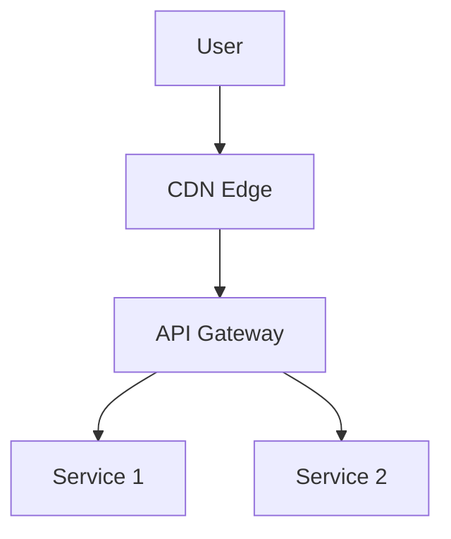

This layered approach gives you the best of both worlds: low-latency static delivery and DDoS absorption at the CDN, with rich API management capabilities at the gateway.

---

## The Canonical Trace: What Happens When You Type `google.com`

This is the most asked networking interview question — and the best way to confirm you've absorbed everything in this chapter. Here's the journey, with approximate latencies from Chapter 1's reference table.

```
1. Browser checks its own cache for google.com           [~0 ms]
   - Browser cache → OS cache → /etc/hosts → resolver

2. DNS lookup (recursive resolver → root → TLD → auth)   [~20-120 ms]
   - Cached at every layer; only the first user pays full cost
   - Returns: 142.250.190.78 (an A record)
   - With Anycast + Geo-DNS, you usually hit a regional answer

3. TCP three-way handshake to that IP on port 443        [~1 RTT, ~50-150 ms cross-continent]
   - Client: SYN
   - Server: SYN-ACK
   - Client: ACK
   - Connection established

4. TLS handshake (HTTPS)                                  [~1-2 more RTTs]
   - Client Hello with supported ciphers
   - Server presents certificate (verified via PKI)
   - Symmetric session key negotiated
   - Modern TLS 1.3 + session resumption: as little as 0-RTT

5. HTTP request                                           [1 RTT for round trip]
   - GET / HTTP/2
   - Host: google.com
   - Cookie: ...
   - May actually hit a CDN / Anycast edge, not the origin

6. Server processes the request                           [variable]
   - Load balancer routes to an app server
   - App server queries DB / cache / other services
   - Composes response

7. HTTP response streams back                              [bandwidth-bound]
   - 200 OK, Content-Type: text/html
   - HTML body (usually compressed: gzip / brotli)

8. Browser parses HTML, discovers subresources             [~10-50 ms]
   - CSS, JS, images, fonts → each may trigger more DNS + TCP + TLS + HTTP
   - But HTTP/2 multiplexes them over the same connection

9. Browser renders the page                                [~50-500 ms depending on JS]
```

**Where the latency budget goes** (typical 200 ms page load):

| Phase                              | Approx. cost           |
|------------------------------------|------------------------|
| DNS lookup (uncached)              | 20-120 ms              |
| TCP handshake (cross-continent)    | 50-150 ms              |
| TLS handshake                      | 50-200 ms              |
| First-byte time (server processing)| 50-300 ms              |
| Content download                   | bandwidth-dependent    |
| Render                             | 50-500 ms              |

> **Designers' lesson:** the first 4 phases (DNS → TCP → TLS) are *all network round trips*. The only way to make them cheaper is to **be closer to the user** (CDN, Anycast, edge compute). This is why CDNs aren't just "a cache for images" — they cut hundreds of milliseconds off every interaction.

> **HTTP/2 and HTTP/3 changes:** HTTP/2 multiplexes many requests on one TCP connection (no more head-of-line blocking from multiple connections). HTTP/3 replaces TCP with QUIC (over UDP) to eliminate even the TCP handshake delay on reconnects. We'll cover these in Chapter 3.

---

## Combined Tips & Tricks for System Design Interviews

A consolidated master list, drawn from across all sections.

### General Networking Tips

- **Always clarify requirements.** Ask about traffic volume, latency tolerance, security needs, etc.
- **Draw diagrams.** Visuals help communicate architecture clearly.
- **Discuss trade-offs.** E.g., stateful vs. stateless, Layer 4 vs. Layer 7 load balancers.
- **Plan for failure.** Include redundancy, failover, and fallback mechanisms.
- **Mention scalability strategies.** Use CDNs, load balancers, and microservices.
- **Highlight security.** Propose private IPs, reverse proxies, API gateways, and SSL.
- **Know your tools.** Be familiar with NGINX, HAProxy, AWS/GCP/Azure networking options, Cloudflare, etc.
- **Practice with real-world scenarios.** E.g., *"How would you design a scalable chat app like WhatsApp?"*
- **Understand protocol choices:** HTTP for RESTful APIs, WebSockets for real-time, gRPC for high-performance RPC, etc. (See Ch. 3.)
- **Monitor and log all networking layers** — from DNS queries to API gateway access — for proactive troubleshooting.

### IP-Specific Tips

- Know the standard private IP ranges (10.x.x.x, 172.16-31.x.x, 192.168.x.x).
- Use private IPs internally; expose only what's necessary via public IPs.
- Mention NAT for IPv4; mention IPv6 as the future direction.

### DNS-Specific Tips

- Set appropriate TTLs (short for changing, long for stable).
- Use multiple DNS providers for redundancy.
- Leverage Anycast for global scale.
- Implement DNSSEC.

### Client-Server Tips

- Prefer stateless servers for scalability.
- Use HTTPS everywhere.
- Choose the right protocol for the use case.
- Plan for graceful degradation.

### Proxy Tips

- Use reverse proxies for SSL termination, load balancing, and security.
- Don't expose backend servers directly.
- Remember: forward proxy = client-side; reverse proxy = server-side.

### Load Balancer Tips

- Always enable health checks.
- Use sticky sessions only if session state requires it.
- Terminate SSL at the load balancer.
- Integrate auto-scaling.
- Add rate limiting at the LB or API Gateway.

### API Gateway Tips

- Use JWT/OAuth2 for auth.
- Implement rate limiting.
- Aggregate requests (API composition) to reduce roundtrips.
- Monitor logs for anomalies.

### CDN Tips

- Set appropriate cache headers.
- Use versioned asset filenames to avoid stale caches.
- Purge carefully.
- Enable compression and minification.
- Monitor edge cache hit ratio.

---

## Sample Interview Questions

A consolidated list from all sections.

### Foundations

- Walk through what happens when you type `google.com` in your browser. (Tests: DNS, client-server, proxies, load balancer.)
- What's the difference between public and private IPs? Why do we need both?
- How does NAT work and what problem does it solve?

### DNS

- Explain the DNS resolution process step by step.
- Authoritative vs. recursive DNS servers — what's the difference?
- How does DNS caching improve performance, and where does it happen?
- What is TTL, and what are the trade-offs of short vs. long TTLs?
- How does DNS-based load balancing work?
- What is DNS cache poisoning, and how is it mitigated?

### Client-Server

- What is the client-server model?
- Stateless vs. stateful servers — when to use each?
- How does a browser load a webpage end-to-end?
- How does WebSocket communication differ from REST?

### Proxies

- Forward vs. reverse proxy — what's the difference?
- When would you choose a reverse proxy?
- How does SSL termination work at a reverse proxy?

### Load Balancing

- What is load balancing and why does it matter?
- L4 vs. L7 — which would you choose for content-aware routing?
- Compare round-robin, least-connections, and IP hashing.
- How would you handle session persistence behind a load balancer?

### API Gateway

- What is an API gateway and how does it differ from a plain load balancer?
- How would you implement rate limiting and authentication in an API gateway?
- When does API aggregation help?

### CDN

- What is a CDN and how does it improve performance?
- Cache hit vs. cache miss — explain in the context of a CDN.
- How does a CDN provide DDoS protection?
- How would you design a CDN strategy for a video streaming platform?

---

## Summary

- Networking is foundational to system design — it enables communication, scalability, and security.
- **IP addresses** identify devices; IPv4 is widely deployed but limited, IPv6 is the future.
- **DNS** translates domain names to IP addresses and underpins load balancing, failover, and CDNs.
- **The client-server model** is the basis of nearly all distributed systems.
- **Proxies** (forward and reverse) sit between clients and servers for security, caching, and routing.
- **Load balancers** distribute traffic across servers for high availability and scalability.
- **API gateways** are centralized entry points for microservice APIs, handling auth, routing, rate limiting, and more.
- **CDNs** deliver content from edge locations close to users for fast, reliable, secure access.

These concepts not only help build robust real-world systems — they are also some of the most common topics in system design interviews. Mastering them gives you the vocabulary and mental models needed to attack everything in the rest of this course.

---

## Further Reading

**IP Addresses:**

- [IETF RFC 1918: Address Allocation for Private Internets](https://datatracker.ietf.org/doc/html/rfc1918)
- [What is IPv6? (Cloudflare)](https://www.cloudflare.com/learning/network-layer/what-is-ipv6/)
- [AWS VPC Documentation](https://docs.aws.amazon.com/vpc/latest/userguide/VPC_Subnets.html)

**DNS:**

- [RFC 1035: Domain Names Implementation and Specification](https://www.rfc-editor.org/rfc/rfc1035)
- [Google Public DNS Documentation](https://developers.google.com/speed/public-dns/docs/using)
- [DNSSEC](https://www.icann.org/resources/pages/dnssec-what-is-it-why-important-2019-03-05-en)

**Client-Server:**

- [Python http.server Documentation](https://docs.python.org/3/library/http.server.html)
- [MDN Web Docs: HTTP Overview](https://developer.mozilla.org/en-US/docs/Web/HTTP/Overview)

**Proxies:**

- [NGINX Reverse Proxy Documentation](https://docs.nginx.com/nginx/admin-guide/web-server/reverse-proxy/)
- [Squid Forward Proxy](http://www.squid-cache.org/)
- [Cloudflare: What is a Reverse Proxy?](https://www.cloudflare.com/learning/cdn/glossary/reverse-proxy/)

**Load Balancing:**

- [NGINX as a Load Balancer](https://docs.nginx.com/nginx/admin-guide/load-balancer/http-load-balancer/)
- [AWS Elastic Load Balancing](https://aws.amazon.com/elasticloadbalancing/)
- [HAProxy Documentation](https://www.haproxy.org/)
- [Kubernetes Ingress Controllers](https://kubernetes.io/docs/concepts/services-networking/ingress-controllers/)

**CDNs:**

- [Cloudflare CDN Docs](https://developers.cloudflare.com/cdn/)
- [AWS CloudFront](https://aws.amazon.com/cloudfront/)
- [Google Cloud CDN](https://cloud.google.com/cdn/)
- [Akamai CDN](https://www.akamai.com/)

---

**Next Up:** [Chapter 3 — Protocols (System Design Fundamentals) →](./3%20-%20Protocols%20(System%20Design%20Fundamentals).md). A deep dive into the protocols (TCP, UDP, HTTP, REST, WebSockets, gRPC, GraphQL) that power everything we discussed in this chapter.
