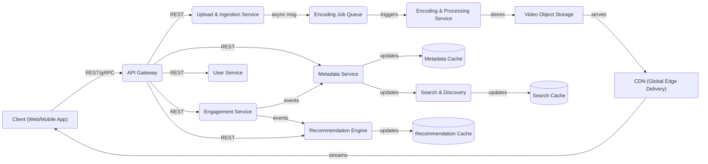
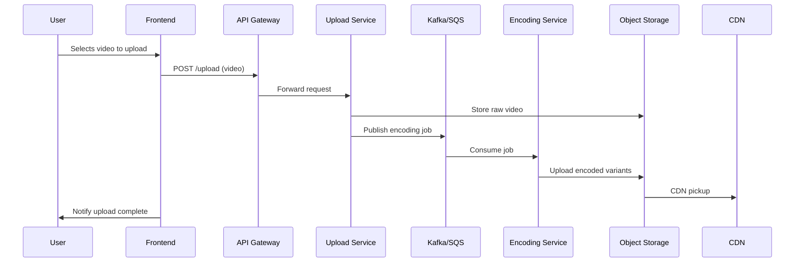
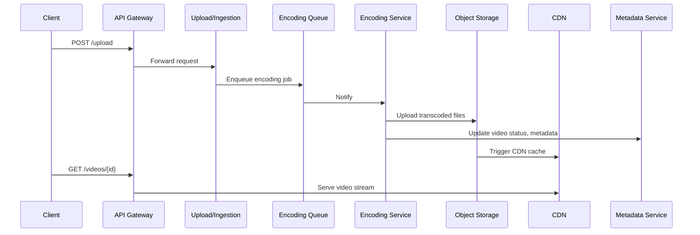

# Designing a Scalable Video Sharing Platform (YouTube)

In today's world, video sharing platforms like YouTube handle **hundreds of millions of users**, **billions of videos**, and **petabytes of daily traffic**. Building such a platform requires not only robust functional design, but also careful attention to scalability, performance, reliability, and cost.

In this case study, we'll walk through the **end-to-end architecture** of a modern video sharing platform — requirements, scale estimation, encoding pipeline, storage strategy, CDN delivery, real-time engagement, and recommendation systems.

---

## Learning Outcomes

After working through this case study, you'll be able to:

1. Design a **multi-resolution encoding pipeline** with HLS/DASH for adaptive streaming.
2. Choose between **VOD (video on demand) and live streaming** architectures.
3. Build a **view-counter** that handles 100K updates/sec without exploding the DB.
4. Reason about **CDN costs** and how to minimize them with tiered storage.
5. Outline a **recommendation engine** at a high level (candidate generation + ranking).

---

## Table of Contents

1. [What Are We Building?](#what-are-we-building)
2. [Functional Requirements](#functional-requirements)
3. [Non-Functional Requirements](#non-functional-requirements)
4. [Architecture Overview](#architecture-overview)
5. [Core Components](#core-components)
6. [Scale Estimation](#scale-estimation)
7. [Storage Estimation](#storage-estimation)
8. [Network & Bandwidth](#network--bandwidth)
9. [Bottlenecks & Solutions](#bottlenecks--solutions)
10. [Communication Patterns](#communication-patterns)
11. [End-to-End Upload Workflow](#end-to-end-upload-workflow)
12. [Encoding Pipeline](#encoding-pipeline)
13. [Storage Design](#storage-design)
14. [Database Schema](#database-schema)
15. [API Design](#api-design)
16. [Search & Recommendations](#search--recommendations)
17. [Tech Stack](#tech-stack)
18. [Security & Abuse Prevention](#security--abuse-prevention)
19. [Tips & Tricks](#tips--tricks)
20. [Conclusion](#conclusion)

---

## What Are We Building?

A platform where users can:

- **Upload and watch videos.**
- **Like, comment, and share.**
- **Search and browse content.**
- **Subscribe to channels.**
- **View personalized recommendations.**

### Core User Workflows

| Workflow              | Description                                                                                 |
|-----------------------|---------------------------------------------------------------------------------------------|
| **Upload a Video**    | Chunked upload → Processing (encoding, thumbnail) → Storage → Ready for playback            |
| **Watch a Video**     | Stream from CDN using adaptive bitrate (HLS/DASH) based on device/network                   |
| **Search & Browse**   | Filter and discover content by tags, categories, or popularity                              |
| **Engagement**        | Like, comment, share, subscribe — social actions that boost stickiness                      |

---

## Functional Requirements

1. **User registration and authentication** (OAuth2/JWT).
2. **Upload large video files** (chunked, resumable).
3. **Encode videos to multiple resolutions** (240p–4K).
4. **On-demand adaptive streaming** (HLS/DASH protocols).
5. **Metadata management** (title, description, tags, timestamps).
6. **Engagement tracking** (likes, comments, views, subscriptions).
7. **Powerful search & discovery.**
8. **Personalized home/feed** (recommendations).

---

## Non-Functional Requirements

- **Low latency streaming** (instant video start, smooth seek).
- **High availability** (24/7, geo-replicated, fault-tolerant).
- **Horizontal scalability** (support billions of videos/users).
- **Efficient storage & cost management** (tiered, object storage).
- **Global delivery** (CDN-backed, regional routing).
- **Security and abuse prevention** (secure uploads, spam/copyright/DoS filters).

---

## Architecture Overview

### High-Level Block Diagram

```
[Client Apps]
     |
     v
[API Gateway] <--------> [User Service]
     |                      |
     |                      +----> [Engagement Service]
     |                      |
     v                      +----> [Metadata Service]
[Upload & Ingestion]------> [Encoding Pipeline]-----> [Blob Storage/S3/GCS]---> [CDN]
     |
     +----> [Event Queue (Kafka/SQS)] ------> [Async Processing]
     |
     +----> [Search & Discovery] <----> [Recommendation Engine]
```

### Mermaid Architecture

```mermaid
flowchart TD
    Client-->|REST/HTTP|APIGateway
    APIGateway-->|POST /upload|Ingestion
    Ingestion-->|Event|Encoding
    Encoding-->|Store|ObjectStorage
    ObjectStorage-->|CDN sync|CDN
    APIGateway-->|GET /videos/{id}|MetadataService
    APIGateway-->|POST /like|EngagementService
    EngagementService-->|Event Bus|AnalyticsService
    APIGateway-->|GET /search|SearchService
    MetadataService-->|DB|MetadataDB
    EngagementService-->|DB|EngagementDB
    SearchService-->|Index|SearchIndex
    RecommendationEngine-->|Feed|APIGateway
```

A more detailed view:



---

## Core Components

| Component                 | Role                                                                                       |
|---------------------------|---------------------------------------------------------------------------------------------|
| **API Gateway**           | Entry point; routes requests, enforces authentication, rate-limits, logs                    |
| **Upload & Ingestion**    | Handles file uploads, stores temp files, triggers encoding jobs via queue                   |
| **Encoding Service**      | Transcodes video to multiple resolutions, generates thumbnails, prepares HLS/DASH manifests |
| **Video Storage & CDN**   | Stores video blobs; CDN serves videos globally with low latency                             |
| **Metadata Service**      | Stores video info (title, tags), provides mapping between ID and location                   |
| **User Service**          | Manages user profiles, authentication, subscriptions                                        |
| **Engagement Service**    | Tracks views, likes, comments, anti-abuse logic, async event logging                        |
| **Search & Discovery**    | Real-time search for videos/channels using tags, titles, trends                             |
| **Recommendation Engine** | Personalizes feeds using behavior, collaborative filtering, ML models                       |
| **Caches**                | Redis/Memcached for metadata, recommendations, search fast-paths                            |

---

## Scale Estimation

Designing for **100M users, 10M uploads/day, 500M daily views**.

| Metric                     | Assumption                                  |
|----------------------------|---------------------------------------------|
| Registered Users           | 100 million                                 |
| Daily Video Uploads        | 10 million                                  |
| Daily Video Views          | 500 million                                 |
| Daily Engagement Events    | 100 million (likes, comments, shares, etc.) |
| Average Video Length       | 10 minutes                                  |
| Video Metadata Size        | ~1 KB per video                             |
| Engagement Event Size      | ~500 bytes/event                            |

### Why These Numbers Matter

- **Authentication and Profile Management** must scale to millions of users.
- **Ingestion Pipeline** must handle concurrent uploads and multi-format transcoding.
- **Streaming** requires massive CDN bandwidth for half a billion daily views.
- **Storage** must efficiently handle raw and encoded video, plus metadata and engagement logs.
- **Metadata and Engagement** drive read/write loads and require real-time indexing.

---

## Storage Estimation

### Raw Video Storage

- **Average Upload:** 10 minutes × 5 MB/minute = **50 MB/video.**
- **Daily Uploads:** 10M × 50 MB = **500 TB/day** raw ingestion.
- **Temporary Buffer:** Retain for 30 days → **15 PB/month** rolling buffer.

### Encoded Versions

- **4-5 resolutions:** Storage multiplies ~3× (240p, 480p, 720p, 1080p).
- **Daily Storage:** 1.5 PB/day (including transcoded versions).
- **Monthly Storage:** 1.5 PB × 30 = **45 PB/month** (permanent, durable storage).

```python
def estimate_storage(avg_mb_per_video, uploads_per_day, days, encoding_multiplier):
    return avg_mb_per_video * uploads_per_day * encoding_multiplier * days / 1024 / 1024  # in PB

# 50 MB/video, 10 million uploads, 30 days, 3x (encoded)
permanent_storage_pb = estimate_storage(50, 10_000_000, 30, 3)
print(f"Estimated permanent storage: {permanent_storage_pb:.2f} PB")
# Output: Estimated permanent storage: 45.00 PB
```

---

## Network & Bandwidth

### Daily Video Streaming Egress

- **Active Users:** 100M × 3 videos/day = 300M video views.
- **Total Watch Time:** 300M × 10 min = 3B minutes = **50M hours/day.**
- **Average Streaming Rate:** 1 Mbps (~0.45 GB/hour).
- **Egress:** 50M hours × 0.45 GB = **22.5 PB/day.**
- (Note: Some assumptions push this higher; always sanity-check calculations.)

### Peak Load

- **Peak Concurrent Streams:** 10M users × 1 Mbps = **10 Tbps egress.**

### Metadata & Engagement Scale

- **Video Metadata:** 10M new rows/day (~1 KB each).
- **Engagement Events:** 100M/day (~500 bytes each) → ~50 GB/day.
- **Indexing:** Real-time updates for search and feed freshness.
- **Read Patterns:** Hot content triggers thousands of queries/sec.

---

## Bottlenecks & Solutions

| Area             | Bottleneck / Challenge                            | Solution(s)                                                |
|------------------|---------------------------------------------------|------------------------------------------------------------|
| Storage          | Petabyte-scale video & variants                   | Tiered blob storage; lifecycle policies; cold storage      |
| Processing       | Encoding 10M uploads/day × multi-res              | Autoscaling GPU workers; distributed queue (Kafka/SQS)     |
| Network/CDN      | 100s of PB egress, 10M concurrent streams         | Global CDN, edge caching, adaptive bitrate streaming       |
| Engagement Data  | 100M+ writes/day, real-time analytics/aggregation | Event queues, sharded counters, async aggregation          |
| Search/Discovery | Real-time indexing, high QPS                      | Distributed search (Elasticsearch), in-memory cache        |

---

## Communication Patterns

A **hybrid model** ensures both responsiveness and scalability.

- **Synchronous (REST/gRPC):** For real-time interactions (metadata fetch, user info, search).
  - Client ↔ API Gateway: REST (OAuth2/JWT secured).
  - Service ↔ Service: gRPC favored for speed and type safety.
- **Asynchronous (Event Bus/Queue):** For background processing (uploads, encoding, engagement).
  - Video upload triggers an event; encoding processes queue asynchronously.
  - Engagement events (like, comment) flow into analytics.

---

## End-to-End Upload Workflow

1. **User initiates upload:** Client app sends `POST /upload` (chunked upload) to API Gateway.
2. **Upload & ingestion:** API Gateway routes to Upload Service, which temporarily stores the video. Generates a unique `video_id`. Triggers encoding job via Encoding Job Queue.
3. **Encoding & processing:** Encoding Service picks up the job, transcodes to multiple formats (240p–4K). Generates thumbnails, manifests (HLS/DASH), stores in Object Storage.
4. **Final storage & CDN:** Processed video uploaded to object storage. CDN automatically ingests for global edge serving.
5. **Metadata update:** Metadata Service stores video title, description, tags, uploader, status. Updates search index and caches.
6. **Ready for search/playback:** User can now search for the video, view recommendations, or play.
7. **Engagement tracking:** Likes, comments, views are sent as async events to Engagement Service.

### Sequence Diagram



A simpler version focusing on the metadata-update path:



---

## Encoding Pipeline

### Async Trigger (Pseudocode)

```python
def handle_upload(file, metadata):
    video_id = generate_id()
    store_temp(file, video_id)
    publish_event("encoding_requested", {"video_id": video_id, /* ... */})
```

### Encoding Job Queue (Python + SQS + ffmpeg)

```python
import boto3
import subprocess
import json

sqs = boto3.client('sqs')
QUEUE_URL = 'https://sqs.us-west-2.amazonaws.com/123/video-encode'

def process_jobs():
    while True:
        messages = sqs.receive_message(QueueUrl=QUEUE_URL, MaxNumberOfMessages=1)
        for msg in messages.get('Messages', []):
            job = json.loads(msg['Body'])
            video_path = download_temp_file(job['temp_url'])
            for res in [240, 480, 720, 1080]:
                out_path = f'/tmp/{job["video_id"]}_{res}p.mp4'
                subprocess.run(['ffmpeg', '-i', video_path, '-s', f'{res}x{res//9*16}', out_path])
                upload_to_s3(out_path, f'videos/{job["video_id"]}/{res}p.mp4')
            update_metadata(job['video_id'], status='READY')
            sqs.delete_message(QueueUrl=QUEUE_URL, ReceiptHandle=msg['ReceiptHandle'])
```

### Kafka Producer/Consumer (Node.js)

```js
// Upload Service: publish encoding job
producer.send({
  topic: 'video-uploads',
  messages: [
    { key: videoId, value: JSON.stringify({ videoId, tempLocation }) }
  ]
});

// Encoding Service: subscribe to encoding jobs
consumer.subscribe({ topic: 'video-uploads' });
consumer.run({
  eachMessage: async ({ message }) => {
    const job = JSON.parse(message.value);
    await transcodeAndStore(job.videoId, job.tempLocation);
  }
});
```

---

## Storage Design

### Video Files

- **Object storage:** AWS S3, Google Cloud Storage, Azure Blob.
- **CDN:** Cloudflare, Akamai, AWS CloudFront for global edge caching.

### Metadata & Engagement

- **Relational DB:** PostgreSQL/MySQL for structured metadata.
- **NoSQL:** MongoDB for flexible user preferences, recommendations.
- **Cache:** Redis/Memcached for hot data (sessions, metadata).

### Data Storage Decisions

| Data Type       | Storage Layer                | Tech Examples                  |
|-----------------|------------------------------|--------------------------------|
| Video Files     | Object Storage + CDN         | AWS S3, GCS + Cloudflare       |
| Metadata        | Relational DB & Cache        | PostgreSQL/MySQL, Redis        |
| User Profiles   | Relational/NoSQL DB          | PostgreSQL, MongoDB            |
| Engagement Data | Event Queue + NoSQL/Cache    | Kafka/SQS, Redis, Cassandra    |
| Search Index    | Distributed Search Engine    | Elasticsearch, Meilisearch     |

---

## Database Schema

A simplified relational schema (PostgreSQL):

```sql
-- Videos (simple)
CREATE TABLE videos (
  video_id UUID PRIMARY KEY,
  user_id UUID REFERENCES users(user_id),
  title VARCHAR(200),
  description TEXT,
  upload_date TIMESTAMP,
  status VARCHAR(20),
  thumbnail_url TEXT
);
```

A more complete schema:

```sql
-- Users
CREATE TABLE users (
    user_id SERIAL PRIMARY KEY,
    email VARCHAR(255) UNIQUE NOT NULL,
    username VARCHAR(64) UNIQUE NOT NULL,
    password_hash VARCHAR(255) NOT NULL,
    join_date TIMESTAMP DEFAULT NOW(),
    profile_picture TEXT
);

-- Videos
CREATE TABLE videos (
    video_id SERIAL PRIMARY KEY,
    user_id INT REFERENCES users(user_id),
    title VARCHAR(255),
    description TEXT,
    upload_date TIMESTAMP DEFAULT NOW(),
    status VARCHAR(32),
    thumbnail_url TEXT
);

-- Likes
CREATE TABLE likes (
    like_id SERIAL PRIMARY KEY,
    user_id INT REFERENCES users(user_id),
    video_id INT REFERENCES videos(video_id),
    timestamp TIMESTAMP DEFAULT NOW()
);

-- Comments
CREATE TABLE comments (
    comment_id SERIAL PRIMARY KEY,
    video_id INT REFERENCES videos(video_id),
    user_id INT REFERENCES users(user_id),
    comment_text TEXT,
    timestamp TIMESTAMP DEFAULT NOW()
);

-- Watch History
CREATE TABLE watch_history (
    history_id SERIAL PRIMARY KEY,
    user_id INT REFERENCES users(user_id),
    video_id INT REFERENCES videos(video_id),
    watch_timestamp TIMESTAMP DEFAULT NOW()
);

-- Video Analytics (aggregated)
CREATE TABLE video_analytics (
    video_id INT REFERENCES videos(video_id),
    views BIGINT,
    likes BIGINT,
    shares BIGINT,
    dislikes BIGINT,
    comments_count BIGINT,
    PRIMARY KEY (video_id)
);
```

---

## API Design

### REST Endpoints

| Endpoint                | Method | Description                          |
|-------------------------|--------|--------------------------------------|
| `/api/register`         | POST   | User registration                    |
| `/api/login`            | POST   | Issue JWT token                      |
| `/api/upload`           | POST   | Initiate video upload (chunked)      |
| `/api/videos/{id}`      | GET    | Fetch video metadata & stream URLs   |
| `/api/like`             | POST   | Like a video                         |
| `/api/search`           | GET    | Search videos by keyword/tags        |

### Upload (with JWT)

```http
POST /api/upload
Authorization: Bearer <token>
Content-Type: multipart/form-data
Body: { video_file, title, description }

200 OK
{
  "video_id": "abc123",
  "status": "processing"
}
```

### JWT Authentication Middleware (Express.js)

```js
const jwt = require('jsonwebtoken');

app.post('/api/upload', authenticateJWT, (req, res) => {
  // Handle video upload
});

function authenticateJWT(req, res, next) {
  const token = req.headers.authorization?.split(' ')[1];
  if (token) {
    jwt.verify(token, process.env.JWT_SECRET, (err, user) => {
      if (err) return res.sendStatus(403);
      req.user = user;
      next();
    });
  } else {
    res.sendStatus(401);
  }
}
```

### Express Upload Endpoint (Multer)

```js
const express = require('express');
const multer = require('multer');
const upload = multer({ dest: 'uploads/' });
const app = express();

app.post('/api/upload', upload.single('video'), (req, res) => {
  // Process file, trigger encoding, etc.
  res.json({ status: 'uploaded', file: req.file });
});
```

### React Video Upload Component

```jsx
import React, { useState } from "react";

function VideoUpload() {
  const [file, setFile] = useState(null);

  const handleChange = (e) => setFile(e.target.files[0]);
  const handleSubmit = async (e) => {
    e.preventDefault();
    const formData = new FormData();
    formData.append('video', file);
    await fetch('/api/upload', { method: 'POST', body: formData });
  };

  return (
    <form onSubmit={handleSubmit}>
      <input type="file" onChange={handleChange} accept="video/*" />
      <button type="submit">Upload</button>
    </form>
  );
}
```

### JWT Issue Example

```js
const jwt = require('jsonwebtoken');
const token = jwt.sign({ userId: 123 }, 'SECRET', { expiresIn: '1h' });
```

---

## Search & Recommendations

- **Real-time indexing:** As soon as videos are uploaded, metadata is indexed for search.
- **Distributed search infra:** Use Elasticsearch for sharded, full-text, and filtered queries.
- **Caching:** Hot queries/results (trending, popular) cached in Redis.
- **Recommendation engine:** Personalizes feeds using behavior data and collaborative filtering.

### Search API Endpoint (Node.js / Express + Elasticsearch)

```js
app.get('/search', async (req, res) => {
  const query = req.query.q;
  const results = await elastic.search({
    index: 'videos',
    body: {
      query: {
        multi_match: {
          query, fields: ['title', 'description', 'tags']
        }
      }
    }
  });
  res.json(results.hits.hits);
});
```

---

## Tech Stack

| Layer            | Suggested Tech                    | Why                                                  |
|------------------|-----------------------------------|------------------------------------------------------|
| Frontend         | React.js / Vue.js                 | Component-based, modular, responsive UIs             |
| Backend          | Node.js + Express                 | Asynchronous, scalable for high concurrency          |
| Video Storage    | AWS S3 / GCS, multi-region        | Scalable, durable object storage                     |
| CDN              | Cloudflare / CloudFront           | Global, low-latency streaming via edge caching       |
| DB (Metadata)    | PostgreSQL / MySQL                | ACID compliance, structured relational data          |
| DB (NoSQL)       | MongoDB                           | Schema-less, flexible for user prefs/recommendations |
| Search           | Elasticsearch / Meilisearch       | Sharded full-text & filtered queries                 |
| Event Processing | Kafka / SQS                       | Decoupling, async processing                         |
| Orchestration    | Kubernetes                        | Automated deployment, scaling                        |
| Auth             | OAuth2 / JWT                      | Modern, secure, token-based, stateless               |

---

## Security & Abuse Prevention

- **Authentication:** OAuth2/JWT for all client requests.
- **Secure uploads:** Signed URLs for direct client uploads to storage.
- **Rate limiting:** API Gateway enforces per-user/IP quotas.
- **Abuse detection:** Asynchronous moderation jobs for spam/copyright/explicit content.

---

## Beyond MVP — What a Senior Designer Adds

### Adaptive Bitrate Streaming (HLS / DASH)

You don't actually serve one video file — you serve a **manifest** that points to many short segments (~6s each) at multiple bitrates (240p, 480p, 720p, 1080p, 4K). The player picks the bitrate based on the user's network speed and switches mid-stream as conditions change.

- **HLS** (HTTP Live Streaming): Apple's standard. Manifest is `.m3u8`, segments are `.ts`.
- **DASH** (Dynamic Adaptive Streaming over HTTP): MPEG standard. Manifest is `.mpd`, segments are `.m4s`.

Both are HTTP-based — work over CDNs, no special protocols needed.

### View Counter at Scale

A naive `UPDATE videos SET view_count = view_count + 1` on every view = lock contention disaster.

**Pattern:**

1. Each view → emit event to Kafka.
2. Worker buckets events into 1-minute windows and increments a Redis counter.
3. Background job rolls Redis counters into the DB every N minutes.
4. The "view count" shown to users is read from Redis (eventually consistent, that's fine).

This easily handles 100K+ views/sec without the DB ever seeing single-row contention.

### VOD vs Live Streaming

Most of this chapter is VOD (encode once, serve forever). Live is different:

- Ingest via RTMP (legacy) or WebRTC/SRT (modern low-latency).
- Real-time transcoding to multiple bitrates.
- Manifest updated continuously as new segments are produced.
- Latency: 10-30 seconds for traditional HLS; <1 second for low-latency HLS / WebRTC.

### Recommendation Engine (At a Glance)

Two-stage system used by all major platforms:

1. **Candidate generation:** from billions of videos, pick ~1000 candidates the user *might* like. Uses collaborative filtering, embeddings, or knowledge graphs. Optimized for recall, not precision.
2. **Ranking:** score the 1000 candidates with a heavier ML model (deep neural net considering user features, video features, freshness, watch-time priors). Returns top 20.

Total budget: ~100ms end-to-end. Candidate generation does most of the work.

### Content ID (Copyright Detection)

YouTube famously runs uploaded videos against a fingerprint database (Shazam-like, but for video + audio). Matches trigger monetization claims, restrictions, or takedowns.

**Pattern:** extract audio/video fingerprints offline; index in a specialized DB (Annoy, FAISS for embeddings). On upload, fingerprint the new video, query the index, evaluate matches against business rules.

### Cost Optimization (Storage Lifecycle)

A 4-year-old video with 12 lifetime views shouldn't sit on "hot" SSD. Move it to cheaper tiers:

- **Hot (last 30 days, popular):** S3 Standard / regional SSDs. Fast first byte.
- **Warm (30-365 days, occasional views):** S3 Standard-IA, slower but cheaper.
- **Cold (>1 year, rare views):** S3 Glacier, minutes-to-restore. Acceptable for long-tail.

Lifecycle policies automate the transitions. Done right, **storage costs can drop 5-10×.**

### Live Chat (for Live Streams)

Real-time chat overlay on live streams hits a different scaling problem than the video itself. 100K concurrent chatters all writing → all watchers receiving = huge fan-out.

**Pattern:** chat is its own service (separate from video). Pub/Sub (Redis Streams or Kafka) for fan-out. Aggressively shard by stream_id.

---

## Tips & Tricks

### System Design Approach

1. **Start with the user journey.** Map out core workflows before jumping to tech.
2. **Quantify everything.** Estimate users, uploads, storage, bandwidth.
3. **Prioritize non-functional requirements.** Latency, availability, and scalability drive your infra decisions.
4. **Always draw diagrams.** Even ASCII diagrams help clarify your architecture in interviews.

### Architecture

5. **Embrace asynchronous processing.** Use queues for uploads, encoding, and engagement events.
6. **Decouple processing with queues.** All heavy processing (like encoding) should be async via queues.
7. **Horizontal scalability is key.** Design every stateless service to scale horizontally.
8. **Always separate hot and cold paths.** Use object storage and CDN for hot content; move old/rarely accessed videos to cold storage.
9. **Separate reads and writes:** Employ CQRS for heavy analytics.

### Storage & Delivery

10. **Use tiered storage.** Hot/warm/cold storage cuts costs for older/less-viewed content.
11. **Leverage CDNs.** Global delivery isn't optional for video at scale.
12. **CDN cache invalidation.** When a video is updated, trigger CDN cache purge.
13. **Secure video URLs:** Use signed URLs with short TTL for playback links.

### Encoding

14. **Autoscale encoding.** Use Kubernetes jobs with GPU support for parallel encoding.
15. **Chunked uploads.** For large files, implement chunked uploads (Tus or S3 multipart) — resumable & prevents server overloads.

### Engagement

16. **Sharded counters.** For views/likes, use sharded counters to avoid single-point bottlenecks.
17. **Async aggregation.** Aggregate stats like views and likes in the background, not on write path.
18. **Eventual consistency.** Not all counters (views, likes) need strong consistency.
19. **Batch & shard engagement data.** Process in batches, store in sharded stores.

### Search & Discovery

20. **Real-time indexing.** Use event-driven updates (Kafka → Elasticsearch) for instant searchability.
21. **Search optimization:** Use Elasticsearch or Meilisearch with real-time indexing.

### Performance

22. **Cache aggressively.** Use Redis/Memcached for hot metadata, search results, personalized feeds.
23. **Optimize for hot content.** Pre-cache popular videos and metadata; use CDN edge prefetching.

### Operations

24. **Cold storage policies.** Automatically move old, rarely accessed videos to cheaper storage.
25. **Monitoring & autoscaling.** Track ingestion, processing, and streaming metrics. Use cloud-native autoscaling.
26. **Abuse prevention.** Rate limit at API Gateway, moderate comments via ML models, filter uploads for spam/content violations.
27. **API versioning.** Plan for forward/backward compatibility.
28. **Data consistency.** Use eventual consistency for engagement; strict consistency for user auth and metadata.

### Reliability

29. **Schema design matters.** Plan for append-only and high-write tables. Use time-based or hash-based sharding.
30. **Prepare for failure.** Graceful degradation: even if encoding or recommendation fails, the rest of the platform should function.

---

## Conclusion

By combining **microservices**, **object storage**, **CDN**, **caching**, and **event-driven processing**, this architecture ensures that your video sharing platform will be **scalable, reliable, and performant.** Each service is easily maintainable, independently deployable, and can scale to billions of videos and users.

Whether preparing for a system design interview or architecting a real-world solution, remember: **modularity, decoupling, and scalability** should drive your design decisions.

---

## Further Reading

- [YouTube Architecture (High Scalability)](http://highscalability.com/blog/2012/3/12/you-tube-architecture.html)
- [YouTube Architecture 101](https://www.infoq.com/articles/YouTube-Architecture/)
- [AWS Reference: Video Streaming at Scale](https://aws.amazon.com/solutions/case-studies/video-streaming/)
- [AWS Video on Demand Solution](https://aws.amazon.com/solutions/implementations/video-on-demand-on-aws/)
- [CDNs Explained](https://www.cloudflare.com/learning/cdn/what-is-a-cdn/)
- [Microservices Patterns](https://microservices.io/)

---

**Next Up:** [Chapter 21 — Design a Search Engine (Google) →](./21%20-%20Design%20a%20Search%20Engine(aka%20Google).md)
