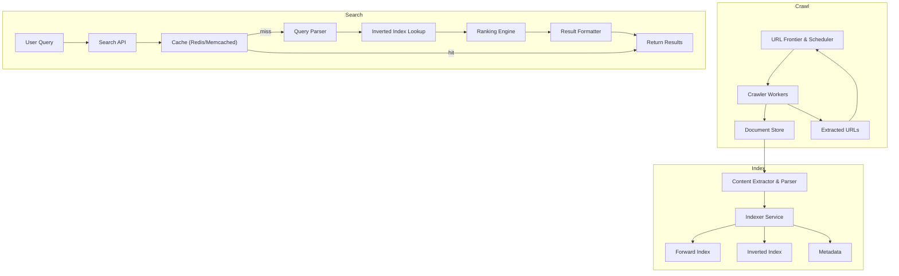
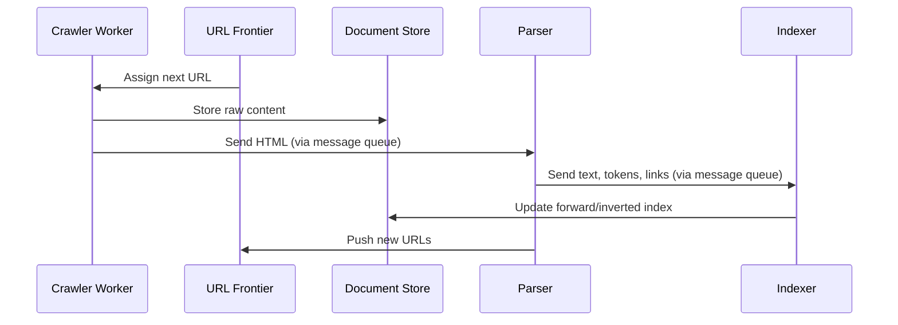
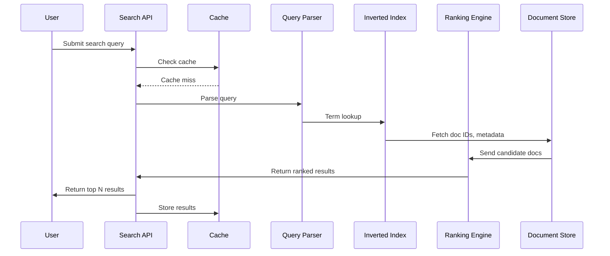

# Designing a Large-Scale Search Engine (Google)

Building a search engine is one of the pinnacles of system design — where distributed computing, data engineering, and algorithmic ranking collide.

In this case study, we'll walk through designing a search engine from first principles: crawling, indexing, ranking, querying. We'll cover architecture, scale estimation, bottlenecks, sample code (SimHash dedup, inverted index, TF-IDF, PageRank), and infrastructure decisions.

---

## Learning Outcomes

After working through this case study, you'll be able to:

1. Design a **distributed crawler** that respects politeness and avoids hammering sites.
2. Build an **inverted index** that scales to billions of documents via sharding.
3. Combine **TF-IDF + PageRank + freshness + ML signals** into a ranking function.
4. Implement **autocomplete** with sub-100ms latency at scale.
5. Outline the difference between **lexical search** (keywords) and **semantic search** (embeddings/vector DB).

---

## Table of Contents

1. [What Are We Building?](#what-are-we-building)
2. [Functional Requirements](#functional-requirements)
3. [Non-Functional Requirements](#non-functional-requirements)
4. [Architecture Overview](#architecture-overview)
5. [Core Components](#core-components)
6. [Scale Estimation](#scale-estimation)
7. [Bottlenecks & Solutions](#bottlenecks--solutions)
8. [Data & Indexing Architecture](#data--indexing-architecture)
9. [End-to-End Workflow](#end-to-end-workflow)
10. [Data Models](#data-models)
11. [Component Deep Dives & Code](#component-deep-dives--code)
12. [Ranking Algorithms](#ranking-algorithms)
13. [Tech & Infrastructure Decisions](#tech--infrastructure-decisions)
14. [Scaling & Fault Tolerance](#scaling--fault-tolerance)
15. [Tips & Tricks](#tips--tricks)
16. [Conclusion](#conclusion)

---

## What Are We Building?

**Goal:** A search engine that can crawl and index billions of web pages, serve keyword-based queries in real-time, and keep results fresh and relevant.

**Key users:**

- **General users:** Seeking fast, relevant search results.
- **Internal analytics teams:** Querying data for insights and improvements.

---

## Functional Requirements

| #   | Component       | Description                                                          |
|-----|-----------------|----------------------------------------------------------------------|
| 1   | Web Crawling    | Discover and fetch web pages at internet scale.                      |
| 2   | Indexing        | Extract, normalize, and structure text for fast querying.            |
| 3   | Keyword Search  | Accept keyword queries; retrieve relevant documents.                 |
| 4   | Ranking         | Score and sort results by relevance (TF-IDF, PageRank, freshness).   |
| 5   | Re-indexing     | Periodically refresh index to keep content up-to-date.               |

---

## Non-Functional Requirements

- **Performance:** < 200ms query response time.
- **Scalability:** Billions of pages, 50,000 QPS.
- **Freshness:** Update index within hours of content changes.
- **Fault tolerance:** No single point of failure.
- **Storage efficiency:** Deduplication, compression for petabytes of data.

---

## Architecture Overview

### High-Level Component Diagram

```
+-------------------+        +----------------+        +--------------------+
|   User / API      |<------>|   Query Layer  |<------>|   Index Storage    |
+-------------------+        +----------------+        +--------------------+
         ^                            ^                        ^
         |                            |                        |
         v                            |                        |
+-------------------+        +----------------+        +--------------------+
|   Cache Layer     |        | Ranking Engine |        | Forward/Inverted   |
+-------------------+        +----------------+        | Indexes            |
         ^                            ^                +--------------------+
         |                            |
         v                            v
+-------------------+        +----------------+        +--------------------+
|  Crawler Service  |<------>| URL Frontier   |------->| Document Store     |
+-------------------+        +----------------+        +--------------------+
```

### Mermaid Architecture



### End-to-End Data Flow

```
   +----------+      +----------+      +----------+      +----------+
   |  Crawler |----->|  Parser  |----->| Indexer  |----->|  Storage |
   +----------+      +----------+      +----------+      +----------+
                                                |
                                                v
                                         +-------------+
                                         |  Query/API  |
                                         +-------------+
                                                |
                                                v
                                          +-----------+
                                          |  Ranking  |
                                          +-----------+
                                                |
                                                v
                                          +-----------+
                                          |   Cache   |
                                          +-----------+
                                                |
                                                v
                                         +------------+
                                         | User/Client|
                                         +------------+
```

---

## Core Components

| Component                  | Responsibility                                                                        |
|----------------------------|----------------------------------------------------------------------------------------|
| **Crawler Service**        | Fetches web pages, obeys rate limits & robots.txt.                                     |
| **URL Frontier & Scheduler**| Prioritizes next URLs to crawl. Manages politeness & domain partitioning.             |
| **Content Extractor & Parser**| Cleans HTML, extracts text, tokenizes, gets metadata/links.                         |
| **Indexer Service**        | Builds forward and inverted indexes, extracts ranking features.                        |
| **Inverted Index Store**   | Maps terms → docIDs for fast lookup.                                                   |
| **Forward Index**          | Maps docID → content/metadata for ranking and snippet formatting.                      |
| **Document Store**         | Stores raw & parsed content, metadata.                                                 |
| **Query Service**          | Parses incoming queries, fetches & ranks results.                                      |
| **Ranking Engine**         | Scores documents (TF-IDF, PageRank, freshness).                                        |
| **Search API**             | User-facing interface (UI/API gateway).                                                |
| **Cache**                  | In-memory hot query/result cache (Redis/Memcached).                                    |

---

## Scale Estimation

### Web Size

- **Indexed Pages:** 100+ billion (MVP: 100M).
- **Average Page Size:** 100 KB → 10 TB for 100M pages (raw); 3–5 TB tokenized.
- **Inverted Index:** ~500–800 GB.
- **Forward Index:** ~5 TB.
- **Metadata:** 100–200 GB.

### Traffic Load

- **Active users:** 10M.
- **Queries/user/day:** 5.
- **Total queries/day:** 50M.
- **Peak QPS:** 1,000–2,000 (with burst handling).
- **Read:Write Ratio:** 95:5.

### Crawling Throughput

- **Goal:** 100M pages in 7 days → ~170 pages/sec.
- **With 500 workers:** ~0.34 pages/sec/worker.

---

## Bottlenecks & Solutions

| Layer         | Bottleneck                          | Solution                                                  |
|---------------|-------------------------------------|-----------------------------------------------------------|
| Crawling      | Bandwidth, duplicate content        | Distributed crawling, deduplication, politeness            |
| Indexing      | Memory & I/O pressure               | Segment-based indexing, compression                        |
| Query         | Latency at high QPS                 | Sharded indexes, caching, in-memory lookups                |
| Storage       | Petabyte-scale data                 | Distributed FS (HDFS/S3), cold/hot separation              |
| Freshness     | High update frequency               | Adaptive re-crawling, prioritization                       |

---

## Data & Indexing Architecture

### Index Types

- **Inverted index** (term → list of docIDs): For fast keyword search.
- **Forward index** (docID → content/metadata): For efficient ranking and result formatting.

### Index Size Estimates (for 100M pages)

| Component       | Size         |
|-----------------|--------------|
| Raw HTML        | 10 TB        |
| Tokenized Text  | 3–5 TB       |
| Inverted Index  | 500–800 GB   |
| Forward Index   | 5 TB         |
| Metadata        | 100–200 GB   |

---

## End-to-End Workflow

### Crawling & Indexing Sequence



### Query Processing Sequence



### Query Processing Flow (Pseudocode)

```
function process_query(query):
    tokens = tokenize_and_normalize(query)
    candidate_docs = set()
    for token in tokens:
        candidate_docs |= inverted_index[token]
    scored_docs = rank(candidate_docs, query)
    return format_results(top_k(scored_docs))
```

### Search Flow With Caching

```python
def search(query):
    # 1. Check cache for hot query
    cached_result = redis.get(query)
    if cached_result:
        return cached_result

    # 2. Parse query and tokenize
    tokens = tokenize(query)

    # 3. Fetch relevant documents from inverted index
    doc_candidates = set()
    for token in tokens:
        doc_candidates |= inverted_index.get(token, set())

    # 4. Rank documents
    ranked_docs = ranker.rank(query, doc_candidates)

    # 5. Format result and cache
    results = format_results(ranked_docs)
    redis.set(query, results, ex=60)  # Cache for 1 minute

    return results
```

---

## Data Models

### Crawler URL Queue (Relational/NoSQL)

```sql
CREATE TABLE UrlQueue (
  url VARCHAR(1024) PRIMARY KEY,
  domain_hash INT,      -- For partitioning
  status ENUM('pending','processing','done','failed'),
  last_crawled TIMESTAMP,
  priority INT
);
```

### Forward Index (NoSQL)

```json
{
  "doc_id": "12345",
  "url": "https://example.com",
  "tokens": ["search", "engine", "design"],
  "metadata": {
    "title": "System Design of Search Engine",
    "pagerank": 0.42,
    "crawl_date": "2024-06-09"
  }
}
```

### Inverted Index (NoSQL)

```json
{
  "token": "search",
  "doc_ids": [
    {"doc_id": "12345", "positions": [1, 7], "tf": 2},
    {"doc_id": "67890", "positions": [3], "tf": 1}
  ]
}
```

### MongoDB Document

```json
{
  "_id": "docid123",
  "url": "https://example.com",
  "title": "Example Page",
  "content": "tokenized, normalized content",
  "links": ["https://another.com"],
  "last_crawled": "2024-06-07T13:00:00Z"
}
```

### Schema Summary

| Table         | Key Fields                       | Description                                 |
|---------------|----------------------------------|---------------------------------------------|
| UrlQueue      | url, priority, crawl_status      | Sharded, prioritized URL queue              |
| Documents     | docID, url, title, content       | Forward index, metadata, raw/parsed content |
| InvertedIndex | token, [docIDs], positions, freq | Token → docIDs mapping                      |

---

## Component Deep Dives & Code

### 1. Web Crawler Service

- **Role:** Continuously fetches web pages, respects robots.txt and rate limits.
- **Coordination:** Distributed workers pull from a sharded URL frontier.
- **Duplicate detection:** Uses content hashes/fingerprints.

```python
import requests
import hashlib

def fetch_url(url):
    resp = requests.get(url, timeout=3)
    content_hash = hashlib.sha256(resp.content).hexdigest()
    return resp.content, content_hash
```

A version with error handling and link extraction:

```python
import requests

def crawl_url(url):
    try:
        resp = requests.get(url, timeout=5)
        if resp.status_code == 200:
            save_raw_html(url, resp.text)
            links = extract_links(resp.text)
            add_links_to_frontier(links)
    except requests.RequestException as e:
        log_error(url, e)
```

### 2. URL Frontier & Scheduler

```python
from queue import PriorityQueue

url_frontier = PriorityQueue()
# url_frontier.put((-priority, url))  # Higher priority first
```

```python
def get_next_url():
    url = frontier_queue.pop()
    if obey_robots_txt(url):
        return url
    else:
        return get_next_url()
```

### 3. Content Extractor & Parser

```python
from bs4 import BeautifulSoup

def extract_content(html):
    soup = BeautifulSoup(html, 'html.parser')
    text = soup.get_text()
    links = [a['href'] for a in soup.find_all('a', href=True)]
    return text, links
```

### 4. Deduplication with SimHash

```python
import simhash

def is_duplicate(new_page_content, existing_hashes, threshold=3):
    new_hash = simhash.Simhash(new_page_content)
    for h in existing_hashes:
        if new_hash.distance(h) < threshold:
            return True
    return False
```

Simple hash-based deduplication:

```python
import hashlib

def is_duplicate(content, hash_set):
    content_hash = hashlib.md5(content.encode()).hexdigest()
    if content_hash in hash_set:
        return True
    hash_set.add(content_hash)
    return False
```

### 5. Indexer

```python
import nltk
from nltk.tokenize import word_tokenize
from nltk.corpus import stopwords

def tokenize_and_index(text, doc_id, inverted_index):
    tokens = word_tokenize(text.lower())
    tokens = [t for t in tokens if t.isalnum()]
    tokens = [t for t in tokens if t not in stopwords.words('english')]
    for token in tokens:
        inverted_index.setdefault(token, set()).add(doc_id)
```

Simple inverted index builder:

```python
from collections import defaultdict

def build_inverted_index(docs):
    index = defaultdict(list)
    for doc_id, content in docs.items():
        for word in set(content.split()):
            index[word].append(doc_id)
    return index

# Example usage
docs = {1: "search engine design", 2: "system design interview"}
inverted_index = build_inverted_index(docs)
print(inverted_index['design'])  # [1, 2]
```

A version using tokens:

```python
from collections import defaultdict

def build_inverted_index(docs):
    index = defaultdict(list)
    for doc_id, tokens in docs.items():
        for token in set(tokens):
            index[token].append(doc_id)
    return index
```

### 6. Indexing to Elasticsearch

```python
from elasticsearch import Elasticsearch

es = Elasticsearch("http://localhost:9200")

def index_document(doc_id, content):
    es.index(index="web_docs", id=doc_id, body={"content": content})
```

### 7. Search API (FastAPI)

```python
from fastapi import FastAPI, Query

app = FastAPI()

@app.get("/search")
def search(q: str):
    # 1. Parse query
    # 2. Lookup in inverted index
    # 3. Rank results
    # 4. Return as JSON
    pass
```

### 8. Search API With Cache

```python
from fastapi import FastAPI, Query
import redis

app = FastAPI()
cache = redis.Redis(host='localhost', port=6379)

@app.get("/search")
def search(q: str):
    cache_key = f"search:{q}"
    cached = cache.get(cache_key)
    if cached:
        return {"results": eval(cached), "source": "cache"}
    # Lookup, ranking, formatting
    results = ["Page1", "Page2", "Page3"]
    cache.set(cache_key, str(results), ex=60*10)  # Cache 10 min
    return {"results": results, "source": "live"}
```

### 9. Distributed Crawl Worker (Celery + Kafka)

```python
from celery import Celery

app = Celery('crawler', broker='kafka://localhost:9092')

@app.task
def fetch_url(url):
    # Respect robots.txt, handle rate limits, fetch HTML
    html = download_html(url)
    # Store to document store
    store_raw_content(url, html)
    # Extract links, push to Kafka for further crawling
    links = extract_links(html)
    for link in links:
        app.send_task('crawler.fetch_url', args=[link])
```

### 10. Caching Query Results (Redis)

```python
import redis

r = redis.Redis()

def search_query(query):
    cached = r.get(query)
    if cached:
        return cached
    results = perform_search(query)
    r.set(query, results, ex=300)  # Cache for 5 min
    return results
```

---

## Ranking Algorithms

### TF-IDF

```python
import math

def tfidf(term, doc, doc_freq, num_docs):
    tf = doc.count(term) / len(doc)
    idf = math.log(num_docs / (1 + doc_freq[term]))
    return tf * idf
```

A simpler variant:

```python
import math

def tf_idf(term, doc, corpus):
    tf = doc.count(term) / len(doc)
    idf = math.log(len(corpus) / (1 + sum(1 for d in corpus if term in d)))
    return tf * idf
```

### PageRank

```python
def pagerank(graph, d=0.85, num_iter=10):
    # graph: dict {url: [linked_urls]}
    N = len(graph)
    ranks = {url: 1/N for url in graph}
    for _ in range(num_iter):
        new_ranks = {}
        for url in graph:
            rank_sum = sum(ranks[other] / len(graph[other]) for other in graph if url in graph[other])
            new_ranks[url] = (1-d)/N + d * rank_sum
        ranks = new_ranks
    return ranks
```

### Combined Ranking

The Ranking Engine combines:

- **TF-IDF** for basic keyword relevance.
- **PageRank** for link-based authority.
- **Freshness score** for prioritizing recent content.

---

## Tech & Infrastructure Decisions

| Layer         | Tech Examples                       | Why                                                    |
|---------------|-------------------------------------|--------------------------------------------------------|
| Crawling      | Kafka, Celery, custom workers       | Scalable, resilient worker pools                       |
| Index Storage | MongoDB, DynamoDB, Elasticsearch    | NoSQL for flexible, fast lookups; full-text search     |
| Storage       | Object (S3/GCS) for raw; DFS for indexes | Petabyte-scale storage                            |
| Caching       | Redis, Memcached                    | Millisecond response for hot queries                   |
| Query API     | NGINX, AWS ALB                      | Load balancing, rate limiting                          |

### Key Design Decisions

1. **Sharded architecture:** Partition index by term hash for scalability.
2. **Replication:** Replicate index/data for fault tolerance.
3. **Segmented indexing:** Build indexes in segments to manage load and speed up merges.
4. **Distributed crawler:** Hash URLs by domain for politeness and parallelism.
5. **Caching:** Use Redis/Memcached for hot queries.
6. **Dual indexing:** Use both inverted (for search) and forward (for ranking/snippets) indexes.

---

## Scaling & Fault Tolerance

- **Horizontal partitioning:** Shard index and URL frontier by hash of domain or token.
- **Replication:** Store multiple copies for high availability.
- **Retry & failover:** Crawler and indexer workers reassign tasks on failure.
- **Asynchronous queues:** Decouple slow/fast components, buffer spikes, enable retry.
- **Load balancers:** Each service is fronted by a load balancer for high QPS.

---

## Beyond MVP — What a Senior Designer Adds

### Query Understanding (Beyond Keyword Match)

Real search doesn't just match keywords. It tries to *understand* the query:

- **Spell correction:** "harry poter" → "harry potter."
- **Synonyms:** "shoes" matches "footwear."
- **Stemming/lemmatization:** "running" matches "run."
- **Intent classification:** "weather tomorrow" needs the weather widget, not 10 blue links.
- **Entity recognition:** "tom hanks movies" identifies Tom Hanks as an entity, returns his filmography.

These all happen as a **query pre-processing pipeline** before hitting the index.

### Autocomplete (Sub-100ms is Hard)

The dropdown that appears as you type. Tricks to make it fast:

1. **Trie** structure of common queries — instant prefix lookup.
2. **Top-K cache** per prefix — pre-compute the top 10 completions for "syst", "syste", "system", etc.
3. **Personalization layer** — boost completions the user has searched before.
4. **Spell tolerance** — match "systm" to "system" prefixes.

Backed by Redis or in-memory tries. Total latency budget: typically <50ms.

### Lexical Search vs Semantic Search

Traditional search uses **lexical** matching — TF-IDF, BM25, exact tokens.

Modern search complements with **semantic** matching — embed query and documents as vectors, find nearest neighbors.

| Lexical                 | Semantic (Embeddings)                       |
|-------------------------|----------------------------------------------|
| Matches keywords        | Matches meaning ("dog" ≈ "puppy")            |
| Inverted index          | Vector index (Annoy, FAISS, Pinecone)        |
| Precise, predictable    | Surfaces conceptually similar results        |
| Bad at synonyms/intent  | Good at synonyms/intent                      |

**Modern search engines blend both:** lexical for high-precision exact matches, semantic for the long tail.

### Ranking Signals Beyond TF-IDF + PageRank

Real Google has hundreds of ranking signals. Common ones:

- **Freshness:** news queries prefer recent content.
- **Click-through rate** in past sessions for similar queries.
- **Dwell time:** users staying on the result = good signal.
- **Bounce-back:** users returning to search after clicking = bad signal.
- **Quality signals:** domain reputation, site engagement, content depth.
- **Personalization:** user's location, search history, preferences.
- **Spam signals:** keyword stuffing, link farming, cloaking detected and demoted.

These are blended in a **learning-to-rank** model — typically a gradient-boosted tree or neural net.

### Featured Snippets / Answer Boxes

For queries like "what's the capital of France?", a search engine extracts an answer directly from the top result and displays it as a card. Implementation:

1. Classify the query as "informational lookup."
2. Extract candidate answers from top-N documents.
3. Score and pick the best (length, source authority, freshness).
4. Render as a card above the regular results.

### Spam and Abuse Defense

The web is adversarial. Crawlers ingest content that wants to **manipulate** ranking:

- **Cloaking:** showing the crawler different content than users.
- **Link farms:** thousands of low-quality pages all linking to each other.
- **Keyword stuffing:** invisible text packed with target keywords.
- **AI-generated content farms** (post-2023 problem).

Defenses are ML-based: classifiers flag low-quality content, signal-based demotion, and manual review queues for the worst offenders.

---

## Tips & Tricks

### Crawling

- **Respect politeness:** Always honor `robots.txt` and crawl-delay to avoid bans.
- **Partition crawling by domain hash:** Avoid hammering single sites; simplify dedup.
- **Backoff strategies:** Exponential backoff for failed fetches.

### Deduplication & Storage

- **Deduplication:** Use SimHash or fingerprinting to prevent re-crawling same/similar content.
- **Deduplicate early:** Hash content to avoid storing/crawling duplicates.
- **Compression:** Store indexes using delta encoding, front-coding for space savings.
- **Cold/hot storage:** Archive old/rarely accessed docs to cheap storage; keep hot data in fast SSD.

### Indexing

- **Sharding is your friend:** Both crawling and indexing benefit from hashing and partitioning.
- **Segmented indexing:** Manage load and speed up merges.
- **Batch writes, stream reads:** Real-time indexing isn't always necessary — batch new docs, but serve queries in real-time.

### Queries

- **Cache aggressively:** Hot queries often account for a large chunk of load. Use Redis/Memcached.
- **Query caching:** Cache frequent/popular queries for instant retrieval.
- **Optimize for read-heavy workloads:** 95%+ of operations are reads.

### Freshness

- **Adaptive recrawling:** Prioritize high-change sites for freshness; use sitemaps/change-frequency signals.
- **Prioritize freshness:** Use content diffing and change-rate heuristics.

### Operations

- **Always design for peak, not average:** Base capacity planning on peak QPS.
- **Monitor everything:** Track crawl rates, index update lag, query latency in real time.
- **Async everywhere:** Decouple all slow/fast boundaries with queues.
- **Horizontal scaling:** Add more workers/nodes, not just CPU/RAM.
- **Graceful degradation:** If ranking fails, still return results; if cache fails, fall back to index.

---

## Conclusion

Designing a web-scale search engine is a tour-de-force in distributed systems, data engineering, and algorithmic ranking. By breaking the problem into manageable blocks — crawling, indexing, querying, ranking — and rigorously addressing scale, performance, and reliability, you can architect a system that not only works, but works at **web scale.**

By combining **distributed crawling, NoSQL document stores, real-time indexing, robust ranking, and cloud-based scaling**, you can build a search engine that's fast, scalable, and reliable.

---

## Further Reading

- [Google File System](https://research.google/pubs/pub51/)
- [MapReduce](https://research.google/pubs/pub62/)
- [Google's Original PageRank Paper](http://ilpubs.stanford.edu:8090/422/1/1999-66.pdf)
- [Elasticsearch Architecture](https://www.elastic.co/guide/en/elasticsearch/reference/current/index.html)
- [Elasticsearch: The Definitive Guide](https://www.elastic.co/guide/en/elasticsearch/guide/current/index.html)
- [Designing Data-Intensive Applications by Martin Kleppmann](https://dataintensive.net/)
- [How Search Engines Work](https://www.searchenginejournal.com/how-search-engines-work/)

---

**Next Up:** [Chapter 22 — Design an E-Commerce Platform (Amazon) →](./22%20-%20Design%20an%20E-Commerce%20Platform(aka%20Amazon).md)
