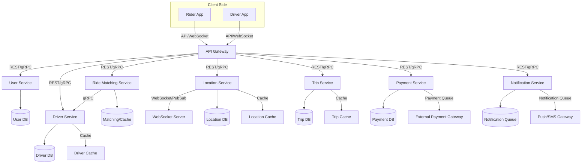
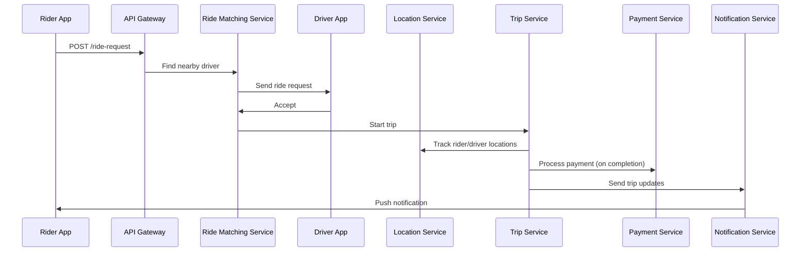
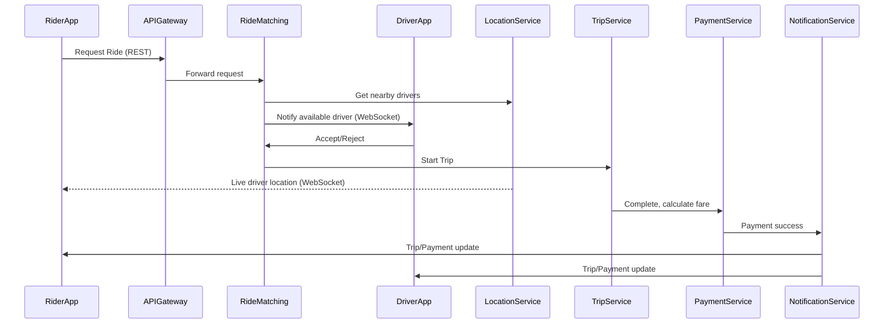

# Designing a Scalable Taxi Hailing App (Uber)

Welcome to this comprehensive walkthrough on how to design a taxi-hailing platform, inspired by industry leaders like Uber and Lyft. We'll cover everything from requirements to architecture, real-time communication, geospatial indexing, and scaling challenges.

Building a taxi-hailing platform like Uber isn't just about connecting drivers and riders. It's about managing **real-time communication**, **geolocation**, **payments**, and **scaling to millions of users** — all with stringent requirements for latency, reliability, and security.

---

## Learning Outcomes

After working through this case study, you'll be able to:

1. Use **geohash, S2, or H3** for fast spatial proximity queries.
2. Design **driver-rider matching** that handles 1M concurrent drivers without N² scans.
3. Implement **surge pricing** as a supply/demand signal in near-real-time.
4. Build **ETA prediction** that's better than naive Haversine + average speed.
5. Handle the **driver-disconnected, mid-trip** edge case gracefully.

---

## Table of Contents

1. [Understanding the Problem](#understanding-the-problem)
2. [Functional & Non-Functional Requirements](#functional--non-functional-requirements)
3. [Assumptions & Constraints](#assumptions--constraints)
4. [Real-Time, Mapping & System Challenges](#real-time-mapping--system-challenges)
5. [Estimating Scale & Usage](#estimating-scale--usage)
6. [Core Microservices Architecture](#core-microservices-architecture)
7. [API Gateway & Communication Patterns](#api-gateway--communication-patterns)
8. [End-to-End Ride Booking Flow](#end-to-end-ride-booking-flow)
9. [Real-Time Communication Design](#real-time-communication-design)
10. [Data Storage & Geospatial Indexing](#data-storage--geospatial-indexing)
11. [Strategic Tech & Infra Decisions](#strategic-tech--infra-decisions)
12. [Key Bottlenecks & Scaling Challenges](#key-bottlenecks--scaling-challenges)
13. [Sample Code](#sample-code)
14. [Tips & Tricks](#tips--tricks)
15. [Conclusion](#conclusion)

---

## Understanding the Problem

**Goal:** Build a scalable, reliable, and low-latency taxi-hailing platform to match millions of riders and drivers in real-time, process payments, and handle geo-location tracking.

**Core Focus Areas:**

- **Real-time matching** of riders and drivers.
- **Geo-location tracking.**
- **Payment processing.**
- **High concurrency and low latency support.**

> **Why is this hard?**
>
> - Needs real-time, low-latency, and highly available systems.
> - Involves seamless integration between mobile apps, backend services, and third-party APIs.

---

## Functional & Non-Functional Requirements

### Functional Requirements (MVP)

**Rider:**

- Sign up / login.
- Request a ride (source → destination).
- Track driver in real time.
- View ETA & trip progress.
- Pay via app.

**Driver:**

- Sign up / login.
- Go online/offline.
- Accept/reject ride requests.
- Navigate to pickup & drop-off.

**System:**

- Match riders with nearby available drivers.
- Handle real-time location updates.
- Update ride status (assigned, en route, completed).
- Calculate fares and process payments.

### Non-Functional Requirements

- **Scalability:** Handle millions of users and concurrent ride sessions.
- **Availability:** 99.99% uptime, especially during peak.
- **Low latency:** <2 seconds to match a ride, instant location updates.
- **Data consistency:** Eventual consistency for location data; strong for payments/trips.
- **Security:** Secure authentication, payment, data privacy.

---

## Assumptions & Constraints

### Assumptions

- All users/drivers have GPS-enabled smartphones.
- Third-party APIs (Google Maps, Stripe) are reliable.
- MVP launches in a single city/region.
- Only in-app digital payments at launch.
- WebSockets (or MQTT) used for real-time comms.

### Constraints

- Third-party APIs have rate limits/latency.
- Connectivity may be unreliable (tunnels, rural zones).
- Drivers may go offline suddenly.
- Limited compute/storage on mobile devices.
- Strict expectations for low-latency, high availability.

---

## Real-Time, Mapping & System Challenges

- **Real-time system complexity:** Match riders and drivers within <2 seconds. Millions of concurrent connections. Location updates every 2-3 seconds.
- **Map & geolocation:** Live user/driver positions, route recalculation. GPS inaccuracies, map API rate limits. Geocoding and spatial indexing.
- **System-level edge cases:** Prevent race conditions in ride assignment. Handle stale/missing location data. Fallbacks for map/payment API failures.

---

## Estimating Scale & Usage

| Metric                       | Estimate                        |
|------------------------------|---------------------------------|
| Registered users             | 10 million                      |
| Daily active users (DAU)     | 1 million                       |
| Daily active drivers         | 200,000                         |
| Peak concurrent sessions     | 150,000 (riders + drivers)      |
| Ride requests/day            | 500,000 (~6/sec)                |
| Location updates/sec         | 18/sec                          |
| Map tile views/hour          | 1 million (~280/sec)            |
| Payment transactions/day     | 100,000 (~1.2/sec)              |

---

## Core Microservices Architecture

```
                +-----------------------+
                |   Mobile Clients      |
                +-----------------------+
                         |
                         v
                +-----------------------+
                |      API Gateway      |<----------------------+
                +-----------------------+                       |
         /         |           |           \                    |
        v          v           v            v                   |
+-----------+ +-----------+ +-----------+ +-----------+         |
| User Svc  | | DriverSvc | | Location  | | Ride Match|         |
+-----------+ +-----------+ |  Service  | |  Service  |         |
                            +-----------+ +-----------+         |
                                             |                  |
                                         +--------+             |
                                         |Payment |             |
                                         |Service |             |
                                         +--------+             |
                                             |                  |
                                      +------------------+      |
                                      | Notification Svc |      |
                                      +------------------+      |
                                                               v
                                               +-----------------------+
                                               |   Third-Party APIs    |
                                               | (Maps, Payments, etc) |
                                               +-----------------------+
```

### Mermaid View



### Service Responsibilities

| Service          | Responsibilities                                                  | Storage           |
|------------------|-------------------------------------------------------------------|-------------------|
| **API Gateway**  | Auth, rate limiting, routing, aggregation                          | -                 |
| **User Service** | Onboarding, authentication, profile management                    | User DB, Cache    |
| **Driver Svc**   | Onboarding, vehicle info, availability status                     | Driver DB, Cache  |
| **Location Svc** | Real-time location ingestion, geo-indexing                        | Location DB, Cache|
| **Ride Match**   | Proximity-based rider-driver matching                             | Matching DB/Cache |
| **Trip Mgmt**    | Trip lifecycle: start, update, complete                           | Trip DB, Cache    |
| **Payment**      | Fare calculation, payment processing, refunds                     | Payment DB        |
| **Notification** | Push, SMS, in-app alerts                                          | Notif Queue       |
| **WebSocket**    | Real-time comms (rider-driver, trip updates, location)            | -                 |

---

## API Gateway & Communication Patterns

- **External API:** REST/GraphQL via API Gateway.
- **Internal service-to-service:** gRPC or async messaging (Kafka, NATS).
- **Real-time events:** WebSockets/MQTT for persistent connections.

### API Gateway Responsibilities

- Authentication & rate limiting.
- Routing to appropriate microservice.
- Aggregating responses for frontend.

### gRPC Example (Go)

```go
driverClient := pb.NewDriverServiceClient(conn)
resp, err := driverClient.GetAvailableDrivers(ctx, &pb.DriverRequest{Location: location})
```

### OpenAPI Spec (Sample)

```yaml
paths:
  /rides/request:
    post:
      summary: Request a new ride
      requestBody:
        required: true
        content:
          application/json:
            schema:
              $ref: '#/components/schemas/RideRequest'
      responses:
        '200':
          description: Ride matched
```

---

## End-to-End Ride Booking Flow

1. **Rider requests a trip:** Client sends ride request via API Gateway. Gateway handles authentication, rate limiting, forwards to Ride Matching Service.
2. **Matching engine:** Location Service uses spatial queries (geohashing/H3) to fetch nearby drivers. Driver Service checks status (with Driver Cache for low latency). Matching Service selects the best driver.
3. **Real-time communication:** Matching Service notifies driver (via WebSocket). Driver accepts/rejects; confirmation triggers Trip Service to create trip record. Both rider and driver receive push/in-app notifications.
4. **Live location tracking:** Location Service ingests frequent GPS updates (every 2–3 sec). Updates ride participants via WebSocket Pub/Sub for low-latency map updates.
5. **Payment processing:** Trip completion triggers Payment Service (often via async queue). Payment Service updates Payment DB, talks to external gateway (Stripe).
6. **Notifications:** All status changes pushed via Notification Service (in-app, push, SMS).

### Sequence Diagram



### More Detailed Sequence



---

## Real-Time Communication Design

- **Tech stack:** WebSockets or MQTT for persistent comms; Pub/Sub (Redis/Kafka) for event propagation.
- **Fallback:** Mobile polling if connection unreliable.

**Scenarios handled:**

- Live driver movement on rider map.
- Pickup status, in-progress updates, trip completion.
- ETA changes, trip cancellation, surge updates.

### Code: WebSocket Server (Python FastAPI)

```python
from fastapi import FastAPI, WebSocket
import asyncio

app = FastAPI()

@app.websocket("/ws/location/{user_id}")
async def location_ws(websocket: WebSocket, user_id: str):
    await websocket.accept()
    try:
        while True:
            data = await websocket.receive_json()
            process_location_update(user_id, data)
    except Exception as e:
        print(f"Connection closed for {user_id}: {e}")
```

### Code: WebSocket Server (Node.js `ws`)

```js
const WebSocket = require('ws');
const wss = new WebSocket.Server({ port: 8080 });

wss.on('connection', function connection(ws) {
  ws.on('message', function incoming(message) {
    console.log('received: %s', message);
    // Handle rider/driver messages here
  });
  ws.send('Connection established!');
});
```

### Code: Python Starlette WebSocket Endpoint

```python
from starlette.endpoints import WebSocketEndpoint

class LocationUpdateEndpoint(WebSocketEndpoint):
    encoding = "json"

    async def on_receive(self, websocket, data):
        driver_id = data["driver_id"]
        location = data["location"]
        await publish_location_update(driver_id, location)
        await websocket.send_json({"status": "ok"})
```

### Code: Kafka Location Publish

```python
from kafka import KafkaProducer
import json

producer = KafkaProducer(bootstrap_servers='kafka:9092')
location_update = {'driver_id': 123, 'lat': 37.77, 'lng': -122.41}
producer.send('driver-location-updates', json.dumps(location_update).encode())
```

### Code: WebSocket Client (JavaScript)

```javascript
ws.onmessage = (event) => {
    const data = JSON.parse(event.data);
    if (data.type === 'locationUpdate') {
        updateDriverMarker(data.lat, data.lng);
    }
};
```

---

## Data Storage & Geospatial Indexing

- **User/Trip data:** SQL (PostgreSQL, MySQL) for strong consistency.
- **Location & ride logs:** NoSQL (MongoDB, Cassandra) for high write throughput.
- **Caching:** Redis for hot driver/location data, sessions.
- **Geospatial indexing:** Geohashing or H3 for efficient proximity queries.

### Driver Location Schema

```sql
CREATE TABLE driver_locations (
    driver_id BIGINT PRIMARY KEY,
    latitude DOUBLE PRECISION,
    longitude DOUBLE PRECISION,
    geohash VARCHAR(12),
    last_updated TIMESTAMP
);

-- To find nearby drivers
SELECT driver_id FROM driver_locations
WHERE geohash LIKE '9q8y%' AND last_updated > NOW() - INTERVAL '1 minute';
```

### PostGIS Proximity Query

```sql
SELECT driver_id FROM drivers
WHERE ST_DWithin(location, ST_MakePoint($1, $2)::geography, 1000);
```

### Redis Geo Commands

```python
import redis
r = redis.Redis()
# Add driver location (longitude, latitude)
r.geoadd("drivers", (77.5946, 12.9716, "driver_123"))
# Find nearby drivers within 3km
r.georadius("drivers", 77.5946, 12.9716, 3, unit='km')
```

### Sample Event Message

```json
{
    "event": "location_update",
    "driver_id": 123456,
    "latitude": 37.7749,
    "longitude": -122.4194,
    "timestamp": "2024-06-25T18:21:00Z"
}
```

---

## Strategic Tech & Infra Decisions

| Area                 | Choices                                                  |
|----------------------|----------------------------------------------------------|
| **Real-Time Comms**  | WebSockets vs MQTT                                       |
| **Service-to-Svc**   | gRPC (low-latency) vs REST                               |
| **Data Storage**     | SQL (user/trip), NoSQL (logs), Redis/Kafka               |
| **Geospatial**       | Geohashing vs H3 for spatial indexing                    |
| **Scalability**      | Horizontal scaling, auto-scaling, Kubernetes             |
| **Fault Tolerance**  | Multi-region replication, HA, event streaming            |
| **Consistency**      | Strong for ride assignment; eventual for location        |

### Tech Stack Summary

- **Communication:** REST/gRPC (internal), WebSockets/MQTT (real-time), Kafka/Redis PubSub (event streaming).
- **Storage:** PostgreSQL/MySQL for users/trips/payments; MongoDB/Cassandra for logs; Redis for caching.
- **Geospatial indexing:** [H3](https://h3geo.org/) or Geohash for driver-location queries.
- **Infra:** Kubernetes for orchestration, auto-scaling/load balancing, multi-region replication.

### Kubernetes Deployment Example

```yaml
apiVersion: apps/v1
kind: Deployment
metadata:
  name: ride-matching
spec:
  replicas: 5
  selector:
    matchLabels:
      app: ride-matching
  template:
    metadata:
      labels:
        app: ride-matching
    spec:
      containers:
      - name: ride-matching
        image: taxi-hailing/ride-matching:latest
        ports:
        - containerPort: 8080
```

---

## Key Bottlenecks & Scaling Challenges

### Real-Time Location & Matching

- Frequent driver updates: write-heavy, low-latency.
- Scaling matching engine: needs to match in <2s.
- Pushing location to all parties instantly.

### Third-Party Dependencies

- Maps: rate limits, costs, external latency.
- Payments: timeouts, retries, fraud checks.

### Platform-Wide Scaling

- Push notifications at massive scale.
- Synchronizing state (eventual consistency).
- Balancing cost vs. performance (compute, APIs, storage).

---

## Sample Code

### Request Ride (Pseudocode)

```python
def request_ride(user_id, src, dst):
    # Auth via API Gateway
    # Call Ride Matching Service
    ride_id = ride_matching_service.match(user_id, src, dst)
    return ride_id
```

### Matching Logic

```python
def match(user_id, src, dst):
    drivers = location_service.find_nearby_drivers(src)
    available_driver = driver_service.pick_available(drivers)
    if available_driver:
        notify_driver_ws(available_driver, ride_details)
    return ride_id
```

### Trip Completion + Payment

```python
def complete_trip(trip_id, user_id, driver_id, fare):
    payment_queue.enqueue(trip_id, user_id, fare)
    # Payment Service processes queue
```

---

## Beyond MVP — What a Senior Designer Adds

### Geohash vs. S2 vs. H3 — Spatial Indexing in Practice

| System    | Origin | Shape    | Strengths                                    | Weaknesses                  |
|-----------|--------|----------|----------------------------------------------|----------------------------|
| **Geohash**  | Open  | Rectangles | Simple, works in any DB with string indexes | Distortion at high latitudes; bad neighbors at edges |
| **S2**       | Google| Spherical cells | Good for spherical-Earth math; used by Google Maps | Steeper learning curve |
| **H3**       | Uber  | Hexagons | Each cell has 6 neighbors (vs 8 for squares) of *equal distance* | Newer, fewer libraries |

**Uber uses H3** because hexagons match real driver movement better than square cells. For interview purposes, geohash is fine to discuss.

### Surge Pricing

Price multiplier based on local supply (drivers) and demand (ride requests). Computed continuously per geohash/H3 cell:

```
surge = max(1.0, demand_in_cell / available_drivers_in_cell)
```

In practice: smoothed with rolling averages to avoid wild flapping; capped to avoid PR disasters; communicated transparently to users.

**Why it matters in design:** surge is a *signal* that flows from the location service → matching service → pricing service → user UI in near-real-time. Latency budget: <1 second.

### ETA Prediction — Smarter than Haversine

Naive: straight-line distance ÷ avg speed. Wrong by ~2× in cities.

**Better:**

1. Compute route distance via routing engine (Google Maps Directions API, OSRM, Valhalla).
2. Apply current traffic conditions for that route.
3. Multiply by an ML model that learns from millions of historical trips (time of day, weather, day of week, driver behavior).

Uber's actual ETA model is a gradient-boosted tree trained on petabytes of past trips.

### Driver Disconnection Mid-Trip

Driver's phone dies. Rider is in the back seat. What now?

- Trip continues in app's "ride in progress" state.
- Server keeps last-known driver location.
- ETA degrades but trip isn't cancelled.
- When driver reconnects, location updates resume; if reconnection doesn't happen within N minutes, trip is flagged for support.
- Fare calculation uses the original quote + adjustments based on actual route (best-effort with sparse data).

### Carpooling / Pool Matching (Uber Pool)

A *much* harder matching problem than 1:1: now you're matching multiple riders to one driver with overlapping routes, dynamically picking up and dropping off mid-trip.

- Pre-compute pool-eligible candidates: riders going roughly the same direction, within a time window.
- Optimize route in real time as new riders join.
- Constraint: total trip time can only increase by X% for each rider already on the trip.

This is a hard optimization problem; Uber uses approximation algorithms with strict time budgets.

### Fraud Detection

Both rider and driver fraud are real:

- **Fake accounts** (account takeover, bot signups).
- **GPS spoofing** by drivers to inflate fare or game incentives.
- **Card testing** by riders (small charges to verify stolen cards work).
- **Collusion** (driver and rider fake long trips for surge bonuses).

Implementation: ML scoring at signup, at ride request, at payment. High-risk events block or step up verification.

### Multi-Modal (Uber Eats, Uber Freight)

The "marketplace" layer (matching supply and demand in real time) generalizes beyond rides. Uber Eats matches restaurants to couriers to customers; Uber Freight matches shippers to truck drivers. Same core architecture, different domain rules.

---

## Tips & Tricks

### Real-time Matching

- **Spatial indexing** (Geohash, H3) in Location Service for fast nearby driver lookup.
- Keep driver location in an in-memory, geo-indexed store (Redis GEO commands).

### Communication

- **WebSockets or MQTT** for persistent connections.
- For unreliable networks, gracefully fallback to HTTP polling.
- **gRPC vs REST:** Use gRPC for internal speed/type safety, REST for public APIs.

### Performance

- **Decouple** write-heavy (location updates) and read-heavy (map/ETA queries) workloads.
- **Async event streaming** (Kafka, NATS) for decoupling microservices.
- **Batch location updates** to reduce write load.
- **Cache aggressively:** Use Redis/Memcached for driver/location/trip hot data.

### Reliability

- **Circuit breakers and fallbacks** for third-party APIs.
- **Idempotency tokens** and **transactional outbox** patterns for payment and ride assignment.
- **Graceful degradation:** Fallbacks if Maps/Payments APIs fail.
- **Event-driven architecture:** Decouple services via event streams.

### Security

- Always use **OAuth2/JWT** for authentication.
- **PCI-compliant** payment processing — never store raw card data.
- Use HTTPS everywhere, encrypt sensitive data at rest and in transit.

### Edge Cases

- Prevent **race conditions** with DB transactions or distributed locks.
- For **missing/stale location data**, interpolate using last known position and timestamp.

### Scaling

- **Horizontally scale** stateless services; use distributed caching for hot data.
- **Autoscale** based on CPU, request latency, connection count.
- **WebSocket scaling:** Use sticky sessions and sharded pub/sub (Redis Cluster or managed services).
- **Push notification throttling:** Notification queue and exponential backoff.

### Operations

- **Monitor third-party API quotas:** Build dashboards and alerts.
- **Optimize for mobile networks:** Support both persistent (WebSocket) and polling connections.
- **Cost management:** Offload rarely accessed data to cheaper storage; cache hot data in Redis.
- **Monitoring & alerting:** Tracing, metrics (latency, error rates, queue length).

---

## Conclusion

Designing a taxi-hailing platform is a **prime test of distributed system design** — it requires balancing real-time needs, scalability, fault-tolerance, and user experience. The system delivers seamless real-time experiences for riders and drivers while handling millions of users, payments, and location updates.

The key is to **balance trade-offs:** performance vs. consistency, cost vs. reliability, and flexibility vs. complexity.

---

## Further Reading

- [Uber Engineering Blog](https://eng.uber.com/)
- [Google Cloud Architecture: Real-Time Ride Hailing](https://cloud.google.com/architecture/real-time-ride-hailing)
- [H3 Geospatial Indexing](https://h3geo.org/)
- [System Design Primer](https://github.com/donnemartin/system-design-primer)
- [Awesome System Design](https://github.com/madd86/awesome-system-design)

---

**Next Up:** [Chapter 24 — Design a Collaborative Document Editor (Google Docs) →](./24%20-%20Design%20a%20Collaborative%20Document%20Editor%20(aka%20Google%20Docs).md)
