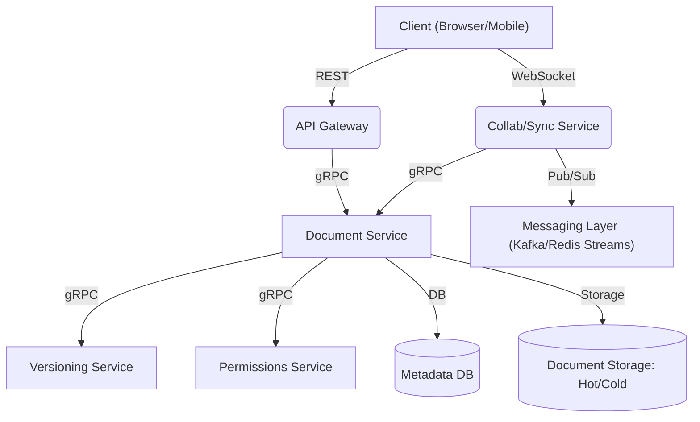
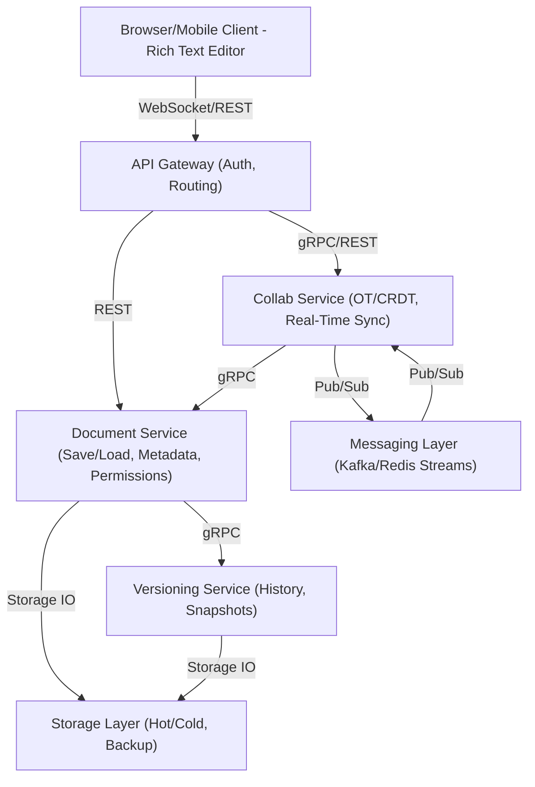
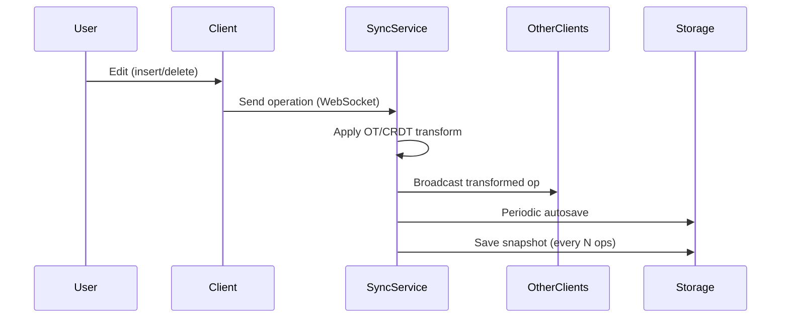
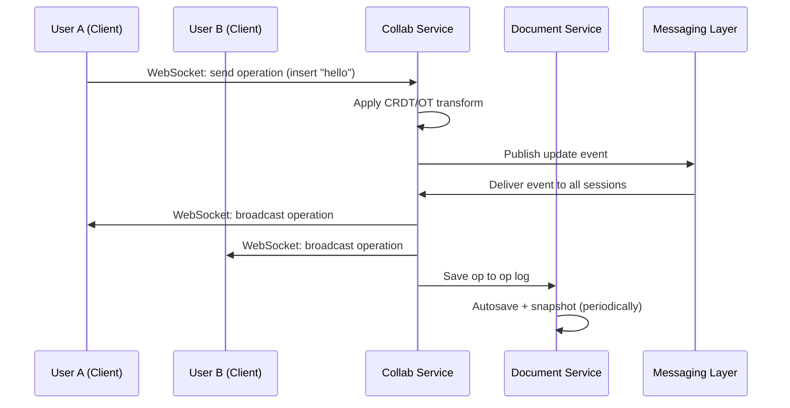
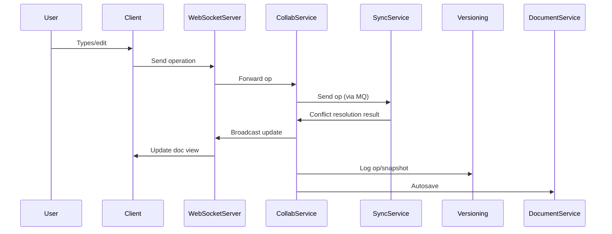

# Designing a Collaborative Document Editor (Google Docs)

Building a collaborative document editor (think Google Docs, Microsoft Word Online, or Notion) is a classic system design challenge. It's a rich real-world problem that tests your grasp of distributed systems, real-time synchronization, concurrency, scalability, and user experience.

In this case study, we'll walk through a detailed design — covering CRDT/OT conflict resolution, real-time sync via WebSockets, document modeling, versioning, scaling, and practical implementation.

---

## Learning Outcomes

After working through this case study, you'll be able to:

1. Explain **Operational Transformation (OT)** at a high level and why **CRDT** is increasingly preferred.
2. Design **presence** (live cursors, who's editing now) at scale.
3. Implement **offline editing** with sync-on-reconnect.
4. Add **comments, suggestions, and revision history** without breaking real-time editing.
5. Scale **WebSocket fan-out** for documents with hundreds of concurrent editors.

---

## Table of Contents

1. [Problem Overview](#problem-overview)
2. [Functional & Non-Functional Requirements](#functional--non-functional-requirements)
3. [Assumptions & Constraints](#assumptions--constraints)
4. [Collaboration Challenges](#collaboration-challenges)
5. [Scale Estimation](#scale-estimation)
6. [Bottlenecks](#bottlenecks)
7. [High-Level Architecture](#high-level-architecture)
8. [Document Model Design](#document-model-design)
9. [Real-Time Sync Flow](#real-time-sync-flow)
10. [Communication Patterns](#communication-patterns)
11. [API Endpoints](#api-endpoints)
12. [Consistency & Conflict Handling](#consistency--conflict-handling)
13. [Tech Stack & Infrastructure Decisions](#tech-stack--infrastructure-decisions)
14. [Sample Code](#sample-code)
15. [Tips & Tricks](#tips--tricks)
16. [Conclusion](#conclusion)

---

## Problem Overview

We want to build a **web-based collaborative document editor** that allows **multiple users to edit the same document in real time**. Core requirements:

- **Real-time collaboration** with instant change reflection for all users.
- **Conflict-free and consistent document state** despite concurrent edits.
- **Document versioning** and **access control** (permissions).
- **Smooth user experience** with low latency and high reliability.

**Examples:** Google Docs, Microsoft Word Online, Notion.

---

## Functional & Non-Functional Requirements

### Functional Requirements (MVP)

| Feature                              | Description                                                              |
|--------------------------------------|--------------------------------------------------------------------------|
| Create, edit, delete documents       | Users can CRUD their text documents.                                     |
| Real-time multi-user collaboration   | Multiple users can edit the same doc simultaneously and see changes live. |
| Real-time syncing of edits           | Edits propagate to all clients in (near) real time.                      |
| Document version history & change track | Track changes, rollback to previous versions.                         |
| Permission control                   | Read/write access for authorized users only.                             |
| Invite collaborators                 | Via shareable link or email.                                             |

### Non-Functional Requirements

- **Performance:** Real-time sync under **100ms** latency.
- **Scalability:** Support **millions of docs/users.**
- **Availability:** **99.9% uptime,** seamless reconnects.
- **Security:** TLS encryption, strong access control, abuse protection.
- **Reliability:** Autosave, crash recovery, eventual consistency.
- **Maintainability:** Modular, clean APIs for extensibility.
- **Testability:** Must be testable under real-time load.

---

## Assumptions & Constraints

### Assumptions

- Users have reliable internet connections.
- Clients use modern browsers with WebSocket support.
- Most docs are text-heavy (not rich media).
- Collaboration groups are small–medium (2–50 users).
- Heavy read-write usage (frequent edits).

### Constraints

- Real-time sync must work under high concurrency.
- Document consistency must be maintained even with conflicts.
- Eventual consistency across all clients.
- Meet global (not just regional) latency targets.
- Only basic text formatting in MVP.

---

## Collaboration Challenges

| Challenge                  | Description                                                                 |
|----------------------------|-----------------------------------------------------------------------------|
| Concurrency Control        | Handling overlapping edits from multiple users in real time.                |
| Conflict Resolution        | Determining winners when edits conflict (e.g., two users edit same text).   |
| Real-Time Synchronization  | Broadcasting updates efficiently to all connected clients.                  |
| Consistency vs. Latency    | Balancing immediate updates vs. consistent global state.                    |
| Failure Recovery           | Seamless reconnects, autosave, handling network loss or partial updates.    |

---

## Scale Estimation

| Metric                       | Value                                      |
|------------------------------|--------------------------------------------|
| Daily Active Users (DAU)     | 10M+                                       |
| Avg. Documents per User      | 100                                        |
| Peak Concurrent Editors      | 200K+                                      |
| Real-Time Sync Events        | ~10B/day                                   |
| Events per Active User       | 1–2/sec                                    |
| Ops/sec per Document         | 5–20 during editing                        |
| Avg. Document Size           | 100KB (100–500KB range)                    |
| Storage Overhead (History)   | 2–5x                                       |
| Hot Storage                  | 1–5 TB/day                                 |
| Cold Storage (Archives)      | 100s of TBs                                |

### Traffic Patterns

- **Spikes during working hours** (especially in shared orgs).
- **Hotspot documents** (meeting notes, templates).
- **Frequent small writes** (edits), **bulk reads** (opening docs/version history).
- **Authentication & permission checks** add latency under load.

---

## Bottlenecks

1. **Operational Transformation (OT) / CRDT overhead:** CPU-intensive, requires fast in-memory ops.
2. **WebSocket scaling & fan-out:** Persistent, low-latency connections; horizontal scaling needed.
3. **Storage write throughput:** Edits and autosaves put heavy pressure on storage systems.
4. **Conflict resolution latency:** Must not block editing experience.
5. **Sync propagation:** Consistent state across all clients within milliseconds.

---

## High-Level Architecture



A more detailed view:



ASCII view:

```
+--------+       +-------------+       +------------------+
| Client | <---> | API Gateway | <---> | Microservices    |
|        |       | (REST/Auth) |       | (Doc, Sync, etc) |
+--------+       +-------------+       +------------------+
     |                |                          |
     | <--- WebSocket |                          |
     |      (Sync)    |                          |
     v                v                          v
+--------------------------------------------------------------+
|                Messaging Layer (Kafka)                       |
+--------------------------------------------------------------+
     |                |                          |
     v                v                          v
+-----------------+   +----------------+   +------------------+
| Storage (S3/GCS)|   | PostgreSQL     |   | MongoDB          |
+-----------------+   +----------------+   +------------------+
```

### Component Breakdown

- **Client:** Rich text editor, WebSocket for real-time sync.
- **API Gateway:** Handles auth, routing, rate limiting.
- **Collab Service:** Real-time sync, OT/CRDT logic.
- **Document Service:** CRUD, metadata, permissions.
- **Versioning Service:** Document history, snapshots.
- **Storage:** Hot storage (frequent access), Cold storage (archive/backups).
- **Messaging Layer:** Pub/Sub for event propagation (Kafka/Redis Streams).
- **Microservices:** Stateless APIs, real-time sync infra.

---

## Document Model Design

### Why CRDT/OT?

With multiple users editing the same doc, we need to:

- **Resolve conflicts** (who "wins" if edits overlap?).
- **Achieve consistency** (all users see the same doc eventually).

**CRDT (Conflict-free Replicated Data Types)** and **OT (Operational Transformation)** are two proven strategies.

- **CRDT (e.g., [Yjs](https://github.com/yjs/yjs), [Automerge](https://github.com/automerge/automerge)):** Each client can modify independently; all changes converge automatically.
- **OT:** Edits are transformed in order to maintain consistency.

### Data Structure

- **Operation-based updates:** Send/receive granular operations (insert, delete) instead of full text blobs.
- **Version metadata:** For diff, sync, and rollback.

#### Yjs Document Example

```javascript
const Y = require('yjs');
const doc = new Y.Doc();
const yText = doc.getText('content');

// User 1 inserts text
yText.insert(0, 'Hello world!');

// Changes are encoded as binary ops and sent over WebSocket
const update = Y.encodeStateAsUpdate(doc);
socket.send(update);
```

#### CRDT-Style Document Structure (Pseudocode)

```js
{
  docId: "abc123",
  type: "text",
  content: Y.Text, // CRDT text structure
  version: 42,
  collaborators: [userId1, userId2],
  metadata: {
    owner: "userId1",
    permissions: { userId1: "write", userId2: "read" }
  },
  opLog: [ /* operation history */ ]
}
```

#### Operation-Based Update (JSON)

```json
{
  "op": "insert",
  "pos": 5,
  "chars": "hello",
  "user": "userA",
  "version": 42
}
```

A more detailed operation:

```json
{
  "op_id": "c123:45",
  "user_id": "user_abc",
  "type": "insert",
  "position": 10,
  "value": "hello",
  "timestamp": 1719583200
}
```

```json
{
  "docId": "abc123",
  "opId": "u1-202306121234",
  "userId": "u1",
  "type": "insert",
  "position": 10,
  "value": "hello",
  "timestamp": 1686564872000
}
```

#### Top-Level Document JSON

```json
{
  "document_id": "abc123",
  "content": [ /* CRDT/OT operation log */ ],
  "metadata": {
    "created_by": "user1",
    "permissions": { "user2": "read", "user3": "write" },
    "version": 42,
    "last_modified": "2024-06-01T12:34:56Z"
  }
}
```

---

## Real-Time Sync Flow

1. ✍️ User edits doc (inserts text).
2. 📤 Client sends operation over WebSocket.
3. 🔀 Collab service applies OT/CRDT transform.
4. 📣 Changes broadcast to collaborators via Pub/Sub.
5. 💾 Autosave to persistent store.
6. 🕒 Snapshots saved periodically for recovery.

### Sequence Diagram



### Two-User Sync Diagram



### Detailed Service-Level Flow



---

## Communication Patterns

| Channel         | Protocol       | Purpose                                    |
|-----------------|----------------|--------------------------------------------|
| **External**    | REST (HTTP)    | CRUD docs, versioning, auth, permissions   |
| **Real-Time**   | WebSocket      | Real-time collaborative editing            |
| **Internal**    | gRPC           | Fast, typed service-to-service comms       |
| **Async Events**| Kafka/Redis    | Fan-out, decouple, background processing   |

- **REST (HTTP/JSON):** Document CRUD, version history (external/client-facing).
- **WebSockets:** Real-time collaboration & sync (persistent, low latency).
- **gRPC (protobuf):** Fast internal service-to-service calls.
- **Message Queues (Kafka, RabbitMQ):** Event-driven workflows, background jobs.

---

## API Endpoints

```http
GET   /documents/:id              # Fetch document
POST  /documents                  # Create new document
PUT   /documents/:id/content      # Save content snapshot
POST  /documents/:id/operations   # Send an edit operation
GET   /documents/:id/history      # Get version history
POST  /documents/:id/collaborators # Add/remove collaborators

WebSocket: /ws/collab?doc_id=abc123&token=jwt
```

### Sample WebSocket Message (Edit Operation)

```json
{
  "type": "operation",
  "docId": "abc123",
  "userId": "u2",
  "operation": {
    "opType": "insert",
    "position": 22,
    "value": "world",
    "version": 35
  }
}
```

```json
{
  "op": "insert",
  "position": 10,
  "text": "Hello, world!",
  "user": "user42",
  "version": 43
}
```

---

## Consistency & Conflict Handling

- **CRDT/OT:** Transform concurrent operations so all clients eventually converge to the same state.
- **Operation logs:** Each doc maintains a log for replay/resync.
- **Snapshots + deltas:** For syncing lagging clients.
- **Reconnection protocol:** Handle clients rejoining after network partition.

### Applying a CRDT Update on Reconnect

```javascript
const update = receiveUpdateFromServer();
Y.applyUpdate(localDoc, update);
```

### Conflict Resolution (Pseudocode — Lamport Timestamps)

```python
def resolve_conflict(local_op, remote_op):
    if local_op.timestamp < remote_op.timestamp:
        apply(local_op)
        apply(remote_op)
    else:
        apply(remote_op)
        apply(local_op)
```

```js
function resolveConflict(opA, opB) {
    if (opA.timestamp < opB.timestamp) return [opA, opB];
    else return [opB, opA];
}
```

### CRDT Merge Pseudo-code

```javascript
function mergeOps(currentState, incomingOp) {
    if (!currentState.hasOp(incomingOp.opId)) {
        currentState.apply(incomingOp);
    }
    // Ignore duplicate ops
}
```

---

## Tech Stack & Infrastructure Decisions

| Layer         | Choice                                                              |
|---------------|---------------------------------------------------------------------|
| Frontend      | React (Web), React Native (Mobile)                                  |
| Backend       | Node.js (WebSocket), gRPC microservices                             |
| APIs          | REST (CRUD), WebSockets (real-time)                                 |
| Data Storage  | S3/GCS (files), Postgres (metadata), MongoDB (flexible schemas)     |
| Orchestration | Kubernetes                                                          |
| Messaging     | Kafka (event bus)                                                   |
| Auth          | OAuth2/JWT                                                          |
| Security      | TLS (in-transit), AES (at-rest)                                     |

---

## Sample Code

### WebSocket Real-Time Sync (Node.js + Yjs)

A basic server:

```javascript
const WebSocket = require('ws');
const Y = require('yjs');

const wss = new WebSocket.Server({ port: 8080 });
const docs = new Map(); // docId -> Y.Doc

wss.on('connection', (ws, req) => {
  const docId = getDocIdFromReq(req);
  let doc = docs.get(docId);
  if (!doc) {
    doc = new Y.Doc();
    docs.set(docId, doc);
  }

  ws.on('message', (msg) => {
    const update = new Uint8Array(msg);
    Y.applyUpdate(doc, update);
    wss.clients.forEach(client => {
      if (client !== ws && client.readyState === WebSocket.OPEN) {
        client.send(update);
      }
    });
  });

  // Send current doc state to new client
  const state = Y.encodeStateAsUpdate(doc);
  ws.send(state);
});
```

A more complete handler with doc per ID:

```js
const Y = require('yjs');
const ws = require('ws');

const docMap = new Map(); // docId => Y.Doc

function getOrCreateDoc(docId) {
  if (!docMap.has(docId)) docMap.set(docId, new Y.Doc());
  return docMap.get(docId);
}

const wss = new ws.Server({ port: 8080 });
wss.on('connection', (socket, req) => {
  const docId = req.url.split('doc_id=')[1].split('&')[0];
  const ydoc = getOrCreateDoc(docId);

  socket.on('message', (msg) => {
    const update = new Uint8Array(JSON.parse(msg).update);
    Y.applyUpdate(ydoc, update);
    wss.clients.forEach(client => {
      if (client !== socket && client.readyState === ws.OPEN) {
        client.send(JSON.stringify({ update: Array.from(update) }));
      }
    });
  });

  socket.send(JSON.stringify({ update: Array.from(Y.encodeStateAsUpdate(ydoc)) }));
});
```

A simpler version (just receiving + applying):

```js
const Y = require('yjs');
const doc = new Y.Doc();

ws.on('message', (msg) => {
    const update = JSON.parse(msg);
    Y.applyUpdate(doc, update);

    broadcastToCollaborators(update);
    saveOpToLog(update);
});
```

### Client-Side WebSocket (JS)

```javascript
const ws = new WebSocket('wss://api.yourdocs.com/ws/collab?doc_id=abc123&token=xyz');
ws.onmessage = (event) => {
  const op = JSON.parse(event.data);
  applyRemoteOperation(op);
};
function sendLocalOperation(op) {
  ws.send(JSON.stringify(op));
}
```

### Server-Side WebSocket Handler (Generic)

```js
wsServer.on('connection', (socket, req) => {
  const docId = getDocIdFromReq(req);
  socket.on('message', (msg) => {
    const op = JSON.parse(msg);
    const transformedOp = applyOTorCRDT(op, docId);
    broadcastToCollaborators(docId, transformedOp);
    persistOperation(docId, transformedOp);
  });
});
```

---

## Beyond MVP — What a Senior Designer Adds

### OT vs CRDT — Which to Choose and Why

Both achieve the same goal (concurrent edits converge to the same state). Trade-offs:

| Aspect              | Operational Transformation (OT)            | CRDTs (Yjs, Automerge)              |
|---------------------|---------------------------------------------|-------------------------------------|
| Architecture        | Requires a central server to order ops      | Peer-to-peer possible; no central authority needed |
| Convergence proof   | Hard (subtle bugs even after decades)       | Mathematical guarantee              |
| Storage overhead    | Small                                       | Larger (metadata per character)     |
| Offline editing     | Possible but complex                        | Trivial — natural fit               |
| Used by             | Google Docs (originally), ShareJS           | Figma, Notion (partially), Linear   |

**Google Docs uses OT** for historical reasons. **Modern systems often choose CRDTs** because the simpler mental model and offline support outweigh the storage overhead. For an interview, mention both and explain the choice.

### Presence (Live Cursors, "X is editing")

Showing 5 colored cursors live in the document is a separate problem from text sync.

- Each user sends cursor position updates (~30 Hz max, debounced).
- Server fans out to other viewers via the same WebSocket.
- Cursors aren't persisted — they're ephemeral state.

**Implementation:** separate "presence" Pub/Sub channel from "edit" channel; presence has a much higher event rate but doesn't need durability.

### Offline Editing

CRDTs make this natural; OT requires careful design.

**Pattern:**

1. Client maintains a local op log while disconnected.
2. UI feels real-time (apply locally + queue for server).
3. On reconnect: push queued ops to server.
4. Server merges via CRDT/OT; broadcasts to other clients.
5. Client may need to reconcile if its local view diverges from server.

### Comments and Suggestions

These are "out-of-band" content — not part of the document text, but anchored to it.

- **Anchors** are tricky: if I comment on "Hello", and you delete "Hello", what happens? Either the comment becomes orphaned (still visible, marked "resolved" or "deleted") or it follows the surrounding context (semantic anchoring).
- Suggestions ("track changes") are inserts/deletes that aren't applied — they show as proposed edits.

**Implementation:** separate `comments` and `suggestions` tables, each with an `anchor_op_id` referencing a position in the op log.

### Revision History

Every N ops or M minutes, snapshot the doc state. UI shows a timeline; clicking a point restores or compares versions.

**Storage:** keep recent snapshots in primary DB; archive older ones to cheap object storage.

### Scaling WebSocket Fan-Out for Hot Documents

A team meeting's shared doc might have 200 editors simultaneously. Each edit goes to 200 connections.

**Pattern:**

1. Shard WebSocket servers by `doc_id` (consistent hashing) so all editors of one doc hit the same server.
2. That server fans out locally — no cross-server pub/sub needed for that doc.
3. For *globally* shared docs (1000+ editors), use a multi-tier fan-out: edge servers handle subsets, aggregate via Pub/Sub.

### Permissions and Sharing

Same as cloud storage (Chapter 19), but with a twist: real-time. If Alice revokes Bob's access *while Bob is editing*, his next op must fail, and his client must immediately show "you no longer have access."

**Pattern:** push permission changes through the same WebSocket channel; client validates on every op; server rejects ops from users no longer permitted.

### Export and Print

Render the live document model to PDF, DOCX, plain text. Run async — typically takes 1-30 seconds. Results stored in object storage, link emailed/displayed.

---

## Tips & Tricks

### Architecture

1. **Start with OT/CRDT libraries.** Don't reinvent the wheel: use mature libraries ([Yjs](https://docs.yjs.dev/), [Automerge](https://automerge.org/)) for document sync and conflict resolution.
2. **WebSocket connection management.** Use connection pools and horizontal scaling (sharding docs across sync nodes). Monitor for "zombie" connections; implement heartbeats/pings.
3. **Efficient fan-out.** Use Pub/Sub (Redis, Kafka) to broadcast document changes with low latency.
4. **Stateless services.** Make components stateless where possible for horizontal scaling.

### Performance

5. **Keep operations small.** Send deltas, not full documents.
6. **Batch operations.** For high-frequency edits, batch and debounce to avoid flooding the network.
7. **Optimize for hot documents.** Some docs will be "hotspots" with many collaborators — use in-memory caching or partitioning.
8. **Sticky sessions or consistent hashing:** Route users editing the same doc to the same backend node, minimizing fan-out.
9. **Autosave frequency.** Balance between too-frequent (write pressure) and too-rare (data loss risk).

### Storage

10. **Snapshots.** Save periodic document snapshots to speed up recovery and reduce replay of long operation logs.
11. **Autosave & snapshots.** Autosave frequently, snapshot (full doc state) less often.

### Reliability

12. **Handle disconnects gracefully.** Have reconnection and catch-up protocols for clients.
13. **Backpressure handling.** Monitor and throttle clients that send too many ops/sec.
14. **Optimistic UI:** Apply local edits instantly, then confirm with the server.

### Security

15. **Security first.** All APIs authenticated (JWT/OAuth2); all transport encrypted (TLS).
16. **Permission caching.** Cache permission checks in memory for active docs to reduce DB load — but always validate on critical writes.
17. **Always validate server-side.** Never trust client-supplied edit ops blindly.

### Testing & Monitoring

18. **Testing real-time flows.** Simulate hundreds/thousands of concurrent users in automated tests.
19. **Monitor for hotspots.** Some docs will be edited much more than others — consider sharding.
20. **Track WebSocket metrics:** Connection rates, event propagation latency, write queue depth.
21. **Test at scale:** Simulate 100s of concurrent collaborators per doc to uncover bottlenecks.

---

## Conclusion

Designing a collaborative document editor is a **classic, multidimensional system design challenge**. With a modular, microservices-based architecture, careful real-time conflict handling, and strategic use of modern infrastructure (WebSockets, Kafka, Kubernetes, CRDT/OT), you can build a solution that's robust, fast, and scalable.

By leveraging modern CRDT/OT libraries, scalable WebSocket infrastructure, and modular microservices, you can deliver seamless collaboration for millions of active users.

**Remember:** In interviews, focus on **clarity, trade-offs, and rationale** — not just drawing boxes.

---

## Further Reading

- [Yjs (CRDT for JS)](https://github.com/yjs/yjs)
- [Yjs Docs](https://docs.yjs.dev/)
- [Automerge (CRDT for JS)](https://github.com/automerge/automerge)
- [Automerge Docs](https://automerge.org/)
- [ShareDB (OT)](https://github.com/share/sharedb)
- [CRDTs Explained](https://crdt.tech/)
- [Martin Fowler: Collaborative Editing](https://martinfowler.com/articles/collaborative-editing.html)
- [Martin Kleppmann: CRDTs vs. OT](https://martin.kleppmann.com/papers/crdt-ot.pdf)
- [Operational Transformation Explained](https://www.oreilly.com/library/view/collaborative-editing-in/9781098108988/)
- [Kafka vs. RabbitMQ](https://www.cloudamqp.com/blog/when-to-use-rabbitmq-or-apache-kafka.html)

---

**Next Up:** [Chapter 25 — Final Prep, Mindset & Moving Forward →](./25%20-%20Final%20Prep%2C%20Mindset%20%26%20Moving%20Forward.md)
