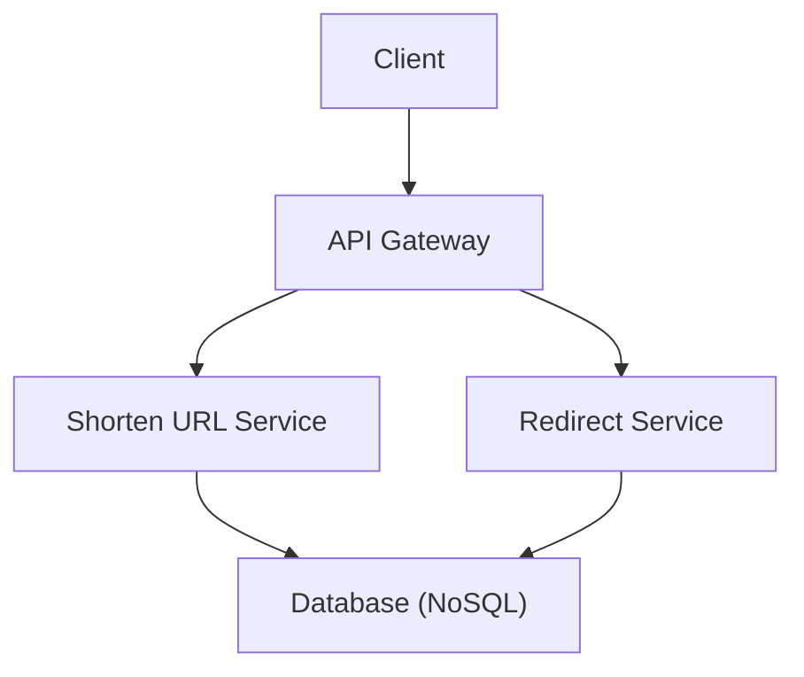

# Mastering System Design: Final Prep, Mindset & Moving Forward

Welcome to the final chapter of your system design journey! Whether you're prepping for interviews, architecting real-world systems, or simply leveling up as an engineer, your **mindset** and **structured approach** are the real game-changers. Let's wrap up with actionable strategies, frameworks, and tips to help you build (and interview) with confidence.

---

## Table of Contents

1. [The Right Mindset for System Design Interviews](#the-right-mindset-for-system-design-interviews)
2. [A 4-Step Framework for Structured Responses](#a-4-step-framework-for-structured-responses)
3. [Handling Open-Ended & Evolving Questions](#handling-open-ended--evolving-questions)
4. [Communicating Trade-Offs & Constraints Effectively](#communicating-trade-offs--constraints-effectively)
5. [Simulating Interviews & Building Fluency](#simulating-interviews--building-fluency)
6. [Wrapping Up & Moving Forward](#wrapping-up--moving-forward)
7. [Tips and Tricks](#tips-and-tricks)
8. [Further Reading](#further-reading)

---

## The Right Mindset for System Design Interviews

Interviewers aren't just seeking the "right" architecture — they're evaluating **clarity of thought, depth of trade-offs, communication skills, and structured problem-solving.** Here's how to stand out:

- **Stay curious, not anxious:** Treat ambiguous questions as collaborative conversations, not traps.
- **Prioritize exploration over perfection:** Narrate your thought process step by step.
- **Lean into complexity:** Don't panic when requirements change — embrace the challenge.

> **Remember:** Your ability to *reason*, *adapt*, and *communicate* under pressure is as important as technical knowledge.

---

## A 4-Step Framework for Structured Responses

A clear structure keeps your solution coherent and adaptable, even as interviewers introduce curveballs. Use this **repeatable 4-step framework** (from Chapter 11):

1. **Understand Requirements** — Clarify both functional and non-functional needs.
2. **Estimate Scale & Identify Bottlenecks** — Use "back-of-the-envelope" calculations; spot potential hotspots.
3. **High-Level Design** — Sketch out main components, data flow, and key interactions.
4. **Strategic Tech/Infra Decisions** — Justify your choice of tools, patterns, and protocols.

### Example: Designing a URL Shortener



1. **Requirements:** Shorten URLs, redirect, track analytics (non-functional: low latency, high availability).
2. **Scale:** Billions of URLs, millions of requests/day.
3. **Design:** API Gateway routes to services; NoSQL DB for fast access.
4. **Tech choices:** NoSQL for scalability and speed; cache hot URLs.

---

## Handling Open-Ended & Evolving Questions

System design interviews are **intentionally ambiguous** — interviewers want to see how you react when requirements evolve.

- **Ask clarifying questions:** Don't guess; clarify.
- **Make assumptions explicit:** State them out loud for transparency.
- **Decompose problems:** Break the system into smaller services, flows, or layers.
- **Zoom in:** Dive into specifics (storage, API, auth) as needed.

> **When scope changes** (e.g., "Now support 50M users!"):
> - Reassess bottlenecks.
> - Communicate how you'd adjust your design.

---

## Communicating Trade-Offs & Constraints Effectively

There's **no perfect design** — only the best fit for the given constraints. Always explain *why* you make each decision.

### Examples

**SQL vs NoSQL?**

> *In this context, NoSQL is chosen for its horizontal scalability and low-latency reads, given the high volume of URL accesses.*

**Consistency models (strong vs eventual):**

> *Eventual consistency is acceptable for analytics, but strong consistency is needed for URL mapping to avoid broken links.*

**Monolith vs microservices:**

> *Microservices allow independent scaling of shortening and redirect functions.*

**Consider:** Latency, cost, scalability, fault tolerance, and availability.

> **Avoid blanket statements.**
>
> *Instead of:* "NoSQL is always better."
>
> *Say:* "For this use-case, NoSQL is preferable due to the expected read-heavy workload and need for horizontal scaling."

---

## Simulating Interviews & Building Fluency

**Practice like you play.**

- **Timed drills:** Use whiteboards, Excalidraw, Miro, or pen and paper.
- **Record and review:** Analyze your clarity and structure.
- **Mock interviews:** Pair with peers, join circles, seek feedback.
- **Templates:** Use checklists for requirements and scale estimation.

### Sample Requirements Gathering Template

```markdown
- Functional Needs:
  - [ ] User can shorten a URL
  - [ ] Redirect from short to long URL
  - [ ] Analytics/tracking

- Non-Functional Needs:
  - [ ] High availability
  - [ ] Low latency
  - [ ] Scalability (X requests/sec)
```

### Prepare for Both Interview Formats

- **Remote interviews:** Practice with screen sharing and diagramming tools.
- **In-person interviews:** Practice whiteboarding and verbal reasoning.

---

## Wrapping Up & Moving Forward

**You've learned:**

- Network protocols, APIs (REST, gRPC, WebSockets).
- Architectural patterns (tiers, event-driven, microservices).
- Scalability strategies (CDNs, load balancing, auto-scaling).
- Real-time and storage system design.
- Case studies translating theory into practice (URL shortener, eBay, Google Drive, YouTube, Google Search, Amazon, Uber, Google Docs).

**Next steps:**

- **Contribute to open-source** or design-focused repositories.
- **Keep practicing** — solo or with peers.
- **Stay updated:** Subscribe to [ByteByteGo](https://bytebytego.com/), [InfoQ](https://infoq.com/), and top engineering blogs.
- **Build side projects:** Simulate scale and real-world trade-offs.

---

## Interview Formats at Top Companies (What to Expect)

Different companies have meaningfully different interview formats. Knowing this helps you tailor your approach.

| Company | Format                                                          | What they evaluate                                   |
|---------|------------------------------------------------------------------|-------------------------------------------------------|
| **Google**  | One 45-min round; design open-ended (e.g., "design YouTube") | Breadth, technical depth, trade-off reasoning         |
| **Meta**    | Two 45-min rounds: one for system design, one for ML/infra-leaning if relevant | Structured 4-step approach; calibration to your level |
| **Amazon**  | 45-min design + leadership principles questions throughout    | Frugality, customer obsession, *and* technical depth  |
| **Microsoft** | One 60-min design                                            | Architecture choices, trade-offs                     |
| **Apple**   | Domain-specific (e.g., design a payment system for a hardware vendor) | Depth in one area + cross-functional collaboration |

> **General pattern:** 45-60 min for design; expect 5-min intro + 35-50 min design + 5-min Q&A from you.

## How Senior+ Candidates Are Evaluated Differently

| Level     | Expected behavior                                                                |
|-----------|-----------------------------------------------------------------------------------|
| L4 (Mid)  | Clean high-level design. Understands trade-offs when prompted.                   |
| L5 (Senior) | Drives the design without prompts. **Articulates trade-offs proactively.** Catches own mistakes. Handles ambiguity. |
| L6 (Staff)  | Designs the platform pieces (LB, caching layer) as well as the product. Anticipates problems 1-2 years out. Knows when *not* to use a technology. |
| L7+ (Principal) | Reframes the problem. "Before we design X, are we sure we should build X?" Discusses cross-team, multi-quarter implications. |

The interviewer is calibrating you to a level. **You can't just "talk smarter" — you have to demonstrate the behaviors of that level.**

## When You Get Stuck

It happens. Three moves:

1. **Restate what you've covered so far.** "OK, so we have the API gateway, the matching service, the location service in Redis — and I'm trying to figure out the surge pricing." Often restating reveals the missing piece.
2. **Ask a leading question.** "Should surge pricing be real-time or eventually consistent?" Forces you to think about trade-offs and gives the interviewer a hook.
3. **Punt to a simpler version.** "Let me come back to that. For now, let's assume surge is computed every minute and pushed to a Redis cache." Then move on. Often the interviewer will accept the simpler version.

**Never freeze.** Silence past 10 seconds is worse than thinking out loud.

## After the Interview — Reflect

Whether you passed or failed, write down within 24 hours:

1. What questions did they ask?
2. Where did you spend too long? Too little?
3. What follow-up question caught you off guard?
4. What's one concept you wish you'd known better?

Over 5-10 interviews, patterns emerge. This is how you get *much* better, not just more practiced.

## Mock Interview Resources

- **Free / peer-based:** [interviewing.io](https://interviewing.io) (anonymous, peer + ex-FAANG), [Pramp](https://www.pramp.com).
- **Paid:** Exponent, Educative, ByteByteGo.
- **DIY:** A friend with a whiteboard and a timer. Surprisingly effective.

> **One paid mock interview with detailed feedback** is worth ten self-study sessions. Spend the money.

---

## Tips and Tricks

- **Always clarify ambiguous requirements** before jumping into design.
- **Narrate your thinking:** Don't leave your reasoning silent — talk through trade-offs and options.
- **Use "layered zoom":** Start broad, then go deep where the interviewer shows interest.
- **Practice "what-if" scenarios:** E.g., "What if traffic spikes?" or "What if a region goes down?"
- **Have reusable patterns ready:** Load balancer + auto-scaling group, cache + DB, async queue + worker, etc.
- **Be honest about trade-offs:** Admit when a design sacrifices consistency for latency, or cost for performance.

---

> **You're not just prepping for interviews — you're becoming a system thinker.**
> **Embrace complexity, keep learning, and build thoughtfully.**
>
> *Good luck, and happy designing!* 🚀

---

## Further Reading

- [ByteByteGo](https://bytebytego.com/)
- [InfoQ](https://infoq.com/)
- [Awesome System Design](https://github.com/madd86/awesome-system-design)
- [Designing Data-Intensive Applications by Martin Kleppmann](https://dataintensive.net/)
- [System Design Primer (GitHub)](https://github.com/donnemartin/system-design-primer)

---

*Ready to take on your next system design challenge? Let's build something great!*
