# Protocols — The Backbone of Modern System Design

Modern system design is built on the foundation of robust communication protocols. From the reliable, ordered delivery of TCP, to the flexible data-fetching of GraphQL, understanding these protocols is crucial for architects, engineers, and developers alike.

System design isn't just about data stores and scaling; at its core, it's about **communication** — how data moves across networks reliably, efficiently, and in real time. In this chapter we'll cover the essential protocols driving web applications, APIs, and real-time communication — complete with practical code snippets, diagrams, and an interview-focused tips section.

---

## Learning Outcomes

After reading this chapter, you'll be able to:

1. Choose between TCP and UDP for a given workload and explain why.
2. Read an HTTP request/response, name the methods, and pick the right status code.
3. Compare REST, gRPC, and GraphQL on serialization, transport, performance, browser support, and use case.
4. Pick between WebSockets, Server-Sent Events (SSE), and long polling for a real-time feature.
5. Explain HTTP/1.1 vs HTTP/2 vs HTTP/3 in one sentence each.

---

## Table of Contents

1. [The Protocol Landscape](#the-protocol-landscape)
2. [TCP & UDP — Transport Layer Foundations](#tcp--udp--transport-layer-foundations)
3. [HTTP — The Backbone of the Web](#http--the-backbone-of-the-web)
4. [REST & RESTfulness — API Design Principles](#rest--restfulness--api-design-principles)
5. [Real-Time Communication Protocols](#real-time-communication-protocols)
6. [Modern API Protocols — gRPC & GraphQL](#modern-api-protocols--grpc--graphql)
7. [Combined Tips & Tricks](#combined-tips--tricks)
8. [Sample Interview Questions](#sample-interview-questions)
9. [Quick Reference Table](#quick-reference-table)
10. [Summary & Key Takeaways](#summary--key-takeaways)
11. [Further Reading](#further-reading)

---

## The Protocol Landscape

Before diving into individual protocols, it helps to understand how they layer:

```
+------------------------------+
|        Application Layer     |  <-- REST, GraphQL, gRPC APIs, WebSockets
+------------------------------+
|       HTTP/HTTPS Protocol    |
+------------------------------+
|        TCP / UDP             |
+------------------------------+
|           IP                 |
+------------------------------+
```

- **TCP/UDP:** Low-level, transport protocols. TCP is reliable and connection-oriented; UDP is fast but unreliable.
- **HTTP:** Application-level protocol, stateless, built on top of TCP — powers web traffic.
- **REST:** An architectural style that builds on HTTP, defining how web APIs should be structured and behave.
- **WebSockets:** A real-time, full-duplex protocol that upgrades from HTTP.
- **Modern APIs (gRPC, GraphQL):** Address REST's limitations for certain use cases — microservices or highly dynamic frontend needs.

---

## TCP & UDP — Transport Layer Foundations

Before any web page loads or an API responds, transport protocols like **TCP** and **UDP** power the underlying communication.

### TCP (Transmission Control Protocol)

- **Connection-oriented:** Establishes a handshake before sending data (think: phone call).
- **Reliable and ordered:** Guarantees all bytes arrive, in order, error-checked.
- **Flow and congestion control:** Built-in.
- **Common uses:** Web browsing (HTTP/HTTPS), file transfer (FTP/SFTP), email (SMTP, IMAP, POP3), databases.

#### TCP Three-Way Handshake (Mermaid)

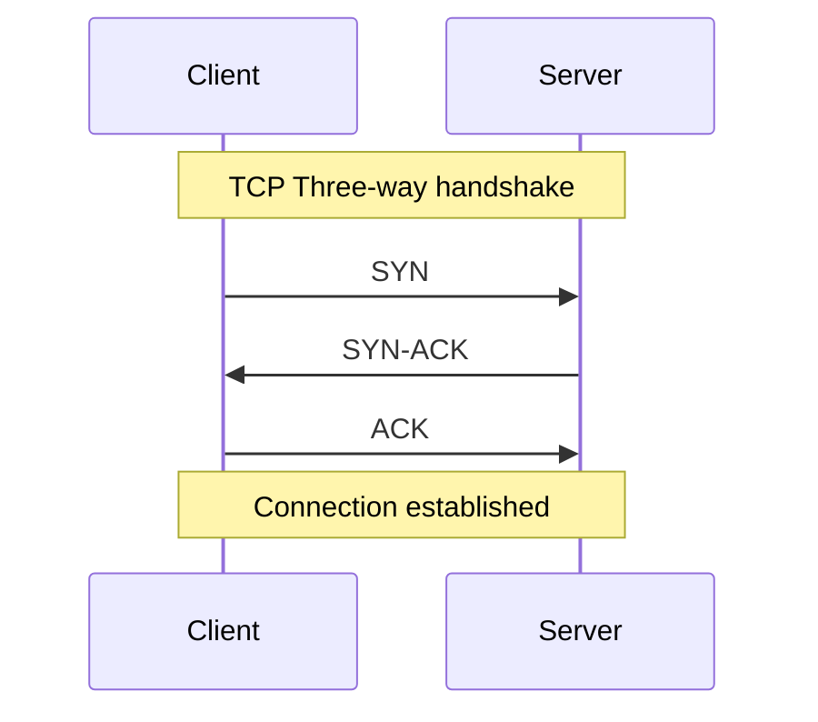

#### TCP Three-Way Handshake (ASCII versions)

```
Client         Server
  |   SYN   --->   |
  | <---  SYN-ACK  |
  |   ACK   --->   |
(Connection established)
```

A second view, with step numbers:

```plaintext
Client                Server
  |     SYN (1)         |
  |-------------------->|
  |    SYN-ACK (2)      |
  |<--------------------|
  |     ACK (3)         |
  |-------------------->|
Data can now flow reliably!
```

**Explanation:**

1. **SYN:** Client asks to start a connection.
2. **SYN-ACK:** Server acknowledges and agrees.
3. **ACK:** Client confirms, and the connection is established.

#### Code: TCP Server in Python (echo server)

```python
import socket

with socket.socket(socket.AF_INET, socket.SOCK_STREAM) as s:
    s.bind(('localhost', 8080))
    s.listen()
    conn, addr = s.accept()
    with conn:
        print('Connected by', addr)
        while True:
            data = conn.recv(1024)
            if not data:
                break
            conn.sendall(data)
```

#### Code: TCP Client in Python

```python
import socket

# Simple TCP client
s = socket.socket(socket.AF_INET, socket.SOCK_STREAM)
s.connect(('example.com', 80))
s.sendall(b"GET / HTTP/1.1\r\nHost: example.com\r\n\r\n")
response = s.recv(4096)
print(response.decode())
s.close()
```

### UDP (User Datagram Protocol)

- **Connectionless:** No setup, just sends packets (think: postcards).
- **Fast, minimal overhead**, but **unreliable**: No guarantee packets arrive or are ordered.
- **No retransmission, no error correction.**
- **Common uses:** Video streaming, online gaming, VoIP, DNS lookups.

#### UDP Packet Flow

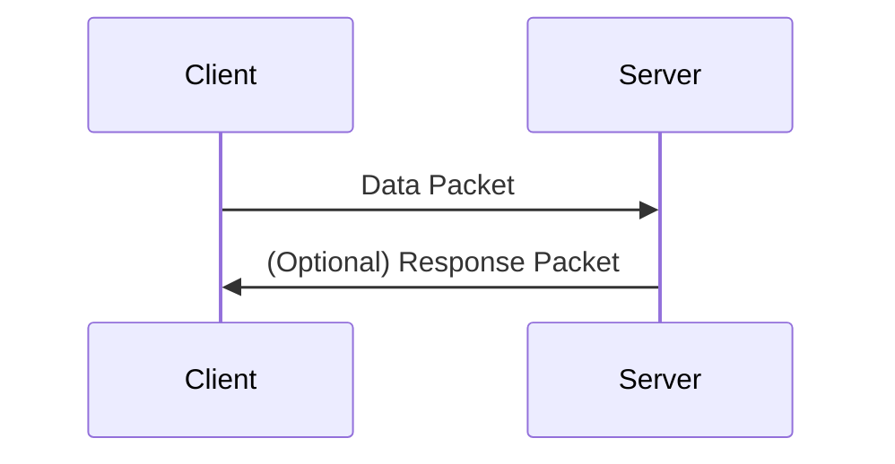

```
Sender               Receiver
  |  ---> packet 1  --->   |
  |  ---> packet 2  --->   |
  |  ---> packet 3  --->   |
(No handshake, no acknowledgment)
```

**Postcard analogy:** Each UDP datagram is like dropping a postcard in the mail. It might arrive, might not, and order isn't guaranteed.

#### Code: UDP Client in Python

```python
import socket

# Simple UDP client
sock = socket.socket(socket.AF_INET, socket.SOCK_DGRAM)
sock.sendto(b'Hello, World!', ('localhost', 8080))
data, addr = sock.recvfrom(1024)
print('Received:', data)
```

A second variant:

```python
import socket

s = socket.socket(socket.AF_INET, socket.SOCK_DGRAM)
s.sendto(b"Hello, UDP!", ('example.com', 12345))
data, addr = s.recvfrom(1024)
print(f"Received from {addr}: {data.decode()}")
s.close()
```

### TCP vs UDP — Comparison

A quick comparison:

| Feature       | TCP         | UDP        |
|---------------|-------------|------------|
| Connection    | Oriented    | Connectionless |
| Reliability   | High        | Low        |
| Ordering      | Yes         | No         |
| Speed         | Slower      | Faster     |
| Use Case      | Web, Files  | Video, VoIP|

A more detailed (interview-friendly) table:

| Feature             | TCP (Transmission Control Protocol)                                                | UDP (User Datagram Protocol)                                       |
|---------------------|------------------------------------------------------------------------------------|--------------------------------------------------------------------|
| **Reliability**     | Reliable (ensures data delivery)                                                   | Unreliable (no guarantee of delivery)                              |
| **Speed**           | Slower (due to error checking & retransmission)                                    | Faster (no retransmission overhead)                                |
| **Connection Type** | Connection-oriented (establishes a connection before communication)                | Connectionless (sends data without setup)                          |
| **Ordering**        | Ensures packets arrive in order                                                    | No guarantee of packet order                                       |
| **Error Handling**  | Built-in error checking & retransmission                                           | Minimal error checking, no retransmission                          |
| **Overhead**        | High (due to handshaking, sequencing, and acknowledgments)                         | Low (minimal protocol overhead)                                    |
| **Use Cases**       | Web browsing (HTTP/HTTPS), file transfers (FTP, SFTP), email, database communication | Video streaming, online gaming, VoIP calls, DNS lookups          |

### When to Use Which?

**Use TCP when:**

- **Web browsing** (HTTP, HTTPS)
- **File transfers** (FTP, SFTP)
- **Email** (SMTP, IMAP, POP3)
- **Database communication**
- Any scenario where loss or corruption of data is unacceptable.

**Use UDP when:**

- **Video streaming** (YouTube, Netflix)
- **Online gaming** (Fortnite, Call of Duty)
- **VoIP calls** (Skype, Zoom, WhatsApp)
- **DNS lookups**
- Any scenario where **speed/latency** is critical and some loss is acceptable.

---

## HTTP — The Backbone of the Web

**HTTP (HyperText Transfer Protocol)** is the foundation of data communication on the web. Whether you're loading a web page, making an API call, or streaming content, HTTP is working behind the scenes.

### What is HTTP?

- **HyperText Transfer Protocol** — foundation of web communication.
- **Text-based, stateless** — each request is independent.
- **Runs over TCP/IP** (port 80 for HTTP, port 443 for HTTPS).
- **Human-readable** — easy to debug.
- **Methods:** GET, POST, PUT, DELETE, PATCH, etc.
- **Status codes:** 200 (OK), 404 (Not Found), 500 (Server Error), etc.

### The Client-Server Model

HTTP follows a **client-server architecture**:

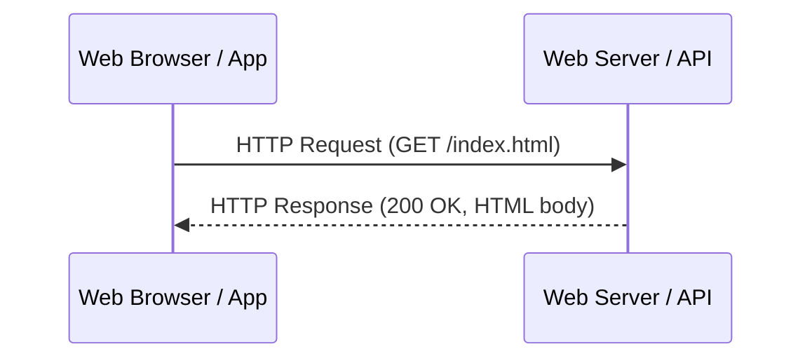

- **Client:** Initiates requests (e.g., browser, mobile app)
- **Server:** Processes requests, sends responses (web server, API, etc.)

### Components of an HTTP Request

- **Method:** Defines the action (`GET`, `POST`, etc.)
- **URL:** The resource being requested
- **Headers:** Metadata (e.g., `User-Agent`, `Content-Type`, `Authorization`)
- **Body (optional):** Data sent in `POST`/`PUT`/`PATCH` requests

### Components of an HTTP Response

- **Status Code:** Indicates success or failure (e.g., `200 OK`, `404 Not Found`)
- **Headers:** Metadata about the response
- **Body (optional):** The actual content returned

### The HTTP Request-Response Cycle

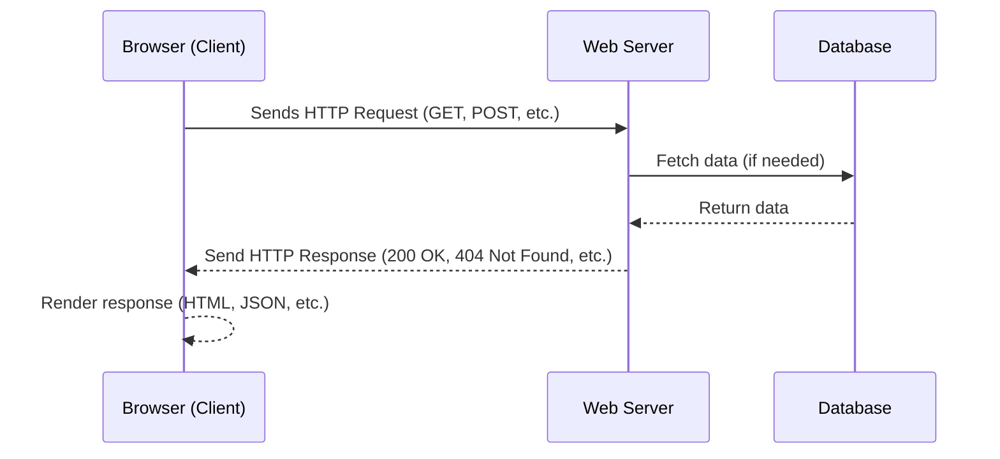

**Step-by-step:**

1. **Request:** Client (browser/app) sends an HTTP request.
2. **Processing:** Server authenticates, fetches data, generates response.
3. **Response:** Server returns status, headers, and body.
4. **Render:** Client renders web page or processes data.

ASCII view:

```
+---------+         +---------+
| Browser |         | Server  |
+---------+         +---------+
     |                  |
     |---(1) Request--->|
     |                  |
     |<--(2) Process----|
     |                  |
     |<--(3) Response---|
     |                  |
     |---(4) Render---->|
```

### Anatomy of an HTTP Request

```http
GET /api/products/123 HTTP/1.1
Host: example.com
User-Agent: Mozilla/5.0
Accept: application/json
Authorization: Bearer <token>
```

| Component | Purpose                                              |
|-----------|------------------------------------------------------|
| Method    | Action to perform (GET, POST, PUT, DELETE, PATCH)    |
| URL       | Resource identifier (`/api/products/123`)            |
| Headers   | Metadata (auth, content-type, cookies, etc.)         |
| Body      | Data to send (only for POST/PUT/PATCH)               |

### Anatomy of an HTTP Response

```http
HTTP/1.1 200 OK
Content-Type: application/json
Set-Cookie: sessionId=abc123; HttpOnly

{
  "id": 123,
  "name": "Wireless Mouse",
  "price": 29.99
}
```

| Component    | Purpose                                            |
|--------------|----------------------------------------------------|
| Status Code  | Numeric code (200, 404, 500) indicating outcome    |
| Headers      | Metadata (content-type, cache-control, etc.)       |
| Body         | The actual content (HTML, JSON, image, etc.)       |

### HTTP Methods

| Method  | Purpose                       | Idempotent? | Safe? | Example Use Case                 |
|---------|-------------------------------|-------------|-------|----------------------------------|
| GET     | Retrieve resource             | Yes         | Yes   | Fetch user profile               |
| POST    | Create new resource           | No          | No    | Submit a new blog post           |
| PUT     | Update/replace resource       | Yes         | No    | Update user profile info         |
| PATCH   | Partial update                | Usually     | No    | Update only the email address    |
| DELETE  | Remove resource               | Yes         | No    | Delete a user account            |

**Example: Creating a user**

```http
POST /api/users HTTP/1.1
Content-Type: application/json

{
  "username": "jane_doe",
  "email": "jane@example.com"
}
```

**Example: Updating a user**

```http
PUT /api/users/123 HTTP/1.1
Content-Type: application/json

{ "email": "alice@example.com" }
```

### HTTP Status Codes

| Range | Description    | Examples                                                |
|-------|----------------|---------------------------------------------------------|
| 1xx   | Informational  | 100 Continue                                            |
| 2xx   | Success        | 200 OK, 201 Created, 204 No Content                     |
| 3xx   | Redirection    | 301 Moved Permanently, 304 Not Modified                 |
| 4xx   | Client Error   | 400 Bad Request, 401 Unauthorized, 403 Forbidden, 404 Not Found |
| 5xx   | Server Error   | 500 Internal Server Error, 503 Service Unavailable      |

**Most common codes you should know cold:**

- **200 OK:** Success
- **201 Created:** Resource created
- **204 No Content:** Success with empty body (often after DELETE)
- **400 Bad Request:** Invalid input
- **401 Unauthorized:** Auth required
- **403 Forbidden:** Authenticated but no permission
- **404 Not Found:** Resource missing
- **500 Internal Server Error:** Server crashed

### The Stateless Nature of HTTP

**Stateless** means each HTTP request is an independent transaction — no memory of previous requests.

**Implications:**

- **Pros:** Simpler server design, easier to scale horizontally.
- **Cons:** Harder to maintain user sessions (e.g., login state).

**Solutions for state management:**

- **Cookies:** Small pieces of data stored in browser, sent with each request.
- **Sessions:** Server stores user data; client holds a session ID (usually in a cookie).
- **Tokens (JWT, OAuth):** Client sends a token with each request that the server validates.

```
Request 1: [Client] ---> [Server] (No memory)
Request 2: [Client] ---> [Server] (Still no memory)
```

Visual summary of stateless HTTP with cookies:

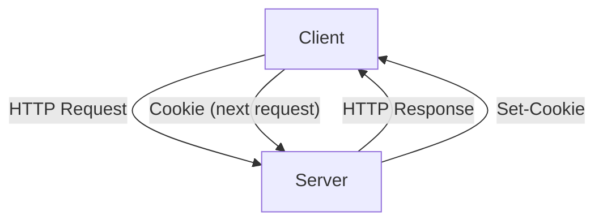

*Stateless HTTP with session management using cookies.*

### HTTP/1.1, HTTP/2, and HTTP/3 — One Sentence Each

| Version  | Year | One-line summary                                                              | Key benefit                             |
|----------|------|-------------------------------------------------------------------------------|------------------------------------------|
| HTTP/1.1 | 1997 | One request at a time per TCP connection (browsers open ~6 connections/host) | The web ran on this for 20 years         |
| HTTP/2   | 2015 | Multiplexes many requests over one TCP connection; binary framing             | Eliminates head-of-line blocking at HTTP |
| HTTP/3   | 2022 | Replaces TCP with **QUIC** (over UDP); built-in TLS 1.3                       | No head-of-line blocking at transport; faster reconnects |

**What "head-of-line blocking" means:** in HTTP/1.1, if one request is slow, every request behind it on the same connection waits. HTTP/2 fixed this *at the HTTP layer* — but TCP itself still blocks on packet loss, so HTTP/3 jumped to QUIC (UDP-based) to fix it at the transport layer too.

**For system design interviews:** "We'll use HTTP/2 for the API since it lets the browser parallelize 100 requests over one connection. For mobile clients on flaky networks, HTTP/3's connection migration is a nice-to-have."

### HTTPS — Secure HTTP

- **HTTPS = HTTP + SSL/TLS encryption.**
- Uses **port 443** instead of port 80.
- Encrypts communication; essential for sensitive data (banking, e-commerce, login, payments).

**Benefits:**

- **Confidentiality:** Encrypts data to keep it private.
- **Integrity:** Ensures data is tamper-proof during transfer.
- **Authentication:** Verifies server identity to prevent impersonation.

```
HTTP (port 80)         HTTPS (port 443, encrypted)
+-------------+        +-------------+
|  Client     |        |  Client     |
|  ---------  |        |  ---------  |
|  Server     |        |  Server     |
+-------------+        +-------------+
```

**Always use HTTPS** for any sensitive data (login, payments, banking, e-commerce, APIs).

### Code: HTTP in Action

**cURL example:**

```bash
curl -X GET "https://api.example.com/users/123" -H "Authorization: Bearer <token>"
```

**Python `requests` library — GET:**

```python
import requests

# GET request
response = requests.get('https://api.example.com/products/123')
print(response.status_code)              # 200
print(response.headers['Content-Type'])  # application/json
print(response.json())
```

**Python `requests` library — POST:**

```python
import requests

payload = {"name": "Alice"}
response = requests.post("https://jsonplaceholder.typicode.com/users", json=payload)
print(response.status_code)   # 201
print(response.json())
```

**JavaScript Fetch API — GET:**

```javascript
fetch('https://jsonplaceholder.typicode.com/users/1')
  .then(res => res.json())
  .then(data => console.log(data));
```

**JavaScript Fetch API — POST:**

```javascript
fetch('https://jsonplaceholder.typicode.com/users', {
  method: 'POST',
  headers: {'Content-Type': 'application/json'},
  body: JSON.stringify({name: 'Alice'})
})
  .then(res => res.json())
  .then(data => console.log(data));
```

**Express.js endpoint:**

```javascript
const express = require('express');
const app = express();

app.get('/users/:id', (req, res) => {
  res.json({ id: req.params.id, name: 'Alice' });
});
```

### HTTP — Interview-Ready Questions

- What is HTTP and how does it work?
- Why is HTTP considered stateless, and how do you manage state?
- Explain the HTTP request-response cycle with an example.
- When would you use PUT vs. PATCH?
- List and explain key HTTP status codes.
- What's the difference between HTTP and HTTPS?
- How do cookies, sessions, and tokens differ?
- How does caching work in HTTP?
- What security issues exist in HTTP, and how are they mitigated?

---

## REST & RESTfulness — API Design Principles

**REST (Representational State Transfer)** is the de facto standard for designing web APIs. Introduced by **Roy Fielding** in his 2000 doctoral dissertation, it's an architectural style — *not a protocol* — for designing networked applications.

### What is REST?

REST leverages **standard HTTP methods** (GET, POST, PUT, DELETE) and stateless communication to enable simple, scalable data exchange.

**Key Idea:**

- Operates over HTTP (stateless, cacheable, uniform interface).
- Each client request contains all necessary information.
- The server does **not** store session data between requests.

### Why REST Matters

- **Simplicity & Scalability:** Uses standard HTTP methods; easy to understand and implement. Statelessness enables horizontal scaling.
- **Interoperability:** Platform-agnostic — works across browsers, mobile, IoT, and more.
- **Efficiency:** Enables caching, reduces server loads, and improves response times.
- **Real-World Use:** Powering APIs for Twitter, GitHub, Google, and countless more.

### Core REST Constraints

RESTful architecture is defined by several key constraints:

| Constraint              | Description                                                                          |
|-------------------------|--------------------------------------------------------------------------------------|
| Client-Server           | Separation of concerns between client and server                                     |
| Stateless               | Each request contains all information; server keeps no session between requests      |
| Cacheable               | Responses can be cached to improve performance                                       |
| Layered System          | Architecture composed of hierarchical layers (load balancers, proxies, security)     |
| Uniform Interface       | Standardized communication between client and server                                 |
| Code-on-Demand (optional)| Servers can send executable code (e.g., JavaScript) to clients to extend functionality |

### REST Architecture Diagram

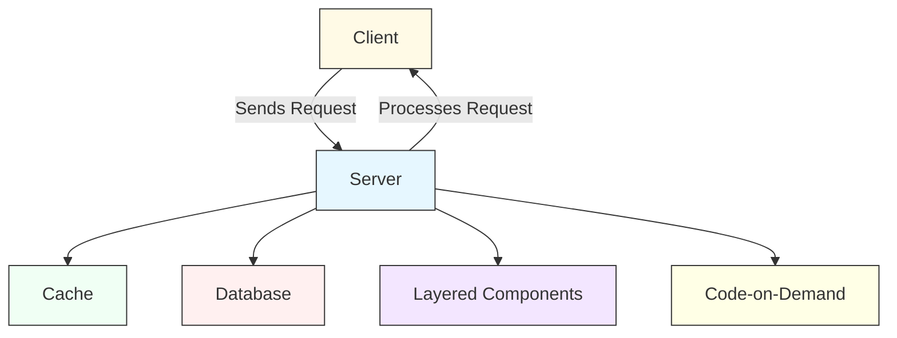

Or, in simple ASCII:

```
  +--------+        HTTP Request        +--------+
  | Client |  ---------------------->   | Server |
  +--------+  <----------------------   +--------+
                 HTTP Response
```

### RESTful API Design Principles

#### 1. Resource-Based Approach

Design endpoints around _resources_, not _actions_. Treat every entity (user, order, product) as a resource, accessed via unique URIs.

| Resource    | Endpoint Example       |
|-------------|------------------------|
| User        | `/users/{id}`          |
| Orders      | `/orders`              |
| Products    | `/products/{id}`       |

**Don't:** `POST /createUser`
**Do:** `POST /users`

#### 2. Proper HTTP Methods Usage

| HTTP Method | Purpose                | Example                  |
|-------------|------------------------|--------------------------|
| GET         | Retrieve resource(s)   | `GET /users/123`         |
| POST        | Create new resource    | `POST /orders`           |
| PUT         | Update entire resource | `PUT /users/123`         |
| PATCH       | Partial update         | `PATCH /users/123`       |
| DELETE      | Remove resource        | `DELETE /users/123`      |

#### 3. Stateless Interactions

Each request must be self-contained. For authentication, use stateless mechanisms like JWT tokens rather than server-side sessions.

```http
GET /users/42 HTTP/1.1
Authorization: Bearer <jwt-token>
```

#### 4. Consistent URL Structure

- Use **plural nouns**: `/users`, `/orders`.
- **Avoid verbs** in URLs: `/users/activate` ❌ → Use `PATCH /users/{id}` ✅.
- **Versioning:** `/v1/users` for backward compatibility.

### Resource Structure Diagram

```text
/-------------------\
|    API ROOT       |
|    /api/v1        |
\-------------------/
        |
  ---------------
  |     |     |
/users /orders /products

Examples:
GET    /users/1
POST   /orders
DELETE /products/42
```

### Resource & Endpoint Examples

#### Get a User

```http
GET /users/123 HTTP/1.1
Host: api.example.com
Accept: application/json
```

**Response:**

```json
{
  "id": 123,
  "name": "Alice",
  "email": "alice@example.com"
}
```

#### Create a New Order

```http
POST /orders HTTP/1.1
Host: api.example.com
Content-Type: application/json

{
  "product_id": 456,
  "quantity": 2
}
```

**Response:**

```http
HTTP/1.1 201 Created
Location: /orders/789
```

### JSON vs. XML in REST APIs

| Feature         | JSON                                  | XML                                    |
|-----------------|---------------------------------------|----------------------------------------|
| **Lightweight** | Yes                                   | No (more verbose)                      |
| **Readability** | Easy for humans/machines              | Less readable                          |
| **Speed**       | Faster parsing (native in JS)         | Slower                                 |
| **Use Cases**   | Modern APIs, web/mobile apps          | Legacy systems, strict schema needs    |

**Pro tip:** Use JSON unless integrating with legacy systems or requiring strict schema validation (where XML + XSD shines).

**Content negotiation example:**

```http
GET /users/1
Accept: application/json
```

```http
GET /users/123
Accept: application/xml
```

Server returns the requested format if supported.

### Real-World REST API Examples

#### Twitter API

- **Fetch tweets:** `GET /tweets/{id}`
- **Post a tweet:** `POST /tweets`

#### GitHub API

- **Get repo details:** `GET /repos/{owner}/{repo}`
- **Create an issue:** `POST /repos/{owner}/{repo}/issues`

#### Sequence diagram of a Twitter API call

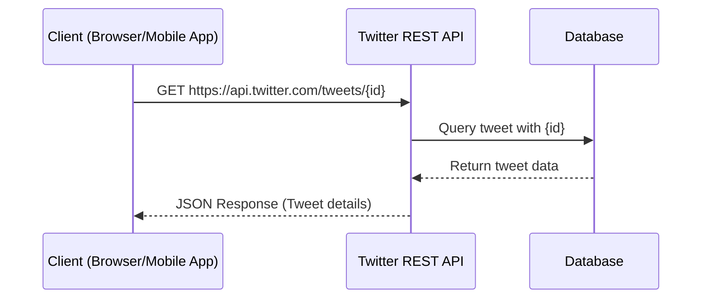

### Code: A Full RESTful API in Node.js/Express

```js
const express = require('express');
const app = express();
app.use(express.json());

let users = [{ id: 1, name: "Alice" }, { id: 2, name: "Bob" }];

// GET /users
app.get('/users', (req, res) => {
  res.json(users);
});

// GET /users/:id
app.get('/users/:id', (req, res) => {
  const user = users.find(u => u.id == req.params.id);
  if (!user) return res.status(404).json({ error: "Not Found" });
  res.json(user);
});

// POST /users
app.post('/users', (req, res) => {
  const newUser = { id: Date.now(), ...req.body };
  users.push(newUser);
  res.status(201).json(newUser);
});

// PUT /users/:id
app.put('/users/:id', (req, res) => {
  const idx = users.findIndex(u => u.id == req.params.id);
  if (idx === -1) return res.status(404).json({ error: "Not Found" });
  users[idx] = { ...users[idx], ...req.body };
  res.json(users[idx]);
});

// DELETE /users/:id
app.delete('/users/:id', (req, res) => {
  users = users.filter(u => u.id != req.params.id);
  res.status(204).send();
});

app.listen(3000, () => console.log('REST API listening on 3000'));
```

A more compact version showing the four CRUD verbs:

```javascript
const express = require('express');
const app = express();

app.get('/users/:id', (req, res) => { /* retrieve user */ });
app.post('/orders', (req, res) => { /* create order */ });
app.put('/users/:id', (req, res) => { /* update user */ });
app.delete('/users/:id', (req, res) => { /* delete user */ });

app.listen(3000);
```

A Python Flask equivalent:

```python
from flask import Flask, jsonify, request
app = Flask(__name__)

@app.route('/users/<int:user_id>', methods=['GET'])
def get_user(user_id):
    return jsonify({'id': user_id, 'name': 'Alice'})

@app.route('/orders', methods=['POST'])
def create_order():
    data = request.get_json()
    # Process order...
    return jsonify({'status': 'created'}), 201
```

### Best Practices

- **Use proper HTTP status codes:** `200`, `201`, `204`, `400`, `401`, `403`, `404`, `500`.
- **Version your API:** `/v1/users` vs. `/v2/users`.
- **Implement authentication/authorization:** OAuth2, JWT tokens, always over HTTPS.
- **Pagination for large datasets:** `GET /users?page=2&limit=50`.
- **Consistent URL structure:** Plural nouns for collections, no verbs in URLs.
- **HATEOAS:** (Hypermedia as the Engine of Application State) — for discoverable APIs in advanced scenarios.

### Common Pitfalls

- **Verbs in URLs:** `/createUser` ❌ → `POST /users` ✅.
- **Don't ignore error handling:** Always return meaningful status codes/messages.
- **Don't expose internal data structures.**
- **Don't forget input validation.**

### REST — Interview Questions

- What are the core constraints of REST?
- Explain the difference between PUT and PATCH.
- How do you implement authentication and authorization in REST APIs?
- How does caching work in RESTful APIs?
- Compare REST, GraphQL, and gRPC.

### REST — Further Reading

- [RESTful API Design — Best Practices in a Nutshell](https://restfulapi.net/)
- [OpenAPI Specification](https://swagger.io/specification/)
- [Postman](https://www.postman.com/) (for testing APIs)

---

## Real-Time Communication Protocols

In modern system design, delivering **instant updates** to users — whether in chat apps, stock tickers, online games, or live notifications — is a critical requirement. Traditional HTTP request-response models often fall short due to their inherent latency and inefficiency.

### What is Real-Time Communication?

**Real-time communication** refers to the continuous exchange of data with minimal latency between clients and servers. Unlike traditional HTTP, where data is fetched only on explicit user requests, real-time systems push updates instantly, enabling interactive and responsive user experiences.

**Examples:**

- WhatsApp/Slack chat
- Live stock market prices
- Multiplayer gaming
- Live sports score streaming
- Notification systems

### Why Not Just Use HTTP?

HTTP follows a **request-response** model:

```
Client: --------> [Request] --------> Server
Client: <-------- [Response] <-------- Server
```

**Drawbacks for real-time use:**

- **High latency:** Client must wait for updates.
- **Inefficiency:** Repeated requests even when no updates.
- **Scalability issues:** Server load increases with polling.

| Feature        | Traditional HTTP        | Real-Time Needed      |
|----------------|-------------------------|-----------------------|
| Model          | Request-Response        | Continuous exchange   |
| Latency        | High (client waits)     | Low                   |
| Overhead       | Repeated connections    | Persistent connection |
| Server Push    | No                      | Yes                   |

### Server-Sent Events (SSE) — The Forgotten Middle Option

Most courses jump straight from "long polling" to "WebSockets," but **SSE** is the right answer for many one-way real-time use cases.

**What it is:** A long-lived HTTP response that streams events from server to client. Built on plain HTTP/1.1 or HTTP/2 — no protocol upgrade needed.

**Use SSE when:**
- Server → client only (notifications, live feeds, stock tickers, log streaming).
- You want HTTP/proxy/firewall friendliness with no custom infra.
- Auto-reconnect should be free.

**Use WebSocket when:**
- Bidirectional, high-frequency (chat, multiplayer games, collaborative editing).
- Binary data matters.

| Feature              | Long Polling | SSE      | WebSocket           |
|----------------------|--------------|----------|---------------------|
| Direction            | C ↔ S        | S → C only | Bidirectional     |
| Transport            | HTTP         | HTTP     | TCP (upgrade from HTTP) |
| Auto-reconnect       | manual       | built-in | manual              |
| Browser support      | universal    | universal (except IE) | universal |
| Binary frames        | no           | no       | yes                 |
| Proxy/firewall friendly | yes       | yes      | sometimes problematic |

> **Rule of thumb:** Need one-way push? Use SSE. Need bidirectional? Use WebSocket. Need legacy compatibility? Long polling.

### Major Approaches to Real-Time Data Exchange

| Technique                | Description                                                | Bi-directional | Overhead          | Latency   |
|--------------------------|------------------------------------------------------------|---------------|--------------------|-----------|
| Polling                  | Client repeatedly requests updates at intervals            | No            | High               | High      |
| **WebSockets**           | Persistent, full-duplex TCP connection                     | Yes           | Low                | Very low  |
| Server-Sent Events (SSE) | Server pushes updates to client (unidirectional)           | No            | Medium             | Low       |
| **Long Polling**         | Client request held open until new data is available       | No            | Lower than polling | Medium    |

### Polling vs. Long Polling vs. WebSockets

| Protocol      | Real-Time | Bi-Directional | Persistent | Overhead |
|---------------|-----------|----------------|------------|----------|
| Polling       | No        | No             | No         | High     |
| Long Polling  | Yes       | No             | No         | Moderate |
| WebSockets    | Yes       | Yes            | Yes        | Low      |

### WebSockets: Persistent, Full-Duplex Communication

WebSockets provide a **persistent, full-duplex TCP connection** between client and server. Once established, data can flow in both directions at any time, with minimal overhead.

**Analogy:** Like a phone call (continuous conversation) vs. sending letters (HTTP requests).

#### How WebSockets Work — Step-by-Step

1. **Handshake:** Client sends HTTP request with an `Upgrade: websocket` header.
2. **Upgrade:** Server replies with `101 Switching Protocols` if it supports WebSockets.
3. **Data Exchange:** Both client and server can send/receive messages in real time (as frames).
4. **Close:** Either party can terminate the connection.

#### WebSocket Handshake Diagrams

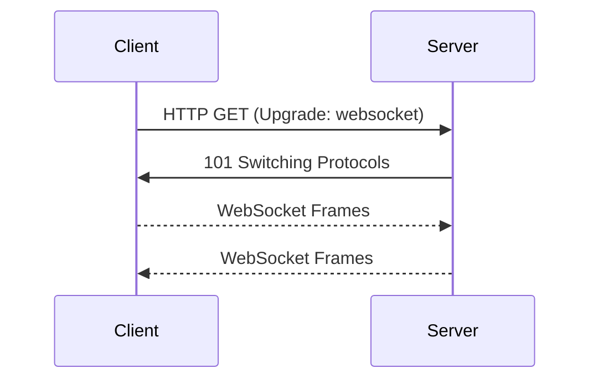

A more detailed lifecycle view:

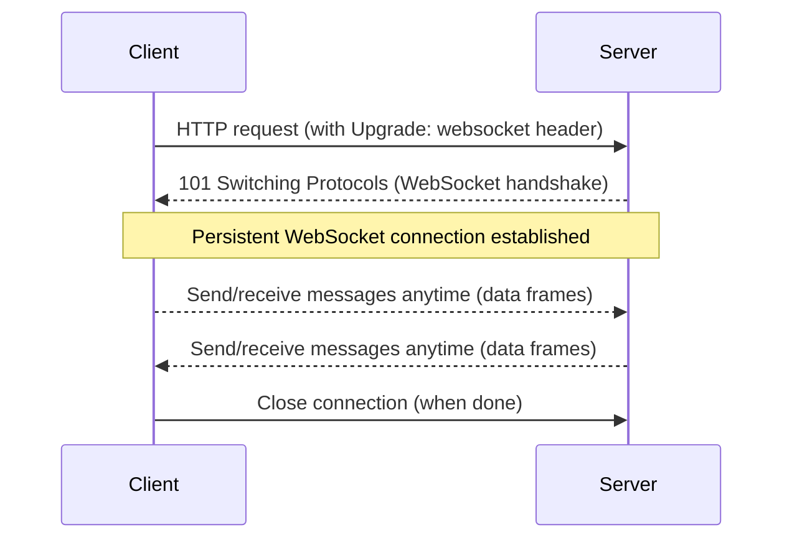

```
Client             Server
  |   HTTP Upgrade  |
  |---------------> |
  | <--- 101 SW     |
  |                 |  (Connection Open)
  | <-- Data -----> |
  | <---- Data ---- |
  |    ...          |
  |  [Close Frame]  |
  |---------------> |
  |    (Closed)     |
```

WebSocket handshake at the HTTP level:

```http
GET /chat HTTP/1.1
Host: server.example.com
Upgrade: websocket
Connection: Upgrade
```

Server responds:

```http
HTTP/1.1 101 Switching Protocols
Upgrade: websocket
Connection: Upgrade
```

#### Code: WebSocket Server in Node.js

```js
const WebSocket = require('ws');
const wss = new WebSocket.Server({ port: 8080 });

wss.on('connection', ws => {
  ws.send('Hello WebSocket!');
  ws.on('message', message => {
    console.log('received:', message);
  });
});
```

An echo server with explicit logging:

```js
const WebSocket = require('ws');
const wss = new WebSocket.Server({ port: 8080 });

wss.on('connection', (ws) => {
  console.log('Client connected');
  ws.on('message', (message) => {
    console.log(`Received: ${message}`);
    ws.send(`Server echo: ${message}`);
  });
});
```

#### Code: WebSocket Client

Vanilla JavaScript:

```js
const ws = new WebSocket('ws://localhost:8080');
ws.onopen = () => ws.send('Hello, Server!');
ws.onmessage = e => console.log('Server:', e.data);
```

In a browser script tag:

```html
<script>
const socket = new WebSocket('ws://localhost:8080');
socket.onopen = () => socket.send('Hello, server!');
socket.onmessage = (event) => {
  console.log('Received:', event.data);
};
</script>
```

Secure WebSockets (`wss://`):

```js
const ws = new WebSocket('wss://echo.websocket.org');
ws.onopen = () => ws.send('Hello, WebSocket!');
ws.onmessage = (event) => console.log('Received:', event.data);
```

#### When to Use WebSockets?

- High-frequency, bidirectional data exchange.
- Low latency is critical (e.g., multiplayer gaming, chat, live trading).

**Use cases:**

- Live chat (WhatsApp, Slack, Discord)
- Real-time stock price updates (NASDAQ)
- Online games (Fortnite, Call of Duty)
- Collaborative tools (Google Docs)

#### Advantages

- **Persistent connection:** No need to reconnect for every message.
- **Low overhead:** Eliminates repeated HTTP requests.
- **Truly real-time:** Both sides can push data instantly.
- **Efficient:** Saves bandwidth and reduces server load.

### Long Polling: Simulating Real-Time over HTTP

**Long polling** is a technique where the client sends an HTTP request and the server *holds* the connection open until new data is available. Once data is sent, the client immediately re-requests, creating a loop that simulates real-time updates.

**Difference from regular polling:**

- Regular polling responds immediately (even if there's no new data).
- **Long polling** holds the request until new data is available.

#### How Long Polling Works — Step-by-Step

1. Client sends an HTTP request (e.g., `GET /updates`).
2. Server holds the request open until new data is ready.
3. Server responds with new data.
4. Client immediately sends another request (cycle repeats).

#### Long Polling Flow Diagrams

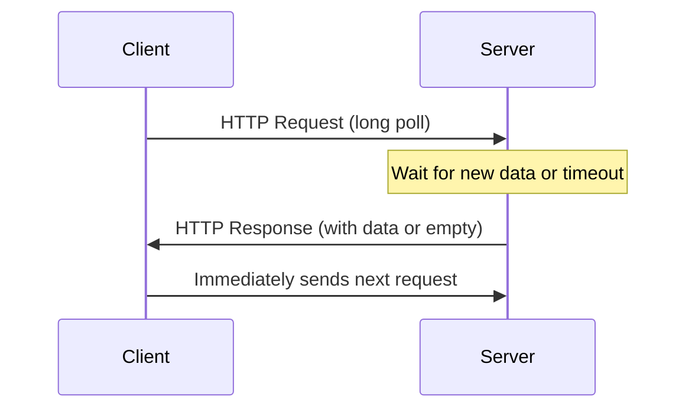

A version with `alt` branches:

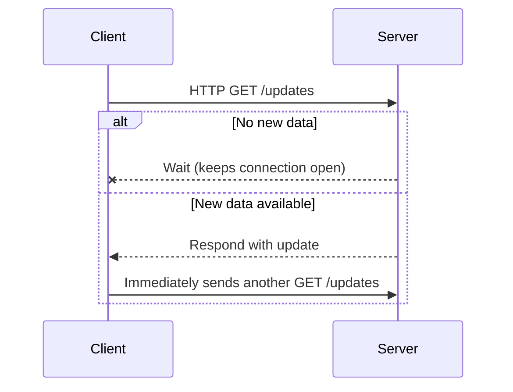

And another, using `Note over` to show the server holding the request:

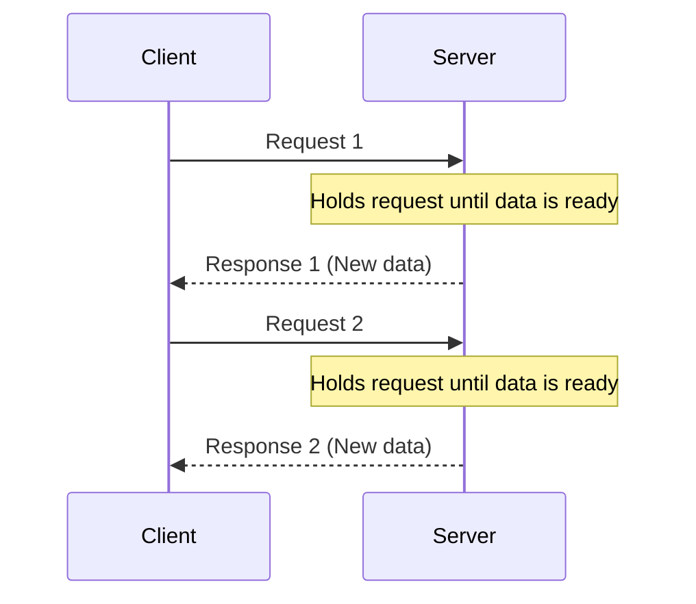

#### Code: Long Polling in Node.js/Express

A simple version with a `clients` queue:

```js
const express = require('express');
const app = express();

let latestMessage = null, clients = [];

app.get('/poll', (req, res) => {
  if (latestMessage) {
    res.json({ message: latestMessage });
    latestMessage = null;
  } else {
    clients.push(res); // Hold the request
  }
});

app.post('/send', express.json(), (req, res) => {
  latestMessage = req.body.message;
  clients.forEach(c => c.json({ message: latestMessage }));
  clients = [];
  res.sendStatus(200);
});
```

A version that polls internally with `setTimeout`:

```js
const express = require('express');
const app = express();
let lastMessage = null;

app.get('/updates', (req, res) => {
  const checkForUpdate = () => {
    if (lastMessage) {
      res.json({ message: lastMessage });
      lastMessage = null;
    } else {
      setTimeout(checkForUpdate, 1000); // check again in 1s
    }
  };
  checkForUpdate();
});

app.post('/send', express.json(), (req, res) => {
  lastMessage = req.body.message;
  res.sendStatus(200);
});

app.listen(3000, () => console.log('Long polling server running on 3000'));
```

A version that uses a `clients` array and broadcasts on an interval:

```js
const express = require('express');
const app = express();
let clients = [];

app.get('/events', (req, res) => {
  clients.push(res);
});

function sendEvent(data) {
  clients.forEach(res => res.json(data));
  clients = [];
}

// Simulate sending an event every 5 seconds
setInterval(() => sendEvent({ message: "New update!" }), 5000);

app.listen(3000, () => console.log('Long polling server on port 3000'));
```

#### Code: Long Polling Client

```js
async function poll() {
  const { message } = await fetch('/poll').then(r => r.json());
  display(message);
  poll(); // Immediately poll again
}
poll();
```

A slightly different form:

```js
async function poll() {
  const res = await fetch('/updates');
  const data = await res.json();
  console.log('Received:', data.message);
  poll(); // Immediately start again
}
poll();
```

#### When to Use Long Polling?

- **WebSockets not supported** (legacy infrastructure, restrictive firewalls).
- **Low/periodic update frequency is acceptable.**

**Use cases:**

- Notifications (Twitter, social media)
- IoT device updates (intermittent connectivity)

#### Advantages

- Works with standard HTTP infrastructure (proxies, firewalls).
- No need for special protocol support.
- Reduces unnecessary polling compared to fixed-interval polling.
- Easier to implement in REST-based systems.

#### Limitations

- Higher latency than WebSockets.
- Not truly bi-directional; mostly server-to-client.
- Slightly more overhead due to repeated HTTP requests.

### WebSockets vs. Long Polling — When to Use Which?

| Feature               | WebSockets                            | Long Polling                       |
|-----------------------|---------------------------------------|------------------------------------|
| Connection            | Persistent TCP (single connection)    | Multiple HTTP requests             |
| Directionality        | Bi-directional                        | Typically server-to-client         |
| Latency               | Very low                              | Low to moderate                    |
| Overhead              | Minimal (after handshake)             | Higher (HTTP headers per req)      |
| Scalability           | Harder to scale, needs sticky sessions| Easier to scale horizontally       |
| Use Cases             | Chat, gaming, trading, collab docs    | Notifications, IoT, simple updates |
| Browser Support       | Modern browsers                       | Universal                          |

A more decision-oriented version:

| Scenario                                       | WebSockets       | Long Polling           |
|------------------------------------------------|------------------|------------------------|
| **High-frequency, bidirectional updates**      | Best choice      | Not suitable           |
| **Low-latency critical (gaming, chat)**        | Yes              | No                     |
| **Environments without WebSocket support**     | No               | Good alternative       |
| **Periodic, low-frequency updates**            | Overkill         | Good choice            |
| **Needs to work with proxies/firewalls**       | Sometimes tricky | Yes                    |
| **Both client/server need to send at any time**| Bidirectional    | Only client can start  |

**Real-world examples:**

- **WebSockets:** Slack chat, Fortnite, real-time stock tickers
- **Long Polling:** Twitter notifications, IoT sensors

### Quick Decision Guide

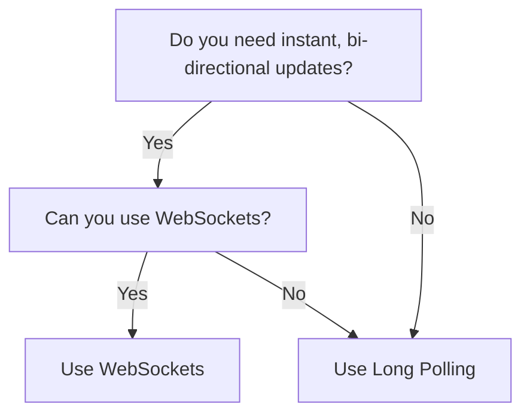

### Real-Time — Tips for System Design Interviews

- **Scalability — WebSockets:** Require load balancers that support sticky sessions or WebSocket proxying (e.g., NGINX with `proxy_pass` + `upgrade` headers).
- **Scalability — Long Polling:** Easier to scale horizontally; requests are stateless. Can leverage existing RESTful infrastructure.
- **Fallback:** Try WebSockets, then degrade gracefully to Long Polling if not supported. Always provide a fallback for browsers/environments without WebSocket support.
- **Coordination across servers:** Use a message broker (e.g., Redis Pub/Sub) to coordinate state across multiple backend servers for WebSockets.
- **Security:** Always use `wss://` (WebSockets over TLS) in production. Authenticate connections (JWT, OAuth). Validate and sanitize all incoming data.
- **Resource cleanup:** Always handle connection close events to free up server resources. For long polling, ensure you properly close connections on timeouts or client disconnects.
- **Rate limiting:** Protect your endpoints from abuse, especially in long polling.
- **Testing:** Simulate slow clients and network interruptions. Test reconnection and error handling. Use tools like [wscat](https://github.com/websockets/wscat) for WebSocket debugging.

### Real-Time — Further Reading

- [MDN — WebSockets](https://developer.mozilla.org/en-US/docs/Web/API/WebSockets_API)
- [Node.js `ws` Documentation](https://github.com/websockets/ws)
- [Socket.IO Docs](https://socket.io/docs/)
- [RFC 6455 — The WebSocket Protocol](https://datatracker.ietf.org/doc/html/rfc6455)

---

## Modern API Protocols — gRPC & GraphQL

While **REST** has long been the standard, modern applications often demand more. As system complexity and client demands have grown, REST shows limitations — and protocols like **gRPC** and **GraphQL** address them.

### Why Go Beyond REST?

- **Over-fetching & Under-fetching:** REST endpoints often return too much or too little data.
- **Multiple round trips:** Fetching related entities may need several requests.
- **Not real-time optimized:** REST primarily uses polling for updates, which is inefficient for real-time needs.

**Example problem:** Fetching a user profile, but only needing name and email:

```http
GET /users/123

{
  "id": 123,
  "name": "Alice",
  "email": "alice@example.com",
  "bio": "...",
  "created_at": "...",
  // ...lots of unused fields
}
```

### Modern Solutions: gRPC & GraphQL

| Protocol       | Focus                       | Serialization              | Strengths                          | Best Use Case               |
|----------------|-----------------------------|----------------------------|------------------------------------|-----------------------------|
| REST           | Simplicity                  | JSON/XML                   | Ubiquity, easy debugging           | Public APIs                 |
| **gRPC**       | Performance & Microservices | Protocol Buffers (binary)  | Speed, streaming, multi-language   | Microservices, real-time    |
| **GraphQL**    | Flexibility                 | JSON                       | Custom data queries, aggregation   | Frontend, mobile, dashboards|

### gRPC — High-Performance Remote Procedure Calls

**gRPC** is a high-performance, open-source RPC framework developed by Google. It shines in microservices architectures and real-time systems.

#### How Does gRPC Work?

- **Built on HTTP/2**, allowing:
  - **Multiplexed requests:** Multiple calls over one connection
  - **Compression:** Smaller payload sizes
  - **Full-duplex streaming:** Real-time bidirectional communication
- **Uses Protocol Buffers (Protobuf):** Smaller and faster serialization than JSON.
- **Auto-generates code:** For many languages (Go, Java, Python, etc.).
- **Supports full duplex streaming:** Both client and server can send/receive data in real time.

#### gRPC Communication Flow

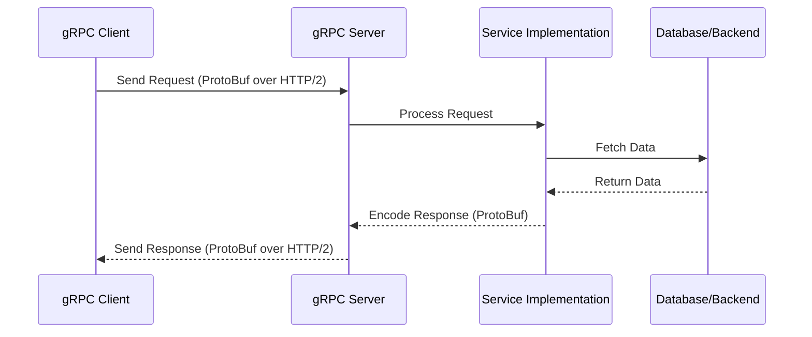

#### Client-Server Serialization Diagram

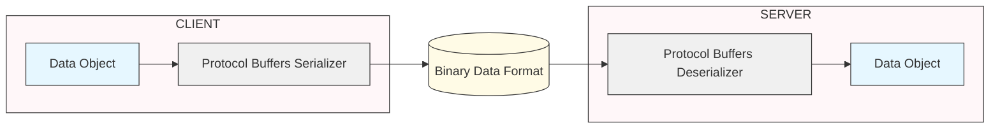

#### gRPC Architecture (ASCII)

```plaintext
+-------------+        HTTP/2 + Protobuf        +-------------+
|  Client     | <==============================>|   Server    |
| (auto-code) |          (binary, fast)         | (auto-code) |
+-------------+                                 +-------------+
         ^                                          ^
         |<--- Bidirectional Streaming ------------>|
```

Or, simpler:

```
Client (any language)
    |
    |  (HTTP/2 + Protobuf)
    V
gRPC Server (any language)
```

#### gRPC Service Definitions — Protobuf

A simple Greeter service:

```protobuf
syntax = "proto3";

service Greeter {
  rpc SayHello (HelloRequest) returns (HelloReply) {}
}

message HelloRequest {
  string name = 1;
}

message HelloReply {
  string message = 1;
}
```

A UserService with streaming:

```protobuf
// user.proto
syntax = "proto3";

service UserService {
  rpc GetUser (UserRequest) returns (UserResponse) {}
  rpc StreamUsers (stream UserRequest) returns (stream UserResponse) {} // bi-directional streaming
}

message UserRequest {
  int32 id = 1;
}

message UserResponse {
  int32 id = 1;
  string name = 2;
  string email = 3;
}
```

A UserService with activity streaming:

```protobuf
syntax = "proto3";

service UserService {
  rpc GetUser (UserRequest) returns (UserResponse);
  rpc StreamUserActivity (ActivityRequest) returns (stream ActivityEvent);
}

message UserRequest {
  string user_id = 1;
}

message UserResponse {
  string name = 1;
  string email = 2;
}

message ActivityRequest {
  string user_id = 1;
}

message ActivityEvent {
  string activity = 1;
  int64 timestamp = 2;
}
```

#### Code: gRPC Python Server

A skeleton Greeter:

```python
import grpc
from concurrent import futures
import helloworld_pb2
import helloworld_pb2_grpc

class Greeter(helloworld_pb2_grpc.GreeterServicer):
    def SayHello(self, request, context):
        return helloworld_pb2.HelloReply(message='Hello, %s!' % request.name)

server = grpc.server(futures.ThreadPoolExecutor(max_workers=10))
helloworld_pb2_grpc.add_GreeterServicer_to_server(Greeter(), server)
server.add_insecure_port('[::]:50051')
server.start()
server.wait_for_termination()
```

A UserService with streaming activity:

```python
import grpc
from concurrent import futures
import time
import user_pb2
import user_pb2_grpc

class UserService(user_pb2_grpc.UserServiceServicer):
    def GetUser(self, request, context):
        # Fetch user logic
        return user_pb2.UserResponse(name="Alice", email="alice@example.com")

    def StreamUserActivity(self, request, context):
        # Streaming logic
        for activity in fetch_activities(request.user_id):
            yield user_pb2.ActivityEvent(activity=activity, timestamp=int(time.time()))

server = grpc.server(futures.ThreadPoolExecutor(max_workers=10))
user_pb2_grpc.add_UserServiceServicer_to_server(UserService(), server)
server.add_insecure_port('[::]:50051')
server.start()
```

#### Code: gRPC Python Client

```python
import grpc
import user_pb2
import user_pb2_grpc

channel = grpc.insecure_channel('localhost:50051')
stub = user_pb2_grpc.UserServiceStub(channel)
response = stub.GetUser(user_pb2.UserRequest(id=123))
print(response.name, response.email)
```

Variant using the `UserServiceStub` directly:

```python
import grpc
from user_pb2 import UserRequest
from user_pb2_grpc import UserServiceStub

channel = grpc.insecure_channel('localhost:50051')
stub = UserServiceStub(channel)
response = stub.GetUser(UserRequest(user_id='123'))
print(response.name, response.email)
```

#### Code: gRPC Go Client

```go
resp, err := client.GetUser(ctx, &pb.UserRequest{Id: 42})
```

Server-side Go example:

```go
func (s *server) GetUser(ctx context.Context, req *pb.UserRequest) (*pb.UserResponse, error) {
    // fetch user from DB
    return &pb.UserResponse{Name: "Alice", Email: "alice@example.com", Age: 30}, nil
}
```

#### When to Use gRPC

- **Microservices communication:** Efficient inter-service calls.
- **Real-time streaming:** Video, analytics, trading platforms.
- **IoT / low-bandwidth environments:** Small, binary payloads.
- **Multi-language ecosystems:** Auto-generated clients/servers in Go, Java, Python, etc.

**Not for:** Public APIs requiring easy debugging, browser-based clients (gRPC-Web exists but is still limited compared to REST/GraphQL).

### GraphQL — Flexible Query Language for APIs

**GraphQL** is a flexible query language and runtime for APIs developed by Facebook, enabling clients to request exactly what they need — no more, no less.

#### How GraphQL Works

- **Single endpoint:** Clients query exactly what they need at `/graphql` instead of multiple REST endpoints.
- **Schema-driven:** Strongly-typed schema defines data and relationships.
- **Dynamic responses:** Server assembles responses per request.

#### GraphQL Communication Flow

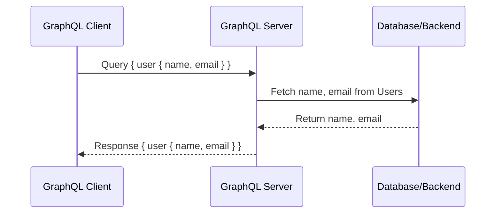

```
[Client] --(POST /graphql { query })--> [GraphQL Server] --(resolves fields)--> [Database/APIs]
```

#### GraphQL Query Example

```graphql
query {
  user(id: "1") {
    id
    name
    posts {
      title
      comments {
        text
      }
    }
  }
}
```

A query with arguments:

```graphql
query {
  user(id: 123) {
    name
    email
    recentTransactions {
      id
      amount
    }
  }
}
```

#### GraphQL Response Example

```json
{
  "data": {
    "user": {
      "name": "Alice",
      "email": "alice@example.com",
      "recentTransactions": [
        {"id": 1, "amount": 100},
        {"id": 2, "amount": 50}
      ]
    }
  }
}
```

A more nested example:

```json
{
  "data": {
    "user": {
      "id": 42,
      "name": "Alice",
      "posts": [
        { "title": "First Post", "date": "2023-01-01" }
      ]
    }
  }
}
```

#### GraphQL Schema Example (SDL)

```graphql
type User {
  id: ID!
  name: String!
  email: String!
  recentTransactions: [Transaction]
}

type Transaction {
  id: ID!
  amount: Float!
}

type Query {
  user(id: ID!): User
}
```

A schema with arguments on a field:

```graphql
type User {
  id: ID!
  name: String!
  email: String!
  transactions(last: Int): [Transaction]
}

type Transaction {
  amount: Float!
  date: String!
}

type Query {
  user(id: ID!): User
}
```

#### Code: GraphQL Server (Node.js + Apollo)

```js
const { ApolloServer, gql } = require('apollo-server');

const typeDefs = gql`
  type User { id: ID!, name: String!, posts: [Post!]! }
  type Post { title: String!, comments: [Comment!]! }
  type Comment { text: String! }
  type Query { user(id: ID!): User }
`;

const resolvers = {
  Query: {
    user: (_, { id }) => ({ id, name: "Alice", posts: [] }),
  },
};

const server = new ApolloServer({ typeDefs, resolvers });
server.listen().then(({ url }) => console.log(`Server ready at ${url}`));
```

A version with resolvers on a nested field:

```js
const resolvers = {
  Query: {
    user: (parent, args, context) => fetchUserById(args.id)
  },
  User: {
    transactions: (user, args) => fetchRecentTransactions(user.id, args.last)
  }
};
```

#### When to Use GraphQL

- **Frontend optimization:** Mobile/web clients fetch only what they need.
- **Reducing API requests:** Replace many REST calls with one query.
- **Aggregating data:** Unify multiple databases/services in a single API.
- **Slow/unstable networks:** Smaller, client-tailored payloads.
- **When frontend teams change frequently or need agility.**

**Not for:** Simple CRUD APIs (REST is enough); scenarios with complex authorization rules can be harder.

### REST vs. gRPC vs. GraphQL — Comparison

| Feature             | REST              | gRPC                       | GraphQL                |
|---------------------|-------------------|----------------------------|------------------------|
| Serialization       | JSON/XML          | Protocol Buffers (binary)  | JSON                   |
| Transport           | HTTP/1.1          | HTTP/2                     | HTTP/1.1 or 2          |
| Flexibility         | Low               | Medium                     | High                   |
| Performance         | Medium            | High                       | Medium                 |
| Real-Time Support   | Poor (Polling)    | Excellent (streaming)      | Good (Subscriptions)   |
| Language Support    | Universal         | Multi-language             | Universal              |
| Code Generation     | Manual            | Auto-generated             | Manual / tools         |
| Browser Support     | Excellent         | Limited (gRPC-Web)         | Excellent              |
| Over/Under-fetching | Yes               | No                         | No                     |
| Tooling             | Mature            | Evolving                   | Evolving               |
| Best For            | Public APIs, CRUD | Microservices, real-time   | Frontend, aggregation  |

### REST vs GraphQL vs gRPC — Visualizing the Data Fetch

```
REST (Multiple Endpoints)
-------------------------
Client
  |
  |--GET /user/123----------------------------->|
  |<--{id, name, email, ...}--------------------|
  |
  |--GET /user/123/transactions---------------->|
  |<--[{amount, date, ...}, ...]---------------|

GraphQL (Single Query)
----------------------
Client
  |
  |--POST /graphql (user + transactions)-------->|
  |<--{user: {name, email, transactions: [...]}}|

gRPC (Single Call, Binary)
--------------------------
Client
  |
  |--GetUser(user_id=123)---------------------->|
  |<--UserResponse(name, email, ...)-----------|
```

### Example: REST vs GraphQL

```http
# REST: Multiple endpoints
GET /users/1
GET /users/1/posts
```

```graphql
# GraphQL: One endpoint, flexible query
POST /graphql
{
  user(id: 1) {
    name
    posts { title }
  }
}
```

### Decision Tree

```
Start
 |
 +-- Does your client require flexible data fetching or aggregation from multiple sources?
 |       +-- Yes: Use GraphQL
 |       +-- No:
 |
 +-- Do you need efficient, low-latency, real-time, or microservice-to-microservice communication?
         +-- Yes: Use gRPC
         +-- No: Use REST
```

### Modern APIs — Tips & Interview Phrases

- **gRPC:** Use for internal systems, not public APIs (browsers don't natively support gRPC).
- **GraphQL:** Use when frontend teams change frequently, or need agility; avoid for simple CRUD APIs.
- **REST:** Still great for simple, stable, widely accessible APIs.
- **Justify your choice:** Explain trade-offs. *"I'd use gRPC for internal microservice comms due to its speed and low latency, but REST or GraphQL for public APIs for broader compatibility."*
- **Security:** All protocols require authentication. gRPC supports TLS; GraphQL needs to guard against complex/expensive queries (query depth limiting, complexity analysis).
- **Versioning:** REST uses URL versioning (`/v1/resource`); gRPC uses proto file evolution; GraphQL evolves the schema with field deprecations.
- **Combine protocols:** It's common to use REST/GraphQL for external APIs and gRPC for internal communication.
- **For real-time needs:** Prefer gRPC (streaming) or GraphQL subscriptions over REST polling.
- **Beware proxies that may not handle HTTP/2 well** when deploying gRPC.

### Modern APIs — Interview Questions

- Compare REST, gRPC, and GraphQL — pros/cons, serialization, real-time capabilities.
- When would you use gRPC over REST? (microservices, internal APIs, streaming)
- What are the trade-offs of GraphQL in large systems? (complexity, caching, security)
- How does gRPC handle authentication? (TLS, token-based, etc.)
- How would you scale a GraphQL API? (caching, batching, complexity analysis)
- How do you prevent over-fetching in REST? (fields projection query params or switch to GraphQL)

### Modern APIs — Further Reading

- [gRPC Official Docs](https://grpc.io/docs/)
- [GraphQL Official Docs](https://graphql.org/learn/)
- [RESTful API Design Guidelines (Microsoft)](https://docs.microsoft.com/en-us/azure/architecture/best-practices/api-design)

---

## Combined Tips & Tricks

A consolidated master list, drawn from across all sections.

### Choosing Protocols

- **Protocol choice matters.** Use TCP for reliability, UDP for speed, HTTP for web, WebSockets for real-time, REST for standard APIs, gRPC for microservices, GraphQL for frontend-driven needs.
- **Always start with requirements.** Is reliability or speed more important? (TCP vs UDP)
- **For critical data** (banking, file transfer), use TCP.
- **For low-latency, real-time** (gaming, chat), use UDP or WebSockets.
- **REST is great for CRUD APIs;** use GraphQL or gRPC for complex, dynamic, or high-performance needs.
- **gRPC is efficient but not browser-native;** use where clients support it (microservices).
- **GraphQL optimizes bandwidth;** use when clients need flexibility in data fetching.

### State Management

- **Handle state properly.** Use tokens or sessions for authentication; avoid storing sensitive data in cookies without encryption.
- **Stateless protocols** (HTTP, REST) need session management — use cookies, tokens, or sessions.
- **Use proper HTTP status codes** — they help debugging and client behavior.

### API Hygiene

- **Use proper HTTP methods.** GET for fetch, POST for create, PUT for update, DELETE for remove.
- **Paginate API responses.** Never return unbounded lists in REST/GraphQL.
- **Version your APIs.** Avoid breaking changes for existing consumers. Use `/v1/`, `/v2/` from day one.
- **Always document your API** (Swagger/OpenAPI).
- **Return helpful error messages** (but not sensitive info).
- **Support filtering, sorting, and searching via query params.**

### Performance

- **Optimize for performance:** Use caching (HTTP headers like `Cache-Control`, `ETag`), pagination for large lists, and WebSockets or gRPC streams for real-time data.
- **Minimize data transfer.** Use compression, caching, and optimize request/response payloads.
- **Implement rate limiting and throttling** to prevent abuse.
- **Set appropriate timeouts** in clients and servers to avoid hanging.

### Security

- **Security first.** Always use HTTPS for sensitive data. gRPC and GraphQL need authentication and input validation.
- **Always prefer HTTPS.** Modern browsers and search engines penalize plain HTTP.
- **WebSockets — always use `wss://`** (TLS) in production.
- **Authenticate connections** (JWT, OAuth) for both API and WebSocket endpoints.
- **Validate and sanitize all incoming data.**
- **For GraphQL:** Implement query depth and cost analysis to prevent expensive queries (DoS risk).
- **Understand CORS:** Cross-Origin Resource Sharing controls which domains can access your API.

### Operational Excellence

- **WebSockets require special infrastructure.** Load balancing and scaling can be tricky; use sticky sessions or message brokers (Redis Pub/Sub).
- **Fallback logic:** Try WebSockets, then degrade gracefully to Long Polling if not supported.
- **Log requests and errors** for monitoring and debugging.
- **Test your API** (unit, integration, and contract tests).
- **Debug with tools:** [Postman](https://www.postman.com/), browser DevTools, [wscat](https://github.com/websockets/wscat) for WebSockets.

### Interview-Specific

- **Understand trade-offs.** WebSockets are great for speed but harder to scale; REST is simple but less flexible; gRPC is fast but requires client code generation.
- **Be ready to compare protocols and justify your choices** for different scenarios.
- **Practice drawing diagrams** and walking through request-response cycles or protocol handshakes.

---

## Sample Interview Questions

### Foundations

- What's the difference between TCP and UDP?
- Why is TCP considered reliable?
- When would you use UDP over TCP?
- How does TCP ensure reliable data transmission?
- Why is DNS implemented over UDP?

### HTTP

- What is HTTP, and how does it work?
- Why is HTTP stateless, and how do you handle sessions?
- What are the differences between HTTP and HTTPS?
- Explain the HTTP request-response cycle with an example.
- When would you use PUT vs. PATCH?
- List and explain key HTTP status codes.
- How do cookies, sessions, and tokens differ?
- How does caching work in HTTP?

### REST

- What are the core constraints of REST?
- Explain the difference between PUT and PATCH.
- How do you implement authentication and authorization in REST APIs?
- How does caching work in RESTful APIs?
- Compare REST, GraphQL, and gRPC.

### Real-Time

- What is a WebSocket handshake?
- WebSockets vs. Long Polling — when to use each?
- How would you scale a WebSocket-based system?
- What are the main differences between REST, gRPC, and GraphQL for real-time use?

### Modern APIs

- When would you use gRPC over REST?
- What are the trade-offs of GraphQL in large systems?
- How does gRPC handle authentication?
- How do you prevent over-fetching in REST?
- How would you secure a GraphQL API against malicious queries?

---

## Quick Reference Table

| Protocol     | Type              | Reliability | Speed   | Real-Time | Use Cases                                |
|--------------|-------------------|-------------|---------|-----------|------------------------------------------|
| TCP          | Connection        | High        | Medium  | No        | HTTP, FTP, Email                         |
| UDP          | Connectionless    | Low         | High    | Yes       | Gaming, Streaming, DNS                   |
| HTTP         | Application       | Medium*     | Medium  | No        | Web pages, APIs                          |
| HTTPS        | Application+TLS   | Medium*     | Medium  | No        | Secure web pages, APIs                   |
| WebSockets   | Real-time TCP     | High        | High    | Yes       | Chat, gaming, live data                  |
| REST         | API design        | N/A         | N/A     | Polling   | Public APIs, CRUD                        |
| gRPC         | API protocol      | High        | High    | Yes       | Microservices, IoT, streaming            |
| GraphQL      | Query language    | N/A         | High    | Subs.     | Frontend APIs, mobile/web, aggregation   |

\* Relies on TCP for reliability and ordering.

---

## Summary & Key Takeaways

- **TCP:** Reliable, ordered, slower. Use for critical data.
- **UDP:** Fast, unreliable. Use for real-time, loss-tolerant data.
- **HTTP/REST:** Foundation of the web and API communication.
- **WebSockets:** Real-time, bidirectional, persistent.
- **gRPC:** High-performance, binary, great for microservices.
- **GraphQL:** Flexible, single endpoint, client-driven data fetching.
- **Trade-offs are central** — there is no one-size-fits-all protocol. Each shines in different scenarios.
- **Choose based on use case** — and be ready to justify your decision.

> *"If you deeply understand protocol trade-offs, your system design and interviews both get easier — because protocol choice shapes everything from latency to scalability to security."*

---

## Further Reading

**HTTP:**

- [MDN Web Docs — HTTP](https://developer.mozilla.org/en-US/docs/Web/HTTP)
- [RFC 2616 — HTTP/1.1](https://www.rfc-editor.org/rfc/rfc2616)
- [RFC 7230 — HTTP/1.1 Message Syntax and Routing](https://tools.ietf.org/html/rfc7230)

**REST:**

- [RESTful API Design — Best Practices](https://restfulapi.net/)
- [OpenAPI Specification](https://swagger.io/specification/)
- [Postman](https://www.postman.com/)

**Real-Time:**

- [MDN — WebSockets](https://developer.mozilla.org/en-US/docs/Web/API/WebSockets_API)
- [Node.js `ws` Documentation](https://github.com/websockets/ws)
- [Socket.IO Docs](https://socket.io/docs/)
- [RFC 6455 — The WebSocket Protocol](https://datatracker.ietf.org/doc/html/rfc6455)
- [Express.js Docs](https://expressjs.com/)

**Modern APIs:**

- [gRPC Docs](https://grpc.io/docs/)
- [GraphQL Docs](https://graphql.org/learn/)
- [RESTful API Design Guidelines (Microsoft)](https://docs.microsoft.com/en-us/azure/architecture/best-practices/api-design)

---

**Next Up:** [Chapter 4 — Architectural Patterns (System Design Fundamentals) →](./4%20-%20Architectural%20Patterns%20(System%20Design%20Fundamentals).md) — see how these protocols fit into scalable system architectures (monolithic, layered, microservices, event-driven).
