# Architectural Patterns & Styles in Modern System Design

Welcome to a deep dive into **Architectural Patterns and Styles**! Understanding architecture is fundamental for building robust, scalable, and maintainable software systems. Whether you're designing your first application or optimizing an enterprise solution, understanding these patterns will help you build adaptable software.

In this chapter we'll explore the foundational architectural patterns — Monolithic, Layered (N-Tier), Client-Server, Microservices, and Event-Driven — see practical code and diagram examples, compare them, and finish with actionable tips and interview prep.

---

## Learning Outcomes

After reading this chapter, you'll be able to:

1. Pick monolith, layered, microservices, or event-driven for a given problem and justify the choice.
2. Recognize a **distributed monolith** anti-pattern and avoid it.
3. Identify when to *defer* moving to microservices (almost always when starting out).
4. Apply the **Strangler Fig** pattern when migrating a monolith.
5. Reach for **CQRS, Saga, and BFF** patterns in the right situations.

---

## Table of Contents

1. [What is Software Architecture?](#what-is-software-architecture)
2. [Key Design Considerations](#key-design-considerations)
3. [Common Architectural Patterns](#common-architectural-patterns)
   - [Monolithic Architecture](#1-monolithic-architecture)
   - [Layered (N-Tier) Architecture](#2-layered-n-tier-architecture)
   - [Client-Server Architecture](#3-client-server-architecture)
   - [Microservices Architecture](#4-microservices-architecture)
   - [Event-Driven Architecture](#5-event-driven-architecture)
4. [Multi-Tier Architecture — A Deep Dive](#multi-tier-architecture--a-deep-dive)
5. [Microservices Architecture — A Deep Dive](#microservices-architecture--a-deep-dive)
6. [Event-Driven Architecture — A Deep Dive](#event-driven-architecture--a-deep-dive)
7. [Factors Influencing Architecture Selection](#factors-influencing-architecture-selection)
8. [Practical Trade-offs](#practical-trade-offs)
9. [Tips & Tricks](#tips--tricks)
10. [Sample Interview Questions](#sample-interview-questions)
11. [Summary & Key Takeaways](#summary--key-takeaways)
12. [Further Reading](#further-reading)

---

## What is Software Architecture?

At its core, **software architecture** defines the **high-level structure** of your system — describing how its components are organized and how they interact. It encompasses:

- **Module organization**
- **Component relationships**
- **Data flow**
- **Communication patterns**
- **Component dependencies**

> *"Software architecture is the high-level structure of a software system — much like a blueprint for a building."*

### Why Does It Matter?

The architectural choices you make will directly impact:

- **Scalability:** Can the system handle more users/data?
- **Performance:** How fast does it respond under load?
- **Maintainability:** How easily can you update or fix it?
- **Resilience:** How well does the system tolerate failure?

> **Key Point:** Every architectural decision shapes your system's behavior in production.

---

## Key Design Considerations

Before selecting an architecture, consider these core aspects:

1. **Business Needs:** What is the system's core purpose and requirements?
2. **Scalability:** Expected load and growth.
3. **Performance:** Latency, throughput, and responsiveness.
4. **Maintainability:** Ease of updates, fixes, and evolution.
5. **Team Skillsets:** Familiarity with distributed systems, automation, etc.
6. **Time to Market:** Speed vs. long-term scalability.

> **Remember:** Choices like monolithic vs. microservices, database structure, and communication protocols directly affect system behavior in production.

---

## Common Architectural Patterns

### 1. Monolithic Architecture

A **monolithic architecture** bundles all components of an application into a single, tightly-coupled unit where everything is deployed together.

#### Diagram

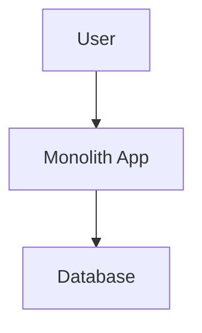

A more detailed view:

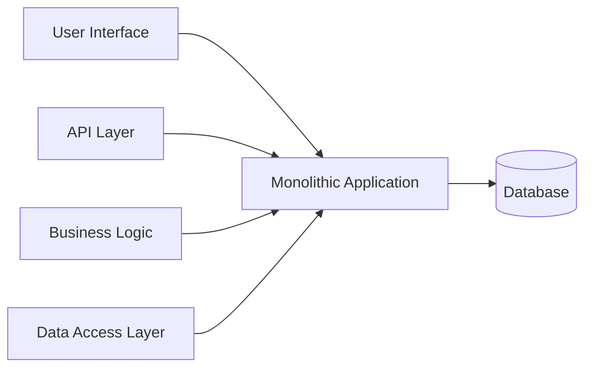

ASCII view:

```
+------------------+
|   Monolith App   |
+------------------+
| UI | Logic | DB  |
+------------------+
```

```
+-------------------------------+
|   User Interface              |
+-------------------------------+
|   Business Logic              |
+-------------------------------+
|   Data Access                 |
+-------------------------------+
|   Single Database             |
+-------------------------------+
```

#### Example Code: Flask Monolith

```python
# Everything in one place (e.g., Flask app)
from flask import Flask, request

app = Flask(__name__)

@app.route('/user/<id>')
def get_user(id):
    # Business logic and data access mixed
    user = db.query_user(id)
    return render_template('user.html', user=user)
```

A simpler version showing multiple routes:

```python
from flask import Flask, request

app = Flask(__name__)

@app.route('/users')
def users():
    return "List of users"

@app.route('/orders')
def orders():
    return "List of orders"

if __name__ == "__main__":
    app.run()
```

A version with mixed UI + logic + data layer in one place:

```python
from flask import Flask
app = Flask(__name__)

@app.route('/')
def home():
    return render_home()

def render_home():
    # UI + business logic + data access all here
    return "Welcome!"

if __name__ == '__main__':
    app.run()
```

#### Pros & Cons

| Pros                                            | Cons                                                     |
|-------------------------------------------------|----------------------------------------------------------|
| Simple to develop and deploy                    | Hard to scale                                            |
| Easier management for small apps                | Difficult to maintain as codebase grows                  |
| No inter-service communication complexity       | High risk of system-wide failure due to a single bug     |
| Easy to test                                    | Updates require redeploying the whole app                |

#### Use Cases

- Small-scale applications
- Startups / MVPs
- Simple CRUD-based apps

---

### 2. Layered (N-Tier) Architecture

**Layered architecture** divides the system into layers, each with a specific responsibility (e.g., Presentation, Business Logic, Data Access).

#### Diagram

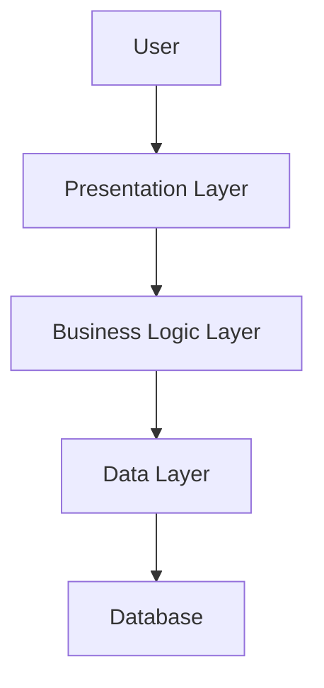

A simpler version:

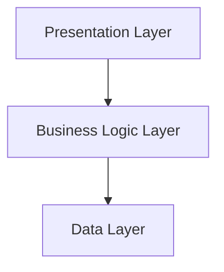

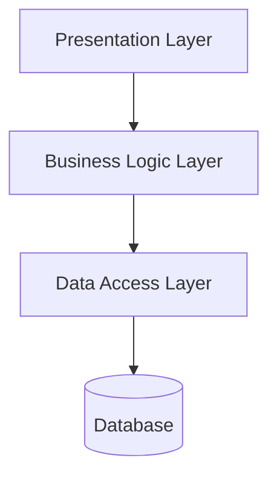

ASCII view:

```
+--------------------+
| Presentation Layer |
+--------------------+
         |
+--------------------+
| Business Logic     |
+--------------------+
         |
+--------------------+
| Data Access Layer  |
+--------------------+
```

#### Code Structure

```plaintext
/app
  /presentation
      user_controller.py
  /business_logic
      user_service.py
  /data_access
      user_repository.py
```

#### Example Code: Python Flask 3-Layer

```python
# Presentation Layer
@app.route('/users')
def get_users():
    return jsonify(UserController().get_users())

# Business Logic Layer
class UserController:
    def get_users(self):
        return UserService().fetch_users()

# Data Access Layer
class UserService:
    def fetch_users(self):
        return UserModel.query.all()
```

A simpler module-based variant:

```python
# presentation.py
def show_user_profile(user_id):
    data = get_user_profile(user_id)
    return render_profile(data)

# business_logic.py
def get_user_profile(user_id):
    return fetch_user_from_db(user_id)

# data_access.py
def fetch_user_from_db(user_id):
    # Fetch from database
    pass
```

#### Pros & Cons

| Pros                                      | Cons                                         |
|-------------------------------------------|----------------------------------------------|
| Clear separation of concerns              | Performance overhead due to layer traversal  |
| Easier to maintain and scale              | Layers may become tightly coupled            |
| Easy to test                              | Can become rigid; changes in one layer may impact others |

#### Use Cases

- Enterprise applications (CRM, ERP)
- Banking / financial systems
- Large web applications

---

### 3. Client-Server Architecture

**Client-server** divides the system into clients (requesters) and servers (responders).

#### Diagram

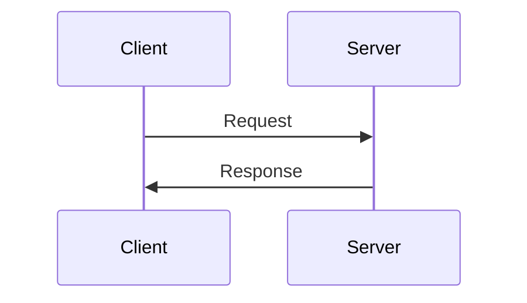

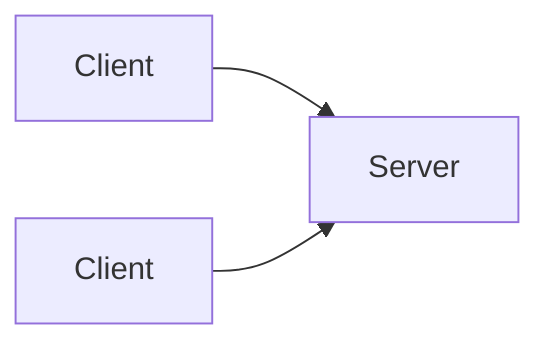

#### Examples

- Web browser (client) communicates with web server (server).
- Mobile app (client) calls backend API (server).
- Email client connects to mail server.

#### Pros & Cons

| Pros                   | Cons                                 |
|------------------------|--------------------------------------|
| Centralized control    | Server can become a bottleneck       |
| Easier management      | Limited offline capability           |

#### Use Cases

- Web applications
- Email systems
- Most traditional web/mobile setups

---

### 4. Microservices Architecture

**Microservices** is a software design pattern that structures an application as a collection of small, independent services. Each service is responsible for a specific business capability and can be deployed, updated, and scaled independently.

**Key characteristics:**

- **Independently deployable:** Services are autonomous and can be upgraded without redeploying the entire system.
- **Loosely coupled:** Services interact via well-defined APIs, minimizing dependencies.
- **Scalable & fault-tolerant:** Each microservice can be scaled horizontally and failures are isolated.

#### Diagram

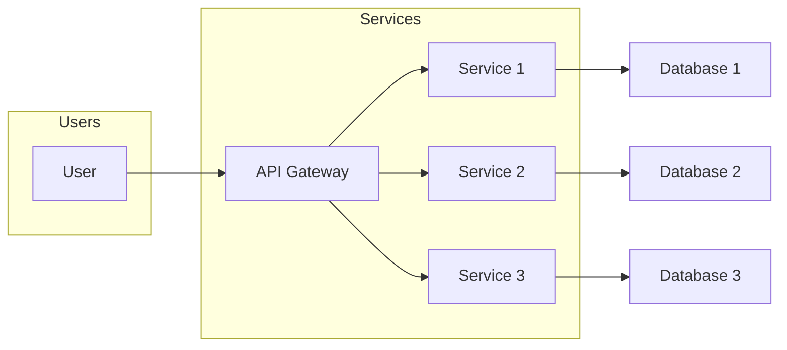

A version showing specific service names:

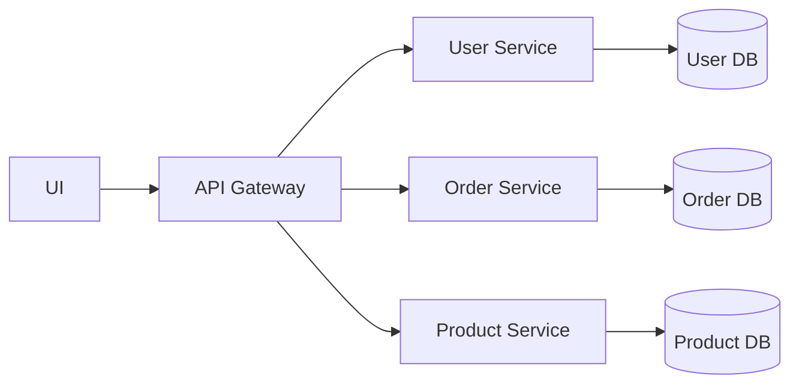

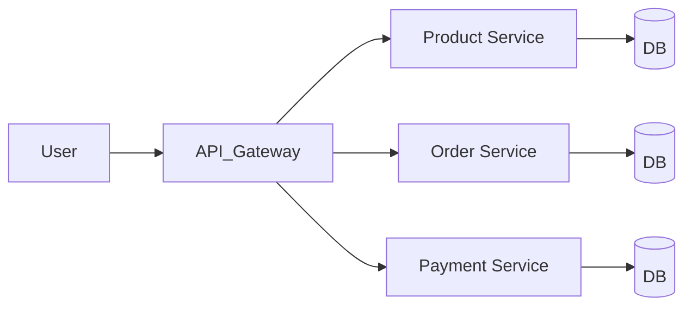

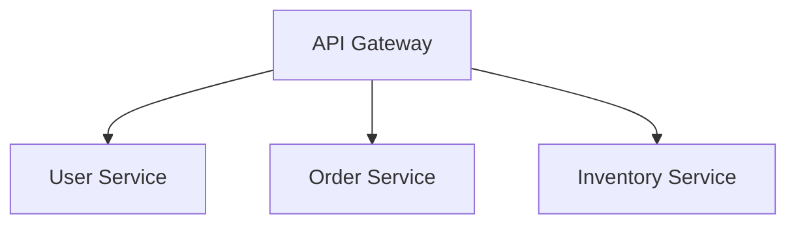

ASCII view:

```
+--------+   +--------+   +--------+
| User   |   | Order  |   | Payment|
|Service |<->|Service |<->|Service |
+--------+   +--------+   +--------+
         |         |         |
         +---API Gateway-----+
```

#### Example Code

**Node.js (Express) microservice:**

```js
// order-service.js
const express = require('express');
const app = express();

app.get('/orders', (req, res) => {
  res.json([{ id: 1, item: 'Apple' }]);
});

app.listen(3001, () => console.log('Order Service running'));
```

**Python Flask microservice (Users service):**

```python
from flask import Flask, jsonify

app = Flask(__name__)

@app.route('/users/<id>')
def get_user(id):
    # This service only knows about users
    return jsonify({'id': id, 'name': 'Alice'})

if __name__ == "__main__":
    app.run(port=5001)
```

**Python Flask microservice (Products service):**

```python
# product_service.py
from flask import Flask, jsonify

app = Flask(__name__)

@app.route('/products')
def get_products():
    return jsonify([{"id": 1, "name": "Book"}])

if __name__ == '__main__':
    app.run(port=5001)
```

**Node.js (Express) — Users service:**

```javascript
const express = require('express');
const app = express();

app.get('/users', (req, res) => {
  res.json([{ name: "Alice" }, { name: "Bob" }]);
});

app.listen(3001, () => console.log('User service running on port 3001'));
```

**Flask microservice with `app.run()` in main:**

```python
from flask import Flask, jsonify

app = Flask(__name__)

@app.route('/users')
def users():
    return jsonify([{"id": 1, "name": "Alice"}])

if __name__ == "__main__":
    app.run(port=5001)
```

#### Communication

- **Synchronous:** REST, gRPC
- **Asynchronous:** Message queues (Kafka, RabbitMQ)

#### Pros & Cons

| Pros                                        | Cons                                               |
|---------------------------------------------|----------------------------------------------------|
| Independent deployment / scaling            | Increased system complexity                        |
| Flexibility in technology stack (polyglot)  | Need for robust DevOps and monitoring              |
| Better fault isolation                      | Data consistency, distributed tracing challenges   |
| Easier modular updates                      | Network overhead, more API call latency            |

#### Use Cases

- Large-scale applications
- Cloud-native apps (Netflix, Amazon, Uber)
- E-commerce platforms

---

### 5. Event-Driven Architecture

In **event-driven architecture (EDA)**, components communicate asynchronously via events/messages rather than direct calls, enabling **loose coupling** and **real-time responses**.

#### Diagram

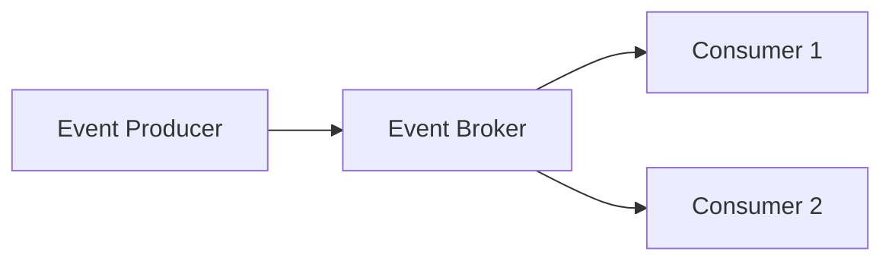

A sequence diagram:

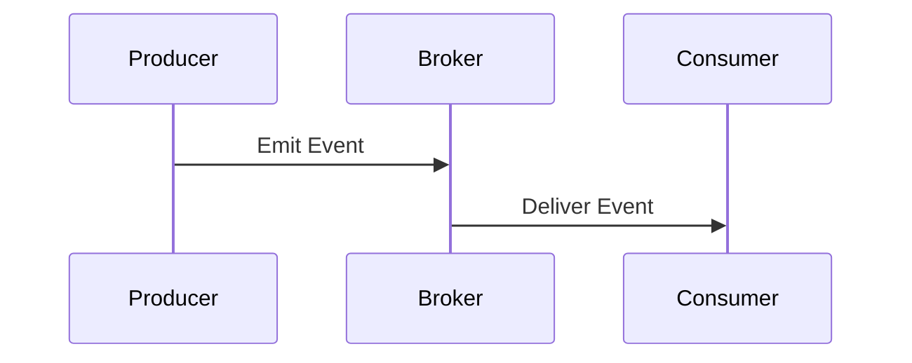

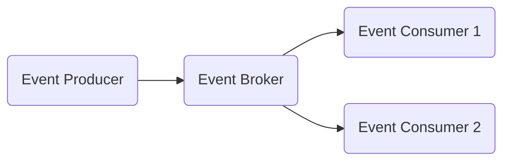

A more detailed scenario with multiple producers/consumers:

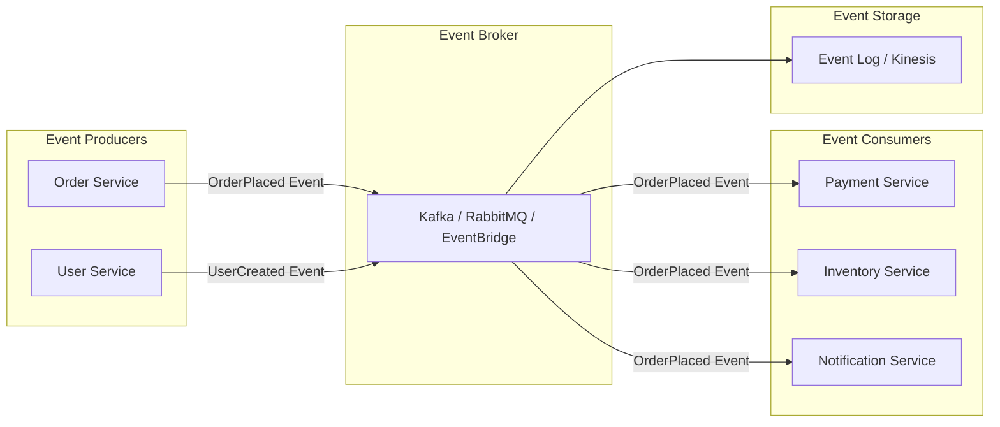

A sequence diagram showing user-triggered flows:

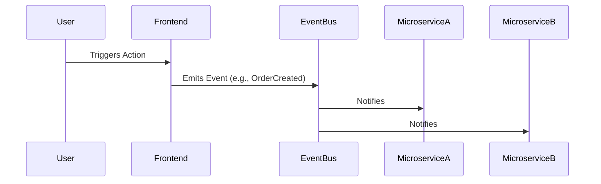

ASCII view:

```
+-------------+        +-------------+
| Producer(s) |----->  | Event Broker|-----> [Consumer(s)]
+-------------+        +-------------+
(e.g., Kafka, RabbitMQ)
```

#### Example Code: Event Publishing

**Node.js + Kafka:**

```js
const { Kafka } = require('kafkajs');
const kafka = new Kafka({ clientId: 'app', brokers: ['localhost:9092'] });
const producer = kafka.producer();

async function publish() {
  await producer.connect();
  await producer.send({
    topic: 'orders',
    messages: [{ value: JSON.stringify({ orderId: 42 }) }],
  });
  await producer.disconnect();
}
publish();
```

**Python + Kafka:**

```python
from kafka import KafkaProducer
producer = KafkaProducer(bootstrap_servers='localhost:9092')
producer.send('orders', b'OrderPlaced:12345')
```

**Python consumer with kafka-python:**

```python
from kafka import KafkaConsumer
consumer = KafkaConsumer('orders', bootstrap_servers='localhost:9092')
for msg in consumer:
    handle_order(msg.value)
```

**Python + RabbitMQ (pika):**

```python
import pika

connection = pika.BlockingConnection(pika.ConnectionParameters('localhost'))
channel = connection.channel()
channel.queue_declare(queue='events')

channel.basic_publish(exchange='', routing_key='events', body='UserRegistered')
print("Event Published")
connection.close()
```

A second pika example with JSON event payload:

```python
import pika

connection = pika.BlockingConnection(pika.ConnectionParameters('localhost'))
channel = connection.channel()
channel.queue_declare(queue='order_events')

channel.basic_publish(exchange='',
                      routing_key='order_events',
                      body='{"event": "order_created", "data": {"order_id": 123}}')
connection.close()
```

**Simple in-process event handler (Python):**

```python
def on_user_created(event):
    print(f"User created: {event['username']}")

# Emitting an event
event = {'username': 'alice'}
on_user_created(event)
```

#### Pros & Cons

| Pros                                       | Cons                                           |
|--------------------------------------------|------------------------------------------------|
| Highly decoupled, scalable                 | Harder to debug / troubleshoot                 |
| Supports asynchronous workflows, real-time | Eventual consistency can be tricky             |
| Flexible and resilient                     | Requires good monitoring                       |
| Scales well under high traffic             | Ensuring ordering / consistency is hard        |

#### Use Cases

- Real-time systems (chat, notifications)
- IoT applications
- Financial trading platforms
- E-commerce order workflows

---

## Multi-Tier Architecture — A Deep Dive

**Multi-tier architecture** is a software design pattern that organizes an application into multiple logical layers (or "tiers"), each responsible for a specific set of tasks. This pattern powers everything from small desktop apps to global-scale web services like Amazon and Netflix.

### Key Benefits

- **Separation of concerns:** Each layer handles a specific role, making the codebase easier to manage.
- **Improved scalability:** Layers can be scaled independently.
- **Better security:** Isolating sensitive operations (like database access) reduces attack surfaces.
- **Maintainability:** Changes in one layer have minimal impact on others.
- **Organizes applications into independent layers.**
- **Used in:** Web apps, enterprise systems, cloud architectures.

### Types of Multi-Tier Architectures

| Type      | Layers                                       | Use Case                          |
|-----------|----------------------------------------------|-----------------------------------|
| 2-Tier    | Client ↔ DB                                  | Simple desktop apps               |
| 3-Tier    | UI ↔ Business Logic ↔ DB                     | Standard web apps                 |
| N-Tier    | UI ↔ API ↔ Logic ↔ Cache ↔ DB                | Large-scale / cloud, microservices|

### 2-Tier Architecture

The client contains both the UI and application logic, communicating directly with the database.

```
[Client Application] <------> [Database Server]
```

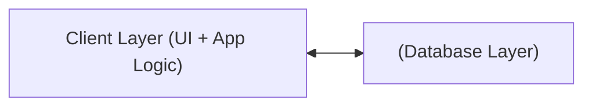

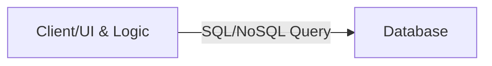

**Example (Python + SQLite):**

```python
# Two-tier example: direct database access
import sqlite3

conn = sqlite3.connect('example.db')
cursor = conn.cursor()
cursor.execute("SELECT * FROM users")
for row in cursor.fetchall():
    print(row)
conn.close()
```

**Pros & Cons:**

| Pros                  | Cons                                   |
|-----------------------|----------------------------------------|
| Simple to implement   | Poor scalability (few users)           |
| Fast for small apps   | Security risks (direct DB access)      |
|                       | Limited to small/simple apps           |

**Use case:** A desktop app directly querying a local SQL database.

### 3-Tier Architecture

Adds a **Business Logic Layer** between the UI and the database.

```
[Presentation Layer] <--> [Business Logic Layer] <--> [Data Layer]
```

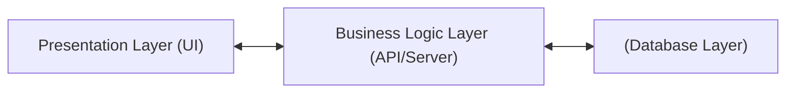

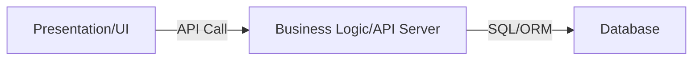

Or with the database on the right:

```mermaid
flowchart TD
    A[Client/UI] --> B[Business Logic/API]
    B --> C[Database]
```

**Example (Node.js Express API as the Business Logic layer):**

```js
// Business Logic Layer (API)
const express = require('express');
const app = express();
const db = require('./db'); // Assume db.js handles DB connection

app.get('/users', async (req, res) => {
  const users = await db.query('SELECT * FROM users');
  res.json(users);
});

app.listen(3000, () => console.log('API running on port 3000'));
```

A more decoupled version with separate route and data-access modules:

```js
// server/routes/users.js
const express = require('express');
const router = express.Router();
const { getUserById } = require('../services/userService'); // Business logic

router.get('/:id', async (req, res) => {
  const user = await getUserById(req.params.id); // Calls data access layer
  res.json(user);
});

module.exports = router;
```

```js
// server/data/userRepository.js
const db = require('./dbConnection');

async function getUserById(id) {
  return db.query('SELECT * FROM users WHERE id = $1', [id]);
}

module.exports = { getUserById };
```

**Project structure:**

```
project/
│
├── frontend/      # Presentation Layer (React, Angular, etc.)
├── server/        # Business Logic Layer (Node.js/Express)
├── database/      # Data Layer (PostgreSQL, MongoDB)
```

**Pros & Cons:**

| Pros                                | Cons                      |
|-------------------------------------|---------------------------|
| Improved scalability & security     | Slightly higher latency   |
| Better separation of concerns       | More complex than 2-tier  |
| Easier maintenance                  |                           |

**Use case:** Traditional web applications (React front-end → Node.js/Express API → PostgreSQL DB).

### N-Tier Architecture

Extends 3-tier by adding specialized layers (caching, API gateway, microservices, etc.).

**Example layers:**

- API Gateway
- Authentication Service
- Caching Layer (e.g., Redis)
- Microservices (e.g., User Service, Payment Service)
- Database Layer

```mermaid
flowchart LR
    UI[UI Layer]
    API[API Gateway]
    Cache[Cache Layer]
    SVC[Microservices Layer]
    BL[Business Logic Layer]
    DB[(Database Layer)]
    UI <--> API <--> Cache <--> SVC <--> BL <--> DB
```

```mermaid
graph LR
  A[Client/UI]
  B[API Gateway]
  C[Auth Service]
  D[Business Logic/Microservices]
  E[Cache]
  F[Database]

  A --> B --> C --> D --> E --> F
  D --> F
  E --> F
```

```mermaid
graph TD
  Client[Client Tier]
  Web[Web Server Tier]
  App[Application Tier]
  DB[Database Tier]

  Client --> Web --> App --> DB
```

*Note: actual order and number of layers may vary based on requirements.*

**Example (Pseudo-code: API Gateway forwards to microservice, checks cache):**

```python
def get_user_profile(user_id):
    cached = redis.get(f"profile:{user_id}")
    if cached:
        return cached
    profile = user_service.get_profile(user_id)
    redis.set(f"profile:{user_id}", profile)
    return profile
```

**Caching example:**

```python
def get_product(product_id):
    product = cache.get(product_id)
    if not product:
        product = db.fetch(product_id)
        cache.set(product_id, product)
    return product
```

**Pros & Cons:**

| Pros                                          | Cons              |
|-----------------------------------------------|-------------------|
| Handles high-traffic & complex business logic | Higher complexity |
| Independent scaling of layers                 | More moving parts |
| Highly scalable                               | More points of failure |
| Fault tolerant                                | Requires robust monitoring and deployment |

**Use case:** Large-scale enterprise software, microservices-based applications, e-commerce platforms.

### Performance and Scalability — How Do Tiers Impact Your System?

#### Latency Considerations

- **More tiers = higher latency** (if not optimized).
- Each request passes through more processing steps.

**Mitigations:**

- **Caching:** Store frequently accessed data for quick retrieval (e.g., Redis, Memcached).
- **Load Balancing:** Distribute requests across servers/layers for resilience and speed.

#### Scaling Strategies

- **Vertical Scaling:** Add resources to a single server (CPU, RAM).
- **Horizontal Scaling:** Add more servers (better for high-traffic systems).
- **Optimizations:** Caching, load balancing, and asynchronous messaging can reduce bottlenecks.

### Multi-Tier — Tips and Tricks

- **Keep layers independent:** Avoid tight coupling; use clear interfaces/APIs between layers.
- **Optimize for latency:** Introduce caching and asynchronous processing where possible.
- **Secure inter-layer communication:** Use encryption (TLS), API keys, and input validation.
- **Monitor and log each layer:** Add observability (logging, tracing, metrics) to identify bottlenecks quickly.
- **Scale horizontally where possible:** Especially for API/business logic and caching layers.
- **Automate deployments and testing:** CI/CD pipelines ensure each layer is robust and can be deployed independently.
- **Start simple:** Begin with three-tier unless you know you'll need n-tier complexity.
- **Isolate secrets and credentials:** Never expose DB credentials in the UI/client layer.
- **Leverage caching:** Use Redis or Memcached for reducing database load.
- **Use load balancers:** Distribute API requests with load balancers for horizontal scaling.
- **Secure APIs:** Validate and sanitize all input at the business logic layer.

### Multi-Tier — Common Interview Questions

1. What is Multi-Tier Architecture, and why is it used?
2. How does a 2-Tier architecture differ from a 3-Tier architecture?
3. What are the key components of a 3-Tier architecture?
4. How does scalability improve in a multi-tier system?
5. What strategies can reduce latency in a multi-tier app?

---

## Microservices Architecture — A Deep Dive

Modern applications must be scalable, resilient, and maintainable. As businesses grow and requirements change rapidly, traditional monolithic architectures often fail to keep up. Enter **Microservices Architecture** — adopted by giants like Netflix, Uber, and Amazon.

### Monolith vs. Microservices Comparison

| Aspect          | Monolithic Architecture     | Microservices Architecture      |
|-----------------|------------------------------|----------------------------------|
| Deployment      | Single unit                  | Independent services             |
| Scalability     | Whole app scales together    | Each service scales separately   |
| Technology      | Unified stack                | Polyglot (mixed stacks)          |
| Fault Tolerance | Single point of failure      | Isolated failures                |
| Maintainability | Hard as app grows            | Easier, modular updates          |
| Data Storage    | Centralized                  | Decentralized, per-service DBs   |

ASCII view of monolith vs microservices:

```
[Monolith]              [Microservices]
+-------------------+   +--------+  +--------+  +--------+
| UI | Logic | Data |   | Auth   |  | Orders |  | Payment|
+-------------------+   +--------+  +--------+  +--------+
```

```
+-------------------+   +--------------------+   +-------------------+
| Order Service     |   | Payment Service    |   | User Service      |
+-------------------+   +--------------------+   +-------------------+
| Order DB          |   | Payment DB         |   | User DB           |
+-------------------+   +--------------------+   +-------------------+
       |                       |                        |
       +---------API / Events--+------------------------+
```

### Identifying and Structuring Microservices

**Principles to follow:**

- **Business capabilities:** Each service aligns with a business function (e.g., Payments, Orders, Users).
- **Single Responsibility Principle:** One microservice should do one thing well.
- **Data ownership:** Each microservice owns its own data; avoid shared databases.
- **Independent deployment:** Updating one service should not require redeploying others.
- **Right granularity:** Avoid too-large (monolith) or too-fine (excessive complexity) services.

**Domain-Driven Design (DDD)** is a useful approach:

```
[Order Service] <--> [Payment Service] <--> [User Service]
     |                    |                   |
[Order DB]          [Payment DB]           [User DB]
```

ASCII domain model:

```
+-------------+      +------------+      +-----------+
| Order       |<---->| Payment    |<---->| Inventory |
+-------------+      +------------+      +-----------+
```

### Example: Node.js Microservice Skeleton

```js
// orders-service/app.js (Express)
const express = require('express');
const app = express();
const port = 3001;

app.use(express.json());

app.get('/orders/:id', (req, res) => {
  // Fetch order from Order DB
  res.json({ orderId: req.params.id, status: 'processing' });
});

app.listen(port, () => {
  console.log(`Order service listening at http://localhost:${port}`);
});
```

### Communication Between Microservices

Microservices must interact to fulfill business flows. Two main models:

#### Synchronous Communication

- **REST APIs**
  - Easy to implement and widely supported.
  - Uses HTTP/JSON — higher latency.
- **gRPC**
  - Uses Protocol Buffers (binary format) for faster, low-latency RPC.
  - Great for high-performance internal communication.

**Example: REST call from Payment Service to Order Service (Python):**

```python
import requests

order = requests.get('http://orders-service:3001/orders/123').json()
```

**Example: gRPC service definition:**

```protobuf
// order.proto
syntax = "proto3";
service OrderService {
  rpc CreateOrder (OrderRequest) returns (OrderResponse);
}
message OrderRequest { string item_id = 1; }
message OrderResponse { string status = 1; }
```

**Example: Flask service with create_order endpoint:**

```python
from flask import Flask, jsonify, request

app = Flask(__name__)

@app.route('/order', methods=['POST'])
def create_order():
    data = request.json
    # Process order...
    return jsonify({'status': 'created'}), 201
```

**Example: User Service calling Order Service (Python):**

```python
# User Service
@app.route('/users/<id>/orders')
def get_orders(id):
    # REST call to Order Service
    response = requests.get(f'http://orders/api/orders?user={id}')
    return response.json()
```

#### Asynchronous Communication

- **Event-driven messaging:** Services publish events (e.g., `OrderCreated`) to a message broker (Kafka, RabbitMQ).
- Other services subscribe and react to these events.
- **Benefits:** Loose coupling, improved scalability, non-blocking.

**Example: Publish an Event with RabbitMQ (Node.js):**

```js
const amqp = require('amqplib');

async function publish() {
  const conn = await amqp.connect('amqp://localhost');
  const channel = await conn.createChannel();
  const queue = 'order_created';
  const msg = JSON.stringify({ orderId: 123 });

  await channel.assertQueue(queue, { durable: true });
  channel.sendToQueue(queue, Buffer.from(msg));
  console.log('Order event published');
}

publish();
```

**Example: Python Kafka producer:**

```python
from kafka import KafkaProducer
import json

producer = KafkaProducer(bootstrap_servers='localhost:9092')
producer.send('order-events', json.dumps({'order_id': 123, 'status': 'created'}).encode())
```

**Event flow diagram:**

```
[Order Service]--(order_created)-->[Kafka]--->[Payment Service]
                                                |
                                                v
                                          [Inventory Service]
```

### Key Challenges in Microservices

| Challenge             | Description                                                                       | Solutions / Tools                                |
|-----------------------|-----------------------------------------------------------------------------------|--------------------------------------------------|
| Data Consistency      | Eventual consistency due to distributed databases                                 | Compensating transactions, idempotent operations |
| Distributed Tracing   | Hard to trace requests across multiple services                                   | OpenTelemetry, Jaeger, Zipkin                    |
| Network Overhead      | More API calls mean more latency and failure points                               | Optimize with gRPC, caching, API Gateway         |
| Security              | Each service needs auth, encrypted communication                                  | OAuth2, JWT, mTLS, API Gateway                   |
| Operational Complexity| Deployment, orchestration, and monitoring across many services                    | Kubernetes, robust DevOps                        |

### Example: Distributed Tracing (OpenTelemetry — Node.js)

```js
// Pseudo-setup for distributed tracing
const { NodeTracerProvider } = require('@opentelemetry/sdk-trace-node');
const provider = new NodeTracerProvider();
provider.register();
```

### Scaling Microservices

Microservices shine in scalability:

- **Horizontal Scaling:** Add more instances of a service to handle increased load.
- **Database Sharding & Read Replicas:** Split data to optimize for high traffic.

**Auto-Scaling (Kubernetes example):**

```yaml
apiVersion: autoscaling/v2
kind: HorizontalPodAutoscaler
metadata:
  name: order-service-hpa
spec:
  scaleTargetRef:
    apiVersion: apps/v1
    kind: Deployment
    name: order-service
  minReplicas: 2
  maxReplicas: 10
  metrics:
  - type: Resource
    resource:
      name: cpu
      target:
        type: Utilization
        averageUtilization: 70
```

**Horizontal scaling diagram:**

```
        +----------+
        |  Client  |
        +----------+
             |
     +----------------------+
     |   Load Balancer      |
     +----------------------+
      /          |          \
+--------+  +--------+  +--------+
|Order S1|  |Order S2|  |Order S3|
+--------+  +--------+  +--------+
```

### Real-World Examples

- **Netflix:** Streams video via hundreds of microservices — separate services for streaming, recommendations, personalization, scaled independently.
- **Uber:** Ride-matching, payments, and navigation are different services.
- **Amazon:** Search, payments, recommendations are modular, allowing real-time updates and massive scale.

### Microservices — Tips for Success

- **Start with clear service boundaries:** Use DDD to avoid accidental monoliths.
- **Automate everything:** CI/CD, testing, deployment, and monitoring.
- **Invest in observability:** Logging, metrics, tracing — don't leave debugging until production.
- **Use an API Gateway:** Centralize cross-cutting concerns (authentication, rate-limiting, routing).
- **Design for failure:** Assume outages; use retries, circuit breakers, bulkheads, and graceful degradation.
- **Document APIs:** Keep OpenAPI/Swagger specs updated.
- **Version your contracts:** Don't break clients when updating APIs.
- **Keep data isolated:** No shared databases; use events for cross-service sync.
- **Right-size your services:** Too fine-grained increases complexity; too coarse defeats the purpose.
- **Secure all endpoints** and encrypt inter-service traffic.

### Microservices — Interview Questions

- What are microservices and how do they differ from monolithic architecture?
- How do microservices communicate?
- What are the biggest challenges in microservices?
- How do you ensure data consistency?
- What is the role of an API Gateway?
- How do you structure microservices for a new project?
- How would you debug errors in a distributed microservices system?
- When would you choose microservices over N-tier or monolithic?
- When would you use synchronous vs. asynchronous communication?
- How do you implement service discovery and load balancing?
- What tools would you use for monitoring and observability?

---

## Event-Driven Architecture — A Deep Dive

**Event-Driven Architecture (EDA)** is a system design paradigm where components communicate through events. Rather than making direct synchronous calls, services publish events (like `OrderPlaced` or `UserRegistered`) and other services consume these events to trigger their own logic.

**Three key characteristics:**

- **Asynchronous processing:** Components don't wait for responses and continue processing other work.
- **Loose coupling:** Components interact via events, not direct calls, so they evolve independently.
- **Scalability & flexibility:** Easily handle spikes in workload without tight dependencies.

### Why Use Event-Driven Architecture?

- **Asynchronous processing:** Services continue working while events are handled in the background.
- **Loose coupling:** Components evolve independently, increasing system flexibility.
- **Scalability:** Handles spikes and high traffic with ease.
- **Real-time responsiveness:** Ideal for finance, IoT, and notification systems.
- **Complex workflows:** Multiple services respond to a single event, supporting sophisticated business processes.

### Core Components

| Component         | Role                                                          | Example                                  |
|-------------------|---------------------------------------------------------------|------------------------------------------|
| **Event Producer**| Generates events based on actions or changes                  | User places an order                     |
| **Event Broker**  | Routes, stores, and delivers events                           | Kafka, RabbitMQ, AWS EventBridge         |
| **Event Consumer**| Listens for events and performs actions                       | Payment service, Email notifier          |
| **Event Storage** | (Optional) Persists events for replay, auditing, or recovery  | Kafka log, AWS Kinesis                   |

#### Event Flow Sequence Diagram

```mermaid
sequenceDiagram
    participant Producer
    participant Broker
    participant Consumer
    participant Storage

    Producer->>Broker: Publish Event
    Broker->>Storage: Store Event (optional)
    Broker->>Consumer: Deliver Event
    Consumer->>Storage: (Optional) Query/Replay Event
```

### Synchronous vs. Asynchronous Communication

| Synchronous                                 | Asynchronous (Event-Driven)               |
|---------------------------------------------|-------------------------------------------|
| Blocking calls (wait for response)          | Non-blocking (fire-and-forget)            |
| Tight coupling between components           | Decoupled; services operate independently |
| Example: HTTP REST API                      | Example: Kafka, RabbitMQ, SQS             |
| Can lead to bottlenecks                     | Promotes scalability and resilience       |

**Example: Synchronous (traditional HTTP call)**

```python
def place_order(order):
    response = payment_service.process_payment(order)
    if response.success:
        inventory_service.update(order)
```

**Example: Asynchronous (event-driven)**

```python
def place_order(order):
    event_broker.publish('OrderPlaced', order)
    # Continue without waiting for payment/inventory

# Payment service (subscriber)
def on_order_placed(event):
    process_payment(event.data)
```

### Messaging Patterns

#### 1. Publish-Subscribe (Pub/Sub)

- Producers send events to a "topic."
- All subscribed consumers receive the event, usually once and in real-time.
- Subscribers receive events in real-time but must be online.
- **Example:** Notifications to all followers when a user posts.

#### 2. Event Streaming

- Events are stored in an ordered log; consumers can replay and process at their own pace.
- Useful when replayability or ordered processing is needed.
- **Example:** Analytics, audit logs, IoT sensor data, website analytics tracking user activity over time.

#### Mermaid Diagram: Pub/Sub vs. Event Streaming

```mermaid
graph LR
  A[Event Producer] -- Publish Event --> B[Event Broker]
  B -- Event --> C[Subscriber 1]
  B -- Event --> D[Subscriber 2]

  subgraph PubSub [Pub/Sub Model]
    A
    B
    C
    D
  end

  subgraph EventStreamingModel [Event Streaming Model]
    E[Event Producer] -- Append Event --> F[Event Log]
    F -- Read Event --> G[Consumer 1]
    F -- Read Event --> H[Consumer 2]
  end
```

#### Code Example: Pub/Sub with Python & Redis

```python
# Producer
import redis
r = redis.Redis()
r.publish('orders', 'order_placed:12345')

# Consumer
import redis
r = redis.Redis()
pubsub = r.pubsub()
pubsub.subscribe('orders')
for message in pubsub.listen():
    if message['type'] == 'message':
        print('Received:', message['data'])
```

### Event-Driven Architecture in Action: E-Commerce Example

**Workflow:**

1. **Order Service:** User places an order → emits `OrderPlaced` event.
2. **Payment Service:** Listens for `OrderPlaced` → processes payment.
3. **Inventory Service:** Listens for `OrderPlaced` → updates stock.
4. **Notification Service:** Listens for `OrderPlaced` → sends email/SMS.

This enables independent scaling and failure isolation for each service.

### Challenges in Event-Driven Systems

| Challenge               | Description                                                               | Solutions / Tools                                 |
|-------------------------|---------------------------------------------------------------------------|---------------------------------------------------|
| Eventual Consistency    | State updates are not always immediate across services                    | Idempotent processing, compensating transactions  |
| Ordering Guarantees     | Events may arrive out of sequence in distributed systems                  | Partitioning, sequence numbers, deduplication     |
| Fault Tolerance         | Handling failures without data loss                                       | Dead-letter queues, retries, event replay         |
| Debugging Complexity    | Harder to trace asynchronous flows                                        | Distributed tracing (OpenTelemetry, Jaeger)       |

### Best Practices

1. **Idempotent event processing:** Ensure consumers can safely process the same event multiple times.

```python
# Pseudocode for idempotency
if not already_processed(event_id):
    process_event(event)
```

2. **Implement dead-letter queues (DLQ):** Capture failed events for later inspection and manual handling.
3. **Choose the right broker:** Kafka for high-throughput streaming, RabbitMQ for classic queuing, AWS EventBridge for serverless event routing.
4. **Event versioning:** Use schema registries (e.g., [Apache Avro](https://avro.apache.org/)) to evolve event formats without breaking consumers.

### Common Use Cases

- **Logging & auditing:** Capture all system changes for compliance and debugging.
- **Real-time notifications:** Messaging apps, stock price updates, push notifications.
- **Microservices decoupling:** Independent scalability and resilience.
- **IoT systems:** High-frequency, real-time sensor data processing.
- **E-commerce order processing:** Orchestrate complex, multi-step order workflows.

### Event-Driven — Tips & Tricks

- **Always make consumers idempotent:** Use unique event IDs or database constraints.
- **Monitor event flows:** Use distributed tracing tools (Jaeger, OpenTelemetry).
- **Plan for schema evolution:** Add new fields, never remove or change existing ones without versioning.
- **Use partitioning for ordering:** Partition events by relevant key (e.g., user ID) to maintain order where required.
- **Embrace infrastructure as code:** Use Terraform or AWS CloudFormation to automate broker setup and scaling.
- **Monitor event lag:** Track how far behind consumers are from the latest event.
- **Back pressure handling:** Protect slow consumers from being overwhelmed.
- **Compensating transactions:** Use when eventual consistency isn't enough — e.g., refund a payment if order fails.
- **Testing:** Simulate failure scenarios and duplicate events during testing.

### Event-Driven — Interview Prep

- Explain the difference between Pub/Sub and Event Streaming.
- How do you ensure idempotency in event consumers?
- What are dead-letter queues and why are they important?
- Describe a real-world use case for event-driven architecture.
- How would you handle event versioning and schema evolution?

---

## Factors Influencing Architecture Selection

When choosing an architectural style, consider:

1. **Business Needs:** What is the system's core purpose?
2. **Scalability:** Expected load and growth.
3. **Performance:** Latency, throughput, and responsiveness.
4. **Maintainability:** Ease of updates, fixes, and evolution.
5. **Team Skillsets:** Familiarity with distributed systems, automation, etc.
6. **Time to Market:** Speed vs. long-term scalability.

| Architecture     | Best For                                       | Avoid When                          |
|------------------|------------------------------------------------|-------------------------------------|
| Monolithic       | Small, simple apps, MVPs, startups             | Large/complex, needs high scale     |
| Layered (N-Tier) | Enterprise apps, CRMs, banking systems         | Performance-critical hot paths      |
| Microservices    | Large-scale, cloud-native, independent scaling | Small/simple projects               |
| Event-Driven     | Real-time, IoT, async, scalable systems        | When strong consistency is needed   |

### Example: When to Use Which?

- **Building a CRM for a small business?** Go for **Layered Architecture**.
- **Launching an MVP for a startup?** Start with **Monolithic**; split into microservices if it grows.
- **Creating a real-time notification system?** **Event-Driven** is a strong fit.
- **Developing a large e-commerce platform?** **Microservices** for independent scaling of catalog, orders, payments.

---

## Patterns Worth Knowing (Beyond the Big Four)

The four main patterns above (monolith, layered, microservices, event-driven) are *categories*. The patterns below are *specific techniques* that show up inside or across those categories.

### Modular Monolith

A monolith **internally organized as if it were microservices** — clear module boundaries, no cross-module DB access, well-defined interfaces — but deployed as a single binary.

**Why it matters:** combines monolith's deployment simplicity with microservices' modularity. Often the *correct* starting point for a new system. You can split it into actual services later if growth demands it.

### Strangler Fig — How to Migrate Monolith → Microservices

Named after the strangler fig tree that grows around an existing tree and eventually replaces it. Coined by Martin Fowler.

**The technique:**
1. Put a **facade** (API Gateway or reverse proxy) in front of the monolith.
2. Build the new microservice alongside the monolith.
3. Reroute the facade so specific endpoints go to the microservice instead of the monolith.
4. Once everything is moved, the monolith dies.

> **Why it works:** no "big bang" rewrite (which almost always fails). You ship incrementally, and at any point you can stop. The new code never has to be perfect because the monolith is always the fallback.

### Backend for Frontend (BFF)

Each frontend (web, iOS, Android, smart TV) gets its **own dedicated backend service** that aggregates calls to underlying microservices, shaping responses for that frontend's needs.

**Why:** different clients have different data needs and constraints. The iOS app wants minimal data on cellular; the web wants more. Without a BFF, every microservice has to support every client variation — or the frontend makes 10 separate calls.

```
                ┌─ BFF for Web ─┐
Clients ──→     ├─ BFF for iOS ─┤ ──→ Microservices
                └─ BFF for TV  ─┘
```

### CQRS (Command Query Responsibility Segregation)

**Separate the model used for writes from the model used for reads.** Writes go through a "command" model (often normalized, transactional); reads go through a "query" model (often denormalized, materialized views).

**Why:** read and write patterns are wildly different at scale. Reads vastly outnumber writes; denormalized views serve them in O(1). Writes can use a clean normalized model without performance pressure.

**Trade-off:** complexity. Don't reach for CQRS unless your read/write asymmetry is extreme.

### Event Sourcing

Instead of storing the *current state*, store the *sequence of events* that produced it. Current state is derived by replaying events.

**Why:** complete audit log built in, time-travel debugging, easy to derive new read models.

**Trade-off:** querying current state requires replay or maintained projections. Schema evolution is hard.

> Often paired with CQRS: events are the write model, projections are the read model.

### Saga Pattern (Distributed Transactions Without 2PC)

In a monolith, you wrap multi-step operations in a database transaction. In microservices, **you can't** — each service has its own DB. The **Saga pattern** is the answer.

**The idea:** break the transaction into a sequence of *local* transactions, each in its own service. If step N fails, run **compensating transactions** to undo steps 1..N-1.

**Example: book a trip (flight + hotel + car)**

```
1. Book flight       → success
2. Book hotel        → success
3. Book car          → FAILED
4. Compensate hotel  (cancel)
5. Compensate flight (cancel)
```

Two implementation styles:
- **Choreography:** each service listens for events and decides what to do. No central coordinator. Simple but hard to reason about at scale.
- **Orchestration:** a central "saga orchestrator" service tells each step what to do. Easier to debug; one more service to operate.

### When NOT to Use Microservices

A microservices anti-checklist. Stay with a monolith if:

- You have fewer than ~10 engineers.
- Your domain isn't well understood yet (service boundaries will be wrong).
- You don't have CI/CD, observability, and on-call rotation already.
- Different parts of your system don't scale independently (no scaling problem to solve).
- Latency is critical and you can't afford network hops between services.

> **The truth:** every team that adopts microservices too early ends up with a *distributed monolith* — slower than a monolith, harder to debug, and more expensive to operate.

---

## Practical Trade-offs

| Pattern         | Pros                  | Cons                              | Use Cases                  |
|-----------------|-----------------------|-----------------------------------|----------------------------|
| Monolithic      | Simple, fast to start | Hard to scale, maintain           | Startups, simple apps      |
| Layered (N-Tier)| Separated concerns    | Overhead, possible coupling       | Enterprise, banking        |
| Microservices   | Scale, flexibility    | Complexity, consistency problems  | Large, cloud-native        |
| Event-Driven    | Async, decoupled      | Debugging, ordering, consistency  | IoT, real-time, logging    |

---

## Tips & Tricks

A merged master list of advice across all patterns.

### General

- **Start simple, scale out.** Begin with monolithic or layered; refactor to microservices when growth demands.
- **Document boundaries.** In microservices, define clear API contracts and data ownership to avoid integration mess.
- **Document your architecture** with diagrams and clear descriptions.
- **Design for change.** Assume requirements will change; favor modular, loosely-coupled designs.
- **Choose the right pattern.** Not every problem needs microservices. Start with monolithic or multi-tier, and migrate when scaling demands it.

### Automation & Observability

- **Automate everything.** Especially with microservices: CI/CD, monitoring, automated testing.
- **Monitor performance.** Use tools like Prometheus, Grafana, or Datadog to track bottlenecks and system health.
- **Centralized logging.** Essential for debugging in distributed/event-driven systems.
- **Prepare for debugging.** Implement distributed tracing (OpenTelemetry, Jaeger) early.
- **Automate testing.** Especially in event-driven and microservices systems, automated integration tests are vital.

### Communication

- **Choose the right communication pattern.** Use **REST/gRPC** for synchronous, **Kafka/RabbitMQ** for async/event-driven.
- **Use API gateways** to manage requests in microservices architectures.
- **Document interfaces** — clearly specify contracts between services and layers.
- **Version your contracts** — don't break clients when updating APIs.

### Reliability

- **Handle failures gracefully.** In event-driven designs, use **dead-letter queues** and **idempotent handlers**.
- **Embrace eventual consistency** in distributed/event-driven systems — design for eventual rather than immediate.
- **Use retries, circuit breakers, and graceful degradation** for distributed systems.
- **Consistency vs. Availability** — understand the CAP theorem and make informed trade-offs.

### Security

- **Security first.** Isolate services, secure APIs, and encrypt inter-service communication.
- Authentication, authorization, and data protection — especially as services multiply.

### Data

- **Data ownership in microservices.** Each microservice should own its database. Avoid sharing schemas.
- **Plan for schema changes.** Use event versioning or backward-compatible messages in EDA.

### Evolution

- **Plan for evolution.** Choose an architecture that can evolve as your business needs change.

---

## Sample Interview Questions

- What are the differences between monolithic, layered, microservices, and event-driven architectures?
- How does a 2-Tier architecture differ from a 3-Tier architecture?
- How does scalability improve in a multi-tier system?
- When would you choose microservices over a monolith?
- What are the key challenges of microservices, and how do you mitigate them?
- How would you handle data consistency in distributed systems?
- What is the role of an API Gateway?
- When would you use synchronous vs. asynchronous communication?
- Explain the difference between Pub/Sub and Event Streaming.
- How do you ensure idempotency in event consumers?
- What are dead-letter queues and why are they important?
- How do you implement service discovery and load balancing?
- What tools would you use for monitoring and observability in a distributed system?

---

## Summary & Key Takeaways

- **Monolithic:** Simple, good for small apps or prototypes; struggles at scale.
- **Layered (N-Tier):** Clear separation, maintainable; can have performance overhead.
- **Client-Server:** Foundational for web/mobile; server can be a bottleneck.
- **Microservices:** Scalable, resilient, flexible; complex to manage.
- **Event-Driven:** Decoupled, real-time, scalable; introduces consistency and debugging challenges.

> *"Choose architecture based on business needs, technical requirements, and scalability goals — not just trends."*

---

## Further Reading

- [Martin Fowler — Microservices](https://martinfowler.com/articles/microservices.html)
- [Martin Fowler — Patterns of Enterprise Application Architecture](https://martinfowler.com/eaaCatalog/)
- [Martin Fowler — Event-Driven Architecture](https://martinfowler.com/articles/201701-event-driven.html)
- [Microservices.io (Chris Richardson)](https://microservices.io/)
- [Event-Driven Architecture on AWS](https://aws.amazon.com/architecture/event-driven/)
- [AWS Multi-Tier Architecture Guide](https://docs.aws.amazon.com/whitepapers/latest/aws-overview/multi-tier-architectures.html)
- [Microsoft Patterns & Practices — Multi-tier Architecture](https://docs.microsoft.com/en-us/azure/architecture/guide/architecture-styles/n-tier)
- [Apache Kafka Documentation](https://kafka.apache.org/documentation/)

---

**Next Up:** [Chapter 5 — Web Concepts in System Design →](./5%20-%20Web%20Concepts%20in%20System%20Design%20(System%20Design%20Fundamentals).md) — sessions, serialization, CORS, and the practical web-specific concerns that build on top of these architectural patterns.
