# Web Concepts in System Design

Welcome to **Web Concepts in System Design**. In this chapter, we'll break down the key principles that power scalable, efficient, and secure web applications — essentials not only for real-world projects but also for system design interviews.

The web forms the backbone of modern applications — social media, e-commerce, cloud platforms, and more. Most large-scale systems are built on web-based architectures, so understanding these fundamentals is critical for:

- **Scalability:** Efficiently handling millions of users.
- **Security:** Preventing unauthorized access and vulnerabilities.
- **Performance:** Ensuring seamless and fast user experiences.

**Bonus:** Mastery of these concepts gives you an edge in system design interviews, where questions often revolve around state management, data exchange, cross-origin requests, and optimizing web security.

---

## Learning Outcomes

After reading this chapter, you'll be able to:

1. Choose session-based vs token-based auth and explain the tradeoffs.
2. Set cookie attributes (`HttpOnly`, `Secure`, `SameSite`) correctly to defend against XSS and CSRF.
3. Pick the right serialization format (JSON, Protobuf, Avro) for a given use case.
4. Diagnose and fix a CORS error.
5. Name the most common browser security headers (CSP, HSTS, X-Content-Type-Options) and what each does.

---

## Table of Contents

1. [How Web Applications Work](#how-web-applications-work)
2. [Web Sessions — Managing State in Stateless HTTP](#web-sessions--managing-state-in-stateless-http)
3. [Serialization — Data Exchange & Storage Formats](#serialization--data-exchange--storage-formats)
4. [CORS — Cross-Origin Resource Sharing & Web Security](#cors--cross-origin-resource-sharing--web-security)
5. [Best Practices for Scalable & Secure Web Systems](#best-practices-for-scalable--secure-web-systems)
6. [Combined Tips & Tricks](#combined-tips--tricks)
7. [Sample Interview Questions](#sample-interview-questions)
8. [Summary & Key Takeaways](#summary--key-takeaways)
9. [Further Reading](#further-reading)

---

## How Web Applications Work

Before diving into advanced topics, let's recap the basics.

**Client-Server Model:**

```plaintext
+------------+         HTTP Request         +------------+
|  Browser   |  ------------------------->  |   Server   |
| (Frontend) |  <-------------------------  | (Backend)  |
+------------+         HTTP Response        +------------+
```

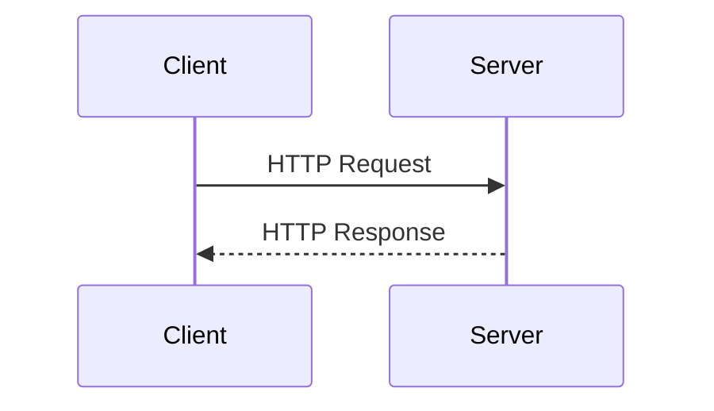

- **Stateless Protocol:** HTTP doesn't remember previous requests; every interaction is independent.
- **Stateful Needs:** Web apps often need to track information (like login state or a shopping cart) across multiple requests.
- **Stateless vs. Stateful Interactions:**
  - **Stateless:** Each request is independent (e.g., plain HTTP).
  - **Stateful:** Server retains user state between requests.
- **Security, Scalability, Performance:** These are core considerations for any design.

---

## Web Sessions — Managing State in Stateless HTTP

### The Challenge: Stateless HTTP

HTTP is **stateless** — each request is independent and carries no memory of previous interactions, which makes it tricky to implement features like user logins, shopping carts, or preferences.

**Why is this a challenge?**

- Users would have to log in on every page load.
- Shopping carts and personalized experiences wouldn't persist.
- Applications would be frustrating and less functional.

**Stateless HTTP visualized:**

```
[Browser] --(Request 1)--> [Server]
[Browser] --(Request 2)--> [Server]
(No memory of Request 1 when processing Request 2)
```

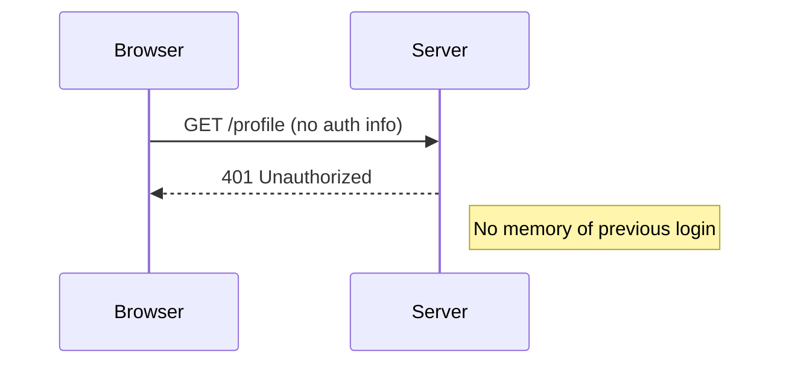

**Solution:** We need mechanisms to track user sessions and maintain state across requests.

### Techniques for Maintaining State

#### A. Cookies

- **Definition:** Small data pieces stored on the client's browser.
- **Use Case:** Session identifiers, preferences, authentication tokens.

**Example: Setting a Cookie**

```http
Set-Cookie: sessionId=abc123; HttpOnly; Secure; SameSite=Strict
```

#### B. Session-Based Authentication (Server-Side Sessions + Cookies)

- The server creates a session and stores session data (like user ID) in memory or a database.
- A session ID is sent to the client (usually via a cookie).
- The client includes the session ID in subsequent requests; the server uses this to retrieve session info.

**Sequence diagram (ASCII):**

```
[Client] --(POST /login)--> [Server]
                |
       [Server creates session]
                |
[Server] --(Set-Cookie: session_id)--> [Client]

[Client] --(GET /dashboard, Cookie: session_id)--> [Server]
[Server] --(Retrieve user from session_id)--> [Process]
```

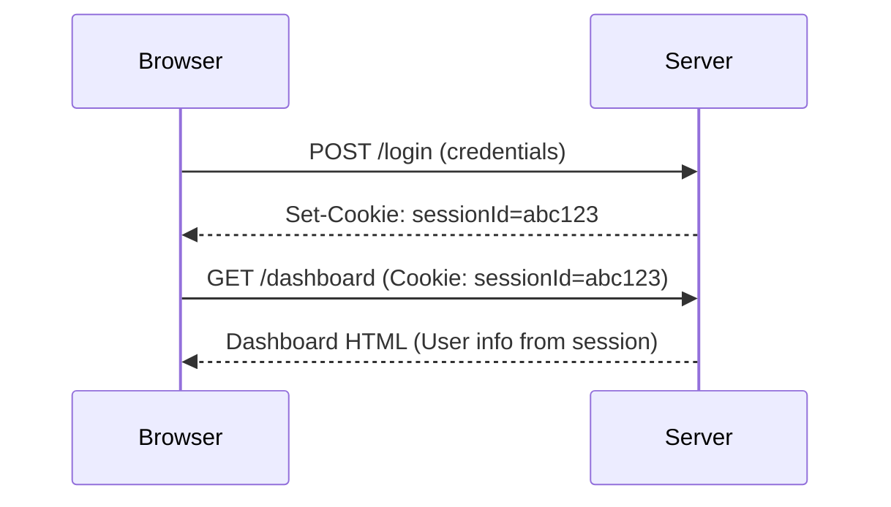

A more detailed view including the session store:

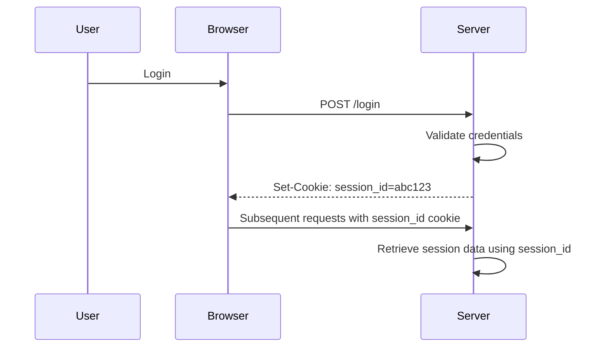

Session workflow with separate session store:

```
+------------+           +-------------+
|  Browser   | <-------> |   Server    |
+------------+           +-------------+
       ^                      |
       |                      v
   [sessionId in cookie]  [Session Store]
```

**Example: Express.js session setup**

```javascript
const session = require('express-session');
app.use(session({
  secret: 'your-secret',
  resave: false,
  saveUninitialized: true,
  cookie: { secure: true, httpOnly: true, sameSite: 'Strict' }
}));
```

A login endpoint storing user info in the session:

```js
const express = require('express');
const session = require('express-session');

const app = express();

app.use(session({
  secret: 'yourSecret',
  resave: false,
  saveUninitialized: true,
  cookie: { secure: true, httpOnly: true, sameSite: 'Strict' }
}));

app.post('/login', (req, res) => {
  // Authenticate user...
  req.session.userId = user.id; // Store in session
  res.send('Logged in!');
});
```

#### C. Token-Based Authentication (JWT, OAuth)

- All session data is **encoded in a token** (e.g., JWT) that the client sends with each request.
- The server is stateless — just verifies the token.
- No server-side session storage needed.

**Sequence:**

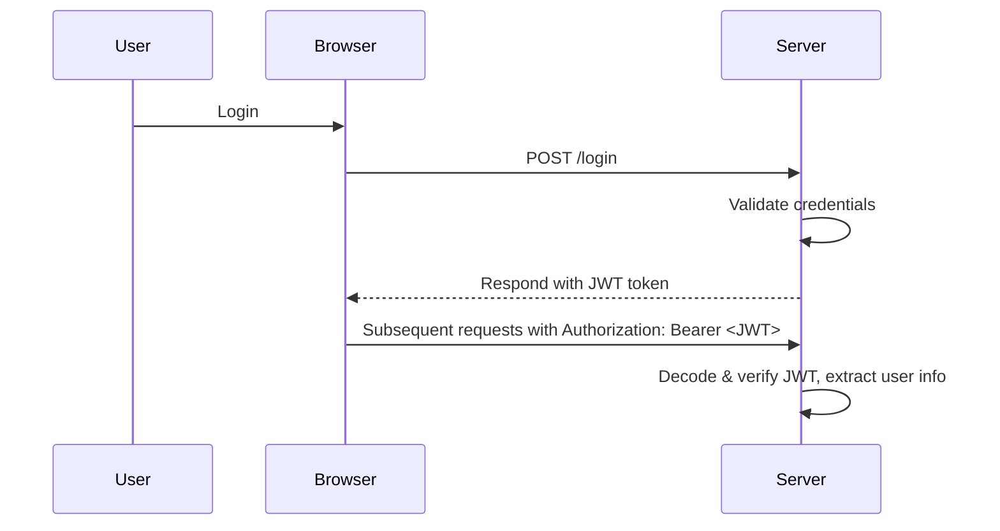

**Sample JWT payload (decoded):**

```json
{
  "sub": "user123",
  "name": "Alice",
  "roles": ["user"],
  "exp": 1712345678
}
```

Or:

```json
{
  "sub": "user123",
  "role": "admin",
  "iat": 1712345678,
  "exp": 1712349278
}
```

**Sending JWT in header:**

```http
Authorization: Bearer eyJhbGciOiJIUzI1...
```

**JWT example (Node.js with `jsonwebtoken`):**

```javascript
const jwt = require('jsonwebtoken');
const token = jwt.sign({ userId: user.id }, 'jwt-secret', { expiresIn: '1h' });
// Send token to client; client sends it in Authorization header
```

A complete login + verification flow:

```js
const jwt = require('jsonwebtoken');
const secret = 'your_jwt_secret';

app.post('/login', (req, res) => {
  // Authenticate user
  const token = jwt.sign({ userId: user.id }, secret, { expiresIn: '1h' });
  res.json({ token });
});

app.get('/profile', (req, res) => {
  const token = req.headers.authorization.split(' ')[1];
  const payload = jwt.verify(token, secret);
  // payload.userId will be available
  res.json({ userId: payload.userId });
});
```

An alternative form using the request header more defensively:

```js
const jwt = require('jsonwebtoken');

const token = jwt.sign({ userId: user.id }, 'shhSecret', { expiresIn: '1h' });

// On client: store token in localStorage or an HttpOnly cookie
// On each request:
app.get('/protected', (req, res) => {
  const token = req.headers['authorization'].split(' ')[1];
  const payload = jwt.verify(token, 'shhSecret');
  // Use payload.userId ...
});
```

Or with explicit verify callback:

```js
// Creating a JWT token
const jwt = require('jsonwebtoken');
const token = jwt.sign({ userId: 123 }, 'your-secret-key', { expiresIn: '1h' });

// Verifying a JWT token
jwt.verify(token, 'your-secret-key', (err, decoded) => {
  if (err) return res.sendStatus(403);
  // decoded.userId available
});
```

**Advantages:** Scalable (stateless), easy for microservices.

### Session-Based vs. Token-Based Comparison

| Feature            | Session-based                            | Token-based (JWT/OAuth)                       |
|--------------------|------------------------------------------|-----------------------------------------------|
| Storage            | Server-side                              | Client-side (self-contained)                  |
| Scalability        | Harder (needs shared session store)      | Easier (stateless)                            |
| Security           | Session ID must be protected; short expiry | Token can leak info if not encrypted; short expiry & validation needed |
| Use Cases          | Classic web apps                         | APIs, microservices, mobile                   |

And from a state-storage perspective:

| Method               | Where State is Stored     | Pros                        | Cons                          |
|----------------------|---------------------------|-----------------------------|-------------------------------|
| Cookies              | Client                    | Simple, widely supported    | Size limits, security risks   |
| Server-side Sessions | Server (e.g., DB, cache)  | More secure                 | Scalability, memory usage     |
| JWT                  | Client (token)            | Scalable, stateless         | Token invalidation is tricky  |

### Diagram: Session-Based vs. Token-Based Flow

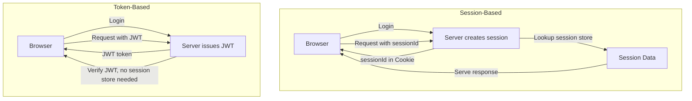

### Security Concerns & Mitigations

- **Session Hijacking:** Stolen session IDs grant attackers access.
  - **Mitigation:** Use HTTPS, regenerate session IDs after login/logout, short expiry.
- **CSRF (Cross-Site Request Forgery):** Tricking a user's browser to perform unwanted actions.
  - **Mitigation:** CSRF tokens, `SameSite` cookies, require user confirmation for sensitive actions, multi-factor authentication.
- **Cookie Theft (e.g., via XSS):** Insecure transmission or script-accessible cookies.
  - **Mitigation:** Set cookies with `Secure`, `HttpOnly`, and `SameSite` flags.

**Secure cookie example:**

```javascript
// Secure cookie example in Express
res.cookie('sessionId', 'abc123', {
  secure: true,       // Only over HTTPS
  httpOnly: true,     // Not accessible via JS
  sameSite: 'Strict'  // No cross-site sending
});
```

```js
// Example: Setting secure cookies
res.cookie('sessionId', value, { secure: true, httpOnly: true, sameSite: 'Strict' });
```

### Scaling Session Management

- **Sticky Sessions:** Pin users to the same server (simple, not ideal for scaling).
- **Distributed Sessions:** Use shared storage like Redis or Memcached.
- **Stateless Auth (JWT):** No server storage required; ideal for microservices.

**Distributed Session Example (Express + Redis):**

```javascript
const RedisStore = require('connect-redis')(session);
app.use(session({
  store: new RedisStore({ client: redisClient }),
  secret: 'secret',
  resave: false,
  saveUninitialized: false
}));
```

A simpler form:

```js
const RedisStore = require('connect-redis')(session);
app.use(session({
  store: new RedisStore({ client: redisClient }),
  // ... other options
}));
```

**Distributed session storage diagram:**

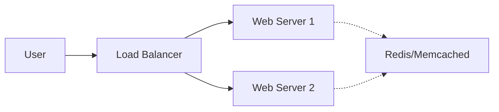

---

## Serialization — Data Exchange & Storage Formats

### What is Serialization?

Serialization is the process of converting complex data structures (like objects) into a format suitable for transmission or storage (e.g., JSON, XML, Protobuf). **Deserialization** is the reverse.

> **Why does it matter?**
> - Enables data exchange between different systems or programming languages.
> - Crucial for APIs, databases, and caching systems.
> - Directly impacts system scalability and performance.

**Why serialization matters in system design:**

- **Data Exchange:** Enables structured data to move between systems (often written in different languages).
- **Storage:** Efficiently saves objects in databases or cache.
- **Performance:** Impacts bandwidth, memory, and CPU usage.
- **Interoperability:** Makes communication possible in microservices and distributed architectures.

### Common Serialization Formats

#### 1. JSON (JavaScript Object Notation)

- **Human-readable** and text-based.
- **Simple key-value structure**, ideal for REST APIs and front-end applications.
- **Widely supported** across programming languages.
- **Drawback:** Larger payloads compared to binary formats, leading to higher bandwidth usage.

**Example (Python):**

```python
import json

data = {
    'id': 123,
    'name': 'Alice',
    'roles': ['admin', 'user']
}

# Serialization
json_str = json.dumps(data)
print(json_str)  # {"id": 123, "name": "Alice", "roles": ["admin", "user"]}

# Deserialization
parsed_data = json.loads(json_str)
print(parsed_data['name'])  # Alice
```

A simpler Python example:

```python
import json

data = {'user': 'alice', 'id': 123}
json_string = json.dumps(data)  # '{"user": "alice", "id": 123}'
```

```python
import json

# Serialize
user = {
    "name": "Alice",
    "age": 30,
    "skills": ["Go", "Python", "System Design"]
}
json_str = json.dumps(user)

# Deserialize
user_obj = json.loads(json_str)
print(user_obj)
```

**Example (JavaScript):**

```javascript
const user = { id: 1, name: 'Alice' };
const jsonString = JSON.stringify(user);
// '{"id":1,"name":"Alice"}'
```

A simple JSON object:

```json
{
  "userId": 123,
  "username": "alice"
}
```

```json
{
  "name": "Alice",
  "age": 30,
  "skills": ["Go", "Python", "System Design"]
}
```

#### 2. XML (Extensible Markup Language)

- **Tag-based and hierarchical** (supports complex structures).
- **Supports complex schemas** and strict schema validation (great for strict industries like banking).
- Used in **legacy enterprise systems**, configuration files, and certain industries (e.g., finance).
- **Drawback:** Extremely verbose — larger than JSON, less efficient for data transmission.

**Example (Python with `xml.etree`):**

```python
import xml.etree.ElementTree as ET

data = ET.Element('user')
ET.SubElement(data, 'id').text = '123'
ET.SubElement(data, 'name').text = 'Alice'

xml_str = ET.tostring(data)
print(xml_str.decode())  # <user><id>123</id><name>Alice</name></user>
```

XML user example:

```xml
<User>
  <Name>Alice</Name>
  <Age>30</Age>
  <Skills>
    <Skill>Go</Skill>
    <Skill>Python</Skill>
    <Skill>System Design</Skill>
  </Skills>
</User>
```

#### 3. Protocol Buffers (Protobuf)

- Developed by Google.
- **Binary format** — compact and fast.
- **Requires a predefined schema** (a `.proto` file / IDL).
- Used in **gRPC APIs**, microservices, and high-performance systems.
- Not human-readable, but **supports versioning** for evolving data structures.
- **Drawback:** Not human-readable; adds schema management complexity.

**Example `.proto` schema:**

```protobuf
syntax = "proto3";

message User {
  int32 id = 1;
  string name = 2;
  repeated string roles = 3;
}
```

A schema with `age` and `skills`:

```protobuf
syntax = "proto3";

message User {
  string name = 1;
  int32 age = 2;
  repeated string skills = 3;
}
```

A simpler version:

```protobuf
message User {
  int32 id = 1;
  string name = 2;
}
```

Or with `userId`:

```protobuf
message User {
  int32 userId = 1;
  string username = 2;
}
```

**Python usage:**

```python
# Requires: pip install protobuf
from user_pb2 import User

user = User(id=123, name='Alice', roles=['admin', 'user'])
serialized = user.SerializeToString()
print(serialized)  # Binary data

# Deserialization
new_user = User()
new_user.ParseFromString(serialized)
print(new_user.name)  # Alice
```

Another Python form:

```python
import user_pb2

user = user_pb2.User()
user.name = "Alice"
user.age = 30
user.skills.extend(["Go", "Python", "System Design"])

# Serialize to bytes
serialized = user.SerializeToString()

# Deserialize
user2 = user_pb2.User()
user2.ParseFromString(serialized)
print(user2)
```

**Node.js usage (`protobufjs`):**

```javascript
// Usage with protobufjs in Node.js
const User = root.lookupType('User');
const buffer = User.encode({ id: 1, name: 'Alice' }).finish();
```

#### 4. BSON, Avro, and Others

- **BSON:** Binary JSON (used by MongoDB).
- **Avro:** Common in big data pipelines (supports schema evolution).

### Trade-Offs: Readability, Efficiency, Compatibility

| Format          | Readability     | Efficiency       | Compatibility                                  | Use Cases                |
|-----------------|-----------------|------------------|------------------------------------------------|--------------------------|
| **JSON**        | Human-readable  | Medium           | Good, limited schema                           | REST APIs, web apps      |
| **XML**         | Verbose         | Low              | Strong schema, metadata                        | Legacy systems, configs  |
| **Protobuf**    | Not readable    | High             | Requires schema, supports versioning           | gRPC, high-perf APIs     |
| **Avro**        | Not readable    | High             | Schema evolution                               | Big Data                 |
| **BSON**        | Medium          | Medium           | Used in NoSQL (MongoDB)                        | MongoDB                  |

Another summary table:

| Format               | Human-Readable | Efficient | Widely Supported | Binary / Text      |
|----------------------|----------------|-----------|------------------|--------------------|
| JSON                 | Yes            | Good      | Yes              | Text               |
| XML                  | Yes            | Ok        | Yes              | Text               |
| Protocol Buffers     | No             | Excellent | Good             | Binary             |

A schema-focused comparison:

| Format     | Readability    | Efficiency  | Schema Support | Use Cases                      |
|------------|----------------|-------------|----------------|--------------------------------|
| JSON       | High           | Medium      | Low            | Web APIs, front-end            |
| XML        | High           | Low         | High           | Legacy, config, enterprise     |
| Protobuf   | Low            | High        | High           | gRPC, microservices, big data  |

A use-case-focused table:

| Format        | Readable | Efficient | Used In                | Notes                        |
|---------------|----------|-----------|------------------------|------------------------------|
| JSON          | Yes      | No        | REST APIs, Web Apps    | Human-friendly, large size   |
| XML           | Yes      | No        | Legacy, Config Files   | Verbose, schema support      |
| Protobuf      | No       | Yes       | gRPC, Big Data         | Binary, needs schema         |
| Avro          | No       | Yes       | Big Data               | Supports schema evolution    |

**Key trade-offs summarized:**

- **Readability:** JSON, XML are human-friendly.
- **Efficiency:** Protobuf and Avro are compact — reduce bandwidth and parsing time.
- **Compatibility:** XML supports schema evolution; JSON less so; Protobuf/Avro require schema management.

### Serialization in Action

#### Where is Serialization Used?

- **APIs:**
  - REST APIs → JSON
  - gRPC APIs → Protobuf
  - SOAP (legacy) → XML
- **Caching:**
  - Redis / Memcached store JSON or Protobuf for fast retrieval.
- **Databases:**
  - MongoDB uses BSON.
  - Big data stores (Hadoop, Kafka) use Avro/Protobuf.

#### Data Flow Diagram

```
+-----------------+         (serialize)         +----------------+
|    Web Server   |  ----------------------->   |    Database    |
|   (Python obj)  |                             | (JSON/BSON)    |
+-----------------+                             +----------------+
         ^                                             |
         |          (deserialize)                      |
         +-----------------------<---------------------+
```

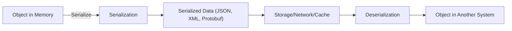

### Performance Considerations

- **JSON/XML:** Text-based, larger payload, slow parsing.
- **Protobuf/Avro:** Binary, compact, fast parsing (but needs schema).
- **Bandwidth & CPU:** Choosing the right format affects network traffic and system resources.

#### Example: Comparing Payload Sizes

| Format   | Sample Data Size |
|----------|------------------|
| JSON     | 150 bytes        |
| XML      | 220 bytes        |
| Protobuf | 50 bytes         |

### When to Use Each Format

- **JSON:** Default for web APIs (REST), easy debugging, wide adoption.
- **XML:** Needed for strong schema enforcement, legacy systems.
- **Protobuf:** For microservices, gRPC, or performance-critical systems.

### Serialization — Tips & Best Practices

- **Choose the right format for the use case:**
  - APIs → JSON for REST; Protobuf for gRPC.
  - Performance-critical → Protobuf or Avro.
  - Human inspection/debugging → JSON.
- **Schema management:** For Protobuf/Avro, maintain versioned schemas for compatibility.
- **Security:** Never deserialize untrusted data without validation (risk of code execution / exploits). Sanitize and validate data post-deserialization.
- **Compression:** For large JSON/XML payloads, use gzip or similar compression in transit.
- **Testing:** Always test serialization/deserialization logic for edge cases and compatibility across language boundaries.
- **Monitoring:** Track payload sizes and serialization/deserialization times for performance bottlenecks.
- **Profile performance:** For high-traffic APIs, benchmark serialization/deserialization speeds and payload sizes.
- **Use binary formats carefully:** Binary is efficient but not debuggable — use in internal service-to-service communication rather than client-facing APIs.
- **Validate data:** XML offers robust schema validation; Protobuf can enforce types; JSON is more permissive but use libraries to validate.

### Serialization — Interview Questions

- What is serialization and where is it used?
- Compare JSON, XML, Protobuf, and Avro.
- Why use Protobuf in gRPC?
- How does serialization affect API performance?
- What are the security risks with serialization?
- Why does MongoDB use BSON?
- How does Avro help in big data systems?
- What are the trade-offs between readability and efficiency in serialization?

### Serialization — References

- [Protobuf Documentation](https://developers.google.com/protocol-buffers)
- [JSON Official Website](https://www.json.org/)
- [XML Specification](https://www.w3.org/XML/)
- [Python json module](https://docs.python.org/3/library/json.html)

---

## CORS — Cross-Origin Resource Sharing & Web Security

Modern web applications are no longer siloed on a single domain — they often depend on APIs and services spread across different domains. But this flexibility introduces critical security challenges. Browsers enforce the **Same-Origin Policy (SOP)** to prevent malicious cross-origin requests, but legitimate use cases require controlled exceptions. That's where **CORS** comes in.

### The Problem: Same-Origin Policy (SOP)

**Same-Origin Policy** is a browser security feature that restricts web pages from making requests to a different domain (origin) than the one that served the web page. This prevents unauthorized web pages from reading sensitive data from another origin.

**Example scenario:**

- Frontend is hosted at `https://app.com`
- Backend API is at `https://api.com`
- By default, the browser **blocks** requests from `app.com` to `api.com`

```
[myapp.com] --X--> [api.other.com]
(Cross-origin request blocked unless CORS is enabled)
```

```plaintext
+----------+      GET /api/data      +------------------+
| app.com  |  -------------------->  | api.other.com    |
+----------+   (Blocked by SOP)      +------------------+
```

### The Solution: What is CORS?

**CORS** is a server-side mechanism that allows controlled cross-origin requests. It does so using specific HTTP headers in responses.

> **Key Point:** CORS is always enforced by browsers and is entirely controlled by server-side configuration. If the server doesn't allow it, the browser will block the request.

### How CORS Works

When a browser detects a cross-origin request, it does one of two things depending on the request's complexity:

#### 1. Simple Requests

- Use methods like `GET`, `POST` (no custom headers or content types).
- The browser adds an `Origin` header automatically.
- Server must respond with:

```
Access-Control-Allow-Origin: https://app.com
```

- If the header is absent or incorrect, the browser blocks the response.

#### 2. Preflight Requests

- Triggered by methods like `PUT`, `DELETE`, or requests with custom headers (e.g., `Authorization`).
- **Before** the actual request, the browser sends an `OPTIONS` request to the server.
- The server responds with headers indicating what's allowed.
- If approved, the browser sends the actual request.

**Preflight request example:**

```http
OPTIONS /user HTTP/1.1
Origin: https://app.com
Access-Control-Request-Method: PUT
Access-Control-Request-Headers: Authorization
```

**Server response:**

```http
Access-Control-Allow-Origin: https://app.com
Access-Control-Allow-Methods: GET, POST, PUT
Access-Control-Allow-Headers: Authorization
```

### CORS Flow Diagrams

A simple GET flow:

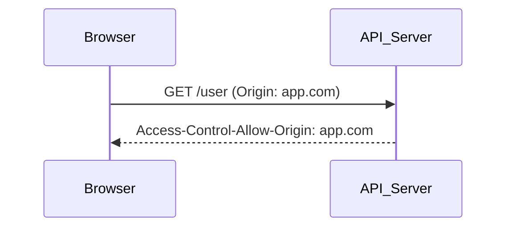

A preflight flow with explicit headers:

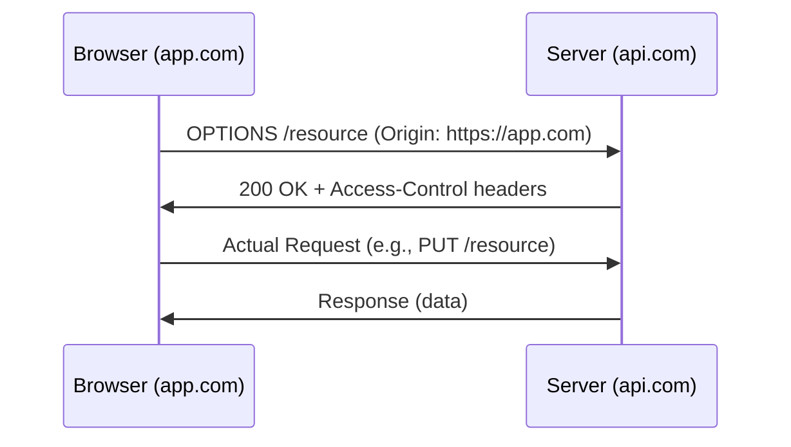

With `alt` branches for allowed/disallowed:

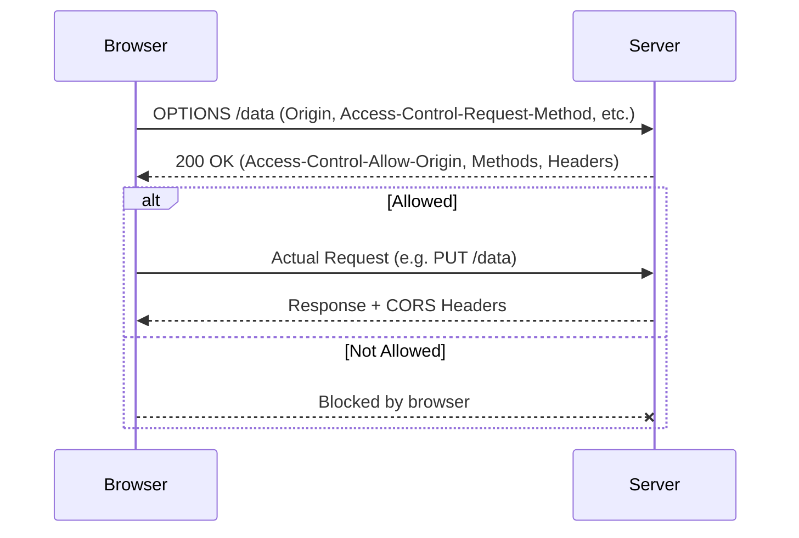

ASCII CORS workflow:

```
+-----------+   Request   +-----------+
|  Site A   | ----------> |   API B   |
+-----------+             +-----------+
      |                       |
      |   Preflight OPTIONS   |
      | <-------------------  |
      |                       |
      |   CORS Headers        |
      | <-------------------  |
```

```plaintext
Client (Origin A)
    |
    |---(HTTP Request with Origin header)--->
    |
Server (Origin B)
    |
    |---(CORS Headers in Response)--------->
    |
Client checks CORS headers before allowing response
```

### Key CORS Headers

| Header                              | Purpose                                                                                  |
|-------------------------------------|------------------------------------------------------------------------------------------|
| `Access-Control-Allow-Origin`       | Specifies the permitted origin(s) (e.g., `https://app.com`, or `*` for any)              |
| `Access-Control-Allow-Methods`      | Allowed HTTP methods (e.g., `GET, POST, PUT`)                                            |
| `Access-Control-Allow-Headers`      | Allowed custom headers (e.g., `Authorization, Content-Type`)                             |
| `Access-Control-Allow-Credentials`  | Indicates if cookies/credentials can be sent (must **not** be used with `*` origin)      |

**Example response headers:**

```
Access-Control-Allow-Origin: https://trusted.com
Access-Control-Allow-Methods: GET, POST
Access-Control-Allow-Headers: Content-Type, Authorization
```

Or, with credentials:

```http
HTTP/1.1 200 OK
Access-Control-Allow-Origin: https://app.com
Access-Control-Allow-Methods: GET, POST, PUT
Access-Control-Allow-Headers: Content-Type, Authorization
Access-Control-Allow-Credentials: true
```

A minimal version:

```http
Access-Control-Allow-Origin: https://trustedsite.com
```

And another:

```http
Access-Control-Allow-Origin: https://example.com
Access-Control-Allow-Methods: GET, POST
Access-Control-Allow-Credentials: true
```

### Implementing CORS: Code Examples

#### Express.js (basic)

```javascript
const cors = require('cors');
app.use(cors({
  origin: ['https://trusted.com'], // Whitelisted origins
  methods: ['GET', 'POST'],
  credentials: true
}));
```

A version with a more specific list:

```javascript
const cors = require('cors');

app.use(cors({
  origin: 'https://app.com',
  credentials: true,
  allowedHeaders: ['Authorization', 'Content-Type'],
  methods: ['GET', 'POST', 'PUT']
}));
```

A simpler version:

```js
const cors = require('cors');
app.use(cors({
  origin: 'https://your-frontend.com',
  methods: ['GET', 'POST'],
  credentials: true
}));
```

#### Express.js (with origin whitelist function)

```js
const express = require('express');
const cors = require('cors');

const app = express();

// Allow only specific origins
const allowedOrigins = ['https://app.com', 'https://admin.app.com'];

app.use(cors({
  origin: function(origin, callback) {
    if (!origin || allowedOrigins.includes(origin)) {
      callback(null, true);
    } else {
      callback(new Error('Not allowed by CORS'));
    }
  },
  methods: ['GET', 'POST', 'PUT', 'DELETE'],
  allowedHeaders: ['Content-Type', 'Authorization'],
  credentials: true // Allow cookies if needed
}));

app.get('/api/data', (req, res) => {
  res.json({ message: "CORS-secured data" });
});

app.listen(3000);
```

A whitelist version with multiple origins:

```js
const express = require('express');
const cors = require('cors');
const app = express();

app.use(cors({
  origin: ['https://app.com'], // whitelist your frontend domain(s)
  methods: ['GET', 'POST', 'PUT', 'DELETE'],
  allowedHeaders: ['Content-Type', 'Authorization'],
  credentials: true // if you need cookies/auth
}));

// Your API routes here
```

#### Spring Boot

```java
// Controller-level CORS config
@CrossOrigin(origins = "https://app.com", allowedHeaders = "*", allowCredentials = "true")
@RestController
public class ApiController {
    @GetMapping("/api/data")
    public ResponseEntity<String> getData() {
        return ResponseEntity.ok("CORS-secured data");
    }
}
```

#### GraphQL (Apollo Server)

```js
const { ApolloServer } = require('apollo-server-express');

const server = new ApolloServer({ /* ... */ });

server.applyMiddleware({
  app,
  cors: {
    origin: ['https://app.com'],
    credentials: true,
    allowedHeaders: ['Content-Type', 'Authorization'],
    methods: ['GET', 'POST']
  }
});
```

#### NGINX Reverse Proxy with CORS Headers

```nginx
location /api/ {
    proxy_pass http://backend;
    add_header Access-Control-Allow-Origin https://trusted.com;
    add_header Access-Control-Allow-Methods 'GET, POST, OPTIONS';
}
```

### Security Risks & Misconfigurations

| Risk                                  | Description                                                                                         | Example                                          |
|---------------------------------------|-----------------------------------------------------------------------------------------------------|--------------------------------------------------|
| Overly Permissive Origins             | Allowing `Access-Control-Allow-Origin: *` exposes your API to any website.                          | Any website can read sensitive API data.         |
| Credentials with Wildcard Origin      | `Access-Control-Allow-Credentials: true` + `*` is blocked by browsers but can still be misconfigured. | May inadvertently leak cookies or tokens.        |
| Exposing Sensitive APIs               | Internal APIs exposed to the public due to lax CORS.                                                | Data leakage or unauthorized actions.            |

**Mitigation strategies:**

- Use a **whitelist** of trusted origins.
- Set **specific CORS policies per API endpoint** (not a global wildcard).
- Separate public and private APIs and enforce correct CORS headers.
- Use a **reverse proxy or API gateway** to centralize and standardize CORS handling.

### Handling CORS in REST & GraphQL APIs

- **REST APIs:** Use built-in CORS tools in frameworks (Express.js, Spring Boot, Django).
- **GraphQL APIs:** Also require CORS, especially since mutations often use `POST` and custom headers.
- **Preflight requests** are common for both, especially with complex or authenticated requests.

### Alternatives to CORS

#### Reverse Proxy

Use NGINX, Apache, or similar as a reverse proxy. Client requests hit the frontend server, which proxies them to the backend, **appearing as same-origin**. CORS is bypassed because the browser sees the request as same-origin.

```nginx
server {
    listen 80;
    server_name app.com;

    location /api/ {
        proxy_pass http://api.com/api/;
        proxy_set_header Host $host;
        # Add any needed headers here
    }
}
```

A simpler version:

```nginx
server {
  listen 80;
  server_name app.com;

  location /api/ {
    proxy_pass http://api.com/;
    proxy_set_header Host api.com;
  }
}
```

#### API Gateway

AWS API Gateway, Azure API Management, etc. Centralized CORS policy for all microservices. Simplifies security and reduces misconfiguration risk.

### CORS — Tips and Tricks

- **Never use wildcard (`*`) origin for sensitive APIs.** Always specify allowed origins.
- **Set `Access-Control-Allow-Credentials: true` only when absolutely necessary** (e.g., cookies for authentication), and **never with a wildcard origin**.
- **Test CORS settings in both development and production.** Misconfigurations often go unnoticed until deployment.
- **Centralize CORS management** with a proxy or API gateway in microservice architectures.
- **Use browser developer tools** (Network tab) to debug CORS errors — check the **preflight** and actual requests.
- **Automate CORS header configuration** where possible to avoid manual errors.
- **Educate your team** about the security implications of CORS. A common cause of breaches is lack of awareness.
- **For local development**, use a proxy or set up CORS to allow `localhost` only.
- **Test your CORS configuration** using tools like `curl` or browser dev tools.
- **Monitor logs** for failed preflight requests — these can signal misconfigurations.
- **Use API Gateways/Reverse Proxies** to centralize and standardize CORS handling.

### CORS — Interview Questions

1. What is the Same-Origin Policy, and why does it exist?
2. How does CORS enable cross-origin requests?
3. What is a preflight request, and when is it required?
4. How do you configure CORS headers on a server?
5. What are common security risks associated with CORS?
6. What are alternatives to CORS for handling cross-origin requests?
7. How do API Gateways and Reverse Proxies help with CORS?

### CORS — References

- [MDN Web Docs — CORS](https://developer.mozilla.org/en-US/docs/Web/HTTP/CORS)
- [OWASP — CORS Security](https://owasp.org/www-community/attacks/CORS_OriginHeaderScrutiny)
- [Express.js CORS Middleware](https://expressjs.com/en/resources/middleware/cors.html)
- [AWS API Gateway CORS](https://docs.aws.amazon.com/apigateway/latest/developerguide/how-to-cors.html)

---

## Browser Security Model and Common Headers

Beyond CORS, the browser enforces several protections via HTTP response headers. Configure these on your server (or at the CDN/reverse proxy) to harden your app.

### XSS vs CSRF — Know the Difference

| Attack | What it does                                              | Mitigation                                                  |
|--------|------------------------------------------------------------|-------------------------------------------------------------|
| **XSS** (Cross-Site Scripting) | Attacker injects JS into your page; runs in your origin | Escape user input, use CSP, `HttpOnly` cookies (JS can't read them) |
| **CSRF** (Cross-Site Request Forgery) | Attacker tricks user's browser into sending an authenticated request from another site | `SameSite=Lax` or `Strict` cookies, CSRF tokens, origin/referer check |

### Essential Security Headers

| Header                            | What it does                                                                                | Example                                                  |
|-----------------------------------|----------------------------------------------------------------------------------------------|----------------------------------------------------------|
| **`Strict-Transport-Security` (HSTS)** | Tells the browser to always use HTTPS for this domain                              | `max-age=31536000; includeSubDomains`                    |
| **`Content-Security-Policy` (CSP)**   | Whitelists which scripts/styles/etc. the page can load — strongest XSS defense    | `default-src 'self'; script-src 'self' https://cdn.example.com` |
| **`X-Content-Type-Options`**          | Stops the browser from guessing MIME type                                          | `nosniff`                                                |
| **`X-Frame-Options`**                 | Prevents your page from being framed (clickjacking defense; CSP `frame-ancestors` is newer) | `DENY`                                          |
| **`Referrer-Policy`**                 | Controls how much of your URL is sent as `Referer` to other sites                  | `strict-origin-when-cross-origin`                        |
| **`Permissions-Policy`**              | Disables features like camera/geolocation when not needed                          | `camera=(), microphone=()`                               |

### Cookie Attributes — All Three Always

A cookie set without all three of these is a vulnerability waiting to happen:

| Attribute   | What it does                                                                | When to omit                       |
|-------------|------------------------------------------------------------------------------|-------------------------------------|
| `Secure`    | Cookie only sent over HTTPS                                                  | Never omit in production            |
| `HttpOnly`  | JavaScript can't read the cookie (defeats XSS-based token theft)             | Only for cookies the client must read (rare) |
| `SameSite`  | Cookie not sent on cross-site requests (defeats CSRF)                         | `Lax` is the default; use `Strict` if you don't need cross-site embeds |

> **Beginner pitfall:** storing JWT in `localStorage` so JS can read it is **convenient but unsafe.** XSS instantly steals it. Storing it in an `HttpOnly` cookie is safer — JS can't read it, so XSS can't exfiltrate it. The downside: CSRF risk (mitigated by `SameSite`).

### Modern Auth Pattern: BFF + HttpOnly Session Cookie

The current best-practice pattern for SPAs:

1. SPA calls your **BFF** (Backend for Frontend) over same-origin HTTPS.
2. BFF handles OAuth/OIDC with the identity provider on the server side.
3. BFF issues an **`HttpOnly`, `Secure`, `SameSite=Lax` session cookie** to the browser.
4. JS in the SPA never touches the token. XSS can't steal it. CSRF mitigated by `SameSite`.

This is the recommended pattern by the OAuth working group as of 2023+, replacing the older "store JWT in localStorage" approach.

---

## Best Practices for Scalable & Secure Web Systems

- **Stateless Servers:** Prefer storing minimal state on the server; use tokens.
- **Centralized Session Store:** For sessions, use distributed stores like Redis.
- **Secure Cookies:** Always use `HttpOnly`, `Secure`, and `SameSite` flags.
- **Minimal CORS:** Only allow origins you trust. Never use `*` for sensitive endpoints.
- **Efficient Serialization:** Use Protocol Buffers or similar for internal APIs.

---

## Combined Tips & Tricks

A consolidated master list drawn from all sections.

### Session Security

- Always use **HTTPS** to protect session IDs and tokens.
- Set `HttpOnly`, `Secure`, and `SameSite` on cookies.
- Regenerate session IDs after login and logout to prevent fixation attacks.
- Use short expiry times and idle timeouts to reduce window for hijacking.
- Rotate and expire session tokens regularly.
- Monitor and log session activity to detect suspicious usage or brute force attacks.

### Scaling Sessions

- Use sticky sessions only when unavoidable; prefer distributed session storage.
- For distributed systems, externalize session storage (e.g., Redis, Memcached).
- Prefer stateless JWTs for microservices and APIs, but invalidate tokens on password changes.
- Centralize session storage (e.g., Redis) when scaling web servers to avoid sticky sessions and data loss.

### JWT Caution

- **Never store sensitive data in JWT payload;** always validate on the server.
- Implement token revocation strategies (e.g., blacklists) for sensitive systems.
- Handle token expiry and renewal explicitly.

### Choosing Serialization

- Use **JSON** for REST APIs (unless bandwidth is a concern).
- For high-performance or binary protocols, use **Protobuf** or **Avro**.
- Match serialization format to your database/cache for efficiency.
- For human inspection/debugging, choose JSON.
- Serialize only necessary data; avoid large, nested JSON objects.

### CORS Configuration

- **Never use `Access-Control-Allow-Origin: *` with credentials.**
- Maintain a whitelist of trusted domains.
- Consider using an API Gateway or Reverse Proxy for complex setups.
- Monitor CORS headers in production using browser dev tools or `curl`.

### General Security

- Always validate and sanitize all inputs, even if requests come from "trusted" origins.
- Use CSRF tokens on state-changing requests.

### Interview Prep

- Be ready to discuss trade-offs between session management strategies.
- Explain how you'd handle sessions, serialization, or CORS in cloud or microservice environments.
- Know how to explain CORS, SOP, and common security pitfalls.
- Understand how serialization impacts system performance and scalability.

---

## Sample Interview Questions

### Sessions & State

- Why is HTTP stateless, and how do we work around it?
- Compare session-based and token-based authentication.
- How do you scale session management across multiple servers?
- What are the security risks of cookies, and how do you mitigate them?
- What is CSRF, and how do you protect against it?
- How would you handle token revocation in a stateless JWT system?

### Serialization

- What is serialization, and why is it important?
- Compare JSON, XML, Protobuf, and Avro.
- How does serialization affect bandwidth and performance?
- Why does MongoDB use BSON?
- What security risks come with deserialization, and how do you mitigate them?

### CORS

- What is the Same-Origin Policy and why does it exist?
- Explain CORS and how it works.
- What is a preflight request? When is it required?
- What are common CORS misconfigurations, and how do you avoid them?
- What are the alternatives to CORS?

---

## Summary & Key Takeaways

- **HTTP is stateless:** Use sessions or tokens to track user state.
- **Web sessions:** Maintain state via cookies, server-side sessions, or token-based authentication (JWT).
- **Serialization:** Crucial for data exchange — choose the right format for your performance, readability, and compatibility needs.
- **CORS:** Enforces browser security but must be configured properly to enable legitimate cross-origin communication without exposing vulnerabilities.
- **Scalability & Security:** Design your web systems with distributed session storage, stateless authentication, and robust CORS policies.

---

## Further Reading

**Sessions / Authentication:**

- [JWT.io](https://jwt.io/) — JWT debugger and library list
- [OWASP Session Management Cheat Sheet](https://cheatsheetseries.owasp.org/cheatsheets/Session_Management_Cheat_Sheet.html)

**Serialization:**

- [Protobuf Documentation](https://developers.google.com/protocol-buffers)
- [JSON Official Website](https://www.json.org/)
- [XML Specification](https://www.w3.org/XML/)
- [Python json module](https://docs.python.org/3/library/json.html)
- [Apache Avro](https://avro.apache.org/)

**CORS:**

- [MDN — CORS](https://developer.mozilla.org/en-US/docs/Web/HTTP/CORS)
- [OWASP — CORS Security](https://owasp.org/www-community/attacks/CORS_OriginHeaderScrutiny)
- [Express.js CORS Middleware](https://expressjs.com/en/resources/middleware/cors.html)
- [AWS API Gateway CORS](https://docs.aws.amazon.com/apigateway/latest/developerguide/how-to-cors.html)

---

**Next Up:** [Chapter 6 — Scalability in System Design →](./6%20-%20Scalability%20in%20System%20Design.md) — what it is, why it matters, and strategies like load balancing, horizontal/vertical scaling, and auto-scaling in the cloud.
