# Mastering Scalability in System Design

Scalability is the backbone of robust modern systems — enabling web applications, APIs, and microservices to gracefully handle growth in users, data, and workload.

In this chapter, we'll explore the **core principles, strategies, common pitfalls, and best practices** for designing scalable systems — drawing from theory and real-world cloud solutions. You'll learn vertical/horizontal/diagonal scaling, load balancing, autoscaling, and cost optimization.

---

## Learning Outcomes

After reading this chapter, you'll be able to:

1. Choose between vertical, horizontal, and diagonal scaling for a given growth pattern.
2. Apply **Amdahl's Law** and recognize the limits of parallelism.
3. Design **stateless services** that scale horizontally without coordination.
4. Use **circuit breakers, bulkheads, and rate limiting** to prevent cascading failures.
5. Estimate capacity for a service from QPS, latency, and resource limits.

---

## Table of Contents

1. [What is Scalability?](#what-is-scalability)
2. [Why Systems Need to Scale](#why-systems-need-to-scale)
3. [Types of Scalability](#types-of-scalability)
4. [Common Challenges in Scaling](#common-challenges-in-scaling)
5. [Scaling Strategies — A Deep Dive](#scaling-strategies--a-deep-dive)
6. [Load Balancing — The Backbone of Scalability](#load-balancing--the-backbone-of-scalability)
7. [Autoscaling in Cloud Environments](#autoscaling-in-cloud-environments)
8. [Monitoring & Proactive Scaling](#monitoring--proactive-scaling)
9. [Cost Optimization Strategies](#cost-optimization-strategies)
10. [Combined Tips & Tricks](#combined-tips--tricks)
11. [Sample Interview Questions](#sample-interview-questions)
12. [Key Takeaways](#key-takeaways)
13. [Further Reading](#further-reading)

---

## What is Scalability?

> **Scalability** is the capability of a system to handle an increasing load — or its potential to accommodate growth — without sacrificing performance, reliability, or availability.

A scalable system won't break, slow down, or become unreliable as more users come online or data volumes grow. Whether it's 1,000 users or 1 million, a well-designed system maintains its SLAs and keeps the user experience smooth.

**Key properties:**

- Maintains throughput and latency under growing traffic.
- Avoids downtime or service degradation.
- Grows efficiently without massive re-engineering.

---

## Why Systems Need to Scale

- **User base growth:** Viral success or global expansion increases the number of users dramatically.
- **Data volume explosion:** IoT, analytics, and sensors can generate data that grows exponentially.
- **Peak events:** Black Friday, ticket sales, news spikes, or viral trends cause sudden traffic surges.
- **Service Level Agreements (SLAs):** Meet strict performance (e.g., <200ms response) and uptime targets (e.g., 99.99%).
- **Avoid downtime:** Unscalable systems crash or slow down under pressure, causing user churn.
- **Expanding to new regions or markets.**

---

## Types of Scalability

There are three main ways to scale a system.

### 1. Vertical Scaling ("Scaling Up")

Add more resources (CPU, RAM, Disk) to a single server.

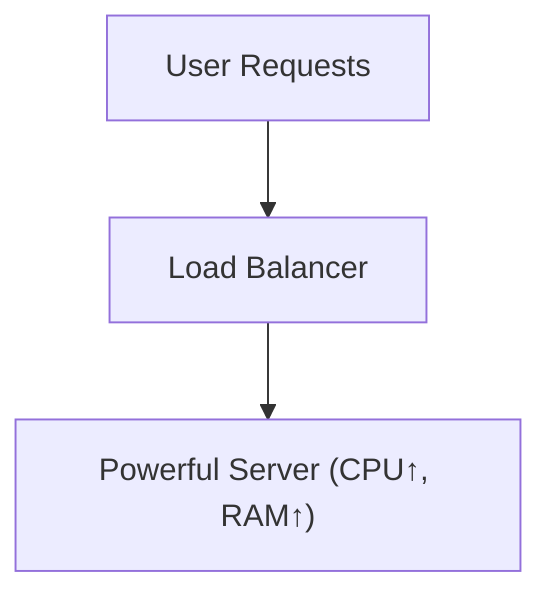

A simpler view:

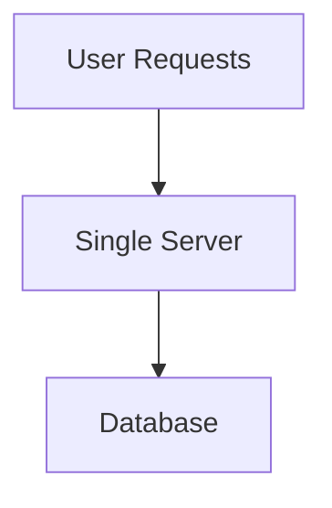

**Pros:**

- Simple to implement.
- Fast upgrades.
- No need for distributed coordination.

**Cons:**

- Physical hardware caps.
- Single point of failure (SPOF).
- Costly at scale.

**Example: Upgrading an AWS EC2 instance:**

```bash
aws ec2 modify-instance-attribute --instance-id i-1234567890abcdef0 --instance-type "{\"Value\": \"t3.2xlarge\"}"
```

### 2. Horizontal Scaling ("Scaling Out")

Add more servers/nodes, distributing traffic and workload.

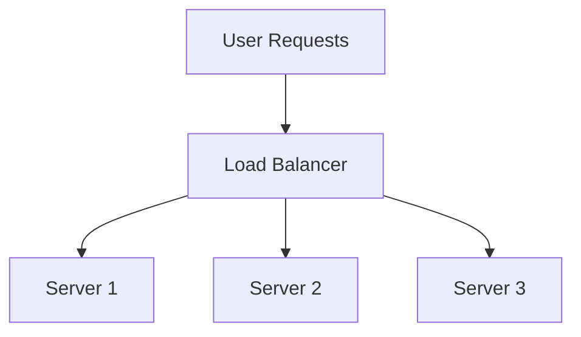

A more detailed version showing the shared database:

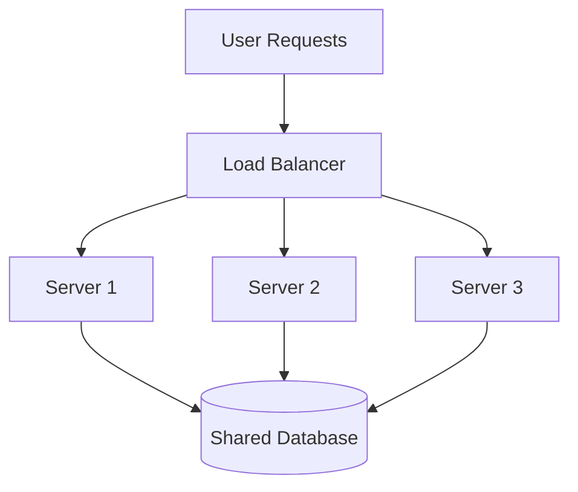

**Pros:**

- High resilience and availability.
- Can scale indefinitely.
- Parallelism, redundancy.

**Cons:**

- Requires stateless design or careful coordination.
- Needs load balancers.
- Complex setup (data consistency, replication).

**Example: Kubernetes Horizontal Pod Autoscaler (HPA) YAML:**

```yaml
apiVersion: autoscaling/v2
kind: HorizontalPodAutoscaler
metadata:
  name: web-app-hpa
spec:
  scaleTargetRef:
    apiVersion: apps/v1
    kind: Deployment
    name: web-app
  minReplicas: 2
  maxReplicas: 10
  metrics:
  - type: Resource
    resource:
      name: cpu
      target:
        type: Utilization
        averageUtilization: 70
```

### 3. Diagonal Scaling (Hybrid)

Begin with vertical scaling for simplicity; transition to horizontal as needed. Common in cloud-native apps.

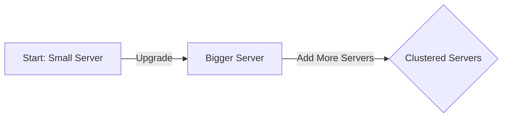

A two-phase view:

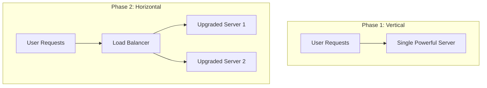

*Start vertical, then scale horizontally as needed.*

A single-graph view of all 3 types:

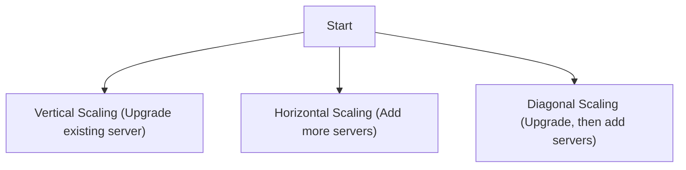

**Real-world examples:**

- **AWS Lambda:** Starts small (vertical), but can auto-scale (horizontal) based on demand.
- **Twitter:** From monolith (vertical) to microservices (horizontal) as user base grew.

### Scaling Types — Comparison

A summary of all three types side-by-side:

| Scaling Type      | Approach                                  | Pros                | Cons                           |
|-------------------|-------------------------------------------|---------------------|--------------------------------|
| Vertical Scaling  | Upgrade single machine (CPU/RAM/Disk)     | Simple, fast        | Physical limits, SPOF*         |
| Horizontal Scaling| Add more machines/nodes                   | Resilient, scalable | Complex architecture           |
| Diagonal Scaling  | Start vertical, then add horizontal nodes | Flexible, cost-wise | Hybrid (must manage both)      |

> *SPOF: Single Point of Failure.

A version focused on pros/cons:

| Type              | Description                              | Pros                        | Cons                       |
|-------------------|------------------------------------------|-----------------------------|----------------------------|
| **Vertical**      | Add resources (CPU/RAM) to a single node | Simple, fast upgrades       | Physical limits, SPOF      |
| **Horizontal**    | Add more nodes/servers                   | High resilience, big scale  | Complex, needs LB/replica  |
| **Diagonal**      | Start vertical, then go horizontal       | Flexible, cost-efficient    | Coordination complexity    |

### Trade-Offs: Cost, Complexity, and Performance

|   Strategy   | Cost (Initial) | Cost (Growth) | Complexity | Performance       |
|--------------|----------------|---------------|------------|-------------------|
| Vertical     | Low            | High          | Low        | High (initial)    |
| Horizontal   | Medium         | Linear        | High       | High (scalable)   |
| Diagonal     | Balanced       | Balanced      | Medium     | Balanced          |

**Summary:**

- **Vertical scaling** is easy and cheap to start, but gets expensive and risky at scale.
- **Horizontal scaling** is robust and future-proof, but requires orchestration, monitoring, and stateless patterns.
- **Diagonal scaling** gives early simplicity and long-term scalability, favored by modern cloud-native architectures.

---

## Common Challenges in Scaling

| Challenge   | Description                                              | Example                        |
|-------------|----------------------------------------------------------|--------------------------------|
| Latency     | Delay in response due to distributed components          | Microservices, DB hops         |
| Bottlenecks | Slowest service limits overall throughput                | Locked DB, single-threaded job |
| Downtime    | More servers = more potential failure points             | Outages during deployments     |
| Cost        | More resources = higher bills (especially in cloud)      | Over-provisioned instances     |

---

## Scaling Strategies — A Deep Dive

### When to Use Which Strategy?

| Approach    | When to Use                            | Real-World Example            |
|-------------|----------------------------------------|-------------------------------|
| Vertical    | MVPs, startups, low initial traffic    | Early-stage SaaS, blogs       |
| Horizontal  | High-scale apps, resilience needed     | Twitter, Facebook             |
| Diagonal    | Cloud-native with uncertain workloads  | AWS Lambda, GCP Cloud Run     |

**Real-world choices:**

- **Twitter:** Monolith → microservices (horizontal) as user base grew.
- **AWS Lambda:** Diagonal + autoscaling.
- **Startups:** Vertical first, then horizontal as needed.

### Example: Setting up AWS Auto Scaling Group (Horizontal)

```bash
aws autoscaling create-auto-scaling-group \
  --auto-scaling-group-name my-asg \
  --launch-configuration-name my-launch-config \
  --min-size 2 \
  --max-size 10 \
  --desired-capacity 2 \
  --vpc-zone-identifier "subnet-12345678,subnet-23456789"
```

### Practical Tips for Scaling Strategy Choice

- **Start simple:** Early-stage startups or MVPs should favor vertical scaling to keep things simple and cost-effective.
- **Know when to switch:** Monitor system metrics. When you approach hardware limits or need high availability, start planning horizontal or diagonal scaling.
- **Embrace statelessness:** For horizontal scaling, design services to be stateless. Use shared databases or distributed caches for state.
- **Use managed services:** Cloud providers offer powerful auto-scaling and load balancing solutions (AWS ELB, Azure Load Balancer).
- **Don't over-engineer:** Avoid building distributed systems too early. Scale complexity with actual demand.
- **Implement load balancers:** Distribute traffic, prevent overload, increase reliability.
- **Monitor proactively:** Use CloudWatch, Prometheus, or Grafana to anticipate scaling needs before issues arise.

---

## Load Balancing — The Backbone of Scalability

Scalability is at the heart of robust system design. As user bases and data volumes grow, ensuring your application remains fast, available, and cost-effective becomes critical. One of the key enablers is **load balancing** — the art and science of distributing incoming traffic across a pool of servers.

### Why Load Balancing is Essential

Imagine a high-traffic e-commerce website during Black Friday. Without load balancing, a single server could get overwhelmed, causing slowdowns or outages. With a load balancer, incoming requests are automatically spread across multiple backend servers for maximum uptime and minimum latency.

**Key benefits:**

- **High Availability:** Keeps your app running even during server failures or traffic spikes.
- **Traffic Distribution:** Prevents overload by spreading requests evenly.
- **Improved Performance:** Routes requests to the least-busy or fastest server.
- **Graceful Failure Handling:** Detects and bypasses failed servers.
- **Scalability:** Makes it easy to add or remove servers as demand changes.
- **Reduces latency for users.**

> **Real-World Example:** During a flash sale, Amazon's load balancers distribute millions of requests per second across a massive fleet of servers, ensuring shoppers never see a 503 error.

### Types of Load Balancers

Load balancers can be categorized by the **network layer** they operate on and by their **deployment model**.

#### By Network Layer

| Type                | Layer               | Examples                                |
|---------------------|---------------------|-----------------------------------------|
| Layer 4 (Transport) | TCP/UDP             | AWS NLB, HAProxy (TCP), F5              |
| Layer 7 (App)       | HTTP/HTTPS/gRPC     | AWS ALB, NGINX, Envoy, Google L7 LB     |

**Layer 4 (Transport Layer):**

- Operates at TCP/UDP level.
- Routes based on IP address and port.
- **Pros:** Blazing fast, efficient, low overhead.
- **Cons:** No content-based routing.

**Layer 7 (Application Layer):**

- Operates at HTTP/HTTPS.
- Routes based on HTTP headers, cookies, URLs, etc.
- **Pros:** Intelligent content-aware routing.
- **Cons:** Slightly more processing overhead.

#### Diagram: Layer 4 vs Layer 7

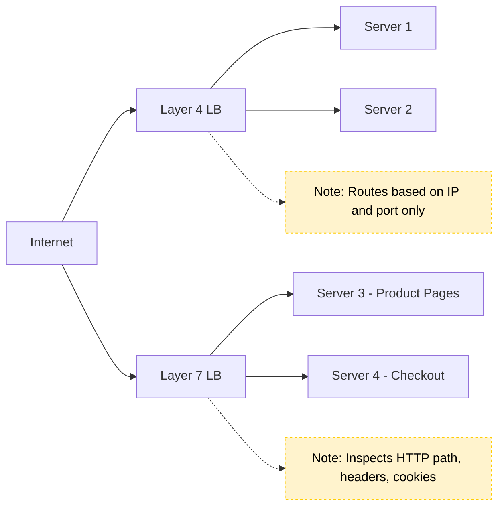

#### By Deployment Model

| Type                 | Examples                                          |
|----------------------|---------------------------------------------------|
| **Hardware**         | F5 BIG-IP, Citrix NetScaler                       |
| **Software**         | NGINX, HAProxy, Envoy                             |
| **Cloud-based**      | AWS ELB, Azure Load Balancer, GCP Load Balancer   |

**Hardware Load Balancers:**

- Specialized devices, used in large data centers.
- Often with SSL termination and DDoS protection.

**Software Load Balancers:**

- Apps running on commodity servers.
- Flexible, cost-effective, popular in microservices and Kubernetes.

**Cloud-based Load Balancers:**

- Managed services provided by cloud vendors.
- Handles scaling, failover, security out-of-the-box.

### Load Balancing Algorithms

- **Round Robin:** Sequential distribution.
- **Least Connections:** Server with fewest active connections.
- **IP Hash:** Consistent routing based on client IP (supports sticky sessions).
- **Weighted:** Some servers get more requests based on capacity.
- **Least Response Time:** Fastest responding server.
- **Adaptive Load Balancing:** Continuously analyzes CPU, memory, and health metrics.

### Code: Load Balancing Algorithms in Python

**Simple round-robin (pseudocode):**

```python
# Pseudocode: Simple Round Robin Load Balancer
servers = [srv1, srv2, srv3]
next_server = 0

def get_server():
    global next_server
    srv = servers[next_server]
    next_server = (next_server + 1) % len(servers)
    return srv
```

**Round-robin with function-level state:**

```python
servers = ['A', 'B', 'C']
idx = 0

def get_next_server():
    global idx
    server = servers[idx]
    idx = (idx + 1) % len(servers)
    return server
```

**Round-robin as a class:**

```python
class RoundRobinLB:
    def __init__(self, servers):
        self.servers = servers
        self.index = 0

    def get_server(self):
        server = self.servers[self.index]
        self.index = (self.index + 1) % len(self.servers)
        return server

# Usage
lb = RoundRobinLB(['server1', 'server2', 'server3'])
for _ in range(6):
    print(lb.get_server())
```

Output:

```
server1
server2
server3
server1
server2
server3
```

**Least connections:**

```python
connections = {'A': 3, 'B': 1, 'C': 2}

def get_least_connections():
    return min(connections, key=connections.get)
```

**IP hashing:**

```python
import hashlib

def ip_hash(ip, servers):
    idx = int(hashlib.md5(ip.encode()).hexdigest(), 16) % len(servers)
    return servers[idx]
```

**Weighted round robin:**

```python
servers = [('A', 3), ('B', 1)]  # (server, weight)
weighted_list = [s for s, w in servers for _ in range(w)]
idx = 0

def get_weighted_server():
    global idx
    server = weighted_list[idx]
    idx = (idx + 1) % len(weighted_list)
    return server
```

### Load Balancer in Action

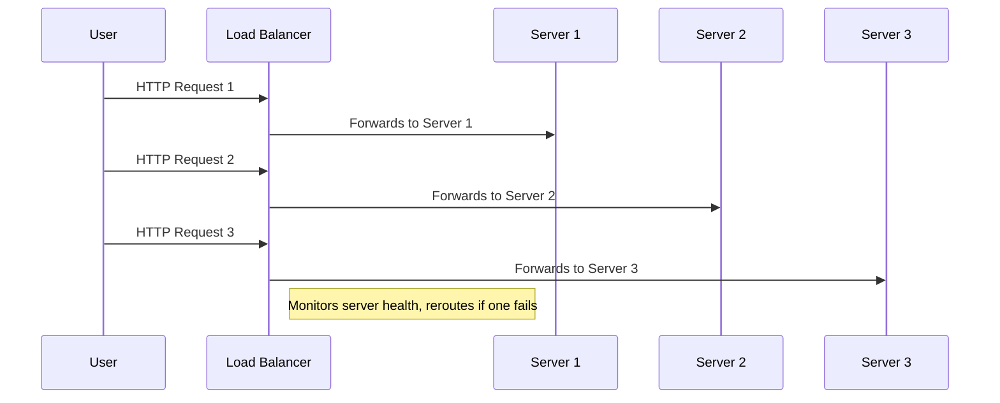

A simpler view:

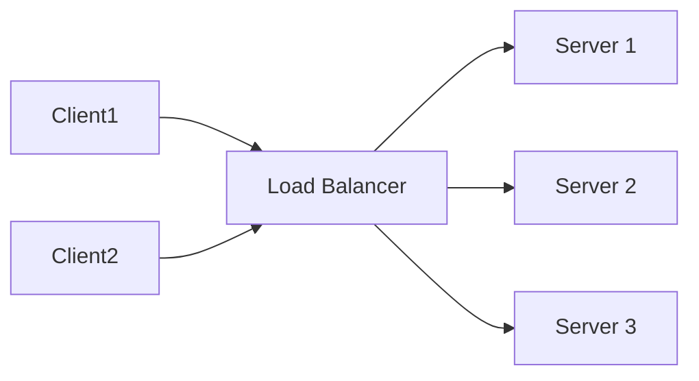

**Handling failures gracefully:** If Server 2 crashes, the load balancer detects this via health checks and reroutes all new traffic to Server 1 and Server 3 only, preserving high availability.

### Sample NGINX Load Balancer Config

```nginx
http {
    upstream backend {
        server backend1.example.com weight=3;
        server backend2.example.com weight=2;
        server backend3.example.com weight=1;
    }

    server {
        listen 80;
        location / {
            proxy_pass http://backend;
        }
    }
}
```

### Choosing the Right Load Balancer

- **Layer 4:** Choose for raw speed and lower-level TCP/UDP traffic.
- **Layer 7:** Choose for intelligent routing (APIs, microservices).
- **Software:** Great for flexible, cost-effective deployments.
- **Hardware:** Enterprise-grade performance, in data centers.
- **Cloud:** Seamless scaling, built-in security, minimal management.

**Other considerations:**

- **SSL Termination:** Offload CPU-heavy encryption from backend servers.
- **DDoS Protection:** Many cloud/hardware LBs provide built-in attack mitigation.
- **Session Persistence:** Use IP hashing or sticky sessions if needed.

### Load Balancing — Tips & Best Practices

- **Always set up health checks** for your backend servers.
- **Prefer stateless backend design** for easier load balancing.
- **Monitor metrics** like connection counts, response times, error rates.
- **For microservices**, consider using a service mesh (Istio, Linkerd) for advanced L7 routing.
- **Enable SSL termination** at the load balancer to reduce backend CPU load.
- **Use autoscaling** in conjunction with load balancing for elastic capacity.
- **Choose the right strategy** based on traffic patterns and backend capabilities.
- **Combine load balancing with autoscaling** for true elasticity in the cloud.
- **Monitor, test, and iterate** — don't "set and forget" your load balancer.

---

## Autoscaling in Cloud Environments

In modern cloud architecture, **autoscaling** is a core technique for building highly available, cost-effective, and resilient systems.

### What is Autoscaling?

**Autoscaling** is the **automatic adjustment of compute resources** (servers, containers, or functions) in response to real-time demand.

- **Objective:** Maintain performance and availability while optimizing costs.
- **Common use cases:** Microservices, web applications, event-driven systems, batch processing.

> *"Autoscaling plays a critical role in keeping system performance available and cost-efficient, especially where demand can vary drastically and unpredictably."*

### How Autoscaling Works

Autoscaling decisions are **triggered by metrics** such as:

- **CPU usage**
- **Memory consumption**
- **Request rate**
- **Queue length**
- **Custom business KPIs**

### Autoscaling Types

| Type               | Description                                                      | Example                |
|--------------------|------------------------------------------------------------------|------------------------|
| **Horizontal**     | Add/remove instances (scale out/in)                              | Add EC2 VMs/Pods       |
| **Vertical**       | Resize a single instance (scale up/down)                         | Add CPU/RAM to server  |
| **Diagonal**       | Start vertical, then add horizontal as needed (hybrid approach)  | Cloud-native workloads |

**Diagram: Scaling Types**

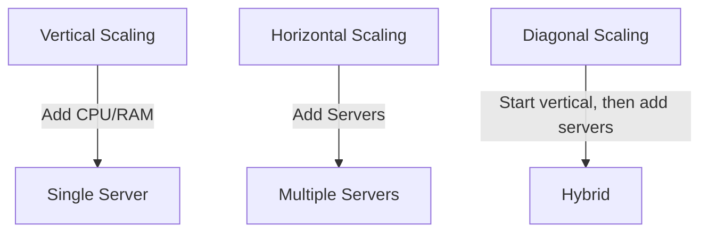

### Scaling Policies

- **Reactive Scaling:** Triggers when specific metrics cross thresholds (e.g., CPU > 80%).
- **Predictive Scaling:** Uses historical trends and ML to forecast and scale *before* demand spikes.
- **Scheduled Scaling:** Scales resources at set times based on known traffic patterns (e.g., daily peaks, Black Friday).

### Autoscaling Across Major Cloud Providers

All major clouds offer first-class autoscaling features.

| Provider | Autoscaling Services                                                                      |
|----------|-------------------------------------------------------------------------------------------|
| AWS      | EC2 Auto Scaling Groups, Lambda, ECS, EKS                                                 |
| Azure    | VM Scale Sets, App Service Plans, AKS                                                     |
| GCP      | Managed Instance Groups (MIGs), Cloud Run, GKE, Functions                                 |

A more detailed view:

| Cloud  | Compute Autoscaling                | Container Autoscaling             | Monitoring / Metrics     |
|--------|------------------------------------|-----------------------------------|--------------------------|
| **AWS**   | EC2 Auto Scaling Groups, Lambda | ECS, EKS (Kubernetes) Autoscaling | CloudWatch               |
| **Azure** | VM Scale Sets, App Service Plans| AKS (Kubernetes) Autoscaling      | Azure Monitor            |
| **GCP**   | Managed Instance Groups, Functions | Cloud Run, GKE Autoscaling     | Stackdriver/Operations   |

### Example: AWS EC2 Auto Scaling Group (CloudFormation YAML)

```yaml
Resources:
  MyAutoScalingGroup:
    Type: AWS::AutoScaling::AutoScalingGroup
    Properties:
      MinSize: '2'
      MaxSize: '10'
      DesiredCapacity: '2'
      LaunchConfigurationName: !Ref MyLaunchConfig
      TargetGroupARNs:
        - !Ref MyTargetGroup
      MetricsCollection:
        - Granularity: "1Minute"
```

A version with tags:

```yaml
Resources:
  MyAutoScalingGroup:
    Type: AWS::AutoScaling::AutoScalingGroup
    Properties:
      MinSize: 2
      MaxSize: 10
      DesiredCapacity: 4
      LaunchConfigurationName: !Ref MyLaunchConfig
      TargetGroupARNs:
        - !Ref MyTargetGroup
      MetricsCollection:
        - Granularity: "1Minute"
      Tags:
        - Key: Name
          Value: MyASGInstance
          PropagateAtLaunch: true
```

### Example: Azure VM Scale Set (CLI)

```bash
az vmss create \
  --resource-group myResourceGroup \
  --name myScaleSet \
  --image UbuntuLTS \
  --upgrade-policy-mode automatic \
  --custom-data cloud-init.txt \
  --admin-username azureuser

az vmss autoscale create \
  --resource-group myResourceGroup \
  --name myAutoscaleSetting \
  --vmss-name myScaleSet \
  --min-count 2 --max-count 10 --count 2
```

### Example: GCP Managed Instance Group (gcloud)

```bash
gcloud compute instance-groups managed create my-group \
  --base-instance-name my-instance \
  --template my-instance-template \
  --size 2 \
  --zone us-central1-a

gcloud compute instance-groups managed set-autoscaling my-group \
  --max-num-replicas 10 \
  --min-num-replicas 2 \
  --target-cpu-utilization 0.75 \
  --cool-down-period 90
```

---

## Monitoring & Proactive Scaling

Effective autoscaling depends on robust monitoring.

- **Key Metrics:** CPU, memory, network, queue depth, custom KPIs.
- **Tools:** AWS CloudWatch, Prometheus, Azure Monitor, GCP Operations, Grafana.
- **Proactive Scaling:** Use ML/trends to *forecast* demand, not just react.
- **Scheduled Scaling:** Predefine scaling windows for known peak times (Black Friday, daily traffic patterns).

---

## Cost Optimization Strategies

Cloud costs can spiral if autoscaling is not managed carefully. Best practices:

| Strategy                       | Description                                                          |
|--------------------------------|----------------------------------------------------------------------|
| **Avoid Over-provisioning**    | Scale just enough for demand; avoid idle resources.                  |
| **Use Spot/Preemptible VMs**   | For batch/non-critical workloads; up to 80% cheaper.                 |
| **Set Resource Limits/Quotas** | Prevent runaway scaling, especially in dev/test environments.        |
| **Rightsize Regularly**        | Analyze actual usage and adjust resource size accordingly.           |
| **Auto-pausing/Scale-to-zero** | Use features that pause/stop idle services (e.g., Cloud Run, Lambda) |

---

## The Fundamental Laws

### Amdahl's Law — Why Adding Servers Doesn't Linearly Scale

If 95% of a workload is parallelizable and 5% is serial, the **maximum speedup is 20×** — no matter how many machines you throw at it.

```
Speedup ≤  1 / ((1 - P) + P/N)
where P = parallel fraction, N = number of processors
```

| Parallel %  | Max speedup (∞ machines) |
|-------------|-------------------------|
| 50%         | 2×                       |
| 90%         | 10×                      |
| 95%         | 20×                      |
| 99%         | 100×                     |

**Lesson:** the serial part of your system is the bottleneck. Profile to find it; eliminate it before adding more machines.

### Universal Scalability Law (Gunther)

In practice, scaling is often *worse* than Amdahl predicts because of **coordination overhead** — locks, consensus, distributed transactions. There's a point past which adding more nodes makes the system *slower*. This is why "just add another microservice" doesn't always help.

---

## Stateless Service Design

The single most important enabler of horizontal scaling. A **stateless** service holds no per-request memory between requests; any instance can serve any request.

### Where to Put the State Instead

| State                   | Where it goes               | Why                                  |
|-------------------------|------------------------------|--------------------------------------|
| User session            | Redis / Memcached            | Any instance can look it up by ID    |
| File uploads in progress| Object storage with session tokens | Resumable uploads work across servers |
| In-progress workflows   | Database or workflow engine (Temporal, Step Functions) | Survives restarts          |
| WebSocket state         | Pub/Sub layer (Redis Streams, Kafka) | Any WebSocket server can deliver to any user |

> **Rule:** if your service can't be killed and restarted at any moment without users noticing, you have hidden state. Find it.

---

## Failure Containment Patterns

Scaling isn't only about handling load — it's about preventing one failure from cascading.

### Circuit Breaker

If a downstream service is failing, **stop calling it for a while** so the failing service can recover and your service doesn't waste resources waiting on timeouts.

```
States:  CLOSED  →  OPEN  →  HALF-OPEN  →  CLOSED
         (normal)   (fail fast)  (try one)  (back to normal)
```

**Implementation:** count failures in a window; trip if >N% fail; after a cooldown, allow one trial request.

### Bulkhead

Isolate resources so failure in one part of the system can't drown the rest. Just like the watertight compartments on a ship — if one floods, the rest stay dry.

**Example:** dedicate separate thread pools (or connection pools) per downstream service. If the slow payment service eats all 200 threads, your auth calls still have their own pool.

### Rate Limiting

Cap how many requests any one client (IP, user, API key) can send in a window. Protects against abuse *and* against your own systems thundering when something goes wrong.

**Algorithms (in order of sophistication):**

| Algorithm        | Simplicity | Burst handling | Memory cost |
|------------------|-----------|-----------------|-------------|
| Fixed window     | simplest   | bad (allows 2× burst at window edges) | tiny |
| Sliding window log | precise  | great           | high (stores timestamps) |
| Sliding window counter | balanced | good       | low |
| Token bucket     | most flexible | great (allows bursts up to bucket size) | small |
| Leaky bucket     | smoothes traffic | enforces constant rate | small |

> **Default choice:** token bucket. Easy to reason about, allows reasonable bursts, well-supported in libraries.

### Backpressure

When you can't keep up, **tell upstream to slow down** rather than silently dropping or queuing forever. Standard mechanisms: HTTP 429, gRPC `RESOURCE_EXHAUSTED`, blocking writes on a bounded queue.

---

## Capacity Planning — Back-of-the-Envelope

Given:
- p99 latency budget: **100 ms**
- Each request takes: **~20 ms** of CPU
- Each server: **8 cores**

**Throughput per server:** `(8 cores × 1000 ms/s) / 20 ms ≈ 400 req/s` (ignoring I/O wait)

**At 10K req/s peak load:** `10,000 / 400 = 25 servers`, plus **+50% headroom** for spikes and rolling deploys → **40 servers**.

> **Rule of thumb:** aim for **60-70% steady-state utilization.** Higher = no margin for spikes. Lower = wasted money.

---

## Combined Tips & Tricks

A consolidated master list drawn from all sections.

### General Scaling

- **Start simple:** Use vertical scaling for MVPs; switch to horizontal as needs grow. Don't over-engineer.
- **Design stateless services:** Easier to distribute and scale horizontally. Use shared databases or distributed caches for state.
- **Choose the right scaling strategy:** Horizontal for resilience, vertical for simplicity, diagonal for flexibility.
- **Know when to switch:** Monitor system metrics; switch when approaching hardware limits or needing high availability.
- **Document scaling decisions:** Record why/when you chose vertical, horizontal, or diagonal scaling to aid future maintenance.

### Automation & Monitoring

- **Automate monitoring:** Track key metrics and set up alerts.
- **Monitor everything:** Use dashboards and alerts (CloudWatch, Prometheus, Grafana).
- **Monitor both technical and business KPIs:** e.g., queue depth, orders per minute.
- **Plan for failure:** Implement health checks and graceful failover in load balancers.
- **Test under load:** Use chaos engineering and load testing to surface bottlenecks early.

### Load Balancers

- **Implement load balancers:** Distribute traffic, prevent overload, increase reliability.
- **Choose the right load balancing strategy:** Match to traffic patterns.
- **Always set up health checks** for backend servers.
- **For microservices**, consider using a service mesh (Istio, Linkerd) for advanced L7 routing.
- **Enable SSL termination** at the load balancer to reduce backend CPU load.

### Autoscaling

- **Set conservative thresholds at first, then tune.** Avoid thrashing (rapid scaling in/out).
- **Test autoscaling in staging with simulated traffic spikes.**
- **Combine reactive and predictive scaling for best results.**
- **Document your scaling policies** and update them as usage patterns evolve.
- **For serverless, check for concurrency limits and cold start implications.**
- **Always review cloud provider pricing calculators** to forecast cost under peak loads.
- **Limit autoscaling:** Set quotas to avoid runaway costs.

### Cost Optimization

- **Avoid over-provisioning.** Use auto-pausing and scale-to-zero features in serverless/cloud.
- **Use spot/preemptible instances** for batch workloads (up to 80% cheaper).
- **Rightsize regularly** based on actual usage.
- **Set resource limits/quotas** to prevent runaway costs in dev/test environments.

---

## Sample Interview Questions

1. What does scalability mean in system design?
2. Compare vertical and horizontal scaling. When would you use each?
3. Explain diagonal scaling and why it's useful in cloud-native apps.
4. What are common bottlenecks, and how do you identify them?
5. How does a load balancer improve availability and performance?
6. What is autoscaling, and how is it implemented in AWS/Azure/GCP?
7. How do you optimize for cost while scaling in the cloud?
8. Describe a scenario where horizontal scaling wouldn't help.
9. How do you balance cost and complexity in scaling strategies?
10. What challenges arise in horizontal scaling and how would you solve them?
11. Explain the difference between Layer 4 and Layer 7 load balancers — with examples.
12. Compare Round Robin vs. Least Connections — pros/cons.
13. When would you use software, hardware, or cloud-based load balancers?
14. How do you handle failover and high availability?
15. How does predictive autoscaling work?
16. How would you set up autoscaling for a containerized app?
17. What challenges arise with autoscaling in real-time systems?
18. How can you ensure cost optimization when implementing autoscaling?

---

## Key Takeaways

- **Scalability is essential** for growth, reliability, and performance in modern architectures.
- **Vertical, horizontal, and diagonal scaling** serve different needs — choose wisely based on workload and growth patterns.
- **Load balancers are key** to distributing traffic and ensuring uptime.
- **Autoscaling** enables agility and cost efficiency in the cloud.
- **Continuous monitoring and optimization** keep your system healthy as it grows.
- **Your scaling strategy should evolve** with your system's growth and requirements.
- **Align autoscaling with cost optimization goals** to avoid budget overruns.

---

## Further Reading

**AWS:**

- [AWS Auto Scaling Documentation](https://docs.aws.amazon.com/autoscaling/)
- [AWS Elastic Load Balancing](https://aws.amazon.com/elasticloadbalancing/)

**Azure:**

- [Azure Autoscale Documentation](https://learn.microsoft.com/en-us/azure/azure-monitor/autoscale/autoscale-overview)
- [Azure Load Balancer](https://azure.microsoft.com/en-us/services/load-balancer/)

**GCP:**

- [GCP Autoscaling Documentation](https://cloud.google.com/compute/docs/autoscaler/)
- [Google Cloud Load Balancing](https://cloud.google.com/load-balancing)
- [Cloud Cost Optimization Guide](https://cloud.google.com/solutions/cost-optimization)

**Tools:**

- [NGINX Load Balancing Docs](https://docs.nginx.com/nginx/admin-guide/load-balancer/http-load-balancer/)
- [NGINX Load Balancing Guide](https://docs.nginx.com/nginx/admin-guide/load-balancer/)
- [HAProxy Documentation](https://www.haproxy.org/)

---

**Diagram rendering note:** To view the Mermaid diagrams, use a Markdown viewer with Mermaid support (e.g., VS Code with Mermaid plugin, GitHub, HackMD).

---

**Next Up:** [Chapter 7 — Storage: Database and Storage →](./7%20-%20Storage%20-%20Database%20and%20Storage.md) — how databases are structured, stored, and scaled in distributed systems.
