# Mastering System Design: Database and Storage Deep Dive

Welcome to this in-depth chapter on **Databases and Storage** — crucial pillars of modern system design. Whether you're building a small app or architecting a global platform, your storage choices directly impact performance, scalability, and reliability.

In this chapter we'll cover: structured vs. unstructured data, storage categories (database/object/file/block), the CAP theorem, SQL vs. NoSQL, advanced topics (replication/sharding/polyglot persistence), object storage, distributed file systems, and big data fundamentals.

---

## Learning Outcomes

After reading this chapter, you'll be able to:

1. Pick SQL vs NoSQL (and which NoSQL flavor) for a given workload.
2. Reason about CAP **during a partition** (the only time CAP applies).
3. Choose **strong vs eventual consistency** and name the spectrum in between (read-your-writes, monotonic reads, etc.).
4. Understand the difference between **B-tree** and **LSM-tree** storage engines — and which DB uses which.
5. Decide when to use **object storage, block storage, or file storage** — they're not interchangeable.

---

## Table of Contents

1. [Why Storage Matters](#why-storage-matters)
2. [Structured vs. Unstructured Data](#structured-vs-unstructured-data)
3. [Storage Categories and Properties](#storage-categories-and-properties)
4. [Trade-offs: Scalability, Reliability, and Performance](#trade-offs-scalability-reliability-and-performance)
5. [The CAP Theorem](#the-cap-theorem)
6. [Database Models — SQL vs. NoSQL](#database-models--sql-vs-nosql)
7. [Advanced Database Topics](#advanced-database-topics)
8. [Object Storage](#object-storage)
9. [File Systems and Distributed Storage](#file-systems-and-distributed-storage)
10. [Big Data Fundamentals](#big-data-fundamentals)
11. [Choosing the Right Storage Solution](#choosing-the-right-storage-solution)
12. [Combined Tips & Tricks](#combined-tips--tricks)
13. [Sample Interview Questions](#sample-interview-questions)
14. [Summary & Key Takeaways](#summary--key-takeaways)
15. [Further Reading](#further-reading)

---

## Why Storage Matters

> **All systems generate and consume data — storing it effectively is essential.**

**Storage** is foundational to every system, powering features such as user profiles, watch histories, analytics, recommendations, and more. The right choice affects:

- **Performance:** Fast data access = better user experience.
- **Reliability:** Durable storage ensures data isn't lost.
- **Cost:** Efficient storage saves resources at scale.

**Example:** A messaging app's history, a banking platform's accounts, and a content delivery network's cache — all rely on robust storage solutions.

---

## Structured vs. Unstructured Data

### Structured Data

- **Format:** Rows and columns, predefined schema (e.g., SQL tables).
- **Example:** User table in a relational database.

```sql
CREATE TABLE users (
  id SERIAL PRIMARY KEY,
  email VARCHAR(255) NOT NULL,
  created_at TIMESTAMP DEFAULT NOW()
);
```

### Unstructured Data

- **Format:** No fixed schema, flexible format (e.g., images, logs, videos).
- **Example:** Product images, chat logs, user-uploaded files.

**Diagram: Structured vs. Unstructured**

```
+-------------------+          +--------------------------+
|  Structured Data  |          |   Unstructured Data      |
|-------------------|          |--------------------------|
| id | email | date |          | image1.jpg, video.mp4,   |
|-------------------|          | log_2024-06-01.txt, ...  |
+-------------------+          +--------------------------+
```

---

## Storage Categories and Properties

### Categories

| Category         | Examples              | Use Case                                 |
|------------------|-----------------------|------------------------------------------|
| Database         | PostgreSQL, MongoDB   | Structured / semi-structured data        |
| Object Storage   | Amazon S3, GCS, MinIO | Unstructured data (media, logs, backups) |
| File Storage     | NFS, SMB              | Shared file access, legacy systems       |
| Block Storage    | EBS, SAN              | Low-latency, high-performance (DB disks) |

### Core Storage Properties

- **Durability:** Data persists even after failures (power loss, crashes).
- **Availability:** Data accessible when needed, even during outages.
- **Consistency:** Every read returns the most recent write.
- **Atomicity (transactional):** Operations are all-or-nothing.

### ACID Properties

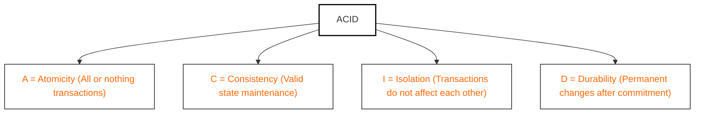

| Property    | Description                                                          |
|-------------|----------------------------------------------------------------------|
| Atomicity   | All steps in a transaction succeed or none do (all-or-nothing).      |
| Consistency | Data must always be valid according to all defined rules/constraints.|
| Isolation   | Transactions do not interfere with each other.                       |
| Durability  | Once committed, data survives crashes/failures.                      |

---

## Trade-offs: Scalability, Reliability, and Performance

No storage system is perfect. Real-world solutions must **trade off** between:

- **Scalability:** Handles data/user/request growth.
- **Reliability:** Continues functioning despite failures.
- **Performance:** Fast reads/writes.

*Optimizing one often impacts the others.* (See `image-1.png` — Scalability/Reliability/Performance triangle diagram.)

---

## The CAP Theorem

**CAP:** In a distributed system, you can only fully guarantee **two** of:

- **Consistency (C):** Every read gets the latest write.
- **Availability (A):** Every request receives a response.
- **Partition Tolerance (P):** System functions despite network splits.

**No distributed system can have all three at the same time.**

### Diagram: CAP Triangle

```
         Consistency
            /\
           /  \
          /----\
Partition      Availability
Tolerance
```

A slightly different ASCII view:

```
          Consistency
           /      \
          /        \
         /          \
    Partition    Availability
     Tolerance
```

(See `image.png` for a rendered CAP Venn diagram.)

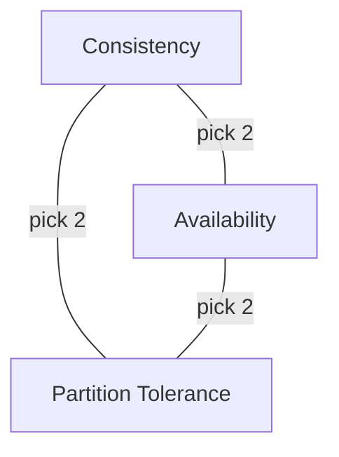

### Types of Systems Based on CAP Trade-offs

#### CP (Consistency + Partition Tolerance)

- Prioritizes data correctness over availability.
- During a partition, the system may reject requests to avoid inconsistent reads.
- Not always available, but when it is — data is guaranteed to be correct.
- **Example:** HBase — strongly consistent. If a node can't confirm a write across replicas, it won't serve it — even if it means being unavailable briefly.
- **When to use:** Financial systems, banking apps — anything where data integrity is critical.

#### AP (Availability + Partition Tolerance)

- Prioritizes system uptime over consistency.
- During a partition, the system will serve requests, even if they return stale or eventually consistent data.
- **Example:** DynamoDB — inspired by Amazon's Dynamo model, uses eventual consistency by default for high availability.
- **When to use:** Social media feeds, product catalogs, content delivery — where being up is more important than perfect accuracy.

#### CA (Consistency + Availability) — The "Unicorn"

- Only possible if no network partitions ever occur — i.e., in single-node or tightly coupled systems.
- In practice, not achievable in distributed systems that need to tolerate network faults.
- **Example:** Relational databases (like PostgreSQL) in standalone mode (not distributed) could be considered CA.

### Database Models in CAP

| Model | Tends Toward                       | Example Use Case                     | Typical DB |
|-------|------------------------------------|--------------------------------------|------------|
| **CP**| Consistency + Partition Tolerance  | Financial, banking, critical systems | SQL        |
| **AP**| Availability + Partition Tolerance | Social media, product catalogs       | NoSQL      |
| **CA**| Consistency + Availability         | Standalone SQL (non-distributed)     | SQL        |

> **Key takeaway:** At scale, network partitions are inevitable — real-world systems must choose between Consistency and Availability during a partition.

---

## Database Models — SQL vs. NoSQL

At its core, a **database** provides a structured way to store, retrieve, and manage data persistently — even across restarts or failures.

(See `image-2.png` for an overview diagram of databases as data managers.)

### Relational Databases (SQL): The Traditional Powerhouse

(See `image-3.png` for SQL DB schema/diagram.)

- **Schema:** Fixed, structured tables.
- **Query Language:** SQL.
- **ACID Properties:** Atomicity, Consistency, Isolation, Durability.
- **Examples:** MySQL, PostgreSQL, Oracle, SQL Server.

**Core concepts:**

- **Schema-based:** Structure (tables, columns, data types) is defined upfront.
- **Rows and Columns:** Data organized like a spreadsheet.
- **Joins:** Combine data across tables.
- **ACID transactions.**

#### Example: SQL Table Schema

```sql
CREATE TABLE users (
    id SERIAL PRIMARY KEY,
    username VARCHAR(50) UNIQUE,
    email VARCHAR(100),
    created_at TIMESTAMP DEFAULT CURRENT_TIMESTAMP
);
```

A more complete example with a foreign key:

```sql
CREATE TABLE users (
    id SERIAL PRIMARY KEY,
    username VARCHAR(50) NOT NULL,
    email VARCHAR(255) UNIQUE NOT NULL,
    created_at TIMESTAMP DEFAULT CURRENT_TIMESTAMP
);

CREATE TABLE orders (
    id SERIAL PRIMARY KEY,
    user_id INT REFERENCES users(id),
    total DECIMAL(10,2),
    created_at TIMESTAMP DEFAULT CURRENT_TIMESTAMP
);
```

#### Example: Complex Query with Join

```sql
SELECT users.email, orders.total
FROM users
JOIN orders ON users.id = orders.user_id
WHERE orders.date > '2024-06-01';
```

#### When to Use SQL

- Complex queries & relationships.
- Strong consistency needed.
- Well-known, structured schema.

#### Limitations of Relational Databases

- **Rigid schema:** Not ideal when data structure changes frequently.
- **Scaling:** Typically scale *vertically* (bigger server), which has limits and cost challenges.
- **Nested data:** Handling deeply nested or variable data (e.g., JSON blobs) is clunky.

### NoSQL Databases: Designed for Scale and Flexibility

(See `image-4.png` for NoSQL DB diagrams and `image-5.png` for NoSQL types.)

- **Schema:** Schema-less or dynamic.
- **Types:** Document, Key-Value, Columnar, Graph.
- **BASE Properties:** Basically Available, Soft state, Eventually consistent.

#### NoSQL Types — Deep Dive

| Type        | Example DBs        | Best For                            |
|-------------|--------------------|--------------------------------------|
| Document    | MongoDB            | Nested/flexible data, CMS, profiles |
| Key-Value   | Redis, DynamoDB    | Caching, sessions, fast lookups     |
| Columnar    | Cassandra, HBase   | Analytics, time-series, big writes  |
| Graph       | Neo4j              | Social networks, recommendations    |

**Document Databases:**

- JSON-like structure (key-value pairs, nesting supported).
- Ideal for content management, user profiles.
- **Example:** MongoDB.

**Key-Value Databases:**

- Simple, fast, key-based lookups.
- High performance, low latency.
- **Example:** Redis, DynamoDB.

**Columnar Databases:**

- Store data by column, not row.
- Optimized for analytical queries over large datasets.
- **Example:** Cassandra, HBase.

**Graph Databases:**

- Store entities and relationships as nodes and edges.
- Efficient for highly connected data (social networks).
- **Example:** Neo4j.

#### NoSQL Database Types Diagram

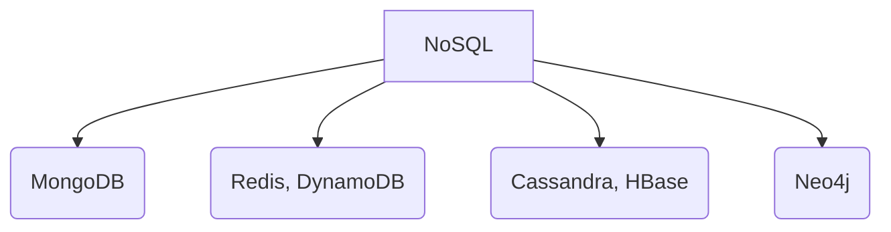

#### Example: Document Store (MongoDB)

```json
{
    "user_id": "12345",
    "username": "jane_doe",
    "profile": {
        "bio": "Engineer. Coffee lover.",
        "social": ["twitter", "github"]
    },
    "created_at": "2024-06-20T15:32:00Z"
}
```

**MongoDB document insert:**

```javascript
db.users.insertOne({
  name: "Alice",
  email: "alice@example.com",
  preferences: { theme: "dark", notifications: true }
});
```

A simpler variant:

```javascript
db.users.insertOne({
  username: "alice",
  email: "alice@example.com",
  created_at: new Date()
});
```

**MongoDB query:**

```javascript
db.users.find({ "profile.social": "github" })
```

#### BASE Properties

NoSQL systems often relax ACID guarantees in favor of scalability and availability, summarized as **BASE**:

- **Basically Available:** System always returns a response (even if stale).
- **Soft state:** State may change over time, even without input (due to eventual sync).
- **Eventually consistent:** System guarantees data consistency... eventually.

#### When to Use NoSQL

- High scalability needed.
- Flexible / evolving data structures.
- Low-latency or high-volume ops.

### SQL vs. NoSQL — When to Use Which?

| Use SQL (Relational) When...               | Use NoSQL (Non-Relational) When...                       |
|--------------------------------------------|----------------------------------------------------------|
| Complex queries, joins, relationships      | High scalability, massive traffic/data volume            |
| Strong consistency is required             | Flexible, evolving, or nested data                       |
| Data is structured & predictable           | Low-latency / high-throughput writes, caching, analytics |
| Examples: Banking, ERP, inventory          | Examples: IoT, social feeds, logs, recommendations       |

### Scaling Approaches: Vertical vs. Horizontal

| Vertical Scaling (Scale-Up)         | Horizontal Scaling (Scale-Out)         |
|-------------------------------------|----------------------------------------|
| Add more CPU/RAM to one server      | Add more nodes; distribute data        |
| Simpler, but hardware-limited       | Elastic, fault-tolerant, scalable      |
| SQL DBs (MySQL, PostgreSQL)         | NoSQL DBs (MongoDB, Cassandra)         |

---

## Advanced Database Topics

### Scaling Strategies — A Recap

#### Vertical Scaling (Scale-Up)

- **Definition:** Boost the capacity of a single server (more CPU, RAM, SSD).
- **Typical with:** Relational/SQL databases.
- **Pros:** Simpler setup; strong consistency via ACID.
- **Cons:** Limited by hardware ceilings; cost grows non-linearly; single point of failure.

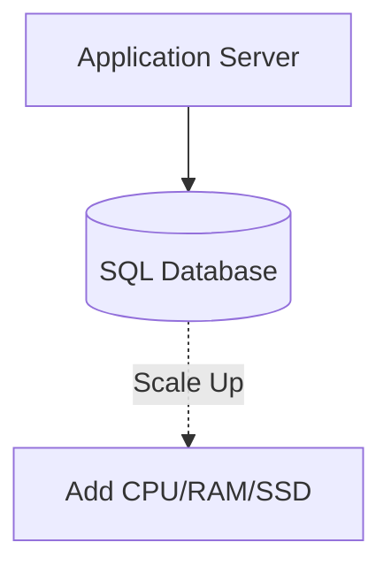

#### Horizontal Scaling (Scale-Out)

- **Definition:** Add more servers/nodes to distribute load and data.
- **Typical with:** NoSQL databases.
- **Pros:** Elastic scalability; handles large-scale traffic and big data; better fault tolerance.
- **Cons:** Increased operational complexity; weaker consistency (often eventual).

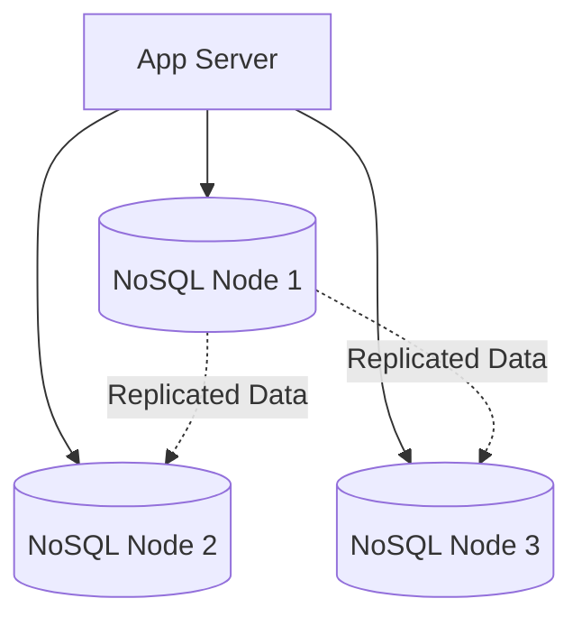

**When to use which?**

- **SQL / Vertical:** Banking, ERP, transactional systems.
- **NoSQL / Horizontal:** Social feeds, product catalogs, IoT, analytics.

### Replication

**Replication** copies data across multiple database nodes for redundancy and increased throughput.

**Benefits:**

- **Fault Tolerance:** If one node fails, others can serve data.
- **Read Scalability:** Distribute read load across replicas.
- **Data Availability:** Users access data despite node failures.

#### Leader-Follower (Primary-Replica) Replication

(See `image-7.png` for a primary-replica diagram.)

- **All writes** go to the **Leader**.
- **Reads** can go to **Followers** (replicas).
- **Asynchronous replication** may cause followers to lag (eventual consistency).
- **Synchronous replication** offers strong consistency but can impact availability.

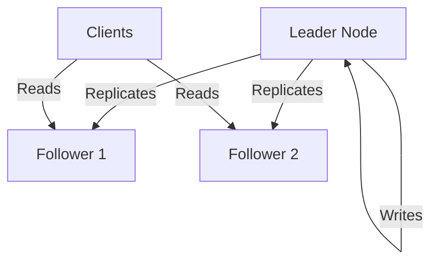

```
           +------------+
           |  Leader    |
           +-----+------+
                 |
         +-------+--------+
         |                |
     +---+----+      +----+---+
     |Follower|      |Follower|
     +--------+      +--------+
```

A wider topology view:

```
      +-------+         +--------+      +--------+
      |Leader |  --->   |Follower| ...  |Follower|
      +-------+         +--------+      +--------+
        (writes)           (reads)         (reads)
```

#### Read Replicas

(See `image-6.png` for a read-replica diagram.)

- **Purpose:** Scale read-heavy workloads.
- **All writes** go to the primary; **reads** are balanced across replicas.
- **Trade-off:** Potential for stale reads if replication lags.

#### Example: Configuring Read Replicas in PostgreSQL

```bash
# On the primary server (postgresql.conf)
wal_level = replica
max_wal_senders = 10
hot_standby = on

# On the replica server
standby_mode = 'on'
primary_conninfo = 'host=primary_ip user=replicator password=secret'
```

### Sharding

As systems outgrow the capacity of a single node, **sharding** divides data across multiple databases or nodes.

#### Types of Sharding

- **Horizontal sharding:** Split data by rows — e.g., user_id ranges.
- **Vertical sharding:** Split by feature/domain — e.g., profiles vs. analytics.

#### Sharding Strategies

**a) Range-Based Sharding:**

- **How:** Data split by value ranges (e.g., user_id 1-1000 → Shard A).
- **Pro:** Simple, intuitive.
- **Con:** Risk of hotspots if data is skewed.

**b) Hash-Based Sharding:**

- **How:** Apply a hash function to a key (e.g., user_id) for shard assignment.
- **Pro:** Even distribution.
- **Con:** Range queries are hard; re-sharding is painful.

```python
def get_shard(user_id, num_shards):
    return hash(user_id) % num_shards

# Usage example
shard_index = get_shard(12345, 4)  # returns shard index 0-3
```

**c) Consistent Hashing:**

Solves the re-sharding problem: only a small subset of keys move when adding/removing nodes.

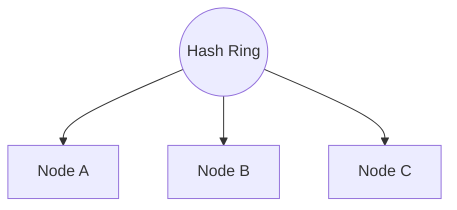

```
[Node1]---[Node2]---[Node3]---[Node1]
   |          |        |        |
[Key1]    [Key2]   [Key3]   [Key4]
```

> Only a subset of keys are remapped when nodes are added/removed.

**d) Geo-Based Sharding:**

- **How:** Shard by geographic region for latency/compliance.
- **Use Case:** Social media, CDN, regionally regulated data.

### Polyglot Persistence

**Polyglot persistence** means using multiple database types in one architecture, choosing the best tool for each job.

**Why:** Each DB excels at different tasks (search, analytics, relationships).

**Benefit:** Better performance, optimized storage.

| Data Need           | Recommended DB           | Example Use Case            |
|---------------------|--------------------------|-----------------------------|
| Relationships       | Relational (PostgreSQL)  | User profiles, transactions |
| Flexible Documents  | Document (MongoDB)       | Product catalogs            |
| Fast Key Access     | Key-Value (Redis)        | Caching, session storage    |
| Full-Text Search    | Search Engine (Elastic)  | Search functionality        |
| Analytics           | Columnar (Cassandra)     | Log/metrics pipelines       |

#### Example: Microservices with Polyglot Persistence

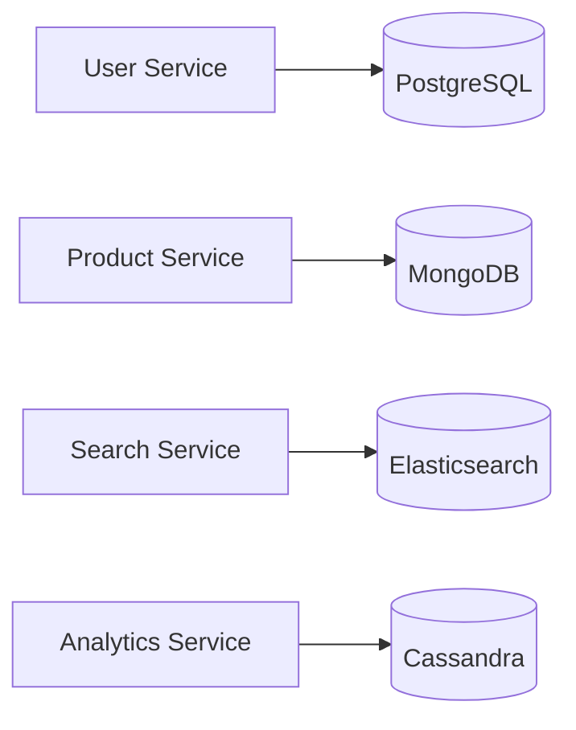

---

## Object Storage

(See `image-8.png` for object-storage architecture.)

**Object storage** is a storage architecture that manages data as *objects*, rather than as files in a hierarchy (file storage) or blocks (block storage). It stores data as a **flat namespace**.

Each object contains:

- The data itself (e.g., an image, video, or document).
- A unique identifier (object key).
- Metadata (extra info: content-type, tags, timestamps, etc.).

Unlike traditional file or block storage, object storage systems are:

- **Scalable:** Billions of objects, petabytes+ of data.
- **Distributed:** Spans servers, data centers, regions, even continents.
- **Optimized for unstructured data:** Handles images, videos, logs, backups, etc.

### What Does "Flat Namespace" Mean?

When we say **object storage uses a flat namespace**, it means there are **no hierarchical folders or directories** — every object is stored in a **single logical container (bucket)** and identified by a **unique key (name or ID)**.

#### Example Comparison

**File Storage (Hierarchical):**

```
/images/2025/travel/beach.png
/images/2025/travel/mountains.png
```

Here, files exist inside real folders (`images/`, `travel/`).

**Object Storage (Flat):**

```
images/2025/travel/beach.png
images/2025/travel/mountains.png
```

There are **no real folders** — the slashes (`/`) are *just part of the object name*. Everything exists in **one big flat space**.

#### AWS S3 Example

In an S3 bucket:

```
my-bucket/photos/beach.jpg
my-bucket/docs/report.pdf
my-bucket/backups/2025/jan.zip
```

Under the hood, S3 does **not** create real directories — it simply stores object keys:

```
"photos/beach.jpg"
"docs/report.pdf"
"backups/2025/jan.zip"
```

The folder view in the AWS Console is **just a visual convenience**.

#### Why Flat Namespace?

| Advantage    | Explanation                                                                |
|--------------|----------------------------------------------------------------------------|
| Scalability  | Easier to distribute data across nodes — no directory hierarchy to manage. |
| Simplicity   | Each object has a globally unique key — easy to retrieve directly.         |
| Performance  | Ideal for billions of objects — key-based lookup is faster than path traversal. |

**Analogy:**

- **File storage** → like a *folder tree* on your computer.
- **Object storage** → like a *key-value store* — each object is fetched by its **key**, not its folder path.

### Key Concepts & Architecture

**Object:**

- **Definition:** The fundamental unit — a self-contained package of data + metadata + identifier.
- **Analogy:** Like a ZIP file with all relevant info bundled inside.

**Bucket:**

- **Definition:** A logical container for objects (similar to folders, but flat).
- **Role:** Organizes objects; every object must belong to a bucket.

**Metadata:**

- **Definition:** Flexible, extensible info about the object.
- **Examples:** MIME type, creation date, owner, custom tags, access controls.

#### ASCII Diagram: Object Storage Structure

```
+-------------------+             +-------------------+
|    Bucket: photos |             |    Bucket: videos |
+-------------------+             +-------------------+
|  +-------------+  |             |  +-------------+  |
|  | Object:     |  |             |  | Object:     |  |
|  | dog.jpg     |  |             |  | movie.mp4   |  |
|  | Key: 123abc |  |             |  | Key: 456xyz |  |
|  | Metadata:   |  |             |  | Metadata:   |  |
|  |  - type     |  |             |  |  - type     |  |
|  |  - tags     |  |             |  |  - tags     |  |
|  +-------------+  |             |  +-------------+  |
+-------------------+             +-------------------+
```

A simpler conceptual view:

```
Bucket: "user-photos"
    ├── photo1.jpg (metadata: {uploaded_by: "alice", tags: ["vacation"]})
    ├── photo2.jpg (metadata: {uploaded_by: "bob", tags: ["profile"]})
```

### Popular Object Storage Platforms

- **Amazon S3:** Industry gold standard, highly durable, vast ecosystem.
- **Google Cloud Storage (GCS):** Simple tiers, ML/data-lake friendly.
- **Azure Blob Storage:** Deep Microsoft stack integration, flexible tiers.
- **On-prem / Hybrid (Open Source):** MinIO, Ceph — cloud-native APIs in your datacenter.

### Common Use Cases

- **Media Storage:** Images, videos, design files (YouTube, asset management).
- **Backups & Archives:** Durable, cheap, long-term backup and compliance storage.
- **Data Lakes:** Massive raw-data repositories for analytics/AI (e.g., S3 Data Lake).
- **Static Website Hosting:** Host HTML/CSS/JS directly from S3/GCS buckets.
- **IoT & ML Data Pipelines:** Sink for sensor/model data, high-throughput ingestion.

### Performance and Cost Considerations

**Performance:**

- **Latency:** Higher than block/file storage; not ideal for rapid small reads/writes.
- **Throughput:** Designed for massive parallel access — great for large data sets.
- **Consistency:** Often eventual (e.g., S3), so changes may not be instantly visible.
- **Access Patterns:** Best for "write-once, read-many" workloads; not optimized for frequent updates/appends.

**Cost:**

- **Storage Tiers:** Standard, Infrequent Access, Archive (e.g., S3 Glacier).
- **Pricing:** Pay for storage used, *and* for API requests (PUT, GET), and data egress.
- **Best practices:**
  - Use lifecycle rules to move stale data to cheaper tiers or delete it.
  - Monitor usage, adjust storage classes as access patterns change.

### Sample Code: Using Amazon S3 with Python (`boto3`)

A simple upload:

```python
import boto3
s3 = boto3.client('s3')
s3.upload_file('photo.jpg', 'mybucket', 'photos/photo.jpg')
```

Upload with metadata, download, and head_object:

```python
import boto3

s3 = boto3.client('s3')

# Upload a file with metadata
s3.upload_file('local_photo.jpg', 'my-photo-bucket', 'photos/dog.jpg',
               ExtraArgs={'Metadata': {'uploaded_by': 'alice', 'project': 'pets'}})

# Download a file
s3.download_file('my-photo-bucket', 'photos/dog.jpg', 'downloaded_dog.jpg')

# Get object metadata
response = s3.head_object(Bucket='my-photo-bucket', Key='photos/dog.jpg')
print(response['Metadata'])
```

Just upload with metadata:

```python
import boto3

s3 = boto3.client('s3')
s3.upload_file('photo1.jpg', 'mybucket', 'photos/photo1.jpg', ExtraArgs={'Metadata': {'uploaded_by': 'alice'}})
```

### Object Storage — Tips & Tricks

- **Use metadata wisely:** Tag objects for easier search, access control, and automation.
- **Lifecycle rules:** Automate moving old data to cheaper storage or deletion to control costs.
- **Monitor usage:** Use built-in analytics to spot unused or rarely-accessed data.
- **Secure your buckets:** Enforce least-privilege, use bucket policies, enable object versioning.
- **Optimize for access patterns:** Use Standard tier for hot data, Archive/Glacier for cold data.
- **Batch operations:** When possible, batch uploads/downloads to reduce request costs.

### Object Storage — Interview Questions

- What is object storage and how is it different from file or block storage?
- When would you choose object storage over a traditional file system?
- Explain the structure of an object in object storage. What role does metadata play?
- Design a media hosting platform (e.g., YouTube). How would you use object storage for video uploads and streaming?
- What are the performance trade-offs of using object storage for real-time access?

---

## File Systems and Distributed Storage

### What is a File System?

A **file system** is the foundational layer that defines how data is stored, organized, and accessed on storage media (hard drives, SSDs, removable disks).

**Responsibilities:**

- Stores files and manages metadata (name, timestamps, permissions, size).
- Manages directory hierarchy (folders/subfolders).
- Handles read/write operations and access control.

**Common file systems:**

- `ext4` (Linux), `NTFS` (Windows), `XFS` (high-performance Linux).

### Traditional File Systems: Strengths & Limitations

Traditional file systems use a **hierarchical structure** — folders and files arranged in a tree:

```
/ (root)
└── home/
    ├── user/
    │   ├── docs/
    │   └── photos/
```

**Key limitations:**

- **Single-node design:** All storage is managed on one machine.
- **Limited scalability:** Cannot easily scale across multiple servers.
- **Not fault tolerant:** Hardware failure = data loss unless external backups are used.

**Best suited for:** Personal computers, small servers, workloads not requiring distributed, parallel access or massive scale.

### Distributed File Systems (DFS): The Need for Scale

> **Definition:** A DFS allows files to be **stored and accessed across multiple nodes/servers**, but appears as a single file system to users and applications.

**Key benefits:**

- **Redundancy & Fault Tolerance:** Data is replicated across nodes; hardware failure does not mean data loss.
- **Horizontal Scalability:** Add more nodes to increase capacity and throughput.
- **High Throughput:** Parallel read/write operations across the cluster.

**Real-world examples:**

- **HDFS (Hadoop Distributed File System):** Powers Hadoop and Spark analytics.
- **CephFS, GlusterFS:** Enterprise and scientific storage.

### DFS Architecture: NameNode & DataNodes

(See `image-9.png` for HDFS architecture diagram.)

A classic DFS architecture (like HDFS) has:

- **NameNode:** The "brain" of DFS. Manages metadata (file names, directories, permissions, block locations).
- **DataNodes:** The "workhorses." Store actual data blocks.

**How it works:**

1. **File upload:** Split into fixed-size blocks (e.g., 128MB).
2. **Block distribution:** Blocks are distributed across DataNodes.
3. **Replication:** Each block is stored on multiple DataNodes (default: 3 copies).
4. **Metadata:** NameNode keeps track of where each block lives.

**Block size & striping:**

- Larger blocks = fewer metadata entries, but less flexibility.
- Striping enables parallel access and higher throughput.

### Scalability, Fault Tolerance, and Performance

**Scalability:**

- **Horizontal scaling:** Add more DataNodes to increase capacity & speed.
- **Automatic rebalancing:** DFS redistributes data as nodes are added/removed.

**Fault Tolerance:**

- **Replication factor** (e.g., 3) ensures that if one node fails, data is available from another replica.
- **Self-healing:** DFS automatically copies data to healthy nodes if a node goes offline.

**Performance:**

- **Parallel I/O:** Multiple nodes serve read/write requests simultaneously.
- **High throughput:** Ideal for analytics, machine learning, and backup workloads.

### Code Snippet: Accessing HDFS in Python

```python
from hdfs import InsecureClient

# Connect to HDFS (assumes NameNode at localhost:9870)
client = InsecureClient('http://localhost:9870', user='hadoop')

# List files in a directory
print(client.list('/user/data'))

# Write a file to HDFS
with client.write('/user/data/example.txt', encoding='utf-8') as writer:
    writer.write('Hello, HDFS!')

# Read a file from HDFS
with client.read('/user/data/example.txt', encoding='utf-8') as reader:
    content = reader.read()
    print(content)
```

### Diagram: DFS Architecture

```
                +----------------------+
                |      NameNode        |
                | (Metadata manager)   |
                +----------+-----------+
                           |
       +-------------------+-------------------+
       |                   |                   |
+---------------+   +---------------+   +---------------+
|   DataNode    |   |   DataNode    |   |   DataNode    |
| (Stores data) |   | (Stores data) |   | (Stores data) |
+---------------+   +---------------+   +---------------+
       |                   |                   |
    [Block 1]          [Block 2]           [Block 3]
    [Block 3]          [Block 1]           [Block 2]
 (Replication ensures each block is on multiple nodes)
```

A simplified view:

```
+-------------------+
|     NameNode      |  (metadata, file hierarchy)
+-------------------+
         |
    +----------+
    | DataNode |  (stores blocks)
    +----------+
    | DataNode |
    +----------+
    | DataNode |
    +----------+
```

### File Systems & DFS — Tips & Tricks

- **Tune block size:** Adjust based on workload. Larger files → larger blocks.
- **Monitor replication:** Avoid under- or over-replication. Too few = risk of data loss; too many = wasted space.
- **Automate rebalancing:** Enable DFS's built-in rebalancer to redistribute data as nodes are added/removed.
- **Secure your cluster:** Use Kerberos or other authentication for NameNode/DataNodes in production.
- **Optimize for access patterns:** For analytics, use striping and partitioning to maximize parallel access.
- **Plan for NameNode failure:** In HDFS, the NameNode is a single point of failure (unless using HA mode). Always configure NameNode HA for production.

---

## Big Data Fundamentals

Modern software systems — from Netflix recommendations to IoT-driven smart factories — are fueled by data. But as data grows in **volume**, **speed**, and **complexity**, traditional storage and processing systems struggle to keep up.

### The 6 V's of Big Data

| V              | Description                                            | Example                                |
|----------------|--------------------------------------------------------|----------------------------------------|
| **Volume**     | Massive data quantities (TBs, PBs, EBs)                | Social media, IoT, transaction logs    |
| **Velocity**   | High speed of data generation and processing           | Clickstreams, sensor feeds, stock data |
| **Variety**    | Diverse formats: structured, semi/unstructured         | Tables, JSON, images, videos, logs     |
| **Veracity**   | Data quality: accuracy, noise, trustworthiness         | Incomplete, noisy, or ambiguous data   |
| **Value**      | Business or analytical value derived from data         | Insights, decisions, model training    |
| **Variability**| Inconsistency and unpredictability in data structure   | Changing context, evolving schemas     |

> **Tip:** In interviews, referencing the 6 V's demonstrates deep understanding of Big Data challenges.

### Why Traditional Storage Fails at Scale

- **Limited scalability:** Vertical scaling hits physical and cost limits.
- **Performance bottlenecks:** Not optimized for parallel reads/writes.
- **Cost inefficiency:** Scaling up is expensive; maintenance is labor-intensive.
- **Lack of fault tolerance:** No built-in redundancy — data loss risk on hardware failure.

> **Example:** Imagine storing petabytes of logs from millions of sensors on a single server — simply infeasible.

### Distributed Storage for Big Data

Modern Big Data solutions rely on **distributed file systems** and **cloud-native object storage**:

| Storage Type                | Example                     | Best For                            | Key Features                        |
|-----------------------------|-----------------------------|-------------------------------------|-------------------------------------|
| **Distributed File System** | HDFS, CephFS, GlusterFS     | Analytics, high-throughput workloads| Replication, horizontal scale, fault tolerance |
| **Object Storage**          | Amazon S3, GCS, Azure Blob  | Unstructured data, backups, data lakes | Scalable, metadata-rich, API-driven |

**How Distributed Storage Works:**

- Data is split into blocks/objects and distributed across many nodes.
- **Replication** ensures that if one node fails, data is safe elsewhere.
- **Horizontal scaling:** Add more nodes to grow storage and throughput.

### Big Data Workloads: Real-World Examples

- **Logs & Events:** Application/system logs, server metrics (monitoring & auditing).
- **Clickstreams:** Tracks user navigation on websites/apps (personalization, analytics).
- **IoT Data:** Streams from sensors, smart meters, wearables.
- **Machine Learning Pipelines:** Model training, feature extraction, data versioning.

> **Commonality:** All require infrastructure that is scalable, flexible, and can handle both *large volumes* and *high velocity*.

### Batch vs. Stream Processing

#### Batch Processing

- **Definition:** Processes large data chunks at intervals (hourly, nightly).
- **Use Cases:** Historical analysis, ETL jobs, aggregations.
- **Tools:** Hadoop, Apache Spark (batch mode).
- **Trade-offs:** High throughput, but higher latency.

#### Stream Processing

- **Definition:** Processes data in real-time as it arrives.
- **Use Cases:** Monitoring, fraud detection, real-time recommendations.
- **Tools:** Apache Kafka, Spark Streaming, Apache Flink.
- **Trade-offs:** Low latency, continuous insights, but may need more complex infrastructure.

| Batch Processing      | Stream Processing       |
|-----------------------|-------------------------|
| Large data chunks     | Real-time, continuous   |
| High throughput       | Low latency             |
| Higher latency        | Continuous insights     |
| Example: Hadoop, Spark| Example: Kafka, Flink   |

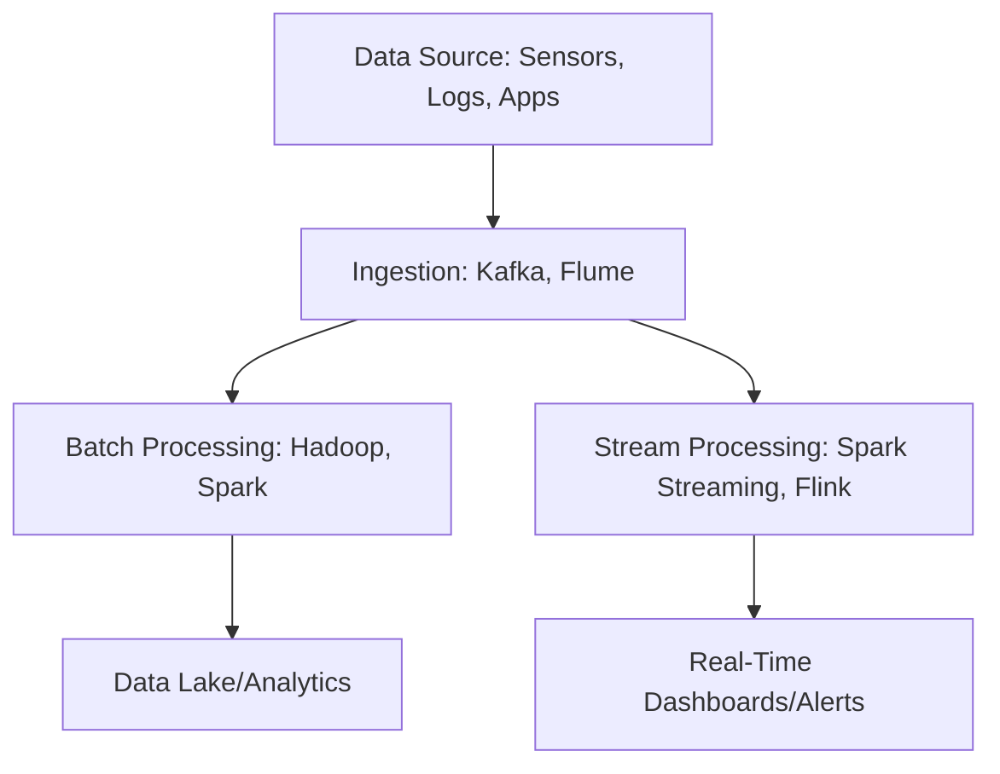

### Code Example: Simple Batch & Stream Processing

**Batch Example — Apache Spark (PySpark):**

```python
from pyspark.sql import SparkSession

spark = SparkSession.builder.appName("BatchExample").getOrCreate()
df = spark.read.json("logs/2024-06-01.json")
agg = df.groupBy("event_type").count()
agg.show()
```

**Stream Example — Kafka Consumer (Python):**

```python
from kafka import KafkaConsumer

consumer = KafkaConsumer('iot-stream', bootstrap_servers='localhost:9092')
for msg in consumer:
    process(msg.value)   # Custom function for real-time processing
```

### Big Data Architecture Diagrams

**Storage & Processing Pipeline:**

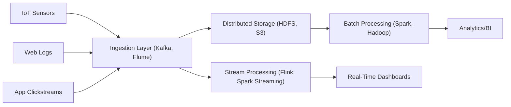

**HDFS Cluster:**

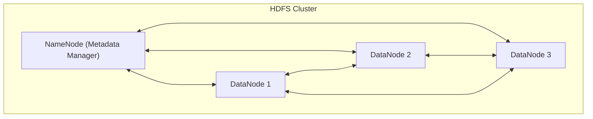

---

## Consistency Models — A Spectrum, Not a Binary

CAP says "C or A." Reality is more nuanced — between strict serializability and pure eventual consistency lies a useful spectrum:

| Model                     | Guarantee                                                      | Where you see it                |
|---------------------------|----------------------------------------------------------------|--------------------------------|
| **Strict Serializability** | Operations appear to happen in some total order, in real time   | Spanner, FoundationDB          |
| **Linearizability**        | A read returns the most-recent committed write                  | Standalone PostgreSQL           |
| **Sequential consistency** | All clients see operations in the same order                    | etcd, Zookeeper                 |
| **Causal consistency**     | If A causes B, all clients see A before B (concurrent ops may differ) | Many distributed databases |
| **Read-your-writes**       | A client sees its own writes immediately                        | Important for UX (your tweet shows up after you post it) |
| **Monotonic reads**        | A client never sees data going "backward"                       | Avoids confusing UI flickers     |
| **Eventual**               | Replicas converge eventually (no time bound)                    | DynamoDB defaults, S3            |

> **Practical takeaway:** Most apps want **read-your-writes + monotonic reads** at minimum. Pure "eventual" is usually too weak — users will see things appear and disappear. Most modern databases offer read-your-writes via *session consistency* or *primary-read*.

---

## Storage Engines: B-Tree vs LSM-Tree

Two foundational data structures power almost every database. Knowing which one your DB uses tells you what it's good at.

| Engine       | Used by                                  | Optimized for | Cost                          |
|--------------|------------------------------------------|---------------|--------------------------------|
| **B-Tree**   | PostgreSQL, MySQL (InnoDB), SQLite       | Read-heavy, point lookups, range queries | Write amplification on update; in-place updates |
| **LSM-Tree** | Cassandra, RocksDB, LevelDB, HBase, ScyllaDB | Write-heavy, append-only | Reads may touch multiple SSTables; needs compaction |

**Rule of thumb:**
- Mostly reads? B-tree DB.
- Mostly writes (time series, log ingest, IoT)? LSM-tree DB.
- Mixed? Most modern OLTP DBs (Postgres, MySQL) work fine — don't over-optimize.

---

## Block vs File vs Object Storage — They're NOT Interchangeable

Probably the most common confusion in storage design.

| Type     | Access pattern                  | Examples                          | Use case                            |
|----------|----------------------------------|-----------------------------------|--------------------------------------|
| **Block** | Raw blocks, low-level, fast    | AWS EBS, Azure Disk, on-prem SAN  | Database disks, VM filesystems       |
| **File**  | Hierarchical filesystem, POSIX | AWS EFS, Azure Files, NFS         | Shared filesystem across servers     |
| **Object**| HTTP API, no hierarchy         | S3, GCS, Azure Blob               | Media, backups, data lakes, static sites |

> **Rule:** Use **block** for things that need a filesystem (DBs, VMs). Use **file** for legacy apps that need shared file access. Use **object** for everything else — it's cheaper, infinitely scalable, and HTTP-native.

---

## Specialized Database Types Worth Knowing

Beyond SQL and the four NoSQL categories, modern systems often use specialized stores:

| Type           | Examples                              | Use case                                       |
|----------------|---------------------------------------|------------------------------------------------|
| **Time-series**| InfluxDB, TimescaleDB, Prometheus     | Metrics, IoT, financial ticks                  |
| **Search**     | Elasticsearch, OpenSearch, Meilisearch| Full-text search, faceting, log analytics      |
| **Vector**     | Pinecone, Weaviate, Milvus, pgvector  | Embeddings for ML/AI (semantic search, RAG)    |
| **Graph**      | Neo4j, JanusGraph, Neptune            | Highly connected data (social, fraud, knowledge graphs) |
| **Wide-column**| Cassandra, HBase, ScyllaDB            | Huge write throughput, time-series scale       |
| **In-memory KV**| Redis, Memcached                     | Caching, rate limiting, leaderboards            |

> **Polyglot persistence** (Chapter 7) means using multiple databases for different parts of one system. Modern apps routinely mix PostgreSQL + Redis + Elasticsearch + S3.

---

## Choosing the Right Storage Solution

| Requirement                          | Best Storage Type                                       |
|--------------------------------------|---------------------------------------------------------|
| Structured, relational data          | SQL (e.g., PostgreSQL, MySQL)                           |
| Flexible, large-scale, evolving      | NoSQL (e.g., MongoDB, Cassandra)                        |
| Unstructured, large media/files      | Object Storage (e.g., S3, GCS)                          |
| High throughput, analytics           | Distributed File Systems (e.g., HDFS, CephFS)           |
| Real-time or batch big data          | Distributed Storage + Processing (HDFS, S3, Delta Lake) |

---

## Combined Tips & Tricks

A consolidated master list drawn from across all sections.

### Data Modeling

- **Always know your data!** Structured or unstructured? This guides storage and DB choice.
- For SQL, design normalized schemas; for NoSQL, optimize for access patterns.
- **Know your consistency needs:** Financial or mission-critical systems need strong consistency (ACID/CP). For social feeds or caching, availability (AP/BASE) is often more valuable.

### Scaling

- **Design for scale from day one:** Use distributed storage and sharding for growth.
- **Plan for scale:** If you expect massive growth, design for horizontal scaling — favor NoSQL or distributed SQL solutions.
- **Always anticipate growth:** Use horizontal scaling and sharding from the beginning if you expect rapid user/data growth.
- **Mix and match (polyglot) for best results:** Use the right database for the right task.
- **Use consistent hashing for dynamic clusters**, especially if you expect nodes to be added/removed frequently.
- **Document your sharding key choices:** Poorly chosen sharding keys can lead to hotspots or unbalanced data.

### Reliability & Replication

- **Replication for read-heavy systems:** Deploy read replicas to distribute load but monitor replication lag.
- **Automate failover and recovery:** Use managed database services or robust orchestration for quick failover.
- **Test failover and replication regularly:** Don't just set it and forget it.
- **Simulate failures:** Test your replication and failover strategies (e.g., using Chaos Engineering).

### Trade-offs

- **Monitor the CAP trade-offs:** Decide early if your system values consistency over availability, or vice versa.
- **Monitor trade-offs:** Optimize for the property (scalability, reliability, or performance) that aligns with your business needs.

### Object & Distributed Storage

- **Use object storage for unstructured, growing data:** Images, backups, logs belong here.
- **Choose storage class wisely:** For S3, select Standard, Infrequent Access, or Glacier based on retrieval needs and cost.
- **Automate lifecycle management:** Set up archiving/deletion policies to control costs.
- **Object Storage Cost:** Use lifecycle policies to move old data to cheaper storage classes (e.g., S3 Glacier).
- **DFS for Analytics:** Choose HDFS or similar for big data processing pipelines, ensuring replication and scalability.

### Big Data

- **Know your 6 V's:** Always consider volume, velocity, variety, veracity, value, and variability.
- **Hybrid processing:** Combine batch (for large-scale analytics) and stream (for real-time actions) for robust solutions.
- **Choose storage wisely:** Use distributed file/object storage for unstructured or high-scale data.
- **Design for failure:** Plan for node failures — replication and redundancy are non-negotiable.
- **Optimize cost:** Leverage storage class tiers for hot vs. cold data.
- **Processing tool selection:** Spark/Hadoop for batch, Kafka/Flink/Spark Streaming for real-time.
- **Monitor and clean data:** Poor veracity can taint downstream analytics.
- **Scalability first:** Assume your data will grow — design horizontally scalable systems from the start.

### Security & Operations

- **Security:** Implement access controls and encryption, especially for object and distributed storage.
- **Backup:** Regularly backup critical data, and test restoration procedures.
- **Utilize managed services:** Cloud databases (AWS RDS, DynamoDB, Google Cloud Firestore) can offload maintenance and scalability headaches.
- **Monitor and revisit:** Periodically reassess data models, scaling strategies, and storage trade-offs.

---

## Sample Interview Questions

1. Why is storage a critical component in system design?
2. How do you differentiate between structured and unstructured data?
3. What are the different types of storage systems and their use cases?
4. Explain the CAP theorem with real-world examples.
5. When would you use SQL vs. NoSQL?
6. How would you architect storage for a photo-sharing app?
7. What are the pros and cons of sharding and replication?
8. How do object, file, and block storage differ in access patterns and scalability?
9. What is object storage and how is it different from file or block storage?
10. When would you choose object storage over a traditional file system?
11. Design a media hosting platform (e.g., YouTube) — how would you use object storage?
12. What are the core constraints of REST?
13. Explain the difference between PUT and PATCH.

---

## Summary & Key Takeaways

- **Storage is foundational:** Impacts every system's performance, reliability, and cost.
- **Understand your data:** Structured vs. unstructured shapes your architecture.
- **No one-size-fits-all:** Use the right combination of storage types — real-world systems often combine several.
- **CAP theorem drives trade-offs:** Know where your system stands.
- **SQL and NoSQL both matter:** Choose based on access patterns, schema, and scale.
- **Scale smart:** Use sharding, replication, and polyglot persistence for modern workloads.
- **Object and distributed file storage:** Power unstructured data and big data analytics.
- **Plan for big data:** Use distributed storage and batch/stream processing for large, fast data.
- **Big Data** is defined not just by size, but by its speed, diversity, quality, and business value.
- **System design** for Big Data is about managing trade-offs: scale, reliability, consistency, and cost.

---

## Further Reading

- [AWS Storage Services Overview](https://aws.amazon.com/products/storage/)
- [Google Cloud Storage Documentation](https://cloud.google.com/storage/docs/)
- [Amazon S3 Overview](https://aws.amazon.com/s3/)
- [CAP Theorem on Wikipedia](https://en.wikipedia.org/wiki/CAP_theorem)
- [CAP Theorem Explained (Martin Kleppmann)](https://martin.kleppmann.com/2012/05/14/cap-theorem.html)
- [Polyglot Persistence Patterns (Martin Fowler)](https://martinfowler.com/bliki/PolyglotPersistence.html)
- [ACID vs. BASE Explained](https://www.ibm.com/cloud/blog/acid-vs-base)
- [Jepsen: Consistency Models](https://jepsen.io/)
- [AWS Architecture Blog: Scaling Databases](https://aws.amazon.com/architecture/databases/)
- [HDFS Architecture Guide (Apache)](https://hadoop.apache.org/docs/current/hadoop-project-dist/hadoop-hdfs/HdfsDesign.html)
- [HDFS Design Doc](https://hadoop.apache.org/docs/r1.2.1/hdfs_design.html)
- [CephFS Documentation](https://docs.ceph.com/en/latest/cephfs/)
- [GlusterFS Overview](https://docs.gluster.org/en/latest/)
- [Apache Spark Streaming](https://spark.apache.org/streaming/)

---

**Next Up:** [Chapter 8 — Performance: Concepts, Tools & Techniques →](./8%20-%20Performance%20-%20Concepts%2C%20Tools%20%26%20Techniques.md) — making systems not just work, but work *fast and efficiently*.
