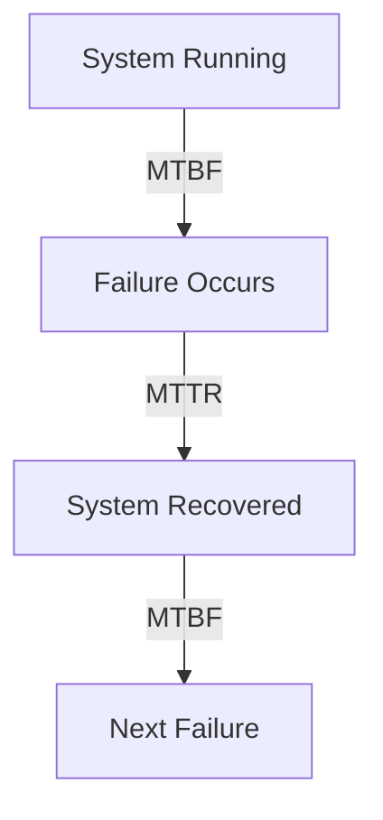
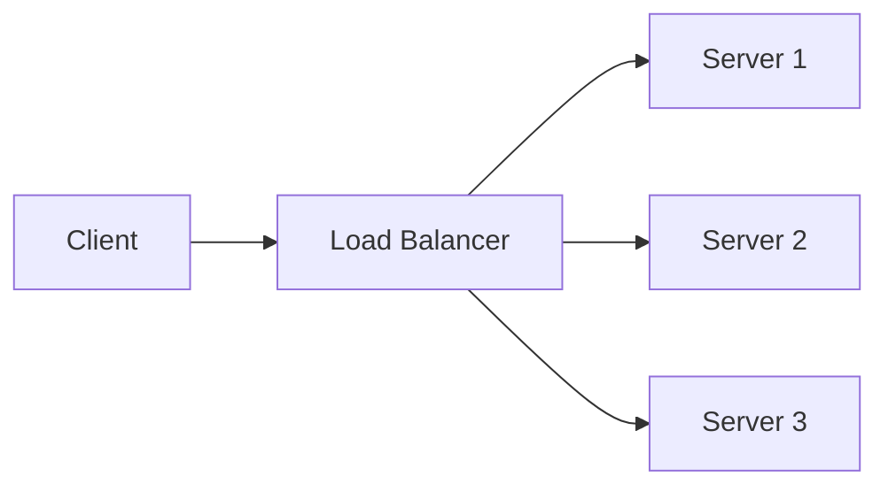
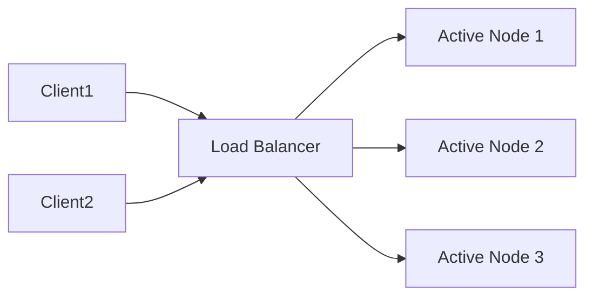
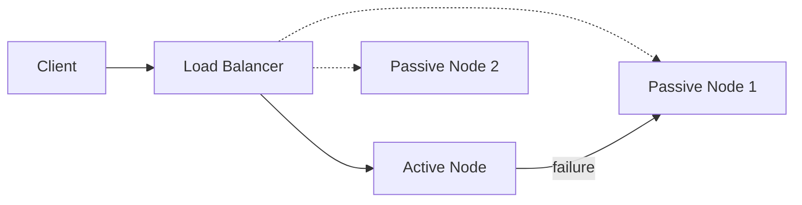
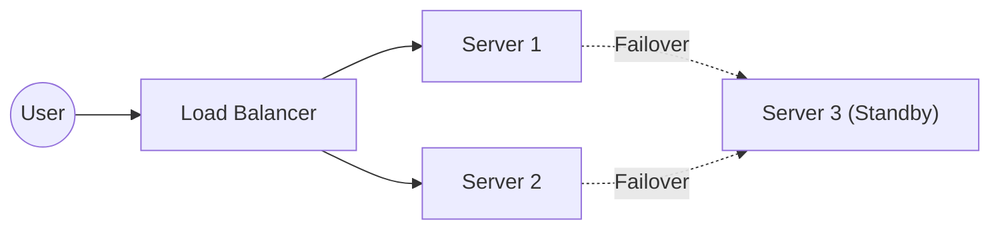
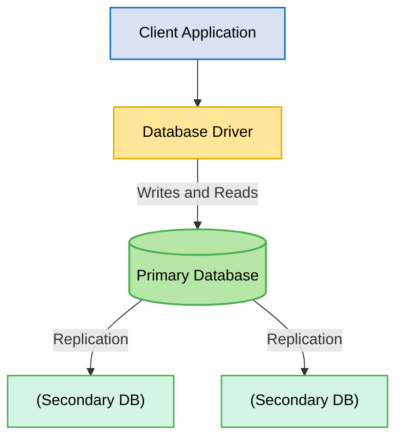
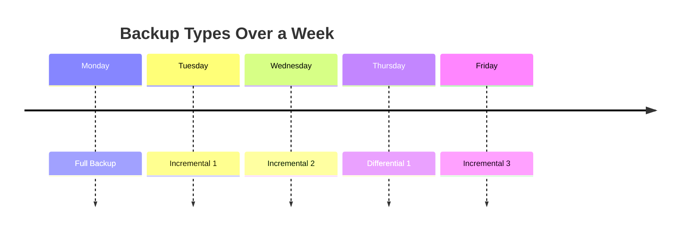
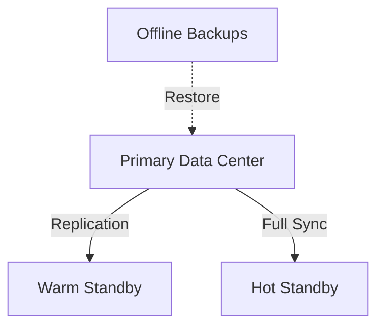
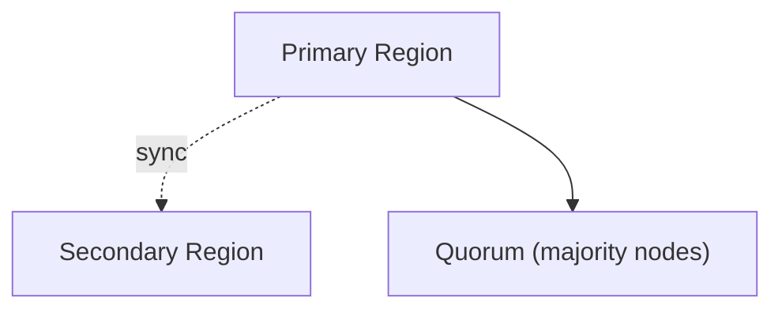

# Reliability, Availability & Disaster Recovery

Welcome to one of the most critical aspects of modern system design: **Reliability, Availability, and Disaster Recovery**. Whether you're designing a high-traffic web application, building cloud-native microservices, or architecting distributed platforms at scale, ensuring your systems can withstand failures and recover gracefully is paramount.

This chapter covers:

- Core concepts of system reliability (MTBF, MTTR, SLAs)
- High availability, fault tolerance, and failover mechanisms
- Backup and recovery strategies
- Disaster recovery in practice
- Real-world patterns, trade-offs, and actionable tips

> *"Systems fail. Reliability is how gracefully they handle it."*

---

## Learning Outcomes

After reading this chapter, you'll be able to:

1. Compute the **9s of availability** and translate "99.99% uptime" into hours of allowed downtime.
2. Pick **RTO and RPO targets** based on business needs and design backups accordingly.
3. Apply **retry-with-backoff, circuit breakers, bulkheads, and idempotency keys** correctly.
4. Distinguish **active-active vs active-passive** and when each is right.
5. Run a **chaos engineering** experiment and explain what it would prove.

---

## Table of Contents

1. [Introduction to System Reliability](#introduction-to-system-reliability)
2. [Core Concepts: Reliability, Availability & Durability](#core-concepts-reliability-availability--durability)
3. [Key Metrics: MTBF, MTTR, SLAs](#key-metrics-mtbf-mttr-slas)
4. [Reliability in Distributed & Cloud-Native Systems](#reliability-in-distributed--cloud-native-systems)
5. [High Availability, Fault Tolerance & Failover](#high-availability-fault-tolerance--failover)
6. [Graceful Degradation](#graceful-degradation)
7. [High Availability Patterns](#high-availability-patterns)
8. [Designing for Redundancy](#designing-for-redundancy)
9. [Health Monitoring & Self-Healing Systems](#health-monitoring--self-healing-systems)
10. [Backup & Recovery Strategies](#backup--recovery-strategies)
11. [Disaster Recovery in Practice](#disaster-recovery-in-practice)
12. [Combined Tips & Tricks](#combined-tips--tricks)
13. [Sample Interview Questions](#sample-interview-questions)
14. [Summary & Key Takeaways](#summary--key-takeaways)
15. [Further Reading](#further-reading)

---

## Introduction to System Reliability

Modern users expect systems to be **always available, consistent, and trustworthy**. Any downtime can result in financial loss, reputational damage, and erosion of user trust. Reliability isn't just about preventing failures — it's about how quickly and gracefully a system can recover when something does go wrong.

---

## Core Concepts: Reliability, Availability & Durability

### What is System Reliability?

Reliability is a system's ability to **operate continuously without failure**. It encompasses:

- **Correctness:** The system performs its intended function without errors.
- **Consistency:** Predictable, repeatable behavior across requests and over time.
- **Fault Tolerance:** The ability to withstand failures without total disruption.
- **Availability / Uptime:** The percentage of time the system is working and accessible.

### Availability vs. Durability

| Concept       | Description                                     | Example                              |
|---------------|-------------------------------------------------|--------------------------------------|
| **Availability** | System is accessible and responsive             | Can query a database anytime         |
| **Durability**   | Data is safe and not lost (even after failures) | Data remains after system crash      |

```
+----------------+        +----------------+
|   User Query   | -----> |   System Up?   | ----> [Available?]
+----------------+        +----------------+
                                    |
                                    v
                        [Data Safe? (Durability)]
```

---

## Key Metrics: MTBF, MTTR, SLAs

- **MTBF (Mean Time Between Failures):** Average time a system runs before encountering a failure. *Higher MTBF = more stable system.*
- **MTTR (Mean Time To Recovery):** Average time to recover from a failure. *Lower MTTR = faster recovery.*

```
High MTBF + Low MTTR = High Reliability
```



### SLAs (Service Level Agreements)

Contractual guarantees about system performance (e.g., 99.9% uptime, response time, error rate).

> 99.9% uptime = ~8.76 hours downtime/year.

Common metrics: availability, response time, error rate.

### Code Example: MTBF/MTTR Calculation

```python
import statistics

failure_times = [100, 120, 95, 110]    # uptime between failures in hours
recovery_times = [2, 1.5, 3, 2.5]      # recovery durations in hours

mtbf = statistics.mean(failure_times)
mttr = statistics.mean(recovery_times)

print(f"MTBF: {mtbf} hrs, MTTR: {mttr} hrs")
```

---

## Reliability in Distributed & Cloud-Native Systems

### Impact of Reliability on System Design

Design decisions that affect reliability:

- **Redundancy:** Multiple instances, failover setups.
- **Health checks and monitoring.**
- **Retry mechanisms and circuit breakers.**
- **Distributed design patterns:** Replication, quorum.

### Reliability in Distributed Systems

**Challenges:**

- Network partitions.
- Node failures.
- Eventual consistency.

**Solutions:**

- Use **CAP-aware design.**
- Ensure **fault isolation.**
- Implement **replication** & **consensus algorithms** (e.g., Paxos, Raft).

### Reliability in Cloud-Native Systems

Cloud infrastructure is inherently unreliable.

**Design for:**

- **Transient failures.**
- **Auto-scaling and self-healing.**
- **Chaos engineering** to test resilience.

> *"Design for failure"* is the **cloud-native mindset.**

---

## High Availability, Fault Tolerance & Failover

### Redundancy

Redundancy prevents single points of failure. Types include:

- **Hardware:** Multiple servers/storage devices.
- **Network:** Multiple data centers, network connections, routers, paths.
- **Service:** Replicated microservices/databases.



### Redundancy Strategies

| Strategy           | Description                                          | Use Case                         |
|--------------------|------------------------------------------------------|----------------------------------|
| **N+1**            | One extra instance for failover                      | 3 servers for 2 needed           |
| **Active-Active**  | Multiple nodes handle requests together              | Load balancing across regions    |
| **Active-Passive** | One active node, standby nodes activated on failure  | Standby backup DB or service     |

#### N+1 Redundancy

- One more instance than needed (e.g., 3 servers for a 2-server load).
- If any one fails, the system remains available.

```
Required = N
Provisioned = N+1
If one fails, N remain to serve traffic.
```

#### Active-Active

- All nodes are active, sharing the workload.
- High availability and load distribution.
- Requires robust load balancing and state synchronization.



ASCII view:

```
Active-Active:
User --> [LB] --> Node A (active)
                    |--> Node B (active)
                    |--> Node C (active)
```

#### Active-Passive

- Only one node is active; others are on standby.
- On failure, a passive node becomes active.
- Simpler, but less load-efficient and has failover latency.



ASCII view:

```
Active-Passive:
User --> [LB] --> Node A (active)
                    |--> Node B (standby)
```

---

## Graceful Degradation

Graceful degradation is about keeping **core functionality alive** during partial failures, even if some features are unavailable.

- **Definition:** System still operates at a reduced capacity during failures.
- Example: During high traffic, disable non-essential features.
- Helps maintain **user experience** even when full service isn't possible.
- Critical for ensuring users still benefit from some **functionality during outages.**

**Example:** If a recommendation engine fails on an e-commerce site, the main shopping and checkout features remain operational.

```python
def handle_request(request):
    if not essential_feature_available():
        # Disable non-essential feature
        return minimal_viable_response(request)
    return full_feature_response(request)
```

```python
# Pseudocode for graceful degradation in a Flask app
@app.route('/recommendations')
def recommendations():
    try:
        return get_recommendations(user_id)
    except RecommendationServiceError:
        # Degrade gracefully: show popular items instead
        return get_popular_items()
```

A simpler form:

```python
def handle_request():
    try:
        return full_service()
    except ServiceOverloadError:
        return degraded_service()  # e.g., disable image uploads
```

---

## High Availability Patterns

### Load Balancing

Distribute traffic evenly across backend nodes. Essential for removing bottlenecks and handling node failures.

```nginx
upstream backend {
    server backend1.example.com;
    server backend2.example.com;
    server backend3.example.com;
}
server {
    listen 80;
    location / {
        proxy_pass http://backend;
    }
}
```

### Replication

Replicate data across nodes/data centers for availability and durability.

- **Synchronous replication:** Zero data loss, but higher latency.
- **Asynchronous replication:** Lower latency, but possible data loss on failure.

### Failover

Automatically switches to a backup node if a primary fails.

```yaml
# Kubernetes deployment with readiness/liveness probes for failover
livenessProbe:
  httpGet:
    path: /healthz
    port: 8080
  initialDelaySeconds: 3
  periodSeconds: 3
```

### High Availability Diagram



---

## Designing for Redundancy

### Redundant Components

Design with multiple instances of key components (servers, databases, etc.) to avoid single points of failure.

### Geographical Redundancy

- Use **multiple data centers** or **cloud regions** for disaster recovery.
- Ensures high availability and resilience during regional outages.
- Distribute components across multiple regions to handle data center/region outages.

### Automated Failover

- Ensure **failover happens automatically** without manual intervention.
- Enables seamless service continuity when a primary system fails.

**Example architecture:** A client application connects to a database driver, which handles connections to a primary database. The primary replicates data to secondary databases, ensuring redundancy and quick recovery during failure.



**Automation:** Use health checks; orchestration tools like Kubernetes, AWS Auto Scaling, Azure Availability Sets.

---

## Health Monitoring & Self-Healing Systems

### Health Monitoring

- Track server uptime, API responses, error rates, CPU/memory usage.
- Alert on anomalies before users notice.

### Self-Healing

- Systems that **automatically recover** (restart, redeploy, reroute).
- E.g., Kubernetes restarts crashed pods automatically.

```yaml
# Kubernetes pod auto-restart example
restartPolicy: Always
```

```yaml
livenessProbe:
  httpGet:
    path: /health
    port: 8080
  initialDelaySeconds: 30
  periodSeconds: 10
```

---

## Backup & Recovery Strategies

### What and Why

- **Backup:** Creating copies of data to protect against loss.
- **Recovery:** Restoring data after failure/corruption.
- Critical for: disaster recovery, ransomware protection, compliance, human error.

**Scenarios demanding backup & recovery:**

- Hardware or software failure.
- Human error (accidental deletion).
- Cyber attacks (ransomware).
- Natural disasters (fire, flood).
- Compliance & legal retention requirements.

> **Remember:** Backup and recovery **complement** redundancy and replication; they're not substitutes.

### Backup Types

| Type             | Description                          | Pros                | Cons                  |
|------------------|--------------------------------------|---------------------|-----------------------|
| **Full**         | Copies all data                      | Simple restore      | High storage & time   |
| **Incremental**  | Changes since last backup            | Fast backup         | Slower restore        |
| **Differential** | Changes since last full backup       | Faster restore      | Larger than incremental |



**Hybrid approach example:** Weekly full backups, daily incremental backups.

### Recovery Models: Cold, Warm, Hot

| Model    | Resources Provisioned   | Downtime         | Cost     | Use Case                |
|----------|-------------------------|------------------|----------|-------------------------|
| **Cold** | None / backups offline  | Hours to days    | Low      | Non-critical apps       |
| **Warm** | Some / pre-provisioned  | Minutes to hours | Medium   | Business apps           |
| **Hot**  | Full (always ready)     | Seconds or less  | High     | Mission-critical systems|



### Key Metrics: RTO & RPO

- **RTO (Recovery Time Objective):** How quickly can you recover? (e.g., 1 hour)
- **RPO (Recovery Point Objective):** How much data loss is acceptable? (e.g., 15 minutes)

> **Shorter RTO/RPO = higher cost and complexity.**

#### Real-World Mapping

- **Banking system:** RTO = 5 minutes, RPO = near zero.
- **Internal tool:** RTO = 1 day, RPO = 12 hours.

```mermaid
gantt
    dateFormat  HH:mm
    title Backup and Recovery Timeline
    section Normal operation
    Uptime                :done,    des1, 00:00, 04:00
    section Failure and Recovery
    Failure Detected      :active,  des2, 04:00, 00:30
    Recovery In Progress  :         des3, 04:30, 01:00
```



### Designing Your Backup & Recovery Strategy

**Key trade-offs:**

- **Cost vs. recovery speed:** Faster recovery usually means more redundancy and higher storage/infra spend.
- **Complexity:** More frequent backups = more management overhead.
- **Business criticality:** Mission-critical? Invest more.
- **Compliance:** Are there legal retention or encryption needs?
- **Infrastructure maturity:** Can your team automate and manage complex strategies?

**Sample hybrid strategy:**

- **Full backup:** Sunday 2 AM.
- **Incremental:** Daily at 2 AM.
- **Retention:** 30 days on disk, 1 year in cloud cold storage.

### Best Practices: The 3-2-1 Rule

- **3** copies of your data (primary + 2 backups).
- **2** different storage media (e.g., disk, cloud).
- **1** backup offsite (remote/cloud).

**Other best practices:**

- **Automate everything:** Automate both backup creation and restore testing. Monitor backup jobs and alert on failures.
- **Encrypt data:** Use strong encryption at rest (AES-256) and in transit (TLS).

### Sample Backup Automation Code

**Automated daily database backup with AWS S3 (Python):**

```python
import boto3
import subprocess
import datetime

def backup_postgres(db_name, s3_bucket, s3_prefix):
    timestamp = datetime.datetime.now().strftime("%Y%m%d_%H%M%S")
    filename = f"/tmp/{db_name}_backup_{timestamp}.sql.gz"
    # Dump and compress the database
    subprocess.run([
        "pg_dump", db_name,
        "--no-owner", "--no-acl"
    ], stdout=subprocess.PIPE)
    subprocess.run(["gzip", "-c"], stdin=subprocess.PIPE, stdout=open(filename, 'wb'))

    # Upload to S3
    s3 = boto3.client('s3')
    s3.upload_file(filename, s3_bucket, f"{s3_prefix}/{filename}")
    print(f"Backup uploaded to s3://{s3_bucket}/{s3_prefix}/{filename}")

# Usage
backup_postgres("mydb", "my-backup-bucket", "db-backups")
```

**Restore example:**

```sh
# Download from S3
aws s3 cp s3://my-backup-bucket/db-backups/mydb_backup_20230601_020000.sql.gz .
gunzip mydb_backup_20230601_020000.sql.gz
psql mydb < mydb_backup_20230601_020000.sql
```

**Linux cron backup:**

```bash
# Automated daily backup (cronjob)
0 2 * * * tar -czf /backups/app-$(date +\%F).tar.gz /data/app
```

---

## Disaster Recovery in Practice

In today's digital world, downtime is expensive — not just in dollars, but also in lost trust and missed opportunities. Mission-critical systems in finance, healthcare, e-commerce, and beyond must be designed to recover gracefully from disasters — hardware failures, cyberattacks, or entire regional outages.

### Why Disaster Recovery REALLY Matters

- **Downtime costs money & trust:** Even a few minutes of outage can mean lost revenue and broken user trust.
- **Beyond backups:** DR is not just about saving data; it's about keeping the *whole system* resilient and available.
- **Compliance:** For regulated industries (finance, healthcare), DR is a legal requirement, not just a best practice.

> DR builds on your backup strategy but focuses on *system-level* recovery — bringing apps, services, and infrastructure *all back online*.

### DR for Mission-Critical Applications

**Example targets:**

| System Type     | Target RTO  | Target RPO    |
|-----------------|-------------|---------------|
| Bank Core       | < 5 minutes | < 1 minute    |
| E-commerce Cart | < 15 min    | < 5 minutes   |
| Social Media    | < 1 hour    | < 15 minutes  |

### DR Architecture: Key Layers of Redundancy

- **Compute redundancy:** Multiple servers/VMs/containers.
- **Storage redundancy:** Replicated databases, distributed storage.
- **Network redundancy:** Multiple paths, routers, ISPs.
- **Geo-redundancy:** Multiple regions/data centers.

### Backup vs. Failover: Why You Need Both

- **Backup:** Restores *data* after corruption, deletion, or ransomware.
- **Failover:** Keeps *services* running by switching to healthy infrastructure during a failure.

| Backup Only                              | Failover Only                                | Combined (Best)                              |
|------------------------------------------|----------------------------------------------|----------------------------------------------|
| Data recovery, but no service continuity | Service continuity, but not data loss        | Both service continuity and data integrity   |

**Diagram: DR Coverage**

```
+-----------------------------+
|        Disaster Event       |
+-----------------------------+
         |               |
         |               |
    Data Loss      Infra Outage
         |               |
     +---v---+       +---v----+
     |Backup |       |Failover|
     +-------+       +--------+
         \             /
          \           /
          +----+-----+
               |
      Complete Resilience
```

### Recovery Automation and Testing

> *"If you haven't tested your DR plan, you don't really have one."*

**Automate key actions:**

- Failover switching (primary <-> secondary).
- Data validation after restore.
- Notifications and logging.

**Regularly run DR drills:** Simulate failures to test team readiness and system behavior.

**Sample pseudocode: Automated Failover**

```python
def disaster_recovery_monitor():
    while True:
        if not is_primary_healthy():
            promote_secondary()
            notify_team()
            log_event("Failover occurred at {}".format(datetime.now()))
        sleep(10)

def promote_secondary():
    # Switch DNS, reconfigure load balancer, etc.
    # Example for AWS Route53:
    subprocess.run([
        "aws", "route53", "change-resource-record-sets",
        "--hosted-zone-id", "<zone-id>",
        "--change-batch", "file://failover.json"
    ])
```

### Circuit Breaker Pattern

```python
class CircuitBreaker:
    def __init__(self, failure_threshold):
        self.failure_threshold = failure_threshold
        self.failure_count = 0
        self.open = False

    def call(self, func, *args, **kwargs):
        if self.open:
            raise Exception("Circuit is open!")
        try:
            return func(*args, **kwargs)
        except Exception:
            self.failure_count += 1
            if self.failure_count >= self.failure_threshold:
                self.open = True
            raise

    def reset(self):
        self.failure_count = 0
        self.open = False
```

### Geo-Distributed Systems: DR Challenges

Geo-distribution increases resilience but also complexity:

- **Data consistency across regions:** Updates must be synchronized without conflict.
- **Latency:** Failover to distant regions can introduce delays.
- **Regulatory constraints:** Laws like GDPR may restrict where data can be stored.
- **Coordinated multi-region failover:** Avoiding split-brain and ensuring quorum is vital.

### Geo-Redundancy & Quorum-Based Design

**Geo-Redundancy:**

Deploy services across multiple physical locations/regions.

```
+----------+       +----------+       +----------+
|  RegionA |<----->|  RegionB |<----->|  RegionC |
+----------+       +----------+       +----------+
      |                 |                  |
  [Users]           [Users]            [Users]
```

If one region fails, others continue serving requests.

**Quorum-Based Design:**

**Quorum:** Minimum number of nodes that must agree for an operation to be considered successful.

**Why:** Prevents "split-brain" scenarios and ensures consistency.

**Example: Write operation in a distributed DB**

- 5 nodes, quorum = 3.
- Operation succeeds if at least 3 nodes acknowledge the write.

```python
def write_with_quorum(data, nodes, quorum=3):
    acks = 0
    for node in nodes:
        if node.write(data):
            acks += 1
        if acks >= quorum:
            return True
    return False
```



### Testing Your DR Plan: Example DR Drill

1. **Simulate failure:** Shut down a region or primary database.
2. **Observe automation:** Ensure failover scripts trigger; monitoring and alerting fire.
3. **Validate data:** Run integrity checks on restored data.
4. **Review logs:** Confirm timelines, actions, and gaps.

---

## The 9s of Availability — What "Five Nines" Actually Means

| Availability  | Allowed downtime per year | Per month     | Per day      |
|---------------|---------------------------|---------------|--------------|
| 99%           | 3.65 days                 | 7.2 hours     | 14.4 minutes |
| 99.9%         | 8.77 hours                | 43.8 minutes  | 1.44 minutes |
| 99.95%        | 4.38 hours                | 21.9 minutes  | 43.2 seconds |
| 99.99%        | 52.6 minutes              | 4.38 minutes  | 8.64 seconds |
| 99.999%       | 5.26 minutes              | 26.3 seconds  | 0.86 seconds |

> **Reality check:** "Five nines" (99.999%) means **less than 6 minutes of downtime per year.** That includes deploys, patches, and unforeseen incidents. Achieving it requires multi-region active-active, automated failover, no single points of failure anywhere, and rigorous testing. It's *expensive*.
>
> Most products live at 99.9% (three nines) and that's usually fine.

### Compounding: System ≠ Component Availability

If your service depends on 3 things, each 99.9% available:

`0.999 × 0.999 × 0.999 ≈ 0.997` = 99.7% (about 26 hours of downtime/year).

**Lesson:** the more dependencies, the lower your composite availability. Either make each component *more* reliable, or design to **work in degraded mode** when a dependency is down.

---

## Retry Patterns Done Right

Retries are the #1 way to convert a single transient failure into a system-wide outage. Done wrong, they're an amplifier. Done right, they're a lifesaver.

### The Five Rules of Retries

1. **Only retry idempotent operations.** Retrying a non-idempotent POST can double-charge a credit card.
2. **Exponential backoff** — `delay = base × 2^attempt`. Not constant delay.
3. **Add jitter** — `delay = random(0, base × 2^attempt)`. Without jitter, retries from many clients synchronize and stampede.
4. **Cap the retries.** Usually 3-5. Past that, give up and report failure.
5. **Respect `Retry-After` and `429`.** If the server tells you when to retry, listen.

### Example

```python
import random, time

def with_retry(fn, max_attempts=4, base=0.1):
    for attempt in range(max_attempts):
        try:
            return fn()
        except TransientError:
            if attempt == max_attempts - 1:
                raise
            delay = random.uniform(0, base * (2 ** attempt))  # exponential + jitter
            time.sleep(delay)
```

---

## Idempotency Keys

Even with retries done right, network failures can leave you unsure whether a request succeeded. The fix: **idempotency keys.**

Client generates a unique key (UUID) per logical operation. Server stores `(key → result)`. On retry, server returns the cached result instead of executing again.

```
POST /payments
Idempotency-Key: 6f7d3e4a-9b2c-4f1d-8e3a-1c2b3d4e5f60
{
  "amount": 100,
  "user_id": 42
}
```

Stripe, PayPal, and modern payment APIs all use this. **You should too** for any non-idempotent operation.

---

## Active-Active vs Active-Passive

| Mode             | Behavior                                                                      | Pros                                  | Cons                                |
|------------------|-------------------------------------------------------------------------------|---------------------------------------|--------------------------------------|
| **Active-Active**| All regions serve traffic simultaneously; data replicated bidirectionally     | Zero failover time; uses all capacity | Conflict resolution required; complex |
| **Active-Passive**| One region serves; other(s) on standby, take over on failure                | Simpler; clean failover               | Standby capacity is paid for and idle |

**Rule of thumb:** active-active is the right answer for read-heavy systems where eventual consistency is OK (social feeds, content delivery). Active-passive is simpler for transactional systems (banking, ticketing) where conflict resolution would be a nightmare.

---

## Chaos Engineering — Failure as a Practice

You don't know if your reliability mechanisms work until you actually break things in production. **Chaos engineering** = deliberately injecting failures (kill pods, drop network packets, fail dependencies) to verify the system survives.

**Famous tools:**
- **Chaos Monkey** (Netflix) — kills random EC2 instances.
- **Gremlin** — broader fault injection: CPU, memory, network, dependencies.
- **LitmusChaos** (CNCF) — Kubernetes-native chaos experiments.

**Start small:**
1. Pick a non-critical service in staging.
2. Hypothesize what will happen ("if I kill this pod, traffic shifts to others, p99 stays under 200ms").
3. Inject the failure.
4. Measure. If you were wrong, fix the system *before* it happens for real.

> **Rule:** if you've never killed a database in staging, you don't know if your failover works. **Reliability is a measurable claim, not a feeling.**

---

## Combined Tips & Tricks

A consolidated master list drawn from all sections.

### Design Philosophy

- **Design for failure:** Assume components/services will fail; plan accordingly. Use retries, circuit breakers, fallback logic.
- **Cloud-native mindset:** Leverage managed services' redundancy and auto-healing (AWS RDS Multi-AZ, GCP Cloud SQL HA).
- **Balance cost vs. risk:** Higher SLAs and lower RTO/RPO mean higher cost and complexity. Align with business needs.

### Automation

- **Automate everything:** Backups, failover, health checks, restore tests.
- **Use circuit breakers and retries:** Prevent cascading failures due to repeated calls to failing services.

### Testing

- **Test regularly:** Run DR drills, test backups, simulate failures (chaos engineering).
- **Test your DR plan:** *If you haven't tested it, you don't have it.*
- **Test across regions:** Don't assume multi-region just "works" — validate failover and data consistency.

### Monitoring

- **Monitor key metrics:** Track MTBF, MTTR, availability, error rates, backup status.
- **Monitor and alert:** Don't just collect metrics — act on them.
- **Implement the 3-2-1 backup rule:** 3 copies, 2 different media, 1 offsite.

### User Experience

- **Gracefully degrade:** Prioritize core features; design for partial service during failures.
- **Document SLAs and recovery objectives:** Explicitly define and communicate RTO/RPO.

### Documentation

- **Document and review:** Keep disaster recovery and backup plans up to date and review them periodically.
- **Document your DR plan:** Ensure everyone knows the process and their role.

### Backup-Specific

- **Test restores regularly:** A backup you've never restored is a backup you don't have.
- **Monitor success & failures:** Set up dashboards/alerts.
- **Cloud backups:** Use object storage with lifecycle policies for cost savings.
- **Immutable backups:** Protect against ransomware by making backups write-once, read-many (WORM).
- **Geo-redundancy:** For mission-critical data, store backups in different regions.
- **Automate cleanup:** Use scripts or cloud policies to prune old backups.

---

## Sample Interview Questions

- How would you design a system for 99.99% availability?
- What's the difference between backup and failover?
- How do you optimize RTO and RPO in a distributed environment?
- How would you design DR for a high-traffic web app?
- What are RTO and RPO, and how do you optimize them?
- What are the challenges with geo-distributed DR systems?
- Explain quorum-based design in distributed recovery.
- How do you ensure high availability across multiple regions?
- Compare active-active and active-passive redundancy.
- What is graceful degradation? Provide an example.
- How do you detect and recover from failures automatically?

---

## Summary & Key Takeaways

- **Reliability is foundational** — measured by metrics like MTBF, MTTR, and SLAs.
- **Design choices must anticipate and tolerate failure.**
- **Redundancy** (hardware, network, service) prevents single points of failure.
- Patterns like **N+1, active-active, and active-passive** support high availability.
- **Graceful degradation** keeps core user experience intact during partial failures.
- **Load balancing, replication, automated failover, and self-healing** are critical patterns in real-world HA systems.
- **Backup and disaster recovery** strategies require regular testing, automation, and a clear understanding of RTO/RPO trade-offs.
- **Geographical redundancy and quorum-based designs** support resilience in distributed and cloud-native environments.
- **DR is more than backups** — it's about *system continuity.*
- **Combine failover + backup** for true resilience.
- **DR is core architecture** for mission-critical systems, not an afterthought.

---

## Further Reading

- [Google SRE Book: Reliability](https://sre.google/sre-book/reliability/)
- [Google SRE Book: Reliability and Recovery](https://sre.google/sre-book/)
- [AWS Well-Architected Framework: Reliability Pillar](https://docs.aws.amazon.com/wellarchitected/latest/reliability-pillar/welcome.html)
- [AWS Disaster Recovery Whitepaper](https://aws.amazon.com/whitepapers/disaster-recovery/)
- [AWS Backup Best Practices](https://docs.aws.amazon.com/backup/latest/devguide/best-practices.html)
- [PostgreSQL Backup & Restore Docs](https://www.postgresql.org/docs/current/backup.html)
- [Google Cloud: Disaster Recovery Planning Guide](https://cloud.google.com/architecture/disaster-recovery-cookbook)
- [Kubernetes Documentation: Self-Healing](https://kubernetes.io/docs/concepts/workloads/pods/pod-lifecycle/#pod-lifetime)
- [CAP Theorem in Distributed Systems](https://en.wikipedia.org/wiki/CAP_theorem)

---

**Next Up:** [Chapter 10 — Security in System Design →](./10%20-%20Security%20in%20System%20Design%20%E2%80%93%20Principles%2C%20Practices%20%26%20Protocols.md) — protect your reliable systems from modern threats.
